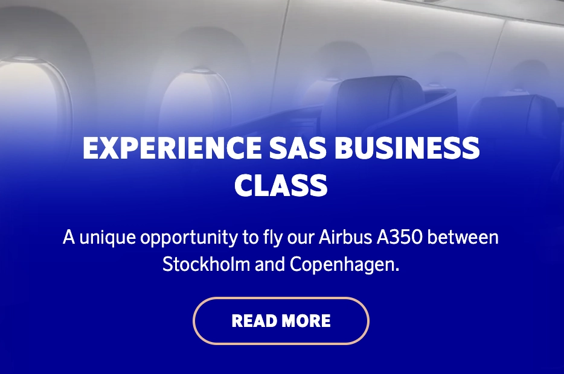
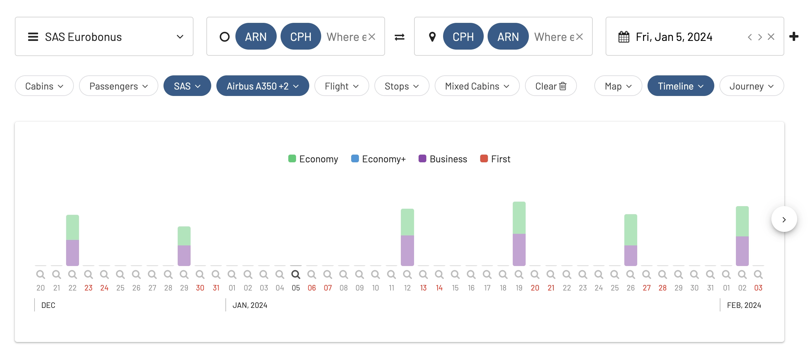
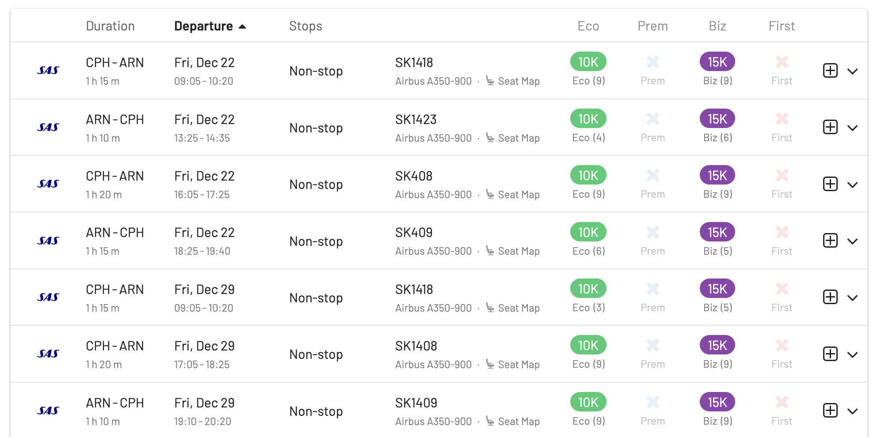
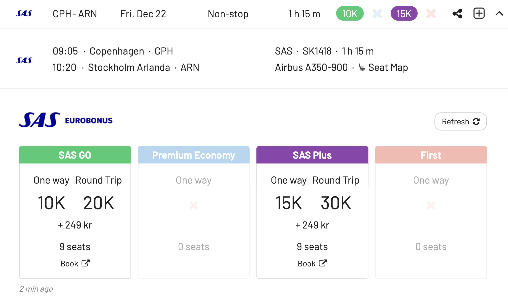
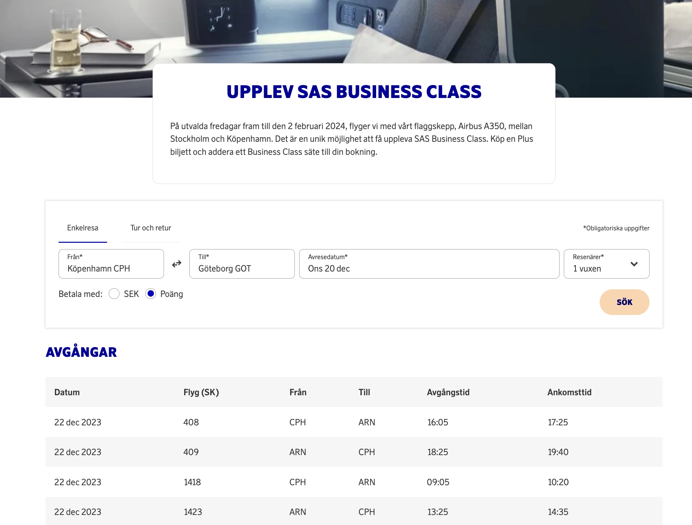

SAS is promoting their Airbus A350 Business Class with a new campaign! Starting today and on selected Fridays until February 2, 2024, they will fly with the flagship A350 between Stockholm and Copenhagen. It is a unique opportunity to experience SAS Business Class. Buy a Plus ticket and get a Business Class seat to your booking.

The great news is that these seats are also available using EuroBonus points! Here's how to search for availability using AwardFares. Hurry up! Seats will run out soon.

## SAS A350 Business Class (Copenhagen to Stockholm)

When searching on AwardFares, we see plenty of seats available, not only in Business Class but also in all other cabin classes including Economy (SAS Go) and Premium Economy (SAS Plus).

## Frequency

We've seen 2-3 round trip flights scheduled for every Friday until February, except for January 5, 2024. It's not clear if they will release seats for this day later, but if you are interested in any of the other dates, book ASAP.

## Pricing

These awards are available for 10k points in Economy and 15k points in Business/Plus, one-way (20k and 30k round trip respectively).

You can book directly on SAS website.

## How to Search for Awards on the A350 with AwardFares?

1. Go to [AwardFares](https://awardfares.com/signup).
2. Under *Frequent Flyer Program*, choose **SAS EuroBonus only**.
3. Tap on *Airline* and select **SAS only**.
4. Under *Departure* city, type **Stockholm** and **Copenhagen**.
5. Do the same under *Destination*, type **Stockholm** and **Copenhagen**.
6. Under *Equipment*, add **Airbus A350-900**.
7. Choose a date, or use the Timeline view to explore flights for different dates.

When choosing a date, remember that these flights are scheduled for Fridays until February 2, 2024. That's it! You will see the full result list on the list below.

## Get started, and stay tuned

You can [try AwardFares for free](https://awardfares.com/). We are rolling out new features and improvements regularly, so [sign up for our monthly newsletter](https://awardfares.com/newsletter) to stay on top of the latest news, announcements, and pro tips.

With our [Gold and Diamond tiers](https://awardfares.com/pricing), you can access premium features such as unlimited daily searches, alerts, seat maps, flight schedules, and more!

## Read more

Our guides have all the information you need to be a pro travel hacker and explore the world on points. Here are some related posts you might enjoy:

- [How To Find Cheap Award Flights And Identify Good Redemptions (Step-by-step)](https://blog.awardfares.com/how-to-find-cheap-award-flights/)
- [Seat Maps: Getting The Perfect Seat Even Before Booking](https://blog.awardfares.com/seatmaps-guide/)
- [10 Tips For Booking An Award Trip In 2023](https://blog.awardfares.com/award-trip-tips/)
- [Demystifying Award Charts: All You Need To Know (2023)](https://blog.awardfares.com/demystifying-award-charts/)
- [Ultimate Guide to Award Release Dates](https://blog.awardfares.com/ultimate-guide-to-award-release-dates)