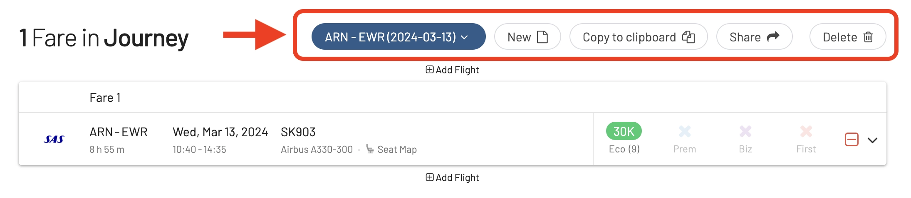
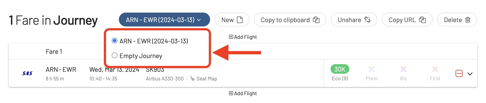
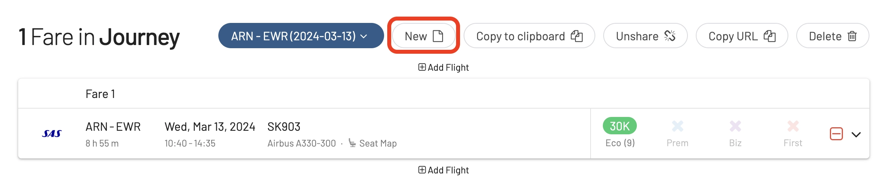
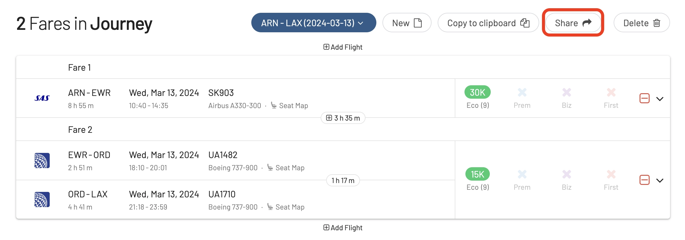
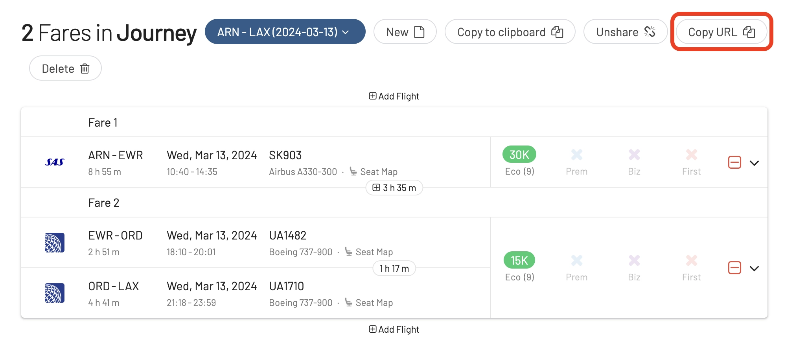
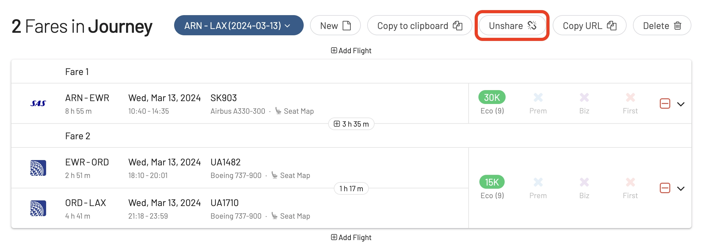

Although 2023 is almost coming to an end, our team is still working full-thrust to deliver convenient new features every week. This time, we are completely revamping our Journey Planner experience, which now allows you to work on multiple journeys in parallel, and share journeys with friends and family via URL (even to anonymous users!).

## What's New?

### New UI

We've redesigned our Journey Planner's experience to be even more intuitive and user-friendly. The top bar now displays more options.

### Work on Multiple Journeys at Once

It's now possible to work on multiple journeys at once! Tap on the first button (Journey List) to see your active/saved journeys and switch between them.

### Create New Journeys

Tap on **New** to start working on a new Journey:

Immediately after, you will see a new *empty journey* under your list of journeys:

### Share a Journey

This new feature becomes extremely handy when organizing a trip with a group of people. It helps evaluate different options while seeing exact information such as flight numbers, dates, and cities involved.

Once you are ready working on an itinerary, tap on **Share** to get a unique link you can send to friends and family.

When opening the link, they will see a summary of your itinerary along with a map.

Use the **Copy URL** button to recover the unique link URL at anytime.

### Unshare a Journey

If you ever want to stop sharing your itinerary, simply tap on **Unshare**.

### Copy to Clipboard

The legacy **Copy to clipboard** option is still there in case you want to paste it into a note and have it at hand when calling a call center, or even saving more options.

Remember you can also paste it back into AwardFares into a new journey.

## Journey Planner: The Full Guide

Check our [complete tutorial here (Journey Planner)](https://blog.awardfares.com/journey-planner/).

## More Improvements: New Alliance Filter

You can now filter results by entire airline alliances including One World, Star Alliance and SkyTeam.

Tap on **Airlines** and the options will show up at the top of the list.

## Get Started with AwardFares

You can [try AwardFares for free](https://awardfares.com/). We are rolling out new features and improvements regularly, so [sign up for our monthly newsletter](https://awardfares.com/newsletter) to stay on top of the latest news, announcements, and pro tips.

With our [Gold and Diamond tiers](https://awardfares.com/pricing), you can access premium features such as unlimited daily searches, alerts, seat maps, flight schedules, and more!

## Read more

Our guides have all the information you need to be a pro travel hacker and explore the world on points. Here are some related posts you might enjoy:

- [Journey Planner: Building Perfect Award Trips To Difficult Destinations](https://blog.awardfares.com/journey-planner/)
- [How To Find Cheap Award Flights And Identify Good Redemptions (Step-by-step)](https://blog.awardfares.com/how-to-find-cheap-award-flights/)
- [Metro Area Searches: Full Guide](https://blog.awardfares.com/metro-area-search-guide/)