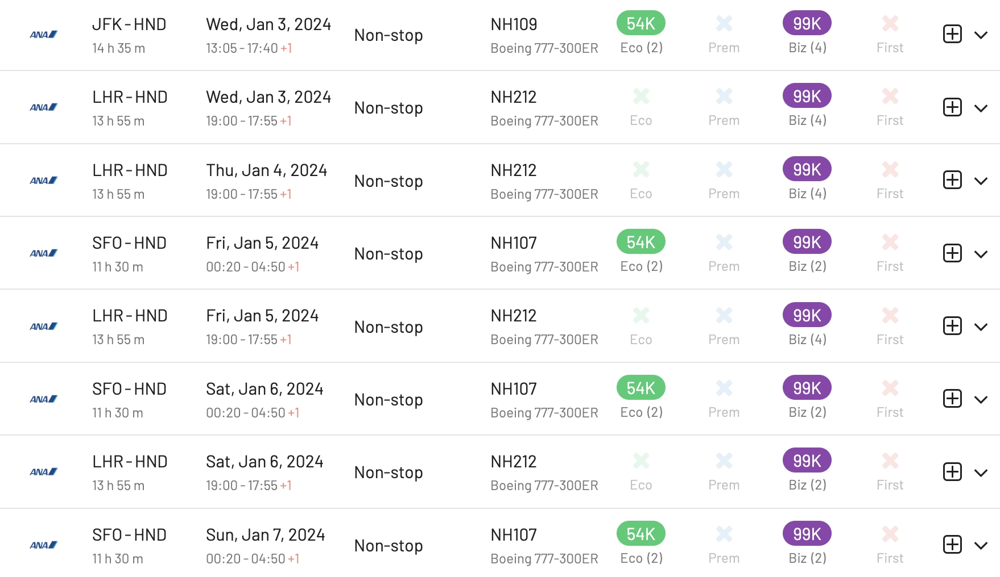

Tick Tock, EuroBonus Clock! It's that time of the year again when many Amex 2-for-1 vouchers (or *companion tickets*) are about to expire, and if you're anything like us, you're probably scrambling to find the best way to use them.

At AwardFares, we know how tricky it can be to snag those last-minute award redemptions, especially when you're trying to make the most out of your EuroBonus points. But don't worry, we've got your back.

In this post, we compile a few of our favorite options, including different airlines, routes, and cabins, that will get you great rates and make good use of your vouchers. Let's start!

**NOTE:** The SAS Service Center is only open until Friday 29th, but online trips can be booked until midnight Sunday.

## Last-minute EuroBonus Awards At Great Value (Our Favorites)

### 1. Lufthansa First Class for 87k points (Round Trip)

There are several LH First seats on a bunch of routes to the North America and Asia, connecting in Frankfurt and Munich. Standard round-trip prices for these awards are anywhere from 165k to 270k points, but when using a 2-for-1 voucher you can score them for **87k-135k points per passenger**.

Remember that these awards need to be booked through the SAS Service Center, and keep in mind that sometimes awards don't show up because of [married segment restrictions](https://blog.awardfares.com/married-segments).

The list below gets updated in real time and shows you the available award seats for the next 30 days on **Lufthansa First** using SAS EuroBonus points.

<table id="lh-first"></table>

Some routes with great availability in the next 2 weeks are:

* [Boston BOS to Munich MUC](https://awardfares.com/search?BOS.MUC.;c:first;z:sas)
* [México City MEX to Frankfurt FRA](https://awardfares.com/search?MEX.FRA.;c:first;z:sas)
* [Chicago ORD to Frankfurt FRA](https://awardfares.com/search?ORD.FRA.;c:first;z:sas)
* [Munich MUC to Boston BOS](https://awardfares.com/search?MUC.BOS.;c:first;z:sas)
* [Munich MUC to New York JKF](https://awardfares.com/search?MUC.JFK.;c:first;z:sas)
* [New York JKF to Munic MUC](https://awardfares.com/search?JFK.MUC.;c:first;z:sas)
* [Bogotá BOG to Frankfurt FRA](https://awardfares.com/search?BOG.FRA.;c:first;z:sas)
* [Hong Kong HKG to Frankfurt FRA](https://awardfares.com/search?HKG.FRA.;c:first;z:sas)
* [San Francisco SFO to Frankfurt FRA](https://awardfares.com/search?SFO.FRA.;c:first;z:sas)
* [Shanghai PVG to Frankfurt FRA](https://awardfares.com/search?PVG.FRA.;c:first;z:sas)
  
**Read more**: If you want good redemptions beyond the 15-day window, Lufthansa Business Class can also be a solid choice (particularly on the 747-8). Check out the following guide with a complete deep-dive into booking LH awards with EB points:

* [*Essential Guide To Book Lufthansa Flights With SAS EuroBonus Points*](https://blog.awardfares.com/lufthansa-with-eurobonus-guide/)

### 2. Turkish Airlines A350 Business Class for 82k points (Round Trip)

Turkish Airlines has an extremely competitive Business Class product (especially on their new A350s), a well-connected network, a great new hub at Istanbul, and more-than-decent award prices with EB points. A killer combo!

These days, we are seeing great availability to destinations in North America and the Caribbean. Although, one of our favorites is from Europe to São Paulo, Brazil: a lengthy flight you can enjoy.

These awards are typically 99k points one way, or 165k points round trip. When using an Amex voucher, you get them at a whopping 87.5k point rate per passenger. These awards can generally be booked through the SAS EuroBonus portal (Star Alliance search), unless you want a more complex itinerary.

The table below gets updated in real time and shows you the available award seats for the next 30 days on **Turkish Airlines Business Class** (all cabins) using SAS EuroBonus points.

<table id="tk-business"></table>

Some routes with great availability in the next 2 weeks are:

* [Istanbul IST to São Paulo GRU](https://awardfares.com/search?IST.GRU.;c:business;a:TK;z:sas#)
* [Cancún CUN to Istanbul IST](https://awardfares.com/search?CUN.IST.;c:business;a:TK;z:sas#)
* [Istanbul IST to Panama PTY](https://awardfares.com/search?IST.PTY.;c:business;a:TK;z:sas#)
* [Istanbul IST to México City MEX](https://awardfares.com/search?IST.MEX.;c:business;a:TK;z:sas#)
* [Bogotá BOG to Istanbul IST](https://awardfares.com/search?BOG.IST.;c:business;a:TK;z:sas#)
* [Istanbul IST to Havana HAV](https://awardfares.com/search?IST.HAV.;c:business;a:TK;z:sas#)

**Read more**: Check out our full guide on Turkish Airlines redemptions with EuroBonus points, including a thorough comparison of all their cabins.

* [*Booking Turkish Airlines Flights With SAS EuroBonus Points (Guide)*](https://blog.awardfares.com/turkish-with-eurobonus/)

### 3. Thai Airways Business Class to Asia for 82k, to Australia for 137k points (Round Trip)

Thai's 777-300ER Business Class can be a solid choice when traveling to Asia and even connecting further into Oceania [[check our most recent review here](https://blog.awardfares.com/thai-business-review-2023/)].

You can get particularly good rates when flying to Australia, for example, Europe to Melbourne or Sydney. Round trip award tickets in Business Class cost 275k EuroBonus points, but with an Amex voucher, that becomes 137k points per passenger. A super decent deal considering there is great availability, and those tickets are expensive in cash.

Some routes with good availability during 2024, ready to book today:

* [Copenhagen CPH to Bangkok BKK](https://awardfares.com/search?CPH.BKK.;c:business;a:TG;z:sas#)
* [Copenhagen CPH to Melbourne MEL](https://awardfares.com/search?CPH.MEL.;c:business;a:TG;z:sas#)
* [Stockholm to Bangkok BKK](https://awardfares.com/search?ARN.BKK.;c:business;a:TG;z:sas#)

### 4. ANA Business Class "The Room" for 82k points (Round Trip)

When thinking of ANA's The Room, imagine a private jet cabin shrunk onto a commercial plane. Wide, fully-flat seats with Nishikawa comfort, sliding doors for ultimate privacy, a 24-inch 4K screen, and direct aisle access from every seat. It's like your own little cocoon in the sky, perfect for work, relaxation, or just savoring the feeling of luxury.

It's not cheap on points, but if you want pampering and unparalleled comfort on your next long-haul flight, ANA The Room might just be your EuroBonus dream redemption. Flights are also not easy to score as there are very few planes that have this reconfiguration.

Standard prices start a 99k points one-way and 165k points round trip. When using a voucher, you can score a seat for as low as 82.5k points round trip.

We've seen great availability on these routes for the upcoming weeks:

* [Tokyo HND to London LHR (NH211/212)](https://awardfares.com/search?LHR.HND.;c:business;a:NH;f:NH211,NH212;z:sas)
* [Tokyo HND to New York JFK (NH109/110 and NH159/160)](https://awardfares.com/search?HND.JFK.;c:business;a:NH;z:sas)
* [Tokyo HND to San Francisco SFO (NH107/108)](https://awardfares.com/search?HND.SFO.;c:business;a:NH;z:sas)

One of the reconfigured 777s is in a special Pokémon livery, which we [described in more detail in this post](https://blog.awardfares.com/ana-777-fleet/).

### 5. TAP A330-900neo Business Class for 65k points (Round Trip)

TAP's A330-900neo is a fuel-efficient dream machine, boasting quieter cabins with mood lighting to ease jet lag, cutting-edge entertainment systems, and even aroma dispensers in the bathrooms! Its extended range opens up exciting long-haul destinations, although you'll find most available seats to North America.

The standard rates are 78k points one-way and 130k points round trip. Using a voucher, you can get those tickets for **as low as 65k EuroBonus points per passenger**.

Some routes with good availability during 2024 are:

* [Lisbon LIS to Miami MIA](https://awardfares.com/search?LIS.MIA.;c:economy,premeco,first;a:TP;z:sas)
* [Lisbon LIS to Toronto YYZ](https://awardfares.com/search?LIS.YYZ.;c:economy,premeco,first;a:TP;z:sas)
* [Lisbon LIS to Boston BOS](https://awardfares.com/search?LIS.BOS.;c:economy,premeco,first;a:TP;z:sas)
* [Lisbon LIS to New York EWR](https://awardfares.com/search?LIS.EWR.;c:economy,premeco,first;a:TP;z:sas)

### 6. EVA Air Business Class for 82k points (Round Trip)

EVA Air not only has a fantastic Business Class product that feels like first. It also has great connections from/to almost everywhere via TPE, and it's a great gateway from Europe to Asia. In addition, there's often great availability on short-notice flights.

Prices range 30k-99k one-way (depending on flight length), and up to 165k round trip. Using an Amex voucher that comes down to 82.5k points per passenger.

Here are some of the routes we've seen with plenty of award space

* [London LHR to Bangkok BKK](https://awardfares.com/search?LHR.BKK.;c:business;a:BR;z:sas)
* [Taipei TPE to Los Angeles LAX](https://awardfares.com/search?TPE.LAX.;c:business;a:BR;z:sas)
* [Munich MUC to Hong Kong HKG](https://awardfares.com/search?MUC.HKG.;c:business;a:BR;z:sas)
* [Vienna VIE to Tokyo NRT](https://awardfares.com/search?VIE.NRT.;c:business;a:BR;z:sas)

## Want more award travel intel?

You can [try AwardFares for free](https://awardfares.com/). We are rolling out new features and improvements regularly, so [sign up for our monthly newsletter](https://awardfares.com/newsletter) to stay on top of the latest news, announcements, and pro tips.

With our [Gold and Diamond tiers](https://awardfares.com/pricing), you can access premium features such as unlimited daily searches, alerts, seat maps, flight schedules, and more!

## Read more

Our guides have all the information you need to be a pro travel hacker and explore the world on points. Here are some related posts you might enjoy:

- [SAS Amex 2-for-1 Vouchers Expire Soon. Here's What You Need To Know.](https://blog.awardfares.com/sas-amex-2-for-1-2023/)
- [Essential Guide To Book Lufthansa Flights With SAS EuroBonus Points](https://blog.awardfares.com/lufthansa-with-eurobonus-guide/)
- [SAS Will Leave Star Alliance! Here’s What To Do Next (2023)](https://blog.awardfares.com/sas-acquisition/)
- [Booking Turkish Airlines Flights With SAS EuroBonus Points (Guide)](https://blog.awardfares.com/turkish-with-eurobonus/)
- [How To Find Cheap Award Flights And Identify Good Redemptions (Step-by-step)](https://blog.awardfares.com/how-to-find-cheap-award-flights/)

