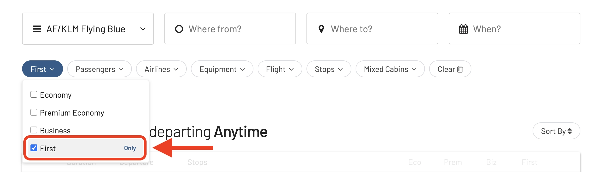

While Flying Blue remains one of the most basic pillars of SkyTeam award flight redemptions, First Class are still among the hardest ones to score. Today, we're diving into the world of First Class redemptions using Flying Blue, a topic that, at least for us, is both exciting and a bit complex.

### In This Post

- [First Things First: Which Airlines Offer First?](#first-things-first-which-airlines-offer-first)
- [Flying to Fantasyland: The Good, the Bad, and the Status](#flying-to-fantasyland-the-good-the-bad-and-the-status)
- [Finding First Class Awards With AwardFares](#finding-first-class-awards-with-awardfares)
- [More Tips When Booking First Class Awards](#more-tips-when-booking-first-class-awards)
- [Want More Award Travel Intel?](#want-more-award-travel-intel)
- [Read More](#read-more)

## First Things First: Which Airlines Offer First?

Not all SkyTeam airlines roll out the red carpet, but these six fly high with dedicated first cabins:

### 1. Air France (La Première)

La Première is undeniably one of the most luxurious first-class experiences in the sky. On the Boeing 777-300ER, you'll find just 4 suites arranged in a 1-2-1 configuration, offering ultimate privacy and spaciousness. Each suite boasts a fully-flat bed that's over 7 feet long, a 23-inch HD touchscreen entertainment system, and a separate ottoman that can be converted into a dining table.

*Image from: [Callum Elsdon](https://callumelsdon.com/articles/review-air-france-la-premire-first-class-on-the-boeing-777-300er)*

The A380 offered an even more exclusive experience, with only 9 La Première suites on the upper deck. These suites were even larger and featured sliding doors for even more privacy. Sadly, Air France retired their A380s in 2020, but the La Première experience on the Boeing 777-300ER is still top-notch.

### 2. China Eastern Airlines

China Eastern's First Class cabin on the Boeing 777-300ER is another great option, especially for those looking for a more affordable luxury experience. The cabin features a few seats arranged in a 1-2-1 configuration, each with a fully-flat bed, a 17-inch IFE system, and plenty of storage space.

The airline also offers a great selection of Chinese and Western cuisine, as well as attentive service from a multilingual crew.

*Image from: [One Mile At A Time](https://onemileatatime.com/china-eastern-first-class-review/)*

### 3. Garuda Indonesia

Garuda Indonesia's First Class cabin, branded as "First Suite," is pure luxury. The airline's Boeing 777-300ERs feature 8 First Suites arranged in a 1-1-1 configuration, each with a sliding door for ultimate privacy. The suites are spacious and well-appointed, with a fully-flat bed, a 23-inch IFE system, and a minibar.

But the real star of the show is the food. Garuda Indonesia offers Michelin-inspired menus on select routes, featuring dishes created by renowned Indonesian chefs. The airline also has a wide selection of Indonesian and international wines and champagnes.

*Image from: Garuda Indonesia*

### 4. Xiamen Air

Xiamen Air's First Class cabin is a bit of a secret, as the airline only operates a limited number of routes. But for those lucky enough to snag a seat, it's a real treat. The cabin features 8 First Class seats arranged in a 1-2-1 configuration, each with a fully-flat bed, a 15.4-inch IFE system, and plenty of storage space.

The airline offers a mix of Chinese and Western cuisine, as well as attentive service from a multilingual crew.

*Image from: [Airline Reporter](https://www.airlinereporter.com/2014/08/xiamen-airlines-takes-delivery-first-boeing-787-dreamliner/)*

### 5. Korean Air

Korean Air's First Class cabin, known as "KosmoSuite," is another great option for luxury travelers. The cabin features 12 KosmoSuites arranged in a 1-2-1 configuration, each with a fully-flat bed, a 23-inch IFE system, and a minibar.

The airline also offers a great selection of Korean and international cuisine, as well as attentive service from a multilingual crew. However, there are some restrictions to be aware of. Korean Air's First Class is only available on a limited number of routes, and award availability can be difficult to come by.

*Image from: Korean Air*

### 6. Saudia

Saudia's First Class cabin, known as "Al Fursan," is a luxurious option for travelers to the Middle East. The cabin features 12 Al Fursan seats arranged in a 1-2-1 configuration, each with a fully-flat bed, a 23-inch IFE system, and a minibar.

The real highlight, however, is the focus on Arabic hospitality. Passengers can expect a warm welcome, attentive service from multilingual crew members dressed in traditional attire, and a menu featuring gourmet Arabic and international dishes alongside a curated selection of Arabic coffee, dates, and other delicacies.

*Image from: Saudia*

### 7. (Bonus) Delta One

While technically classified as Business Class, Delta One on select Boeing 777-200LR and Airbus A350-900 aircraft offers a First Class-like experience. The Delta One Suite features a sliding door for privacy, a fully-flat bed stretching over 7 feet, a large 17.9-inch IFE touchscreen, and ample storage space.

The airline also boasts an excellent food and beverage selection, featuring dishes created by renowned chefs and a curated wine list. Additionally, Delta One passengers enjoy priority boarding, lounge access, and personalized service from a dedicated flight attendant.

*Image from: Delta*

So, while not technically First Class, Delta One is a strong contender for those seeking a luxurious and comfortable transatlantic or transpacific travel experience, particularly on routes not served by airlines with dedicated First Class cabins.

## Flying to Fantasyland: The Good, the Bad, and the Status

Now, here's the reality check: award availability in these First Class havens can be elusive. Let's break it down:

- **Air France La Première**: Only Flying Blue Platinum members can unlock this secret menu (though some award seats open up closer to the flight date).
- **Korean Air and Saudia**: Sadly, their First Class remains a no-fly zone for Flying Blue redemptions.
- **The Rest**: Technically open to everyone, but finding award space feels like winning the lottery – rare and exhilarating.

## Finding First Class Awards With AwardFares

### 1. Go to [AwardFares](https://awardfares.com/signup)

### 2. Under *Frequent Flyer Program*, choose **Flying Blue**

### 3. Tap on *Cabin* and select **First Class only**

### 4. Under *Departure* and *Destination*, specify origin and arrival airport(s)

For example **Shanghai (PVG)** to **Melbourne (MEL)**

### 5. Choose a date

Or use the Timeline view to explore flights for different dates

### 6. Expand details, filter by price

Use the search results header to sort by price and see the cheapest redemptions on the top. Tap on any results to see the final price including taxes and fees.

### 7. Check seat maps

Tap on the *Seat Map* icon to check available/occupied seats on the flight you are interested in.

### Routes We've Detected

| Airline          | Route with Link                                                                                   |
|------------------|----------------------------------------------------------------------------------------------------|
| Garuda Indonesia | [CGK-AMS](https://awardfares.com/search?CGK.AMS.;c:first;z:flyingblue)                             |
| Xiamen Air       | [XMN-SIN](https://awardfares.com/search?XMN.SIN.;c:first;z:flyingblue)                             |
|                  | [XMN-MEL](https://awardfares.com/search?XMN.MEL.;c:first;z:flyingblue)                             |
|                  | [XMN-PKX](https://awardfares.com/search?XMN.PKX.;c:first;z:flyingblue)                             |
|                  | [PVG-PKX](https://awardfares.com/search?PVG.PKX.;c:first;z:flyingblue)                             |
| China Eastern    | [PVG-LHR](https://awardfares.com/search?PVG.LHR.;c:first;z:flyingblue)                             |
|                  | [PVG-SIN](https://awardfares.com/search?PVG.SIN.;c:first;z:flyingblue)                             |
|                  | [PVG-AKL](https://awardfares.com/search?PVG.AKL.;c:first;z:flyingblue)                             |

Example of Garuda Indonesia CGK to Amsterdam AMS in First Class, using Flying Blue miles:

## More Tips When Booking First Class Awards

- **Be Flexible.** Dates, routes, even airlines!
- **Become a Booking Ninja.** [Set up search alerts](https://blog.awardfares.com/alerts) on AwardFares for your dream flights. Pounce when they appear!
- **Fuel Your Mileage Machine.** Flying Blue offers generous transfer options from many credit cards. Top up your stash!
- **Consider the "Curve".** AwardFares easily lets you compare prices in miles and points, sometimes revealing hidden first-class gems
- **Business Can Feel Like First!** While First Class may be the ultimate travel trophy, business class on many SkyTeam airlines is truly outstanding. Don't be afraid to adjust your sights if award gods are fickle.

## Want More Award Travel Intel?

AwardFares is your one-stop shop. [Sign up for email alerts](https://awardfares.com/newsletter), join our community, and stay on top of the latest news, announcements, and pro-tips.

With our [Gold and Diamond tiers](https://awardfares.com/pricing), you can access premium features such as unlimited daily searches, alerts, seat maps, flight schedules, and more!

## Read More

Our guides have all the information you need to be a pro travel hacker and explore the world on points. Here are some related posts you might enjoy:

- [How To Find Cheap Award Flights And Identify Good Redemptions (Step-by-step)](https://blog.awardfares.com/how-to-find-cheap-award-flights/)
- [Seat Maps: Getting The Perfect Seat Even Before Booking](https://blog.awardfares.com/seatmaps-guide/)
- [10 Tips For Booking An Award Trip In 2023](https://blog.awardfares.com/award-trip-tips/)
- [Demystifying Award Charts: All You Need To Know (2023)](https://blog.awardfares.com/demystifying-award-charts/)
- [Ultimate Guide to Award Release Dates](https://blog.awardfares.com/ultimate-guide-to-award-release-dates)