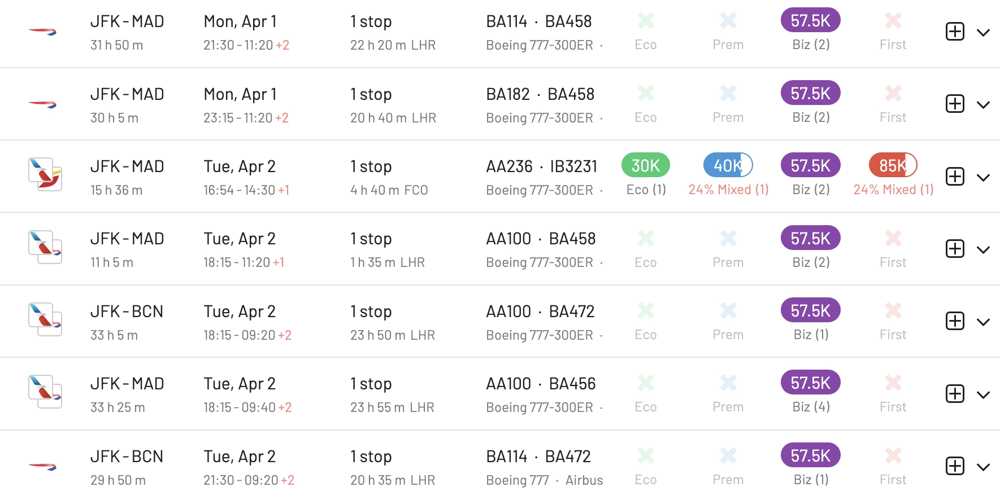

As the world of air travel continues to evolve, 2024 positions ahead as yet-another year full of rapid changes. It might be a great time to re-think your strategy and consider venturing into new programs to get more value out of your miles. As it can be overwhelming to choose the one that best suits your travel needs and preferences, in this blog post we cover some of our favorite frequent flyer programs and why you should consider them for 2024.

As a disclaimer, this list expresses AwardFares' team choices, and by no means is a comprehensive comparison of all programs that exists. The "best" frequent flyer program will depend on your individual travel habits and preferences. Consider factors such as your home airport, preferred airlines, and desired redemption options when choosing a program, as we did for this list.

## Top Frequent Flyer Programs in 2024 (Our Picks)

### 1. SAS EuroBonus (Scandinavian Airlines)

Still one of our favorites due to their high award availability and low devaluation of their points. [**SAS EuroBonus**](https://www.flysas.com/en/eurobonus/home/) delivers a seamless travel experience across the Nordic region and beyond.

While a [future shift to SkyTeam is pending](https://blog.awardfares.com/sas-acquisition), the program currently enjoys the benefits of Star Alliance, further expanding travel options. Overall, EuroBonus offers a rewarding and versatile experience for travelers of all types.

**Pro tip:** Search for SAS EuroBonus awards using AwardFares. [Try here](https://awardfares.com/search?..;z:sas).

Why it shines:

* Great availability: Compared to other programs, SAS open a significant number of seats on every flight that you could book using points.
* Upgrade Opportunities: Easy to use your points for upgrades to SAS Plus or Business, enhancing your flight experience in comfort. Their cooperation with the SAS Mastercard brings the FlyPremium benefit, allowing members to upgrade to SAS Plus and SAS Business for free.
* Nordic Excellence: Enjoy smooth connections and seamless travel across Scandinavian countries with SAS and its partners.
* Companion vouchers: The Amex 2-for-1 voucher (or companion ticket) gives the opportunity to fly amazing cabins such as Lufthansa First Class and others, at 50% of the price.
* Partners: Earn and redeem points on Star Alliance airlines, expanding your travel possibilities. We've tried many redemptions on EVA Air, ANA, Lufthansa, Austrian, Swiss, Copa, United, and more.
* Target Region: Scandinavia and Europe, with worldwide reach through Star Alliance.

### 2. Air France-KLM Flying Blue

A rising star in European skies, [**Flying Blue**](https://www.flyingblue.us/en/home) stands out as a paragon of customer loyalty and rewards in the airline industry. Its strength lies in its vast network, encompassing not only Air France and KLM but also a wide array of partner airlines, offering extensive global reach to its members. The program's user-friendly interface and flexible options for spending miles, such as on flight upgrades, hotel stays, and car rentals, further enhance its appeal. Additionally, its regular promotions, like discounted award tickets, add exceptional value, making it a compelling choice for both frequent and occasional flyers.

**Pro tip:** [Promo awards](https://www.flyingblue.com/en/spend/flights/rewards) show up in AwardFares! Our tools is the easiest way to explore Flying Blue's promo awards every month. [Give it a try here](https://awardfares.com/search?..;z:flyingblue).

Why it shines:

* Promo awards: Every month, Flying Blue releases a set of awards at an ultra-discounted rate (and not only in Economy Class!). A great opportunity for newcomers and members just starting out in the points and miles game. We've taken advantage of these promotions multiple times including destinations such as Bangkok, Dubai, San Francisco, Vancouver.
* SkyTeam Dominance: Access a vast network with SkyTeam partners like Air France-KLM, Delta Air Lines, and Korean Air. With SAS joining SkyTeam after being acquired by Air France-KLM, the alliance will definitely have an even more compelling network in the upcoming years.
* Flexible Reward Redemptions: Choose from award flights, upgrades, car rentals, hotel stays, and even merchandise, offering diverse options for spending your miles. Flying Blue's miles are quite flexible and let you use your points beyond flights easily. Value might not be the best, but it's straightforward.
* Fast track to more miles: Earn miles on everyday purchases with co-branded credit cards and partner stores. Co-branded credit cards are available in several countries including France, Netherlands, Belgium, the US, and others.
* Target Region: Europe, North America, and beyond with SkyTeam partners.

### 3. Alaska Airlines Mileage Plan

Reigning supreme for nine years running, [**Alaska Mileage Plan**](https://www.alaskaair.com/content/mileage-plan) shines for flexibility and ease of use. Earn miles on various partners, redeem for amazing deals on award flights, and enjoy generous award seat availability. This program is a dream for Pacific Northwest explorers and value-conscious travelers everywhere.

Why it shines:

* Rewarding simplicity: Earn miles on every dollar spent, with no blackout dates or complex award charts.
* Sweet spots: Unrivaled value for flights within the West Coast and North America, especially redeeming for First Class.
* Global reach: Access a vast network thanks to partners like Emirates, Japan Airlines, and Qantas. Alaska's array of partners is really interesting, full of opportunities for expert users.
* Target region: Pacific Northwest, North America.

### 4. United MileagePlus

A powerhouse for international travelers, [**United MileagePlus**](https://www.united.com/en/us/fly/mileageplus.html) offers a vast network and valuable upgrade options. This program boasts global reach and an impressive network of partners, including Star Alliance heavyweights like Lufthansa and Singapore Airlines. We'd say that MileagePlus serves all kinds of travelers, from beginners to advanced, and with diverse destinations in mind, especially those seeking long-haul upgrades to luxurious cabins.

Why it shines:

* Global dominance: Fly United and partners like Lufthansa, Singapore Airlines, and ANA, covering virtually every corner of the globe.
* Upgrade heaven: MileagePlus offers some of the best upgrade opportunities on international routes, especially in higher classes.
* Hub strength: Major hubs in Chicago, Newark, and San Francisco ease connections worldwide.
* Target region: International travelers with a focus on Europe, Asia, and South America.

### 5. Air Canada Aeroplan

Soaring to new heights in 2024, [**Air Canada's Aeroplan**](https://www.aircanada.com/ca/en/aco/home/aeroplan.html) takes its place as a top contender for Canadian travelers and beyond. Aeroplan has carved a niche for itself in the world of travel loyalty schemes. One of its standout strengths is its partnership with the Star Alliance network, granting members access to a vast array of airlines and destinations worldwide. This global reach is a significant advantage over many other programs, offering unparalleled flexibility in earning and redeeming points.

Aeroplan's reward structure is particularly user-friendly, with a straightforward points system that allows for easy accumulation and redemption, including for upgrades and car rentals. Additionally, Aeroplan's integration with Air Canada's booking system allows for seamless award flight availability, making it easier for members to use their points effectively.

**Pro tip**: Aeroplan is a great program to search and book First Class cabins, such as Lufthansa First, [try searching with one click awards here](https://awardfares.com/search?..;z:aeroplan).

Why it shines:

* Star Alliance Powerhouse: Tap into the vast network of Star Alliance, offering over 1,300 destinations worldwide.
* Family-Friendly Perks: Enjoy generous benefits like free checked bags for the whole family, making travel more affordable.
* Stopover Magic: Craft unique itineraries with the ability to add a stopover on round-trip award bookings, turning one trip into two adventures.
* Target Region: Primarily Canada and North America, with extensive reach through Star Alliance partners.

### 6. American Airlines AAdvantage

Think extensive partner airlines and attractive award rates, and you'll find yourself at [**American AAdvantage**](https://www.aa.com/i18n/aadvantage-program/aadvantage-program.jsp)'s doorstep. This program is ideal for savvy award seat hunters who prioritize flexibility and finding deals to exotic corners of the globe. It's stable, robust, and a solid option if you are looking for a program that 'always has an option for you'.

Why it shines:

* Partner paradise: Access Oneworld partners like British Airways, Japan Airlines, and Qantas, opening doors to exotic destinations.
* Award sweet spots: Redeem miles for great value on off-peak flights and select business class routes.
* Flexible earning: Plenty of opportunities to earn miles on co-branded credit cards and everyday purchases.
* Target region: Global network with strong presence in North America, Europe, and Asia.

### 7. Delta SkyMiles

For those who prioritize elite status perks, [**Delta SkyMiles**](https://www.delta.com/us/en/skymiles/overview) delivers. Their revamped elite tiers offer enhanced benefits like priority boarding, lounge access, and generous upgrade opportunities. This program shines for frequent business travelers who prioritize comfort and exclusivity, especially within the US and Latin America.

Why it shines:

* Status matters: Enjoy generous benefits like free upgrades, lounge access, and priority boarding with Medallion status.
* Qualification requirements: Starting 2024, earning top-tier status is more demanding on flights (and more on spending), potentially leading to fewer elite members and more benefits.
* Extensive network: Fly Delta and partners like Air France-KLM, Virgin Atlantic, and Korean Air.
* Target region: Global reach with a strong focus on North America and Europe.

### 8. JetBlue True Blue

[**JetBlue's TrueBlue**](https://www.jetblue.com/trueblue) program stands out with its customer-centric approach and simplicity. One of its primary strengths is the absence of blackout dates for award flights, a feature that sets it apart from many competitors and offers unparalleled flexibility for members. Points in the TrueBlue program are earned based on dollars spent rather than miles flown, which benefits passengers who purchase higher-priced tickets rather than those who fly longer distances.

This structure is particularly useful for frequent short-haul travelers. Additionally, TrueBlue points never expire, removing the pressure to redeem within a certain timeframe. The program also offers family pooling of points allowing families to accumulate and redeem points together.

Why it shines:

* No blackout dates, no gimmicks: Enjoy straightforward earning and redemption with no blackout dates or complicated rules.
* Points Equal Money: Redeem points for any JetBlue flight, anytime, with points valued at 1 cent each.
* Bags Fly Free: Check your first bag for free on all JetBlue flights, saving you money on every trip.
* Target Region: Domestic flights within the United States, the Caribbean, and select Latin American destinations.

### Other programs worth looking into

#### Asia-Pacific

* **Singapore Airlines KrisFlyer**: Highly regarded for its excellent service and favorable redemption rates for premium cabins
* **Cathay Pacific Asia Miles**: Offers a good balance of earning and redemption options, especially within Asia.
* **EVA Air Infinity MileageLands**: Provides generous mileage accrual and redemption options, particularly strong for travel in Asia and across the Pacific.

#### Middle East

* **Emirates Skywards**: Known for its luxurious flight options and good redemption opportunities, especially in premium classes
* **Qatar Airways Privilege Club**: Offers access to a wide network and is part of the Oneworld alliance.
* **Etihad Guest**: Provides a range of benefits and has unique features like the ability to pool miles with family members.

#### South America

* **Avianca LifeMiles**: Known for its good redemption rates, especially for Star Alliance flights.
* **LATAM Pass**: Offers extensive coverage in South America and is part of the Oneworld alliance.
* **Aeromexico Club Premier**: Part of the SkyTeam alliance, it offers good connectivity within Latin America and beyond.
* * **GOL Smiles**

#### Africa

* **South African Airways Voyager**: Offers decent redemption options within Africa and is part of the Star Alliance.
* **Ethiopian Airlines ShebaMiles**: Good for travel within Africa and internationally, as part of the Star Alliance.
* **EgyptAir Plus**: Offers benefits for frequent travelers within the Middle East and Africa, and is a Star Alliance member.

#### Oceania

* **Air New Zealand Airpoints** (Oceania): Offers good benefits for domestic and trans-Tasman flights.
* **Qantas Frequent Flyer** (Oceania): Also relevant in this region, especially for flights to and from Australia.

## Want more award travel intel?

You can [try AwardFares for free](https://awardfares.com/). We are rolling out new features and improvements regularly, so [sign up for our monthly newsletter](https://awardfares.com/newsletter) to stay on top of the latest news, announcements, and pro tips.

With our [Gold and Diamond tiers](https://awardfares.com/pricing), you can access premium features such as unlimited daily searches, alerts, seat maps, flight schedules, and more!

## Read more

Our guides have all the information you need to be a pro travel hacker and explore the world on points. Here are some related posts you might enjoy:

* [How To Find Cheap Award Flights And Identify Good Redemptions (Step-by-step)](https://blog.awardfares.com/how-to-find-cheap-award-flights/)
* [Demystifying Award Charts: All You Need To Know (2024)](https://blog.awardfares.com/demystifying-award-charts/)
* [Sky's (Almost) The Limit: Conquering First Class With Flying Blue](https://blog.awardfares.com/flying-blue-skyteam-first-class/)
* [What To Do With 100k Delta SkyMiles? A 2024 Guide To Finding SkyMiles Sweet Spots](https://blog.awardfares.com/100k-skymiles/)
* [What Airlines Have Changed Or Left Alliances? A History of Departures and Switches](https://blog.awardfares.com/airline-alliances-changes/)