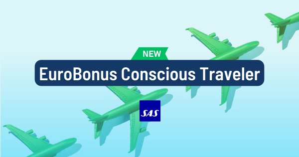
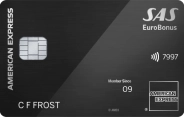
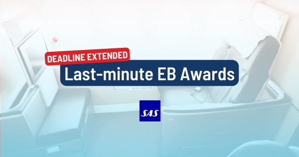
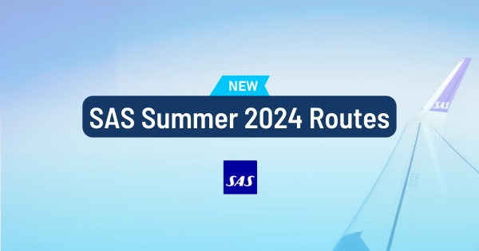
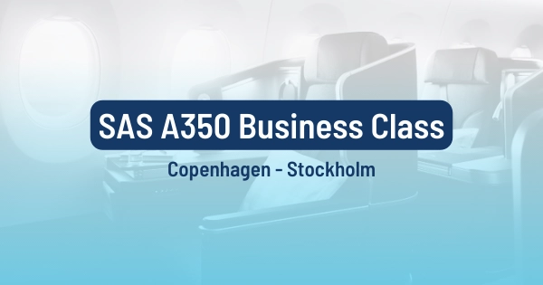

Scandinavian Airlines (SAS) has rolled out several updates and changes that are set to enhance the travel experience for its members. From eco-conscious initiatives to exciting new routes, here are the top SAS EuroBonus updates you should be aware of in January 2024.

### 1. The SAS EuroBonus Conscious Traveler

In an effort to align with global sustainability goals, SAS has introduced the 'EuroBonus Conscious Traveler' initiative. Earn points for opting for biofuel flights, choosing eco-friendly partners, and even incorporating green habits into your daily life. This gamified initiative promotes sustainable travel, inspires others to follow suit, and positions SAS as a leader in eco-conscious aviation.

Read more [in this post](https://blog.awardfares.com/sas-eurobonus-conscious-traveler/).

### 2. SAS Amex Elite Goes Metal And Increases Fees

**Card Design & Renewal**: Starting March 14, 2024, the SAS Amex Elite card will boast a stunning precision cut metal design. If your next renewal falls after that date, you'll automatically receive the new card.

**Membership Fee Adjustment**: The monthly fee for SAS Amex Elite will change from SEK 400 to SEK 500, effective March 14, 2024.

Despite the fee update, the SAS Amex Elite membership still unlocks these perks:

* 2-for-1 vouchers (companion ticket): Take advantage of 2 for 1 trips around the world twice a year.
* Earn Points Faster: Rack up 20 EuroBonus Extra Points per SEK 100 on all purchases, fueling your future travel adventures.
* Status Boost: Enjoy a guaranteed 20,000 status-based points every year, giving you a head start on reaching elite levels.
* Travel Insurance: Stay protected with comprehensive travel insurance coverage for you and your family.

### 3. SAS Mastercard Stops Working With Curve (Terms Changes)

The SAS Mastercard has introduced new changes in its terms and conditions regarding the use of Curve.

*"You do not get extra points for purchases made with a card other than the SAS EuroBonus Mastercard & Mastercard Premium, such as Curve and similar services. This applies from 6 February 2024.”*

*Source: [saseurobonusmastercard.se](https://saseurobonusmastercard.se/)*

### 4. Amex 2-for-1 Vouchers Deadline Extended

After long queues at the SAS Service Center Before Dec 31st, 2023, SAS and Amex decided to extend the deadline for using the popular Amex 2-for-1 vouchers (or companion tickets). Members now have until January 31st, 2024, to utilize these vouchers. This extension provides a fantastic opportunity for EuroBonus members to plan trips with a companion while enjoying significant savings.

Read more [on our dedicated post here](https://blog.awardfares.com/eurobonus-last-minute-awards-2023/).

### 5. SAS Opens 9 New Routes During Summer 2024

Scandinavian Airlines (SAS) is gearing up for a busy summer season with nine new routes connecting travelers to even more corners of Europe. From its Copenhagen hub, SAS will launch flights to Tromsø, Salzburg, and Genoa, while peak summer will see additional routes to Dalaman, Ibiza, Geneva, and Tivat. Oslo and Bergen are also getting in on the action, with new connections to Geneva, Tivat, and London Heathrow, respectively.

Domestic travelers haven't been forgotten, with SAS increasing frequencies on routes from Stockholm to various Swedish destinations, Copenhagen to Bergen, and Oslo to Aalborg and Billund. So whether you're looking for a taste of the Arctic in Tromsø, the Mediterranean charm of Genoa, or the summer buzz of Ibiza, SAS has a new route for you this summer.

[Read more here](https://blog.awardfares.com/sas-summer-2024/).

### 6. Try the SAS A350 Business Class Between Copenhagen and Stockholm

SAS is offering A350 business class flights between Copenhagen and Stockholm until February 2024. The flights are available on Fridays and can be booked using SAS EuroBonus points. Prices start at 10,000 points for Economy and 15,000 points for Business/Plus. To book, search for SAS A350 flights on AwardFares.

[Read more here](https://blog.awardfares.com/sas-a350-arn-cph/).

## Want More Award Travel Intel?

You can [try AwardFares for free](https://awardfares.com/). We are rolling out new features and improvements regularly, so [sign up for our monthly newsletter](https://awardfares.com/newsletter) to stay on top of the latest news, announcements, and pro tips.

With our [Gold and Diamond tiers](https://awardfares.com/pricing), you can access premium features such as unlimited daily searches, alerts, seat maps, flight schedules, and more!

## Read More

Our guides have all the information you need to be a pro travel hacker and explore the world on points. Here are some related posts you might enjoy:

* [SAS EuroBonus Conscious Traveler Takes Off In 2024: Greener Flying, Greater Rewards](https://blog.awardfares.com/sas-eurobonus-conscious-traveler/)
* [Last-Minute EuroBonus Redemption Gems (For The Amex 2-for-1 Vouchers) [EXTENDED DEADLINE]](https://blog.awardfares.com/eurobonus-last-minute-awards-2023/)
* [SAS Will Fly To 9 New Destinations During Summer 2024](https://blog.awardfares.com/sas-summer-2024/)
* [Try These EuroBonus Award Flights Before SAS Leaves Star Alliance (Megapost)](https://blog.awardfares.com/eurobonus-star-alliance-awards/)
* [How To Find Cheap Award Flights And Identify Good Redemptions (Step-by-step)](https://blog.awardfares.com/how-to-find-cheap-award-flights/)