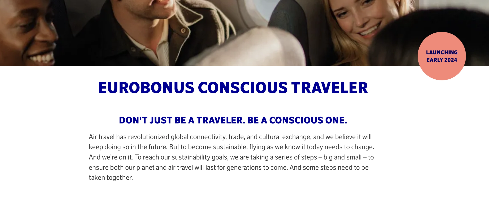
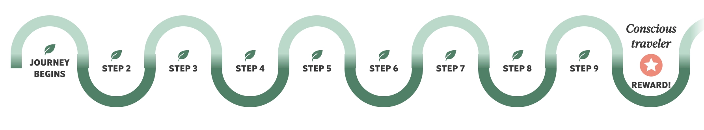
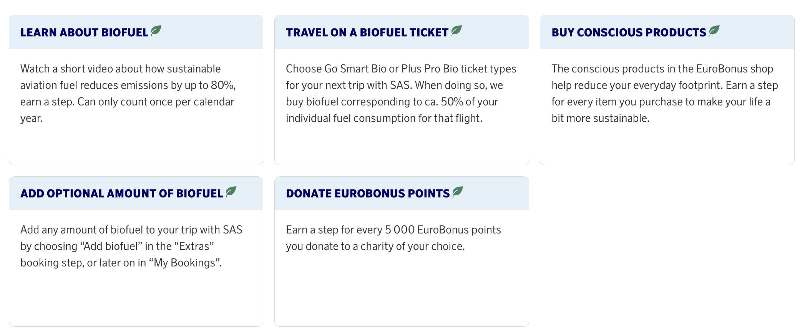

In response to growing environmental concerns, Scandinavian Airlines (SAS) has revamped its EuroBonus program, aligning it with sustainable travel practices. This initiative is called [**EuroBonus Conscious Traveler** (read more here)](https://www.flysas.com/en/eurobonus/conscious-traveler/), is set to launch in January 2024, and it represents a significant shift in the airline's approach, moving beyond traditional loyalty programs to embrace environmental responsibility.

With this movement, SAS not only rewards its customers but also contributes to the global effort to address climate change. As the program evolves, it is expected to inspire both travelers and other companies to consider the environmental implications of their travel choices, fostering a more sustainable future.

**UPDATE (Jan 23rd)**: The EuroBonus Conscious Traveler program is now live! [Read more here](https://www.sas.se/conscious-traveler/).

## The Genesis of EuroBonus Conscious Traveler

SAS, the Scandinavian airline, has been actively working towards a more sustainable future for the aviation industry for over a decade. Here are some of their key achievements:

* **25% emissions reduction by 2025**: SAS has set an ambitious target of reducing its CO2 emissions by 25% by 2025, compared to 2005 levels. This is a significant goal, considering the challenges of reducing emissions in the aviation sector.
* **Modern and fuel-efficient aircraft**: SAS is investing in a fleet of modern and fuel-efficient aircraft, such as the Airbus A350 and A320neo. These aircraft are significantly more fuel-efficient than older models, helping to reduce emissions.
* **Sustainable aviation fuels (SAFs)**: SAS is actively using SAFs, which are made from renewable sources such as biomass and waste. While SAFs are currently more expensive than traditional jet fuel, their use can significantly reduce emissions.
* **Waste reduction and recycling**: In 2022, they diverted 68.3% of operational waste and a staggering 99.9% of construction waste from landfills globally.
* **Renewable energy**: SAS is investing in renewable energy sources, such as solar and wind power. They generated 3.4 million kWh of clean, renewable energy from rooftop and ground-mounted solar systems in 2022.
* **Sustainable products and services**: SAS is offering more sustainable options to its customers, such as carbon-offsetting programs and eco-friendly meal choices.
* **Community engagement**: SAS is actively engaged in various sustainability initiatives, such as supporting research into new technologies and working with communities to reduce their environmental impact.

Now the EuroBonus program, initially a loyalty scheme, has evolved into a platform that encourages and rewards sustainable travel choices.

## How The Program Works

The EuroBonus Conscious Traveler initiative is intelligently designed (and gamified) to integrate sustainability into every aspect of travel. Members earn points not only through flights but also by engaging in eco-friendly activities and choices. These include:

* **Opting for Biofuel**: Members can choose to fly on flights powered by sustainable aviation fuel, earning extra points.
* **Carbon Offsetting**: Points are awarded to travelers who invest in carbon offsetting programs.
* **Sustainable Partnerships**: Earning points through spending with program partners committed to sustainability, like eco-friendly hotels and car rentals.
* **Green Choices in Everyday Life**: The program extends beyond travel, rewarding members for sustainable lifestyle choices in their daily lives.

### What To Do

1. Sign up for SAS EuroBonus (if you are not already a member)
2. Complete TEN or more of the steps listed below during a year (make sure to provide your EuroBonus number when completing a step)
3. Collect your rewards. It's possible to achieve beyond 10 steps (all of them are counted).
4. Repeat steps 2-3 again during the following year to keep your title and claim new rewards.

### Steps You Can Take Today (From January 1st, 2024)

* **Learn about biofuel**: Watch a short video about how sustainable aviation fuel reduces emissions by up to 80%, earn a step. Can only count once per calendar year.
* **Travel on a biofuel ticket**: Choose Go Smart Bio or Plus Pro Bio ticket types for your next trip with SAS. When doing so, we buy biofuel corresponding to ca. 50% of your individual fuel consumption for that flight.
* **Buy conscious products**: The conscious products in the EuroBonus shop help reduce your everyday footprint. Earn a step for every item you purchase to make your life a bit more sustainable.
* **Add optional amount of biofule**: Add any amount of biofuel to your trip with SAS by choosing “Add biofuel” in the “Extras” booking step, or later on in “My Bookings”.
* **Donate EuroBonus points**: Earn a step for every 5 000 EuroBonus points you donate to a charity of your choice.

### The Impact on Travel Behavior

The EuroBonus program is designed not only as a loyalty scheme but also as a tool for promoting behavioral change. By offering incentives for sustainable choices, SAS encourages passengers to consider the environmental impact of their travel decisions. This approach has the potential to influence broader industry trends towards sustainability.

### Challenges and Opportunities

While the initiative sounds great, it's not without challenges. One significant challenge is ensuring that the options available for earning points are genuinely sustainable and not just a marketing gimmick. There's also the broader challenge of making sustainable travel options accessible and appealing to a wider audience.

However, these challenges also present opportunities. For SAS, there's the chance to lead the way in sustainable aviation, setting standards for others in the industry. For travelers, it's an opportunity to be part of a movement that values the planet as much as it does the travel experience.

## Frequently Asked Questions (FAQ)

### Does Participation in the Conscious Traveler Program Affect EuroBonus Membership Levels?

Participation in the Conscious Traveler program **does not impact** an individual's EuroBonus membership level. The Conscious Traveler program operates independently, focusing on sustainability. Members of any EuroBonus level are eligible to participate in the Conscious Traveler program and vice versa.

### Timeframe for Completing the Conscious Traveler Steps

Participants are required to complete the 10 steps of the Conscious Traveler program within a calendar year, starting from January 1st to December 31st. Each year on January 1st, the step counter for all members resets to zero, providing an annual opportunity to achieve Conscious Traveler status. The completion date of each step is crucial, not the date when the step is recorded in the member's account.

### Duration of Conscious Traveler Status Upon Completion

Upon completing the 10 required steps, participants will maintain their Conscious Traveler status for the remainder of that calendar year.

### Tracking of Conscious Steps

The method of counting Conscious Steps varies based on the activity:

* Learning about Biofuel: Watching the educational video on biofuel in the Conscious Traveler profile earns one step, with a maximum of one step per calendar year for this activity.
* Flying with Biofuel: Each flight segment flown on a Go Smart Bio or Plus Pro Bio ticket earns one step. For instance, a journey from Oslo to Paris via Copenhagen on a Bio ticket would earn two steps. It's important to include the EuroBonus number in the booking.
* Adding Biofuel as a Travel Extra: Adding biofuel to a trip earns one step per booking, regardless of the amount of biofuel added.
* Donating Points to Charities: Steps are earned based on the amount of points donated, with specific thresholds outlined in the program details.
* Purchasing Conscious Products: Each purchase of a Conscious Product from the EuroBonus Webshop earns one step, with the step counted up to 35 days post-purchase.

### Timing for Step Recognition in Profile

Steps are recognized based on the date of completion, not when they are recorded in the Conscious Traveler account. This includes the date of watching the biofuel video, the departure dates of flights, the date of biofuel addition, the date of point donations, and the date of Conscious Product purchases. Note that there may be a delay in reflecting these transactions in the Conscious Traveler account.

### Retroactive Registration of Conscious Steps

* Flying with Biofuel: Retroactive registration for EuroBonus points, and consequently Conscious Traveler steps, is possible up to six months post-trip if the EuroBonus number was not added at departure. This may take up to three weeks to reflect in the account.
* Adding Biofuel as a Travel Extra: No retroactive registration is available for this step.
* Other Steps: These require logging into the EuroBonus account to be completed.

### Processing Steps Across Calendar Years

Steps completed in one year but processed in the next will be counted towards the year of completion. If these steps enable reaching the 10th step and thus Conscious Traveler status for the previous year, the status will be granted retroactively.

### Claiming Conscious Traveler Rewards

Rewards for Conscious Travelers [are now live here (updated as of January 23rd, 2024)](https://www.sas.se/conscious-traveler/).

## Want More Award Travel Intel?

You can [try AwardFares for free](https://awardfares.com/). We are rolling out new features and improvements regularly, so [sign up for our monthly newsletter](https://awardfares.com/newsletter) to stay on top of the latest news, announcements, and pro tips.

With our [Gold and Diamond tiers](https://awardfares.com/pricing), you can access premium features such as unlimited daily searches, alerts, seat maps, flight schedules, and more!

## Read More

Our guides have all the information you need to be a pro travel hacker and explore the world on points. Here are some related posts you might enjoy:

* [5 EuroBonus Updates You Should Be Aware Of (January 2024)](https://blog.awardfares.com/eurobonus-updates-jan-2024/)
* [Last-Minute EuroBonus Redemption Gems (For The Amex 2-for-1 Vouchers) [EXTENDED DEADLINE]](https://blog.awardfares.com/eurobonus-last-minute-awards-2023/)
* [SAS Will Fly To 9 New Destinations During Summer 2024](https://blog.awardfares.com/sas-summer-2024/)
* [Try These EuroBonus Award Flights Before SAS Leaves Star Alliance (Megapost)](https://blog.awardfares.com/eurobonus-star-alliance-awards/)
* [How To Find Cheap Award Flights And Identify Good Redemptions (Step-by-step)](https://blog.awardfares.com/how-to-find-cheap-award-flights/)