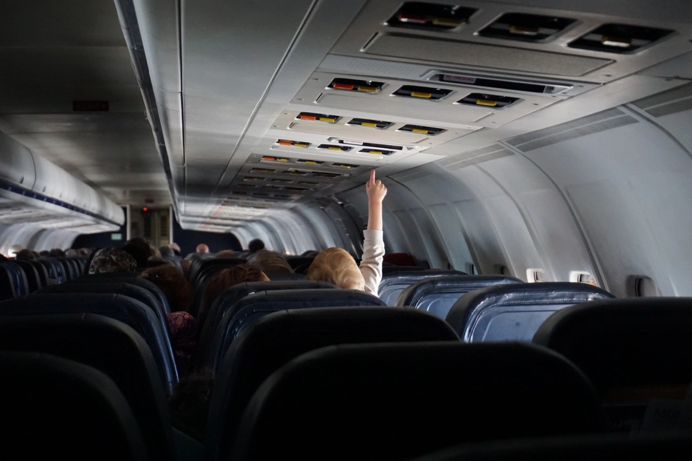
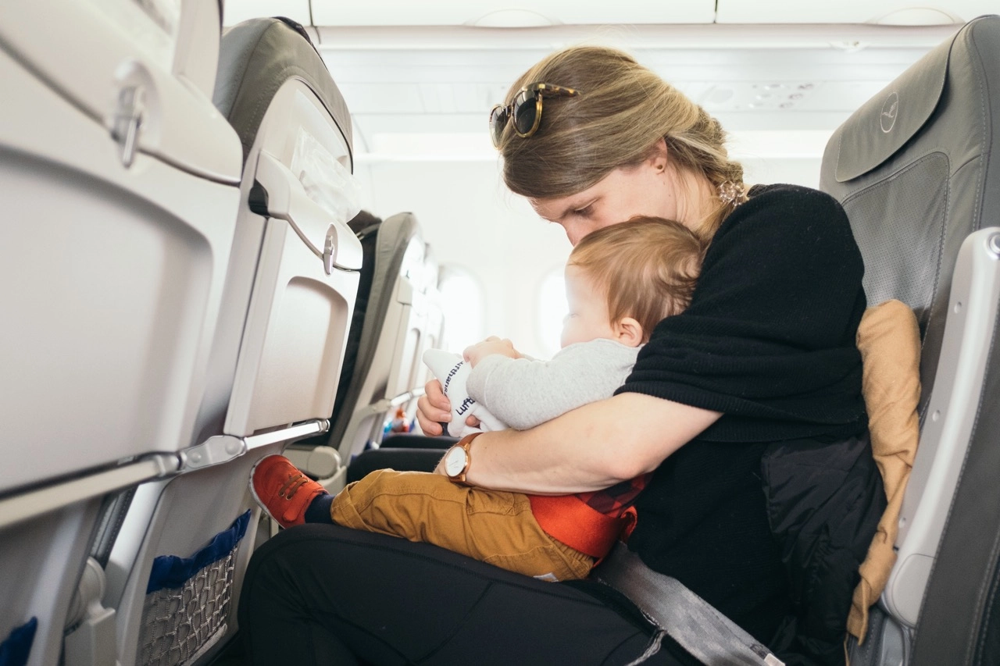
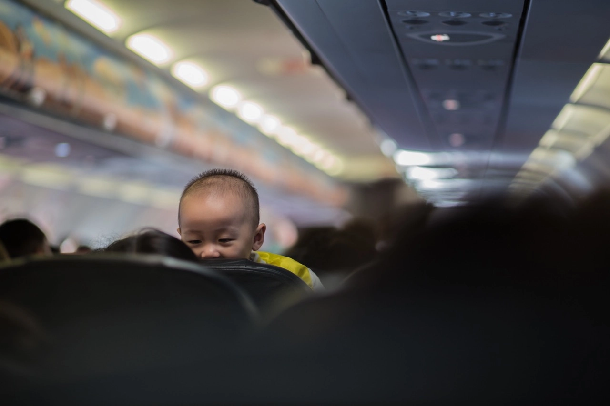
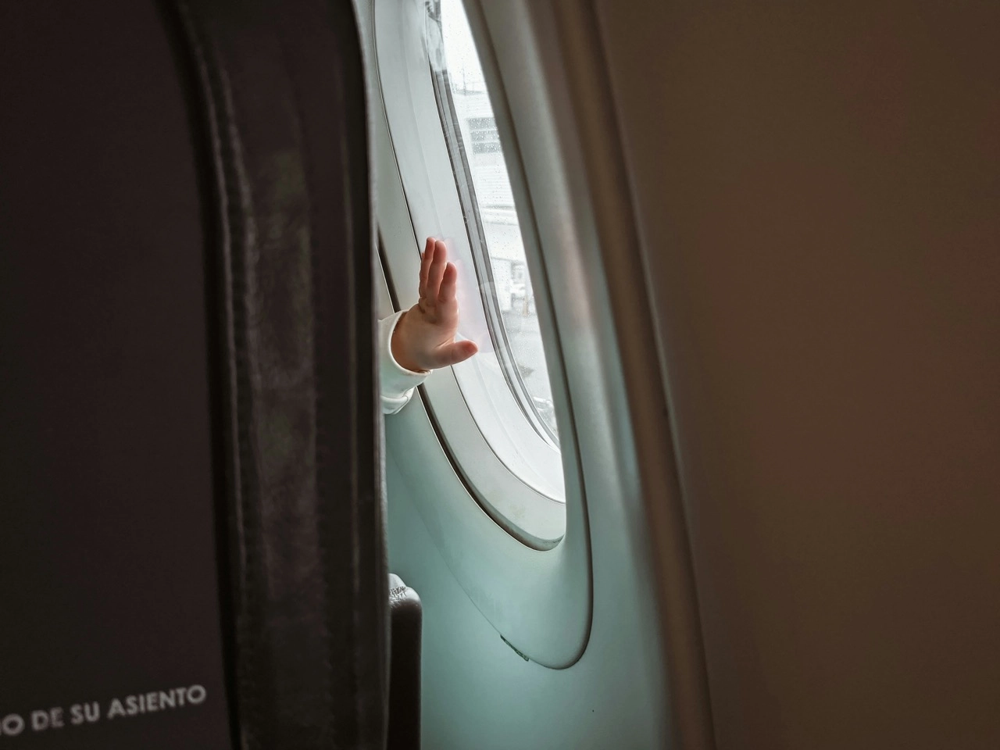

Traveling with kids can be magical, but when it comes to booking flights, the magic can quickly fade into a stressful scramble. Flying with little ones throws a unique curveball. From age-specific policies to luggage logistics, navigating award flights with children requires a different kind of packing list (and time in front of your member dashboard).

As we have received a considerable amount of help requests around this topic on our support channels, we've decided to put together this post with as much as we know in this post: essential things to consider before embarking on your award flight adventure with your mini travel companions!

## Award Flights With Kids: What To Keep In Mind

### 1. Age Matters: Understanding Age-Related Policies and Fees

First things first, let's talk about age. Airlines have specific policies for infants (usually under 2 years) and children. For infants, many airlines offer a reduced rate or even free travel when seated on a parent's lap. However, if you want a separate seat for your baby, you might need to redeem additional miles or pay a fraction of the adult fare. For older children, standard award rates typically apply, but it's always worth checking for any age-related discounts.

### Examples of some frequent flyer programs

| Airline            | Lap Infants (Under 2)              | Children (2-11)                                                                     | Teens (12+)     |
| ------------------ | ---------------------------------- | ----------------------------------------------------------------------------------- | --------------- |
| SAS EuroBonus      | Free, no seat, 1 free bag/stroller | 50% of adult cost, own seat (on SAS flights). No discount on Star Alliance Partners | Full adult cost |
| AAdvantage         | Free, no seat, 1 free bag/stroller | 75% of adult cost, own seat (sometimes 100% on partners)                            | Full adult cost |
| United MileagePlus | Free, no seat, 1 free bag/stroller | 75% of adult cost, own seat (exceptions may apply)                                  | Full adult cost |
| Alaska MileagePlan | Free, no seat, 1 free bag/stroller | 50% of adult cost, own seat (sometimes 75% on partners)                             | Full adult cost |
| Delta SkyMiles     | Free, no seat, 1 free bag/stroller | 75% of adult cost (all flights), own seat                                           | Full adult cost |
| FlyingBlue         | Free, no seat, 1 free bag/stroller | 50% of adult cost, own seat                                                         | Full adult cost |
| Aeroplan           | Free, no seat, 1 free bag/stroller | 50% of adult cost, own seat                                                         | Full adult cost |

### 2. Ask For Family-exclusive Perks

While airlines have different policies, there is usually an array of benefits and services that you could as for when booking as a family with children. Some of them include:

- **Pre-boarding for Families**: Many airlines, including Southwest, Delta, and American Airlines, offer families with young children the chance to board the plane early. This extra time can be crucial for getting settled without the pressure of holding up other passengers.
- **Complimentary Strollers**: Airlines such as Emirates and Singapore Airlines provide complimentary strollers at their hub airports, making it easier for parents to navigate through the terminal.
- **Kid-Friendly Meals**: Airlines including Air France, Qantas, and Turkish Airlines offer special children’s meals that can be pre-ordered. These meals are not only nutritious but also appealing to younger palates.
- **Activity Packs**: Carriers like SAS, Air France, KLM, British Airways, Cathay Pacific, and Etihad Airways provide children with activity packs or amenity kits, which can include coloring books, crayons, puzzles, and games to keep them engaged during the flight.
- **Child Care Assistance**: Some airlines, like Gulf Air, have a Sky Nanny service on long-haul flights, where trained staff assist parents by entertaining and taking care of young children.
- **Bassinets on Board**: For those traveling with infants, airlines such as Singapore Airlines, Air New Zealand, and Lufthansa offer bassinets on long-haul flights, allowing your baby to sleep more comfortably.
- **Frequent Flyer Programs for Kids**: Programs like JetBlue’s TrueBlue and Emirates’ Skywards Skysurfers reward young travelers with points or miles, making them feel like valued customers and encouraging future travel.
- **Priority Baggage Handling**: Airlines like KLM and Scandinavian Airlines often prioritize baggage for families, ensuring that you can quickly collect your bags and strollers and proceed with your journey.
- **Onboard Child Care Items**: Airlines such as Japan Airlines and Finnair provide essential items on board, like diapers, baby wipes, and baby food, helping to reduce the amount of packing necessary for parents.

### 3. Choosing the Right Flight Times

When traveling with kids, timing is everything. Look for flights that align with your children's routines. Red-eye flights might work for older kids, but for toddlers and younger children, consider flights that don't disrupt their sleep schedules too much. A well-rested child can be a more cooperative travel companion.

### 4. Seating Arrangements

Most airlines allow you to select seats at the time of booking, but this can vary when redeeming miles. If possible, secure seats together in advance to avoid last-minute scrambles at the airport. If you're traveling with a baby, request a bassinet seat for extra comfort. Remember, these are often available on a first-come, first-served basis.

### 5. Luggage Allowances and Gear

Check the baggage policies for award tickets, as they can differ from paid tickets. If you're traveling with infants or toddlers, you'll likely have extra gear like strollers, car seats, or cribs. Many airlines allow you to check these items for free, but it's essential to confirm this beforehand.

### 6. Airport Lounges and Facilities

One of the perks of award travel can be airport lounge access. If your award ticket grants you lounge access, take advantage of it! Lounges can be a haven for families, offering more space, complimentary snacks, and sometimes even dedicated play areas for kids equipped with toys, video games, and comfortable seating for families.

### 7. Mileage Programs and Family Pooling

Some airlines offer family pooling or sharing of miles, which can be a game-changer for booking award flights with children. This allows you to combine miles from different family members, making it easier to accumulate enough for everyone's tickets. Check if your airline offers this feature and the specific terms involved.

### 8. Plan for the Unexpected

Traveling with kids can be unpredictable. Look for award tickets that offer some flexibility in case of last-minute changes. It might be worth investing a few extra miles for tickets with more lenient change or cancellation policies.

### 9. Entertainment and Comfort Onboard

Lastly, think about in-flight comfort and entertainment. Pack enough snacks, games, books, and devices to keep your little ones engaged. Some airlines offer kid-friendly in-flight entertainment, but it's always good to have backups.

## Want more award travel intel?

You can [try AwardFares for free](https://awardfares.com/). We are rolling out new features and improvements regularly, so [sign up for our monthly newsletter](https://awardfares.com/newsletter) to stay on top of the latest news, announcements, and pro tips.

With our [Gold and Diamond tiers](https://awardfares.com/pricing), you can access premium features such as unlimited daily searches, alerts, seat maps, flight schedules, and more!

## Read more

Our guides have all the information you need to be a pro travel hacker and explore the world on points. Here are some related posts you might enjoy:

- [Seat Maps: Getting The Perfect Seat Even Before Booking](https://blog.awardfares.com/seatmaps-guide/)
- [Demystifying Award Charts: All You Need To Know (2024)](https://blog.awardfares.com/demystifying-award-charts/)
- [Ultimate Guide to Award Release Dates](https://blog.awardfares.com/ultimate-guide-to-award-release-dates/)
