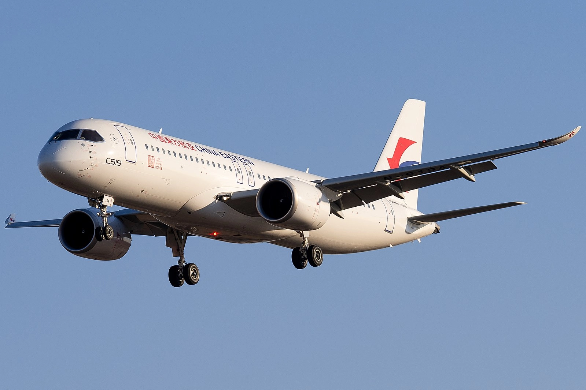

The skies are changing! Alongside established giants like Airbus and Boeing, new players are joining the game, and none are bigger than China's [COMAC](https://es.wikipedia.org/wiki/Comac). Their C919 and ARJ21-700 jets are poised to make waves in the aviation industry, and you, the savvy traveler, can be among the first to experience them. But how do you snag an award seat on these cutting-edge birds? This post is your roadmap to soaring in style on China's rising stars.

## Meet the COMAC Fleet

### C919

C919: The C919 is COMAC's most prominent project, designed to compete with the Boeing 737 and Airbus A320, the workhorses of many global airlines. This narrow-body aircraft aims to serve the high-demand single-aisle market. It's designed to carry around 158 to 168 passengers with a range of approximately 4,075 to 5,555 kilometers, making it suitable for short to medium-haul flights.

### ARJ21

The ARJ21 (Advanced Regional Jet for the 21st Century) is a smaller regional jet, the first jet aircraft developed and produced in China. Similar to the Bombardier CRJ700, it typically seats around 78 to 90 passengers and is designed for short to medium-distance flights. The ARJ21 has been in commercial service since 2016, primarily with Chinese airlines.

### CR929

This is a long-haul, wide-body aircraft being developed in collaboration with Russia's United Aircraft Corporation (UAC). The CR929 is intended to compete with the Airbus A330 and Boeing 787. It's designed to carry around 280 passengers with a range of up to 12,000 kilometers. This project is more complex and ambitious, reflecting COMAC's long-term goals in the aviation industry.

<figure>

</figure>

### Future Developments

COMAC is also believed to be working on other projects, including smaller regional aircraft and possibly larger aircraft that could compete with the likes of the Boeing 777 or Airbus A350. However, details on these projects are limited.

## Booking COMAC Award Flights

Now, the million-dollar question: how do you score an award seat on these beauties? While COMAC aircraft are relatively new, several frequent flyer programs offer exciting possibilities:

* **Star Alliance**: Air China, the launch customer for the C919, is a Star Alliance member. Programs like United MileagePlus and Singapore Airlines KrisFlyer allow you to redeem miles for flights on Air China, potentially including the C919 in the future.
* **SkyTeam**: China Eastern, another early adopter of the C919, belongs to SkyTeam. Delta SkyMiles and Air France-KLM Flying Blue are your gateways to booking award seats on China Eastern flights, potentially snagging you a Comac experience.
* **Oneworld**: While no Chinese airlines currently fly the C919 within Oneworld, keep an eye on American AAdvantage and British Airways Avios. As COMAC expands its reach, partnerships with Oneworld airlines could blossom, opening up new award booking avenues.
  
## Find COMAC Award Flights With AwardFares

### 0. Pre-step: Identify Routes

Since there are so few of these planes, it's essential that you are aware of the possible routes. Here are some of them:

| Airline                     | Aircraft Type | Routes (Example)                |
|-----------------------------|---------------|---------------------------------|
| Chengdu Airlines            | ARJ21-700     | Chengdu to Shanghai             |
|                             |               | Chengdu to Beijing              |
|                             |               | Chengdu to Guangzhou            |
| China Eastern Airlines      | ARJ21-700     | Shanghai to Yantai              |
|                             |               | Shanghai to Nanchang            |
| China Eastern Airlines      | C919          | Shanghai to Beijing             |
|                             |               | Shanghai to Guangzhou           |
|                             |               | Shanghai to Shenzhen            |
| Genghis Khan Airlines       | ARJ21-700     | Hohhot to Ulanhot               |
|                             |               | Hohhot to Xilinhot              |
| Air China                   | ARJ21-700     | Beijing to Yinchuan             |
| Air China (expected)        | C919          | Beijing to Chengdu              |
|                             |               | Beijing to Shanghai             |
| China Southern Airlines (expected) | C919   | Guangzhou to Shanghai           |
|                             |               | Guangzhou to Beijing            |

### 1. Go to AwardFares (Check Availability)

### 2.

## Beyond Miles

Remember, award availability can be scarce, especially for new aircraft. Don't be discouraged! Consider also cash Fares. You could monitor prices directly on airline websites. COMAC jets might offer competitive fares, especially on domestic routes within China. Plus, it can help you ramp-up your point stack.

Remember, this is just the beginning. As COMAC expands its reach and partnerships, the possibilities for booking award flights on their planes will only grow.

## Want more award travel intel?

You can [try AwardFares for free](https://awardfares.com/). We are rolling out new features and improvements regularly, so [sign up for our monthly newsletter](https://awardfares.com/newsletter) to stay on top of the latest news, announcements, and pro tips.

With our [Gold and Diamond tiers](https://awardfares.com/pricing), you can access premium features such as unlimited daily searches, alerts, seat maps, flight schedules, and more!

## Read more

Our guides have all the information you need to be a pro travel hacker and explore the world on points. Here are some related posts you might enjoy:

- [How To Find Cheap Award Flights And Identify Good Redemptions (Step-by-step)](https://blog.awardfares.com/how-to-find-cheap-award-flights/)
- [Seat Maps: Getting The Perfect Seat Even Before Booking](https://blog.awardfares.com/seatmaps-guide/)
- [Demystifying Award Charts: All You Need To Know (2024)](https://blog.awardfares.com/demystifying-award-charts/)
- [Ultimate Guide to Award Release Dates](https://blog.awardfares.com/ultimate-guide-to-award-release-dates)