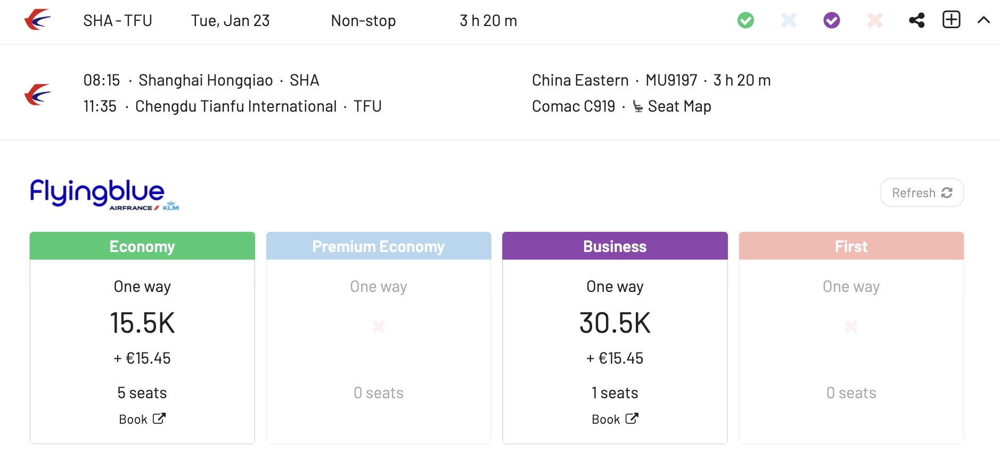

The skies are changing! Alongside established giants like Airbus and Boeing, new players are joining the game, and none are bigger than China's [COMAC](https://es.wikipedia.org/wiki/Comac). Their C919 and ARJ21-700 jets are poised to make waves in the aviation industry, and yes, you can be among the first to experience them. But how do you snag an award seat on these cutting-edge birds? This post is a roadmap to surfing on China's rising stars, and how to redeem miles for flights on these planes.

### In This Post

- [Meet The COMAC Fleet](#meet-the-comac-fleet)
- [Booking COMAC Award Flights](#booking-comac-award-flights)
- [Finding Availability With AwardFares](#finding-availability-with-awardfares)
- [Beyond Miles](#beyond-miles)
- [Want More Award Travel Intel?](#want-more-award-travel-intel)
- [Read More](#read-more)

## Meet The COMAC Fleet

COMAC's fleet currently reflects a company in transition. While their workhorse, the ARJ21 regional jet, boasts a modest but growing presence with airlines in China and beyond, the highly anticipated C919 narrow-body airliner remains in its infancy.

### C919

The C919 is COMAC's most prominent project, designed to compete with the Boeing 737 and Airbus A320, the workhorses of many global airlines. This narrow-body aircraft aims to serve the high-demand single-aisle market. It's designed to carry around 158 to 168 passengers with a range of approximately 4,075 to 5,555 kilometers, making it suitable for short to medium-haul flights.

### ARJ21

The ARJ21 (Advanced Regional Jet for the 21st Century) is a smaller regional jet, the first jet aircraft developed and produced in China. Similar to the Bombardier CRJ700, it typically seats around 78 to 90 passengers and is designed for short to medium-distance flights. The ARJ21 has been in commercial service since 2016, primarily with Chinese airlines.

### CR929

This is a long-haul, wide-body aircraft being developed in collaboration with Russia's United Aircraft Corporation (UAC). The CR929 is intended to compete with the Airbus A330 and Boeing 787. It's designed to carry around 280 passengers with a range of up to 12,000 kilometers. This project is more complex and ambitious, reflecting COMAC's long-term goals in the aviation industry.

<figure>

</figure>

### Future Developments

COMAC is also believed to be working on other projects, including smaller regional aircraft and possibly larger aircraft that could compete with the likes of the Boeing 777 or Airbus A350. However, details on these projects are limited.

## Booking COMAC Award Flights

Now, the million-dollar question: how do you score an award seat on these beauties? While COMAC aircraft are relatively new, several frequent flyer programs offer exciting possibilities:

- **Star Alliance**: Air China, the launch customer for the C919, is a Star Alliance member. Programs like SAS EuroBonus, United MileagePlus and Singapore Airlines KrisFlyer allow you to redeem miles for flights on Air China, including the C919.
- **SkyTeam**: China Eastern, another early adopter of the C919, belongs to SkyTeam. Delta SkyMiles and Air France-KLM Flying Blue are your gateways to booking award seats on China Eastern flights.
- **Oneworld**: While no Chinese airlines currently fly the C919 within Oneworld, keep an eye on American AAdvantage and British Airways Avios. As COMAC expands its reach, partnerships with Oneworld airlines could blossom, opening up new award booking avenues.
  
## Finding Availability With AwardFares

### 0. Pre-step: Identify Routes

Since there are so few of these planes, it's essential that you are aware of the possible routes. Here are some of them:

| Airline                     | Aircraft Type | Routes                          |
|-----------------------------|---------------|---------------------------------|
| Chengdu Airlines            | ARJ21-700     | Chengdu to Shanghai             |
|                             |               | Chengdu to Beijing              |
|                             |               | Chengdu to Guangzhou            |
| China Eastern Airlines      | ARJ21-700     | Shanghai to Yantai              |
|                             |               | Shanghai to Nanchang            |
|                             | C919          | Shanghai to Beijing             |
|                             |               | Shanghai to Guangzhou           |
|                             |               | Shanghai to Shenzhen            |
| Genghis Khan Airlines       | ARJ21-700     | Hohhot to Ulanhot               |
|                             |               | Hohhot to Xilinhot              |
| Air China                   | ARJ21-700     | Beijing to Yinchuan             |
| Air China (expected)        | C919          | Beijing to Chengdu              |
|                             |               | Beijing to Shanghai             |
| China Southern Airlines (expected) | C919   | Guangzhou to Shanghai           |
|                             |               | Guangzhou to Beijing            |

### 1. Go to [AwardFares](https://awardfares.com/signup)

Creating an account is optional, but it's also free, and it gives you access to more features. Make sure to [sign up for one here](https://awardfares.com/signup).

### 2. Select your **Frequent Flyer Program**

Tap on the **Loyalty Program** field and select your desired frequent flyer program. Use Flying Blue or Delta SkyMiles for China Eastern, and MileagePlus or EuroBonus for Air China.

### 3. Add a Route

Use the **Origin** and **Destination** fields to add the corresponding airports and search for flights operating that route.

In the example below, we search for flights [between Shanghai and Chengdu](https://awardfares.com/search?SHA..;x:0;z:flyingblue).

### 4. Filter by *Aircraft*

It's possible to just display flights operated by COMAC planes. Tap on the *Equipment* filter and add Comac ARJ21-700 or Comac C919.

Additionally, you tap on *Airline* and add a specific airline such as China Eastern, Air China etc.

### 5. Choose or explore dates

If you have a particular date in mind, add it by tapping on the **Calendar** field.

If you don't have a set date, you can take advantage of AwardFare's **Timeline View** to explore seat availability across different days. The Timeline View displays how many seats are available for each day of the week/month. The bars are color-coded, so it's easy to distinguish between cabin classes (Economy, Business, First). You can also trigger new searches by tapping the refresh icon underneath each day.

Here are some example results when searching for flights on the C919

And some options for the ARJ21-700

In addition, you can tap anywhere on the flight to display more details in an expanded view, such as aircraft type, and even [get the current seat maps](https://blog.awardfares.com/seatmaps-guide/) to see which seats are free versus occupied!

### 6. Book on the airline's website

Once you have identified the flight(s) you want, tap on the **Book** button, and AwardFares will redirect you to the airline France website, setting your query directly, so you don't have to redo the search. Simply login and complete the booking1.

- *(1) Remember that AwardFares will never ask for the login credentials of your frequent flyer programs to work.*

## Beyond Miles

Remember, award availability can be scarce, especially for new aircraft. Don't be discouraged! Consider also cash Fares. You could monitor prices directly on airline websites. COMAC jets might offer competitive fares, especially on domestic routes within China. Plus, it can help you ramp-up your point stack.

Remember, this is just the beginning. As COMAC expands its reach and partnerships, the possibilities for booking award flights on their planes will only grow.

## Want More Award Travel Intel?

You can [try AwardFares for free](https://awardfares.com/). We are rolling out new features and improvements regularly, so [sign up for our monthly newsletter](https://awardfares.com/newsletter) to stay on top of the latest news, announcements, and pro tips.

With our [Gold and Diamond tiers](https://awardfares.com/pricing), you can access premium features such as unlimited daily searches, alerts, seat maps, flight schedules, and more!

## Read More

Our guides have all the information you need to be a pro travel hacker and explore the world on points. Here are some related posts you might enjoy:

- [How To Find Cheap Award Flights And Identify Good Redemptions (Step-by-step)](https://blog.awardfares.com/how-to-find-cheap-award-flights/)
- [Award Flights On The A380: Airlines and Routes](https://blog.awardfares.com/a380-award-flights/)
- [How To Book The New JAL Flagship A350 With Miles Or Points](https://blog.awardfares.com/jal-flagship-a350/)
- [ANA 777 Liveries: How To Fly The Pokémon Jets And Other Spectacular Planes](https://blog.awardfares.com/ana-777-fleet/)