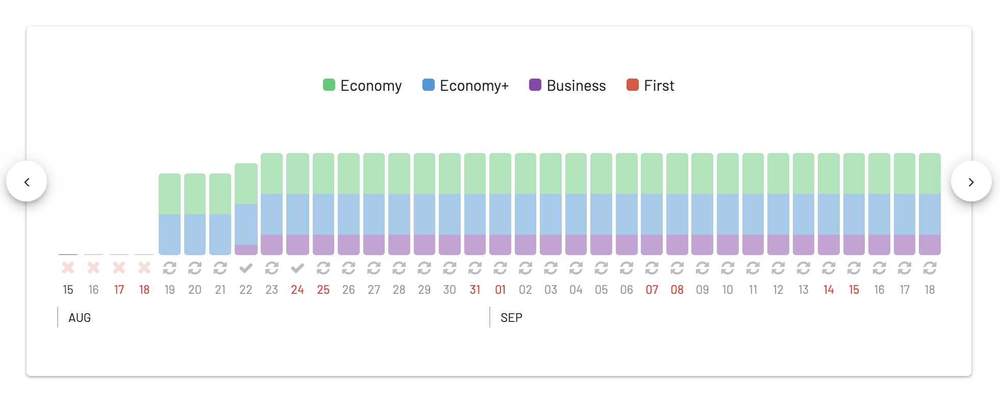
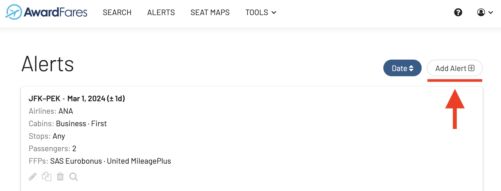
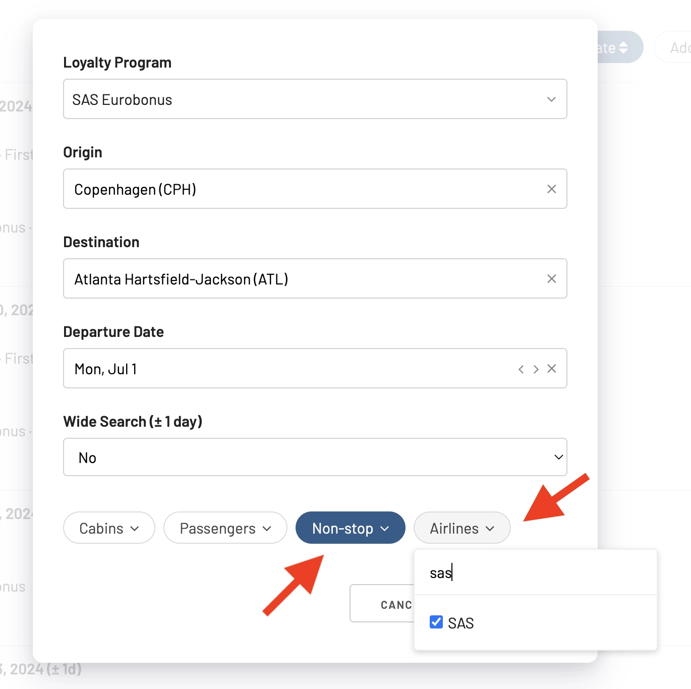

Waking up to more exciting news for SAS travelers and EuroBonus lovers! Scandinavian Airlines announced it will expand its North American network in the summer of 2024 by introducing a ninth destination: starting June 17th, there will be daily nonstop flights from [**Copenhagen to Atlanta**](https://www.sasgroup.net/newsroom/press-releases/2024/sas-expands-its-summer-program-to-include-atlanta/).

The flight schedule for the Copenhagen-Atlanta route will feature daily services with an Airbus A330 during the summer program and a slightly reduced frequency of five weekly flights with an Airbus A350 during the winter program.

**UPDATE (Jan 20)**: Award flights on the new Atlanta route started to become available using SAS EuroBonus points [(read here)](#awards).

#### Schedule in Summer: Daily with Airbus A330

| Flight No. | Departure | STD    | Arrival | STA        |
|------------|-----------|--------|---------|------------|
| SK929      | CPH       | 13:10  | ATL     | 17:10      |
| SK930      | ATL       | 19:00  | CPH     | 10:20 (+1) |

#### Schedule in Winter: 5 Weekly with Airbus A350 (Mon, Wed, Fri, Sat, Sun)

| Flight No. | Departure | STD    | Arrival | STA        |
|------------|-----------|--------|---------|------------|
| SK929      | CPH       | 13:00  | ATL     | 17:00      |
| SK930      | ATL       | 19:10  | CPH     | 10:20 (+1) |

## Why Atlanta?

One of the most compelling reasons for SAS's new route to Atlanta is the anticipated transition of the airline from Star Alliance to SkyTeam. Atlanta's Hartsfield-Jackson International Airport is a major hub for Delta Air Lines, a leading member of the SkyTeam alliance.

SAS President & CEO Anko van der Werff highlighted the strategic partnership with Delta Air Lines. This collaboration is set to broaden SAS's reach, offering passengers access to numerous destinations across the Southern USA, the Caribbean, and Latin America.

Atlanta is **a significant business hub** in the United States, home to numerous Fortune 500 companies, including Coca-Cola, Home Depot, and UPS. This makes the city a lucrative destination for business travelers, a key demographic for airlines like SAS.

Hartsfield-Jackson Atlanta International Airport, where over 107 million passengers traveled in 2023, stands as the [world’s busiest and most efficient airport](https://simpleflying.com/busiest-airports-usa-2023/). The new route to Atlanta is expected to significantly boost cargo transportation, mainly due to its proximity to the Port of Savannah, America's largest and fastest-growing container terminal.

Atlanta's airport is not only the world's busiest in terms of passenger traffic but also **a major cargo hub**. With the proximity of the Port of Savannah, one of America's largest and fastest-growing container terminals, there is substantial potential for cargo transport alongside passenger services.

## Book With EuroBonus: Set Up Alerts {#awards}

Tickets were not available when the announcement came out, but as of today, there are available seats on this route (in all cabins) [from August 17th, 2024 (search here).](https://awardfares.com/search?CPH.ATL.2024-08-17;o:duration;so:a;z:sas).

With AwardFares, it's easy to [set up an alert](https://blog.awardfares.com/alerts) and get notified via email when seats become available.

Simply [log in to your account](https://awardfares.com/login), go to **Alerts**, and tap on **Add Alert**.

Then, configure it with the following settings. Remember to add *nonstop* to the **Stops** filter and *SAS* to the **Airline** filter. Alternatively, you could use the flight numbers, but we advise keeping them broader if the airline changes/adjusts them in the upcoming weeks.

From Copenhagen to Atlanta:

* **Loyalty Program**: SAS EuroBonus
* **Origin**: Copenhagen (CPH)
* **Destination**: Atlanta (ATL)
* **Departure Date**: Pick your desired date starting June 17th.
* **Wide Search**: Choose *Yes* if you have flexibility with the days you'd like to travel.
* **Stops**: Non-stop only
* **Airlines**: SAS only

From Atlanta to Copenhagen:

* **Loyalty Program**: SAS EuroBonus
* **Origin**: Copenhagen (CPH)
* **Destination**: Atlanta (ATL)
* **Departure Date**: Pick your desired date starting June 17th.
* **Wide Search**: Choose *Yes* if you have flexibility with the days you'd like to travel.
* **Stops**: Non-stop only
* **Airlines**: SAS only

## More Summer Routes

The expansion doesn't stop with Atlanta. SAS is also increasing the frequency of its flights to the United States. The Copenhagen-New York (JFK) route will see up to two daily flights, supplementing the existing daily services to New York-Newark Airport from Stockholm, Oslo, and Copenhagen. Additionally, the Copenhagen-Boston route will now operate daily, an increase from its previous six times a week schedule during the summer. Furthermore, Copenhagen to Toronto will benefit from an additional fourth weekly flight.

The upcoming summer program will see SAS serving a diverse range of destinations in North America, including Atlanta, New York (EWR & JFK), Chicago, Boston, Washington D.C., Los Angeles, San Francisco, Miami (until April 7), and Toronto, further cementing its position as a key player in transatlantic travel.

SAS has been actively expanding its global connectivity. In early June 2023, the airline signed a codeshare agreement with EL AL Israel Airlines, which became effective in February. Another significant partnership was with Etihad Airways in October. These codeshare agreements enhance passenger connectivity, providing access to a wide range of destinations worldwide. SAS now boasts 18 such agreements with various carriers globally.

* **Read More**: [SAS Will Fly To 9 New Destinations During Summer 2024](https://blog.awardfares.com/sas-summer-2024/)

## Want More Award Travel Intel?

You can [try AwardFares for free](https://awardfares.com/). We are rolling out new features and improvements regularly, so [sign up for our monthly newsletter](https://awardfares.com/newsletter) to stay on top of the latest news, announcements, and pro tips.

With our [Gold and Diamond tiers](https://awardfares.com/pricing), you can access premium features such as unlimited daily searches, alerts, seat maps, flight schedules, and more!

## Read More

Our guides have all the information you need to be a pro travel hacker and explore the world on points. Here are some related posts you might enjoy:

* [SAS EuroBonus Conscious Traveler Takes Off In 2024: Greener Flying, Greater Rewards](https://blog.awardfares.com/sas-eurobonus-conscious-traveler/)
* [6 SAS Eurobonus Updates You Should Be Aware Of (January 2024)](https://blog.awardfares.com/eurobonus-updates-jan-2024/)
* [Last-Minute EuroBonus Redemption Gems (For The Amex 2-for-1 Vouchers) [EXTENDED DEADLINE]](https://blog.awardfares.com/eurobonus-last-minute-awards-2023/)
* [Try These EuroBonus Award Flights Before SAS Leaves Star Alliance (Megapost)](https://blog.awardfares.com/eurobonus-star-alliance-awards/)
* [How To Find Cheap Award Flights And Identify Good Redemptions (Step-by-step)](https://blog.awardfares.com/how-to-find-cheap-award-flights/)