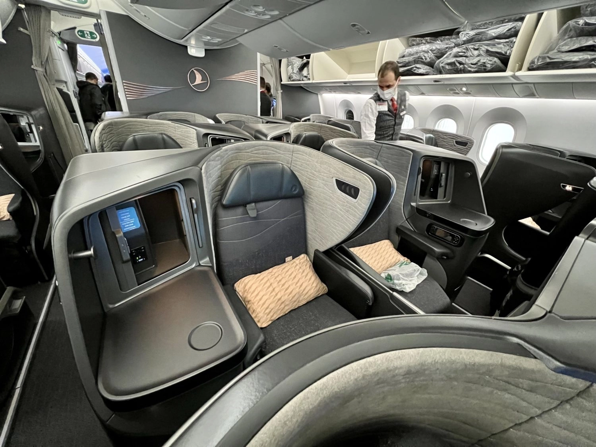

Turkish Airlines has officially announced its inaugural flights to Australia, beginning on March 15 with a thrice-weekly service from Istanbul to Melbourne, via Singapore Changi Airport. The initial flights will utilize Boeing 787-9 aircraft, transitioning to Airbus A350-900 from March 31.

Turkish Airlines cabins on the 787 and A350 are among the most modern in the industry, particularly in Business Class. These flights are a fantastic opportunity to fly a long route with great service.

<figure>

</figure>

*Images from FrequentMiler and SamChui*

This launch marks Melbourne as Turkish Airlines' first Australian destination and adds it as the 346th point in its expansive network. The airline aims to increase its presence in Australia in the coming years by boosting flight frequencies and destinations.

The flights to Melbourne Airport (MEL) will offer a brief layover in Singapore, and Turkish Airlines will be the only European carrier on this route. This development is particularly significant for Melbourne, which hosts Australia's largest Turkish community.

## Award Availability

As of today, awards seem to be available from the inaugural date, March 15th using several frequent flyer programs, including SAS EuroBonus and United MileagePlus.

Keep in mind that availability differs between the programs, and, seats in premium cabins, such as Business Class, is more scarce than in Economy.

Here's the availability up to date using SAS EuroBonus points:

And here it is with United MileagePlus:

With AwardFares, it's also possible to see the equipment transition that happens in March 31st, from the 787 to the A350.

## How to search for SAS EuroBonus Awards with AwardFares?

1. Go to [AwardFares](https://awardfares.com/signup).
2. Choose your favorite frequent flyer Program under *Loyalty Program*.
3. Tap on *Airline* and select **Turkish Airlines only**.
4. Enter your departure city (e.g. **Istanbul**).
5. Enter your destination airport (e.g. **Melbourne**).
6. Choose a date, or use the Timeline view to explore flights for different dates.

## More Expansion In The Future

Australia's government has recently approved an increase in weekly flights from Turkey, with plans for further expansion in the coming years. This includes fifth-freedom traffic rights, allowing more connectivity options.

In the long term, Turkish Airlines intends to operate nonstop flights between Istanbul and Australia, contingent on acquiring suitable long-haul aircraft like the Airbus A350-1000 or the Boeing 777X.

For travelers looking to book these new routes, AwardFares provides a convenient platform to search for award flights, making it easier to find the best options for trips to Australia or other destinations within Turkish Airlines' growing network.

## Want More Award Travel Intel?

You can [try AwardFares for free](https://awardfares.com/). We are rolling out new features and improvements regularly, so [sign up for our monthly newsletter](https://awardfares.com/newsletter) to stay on top of the latest news, announcements, and pro tips.

With our [Gold and Diamond tiers](https://awardfares.com/pricing), you can access premium features such as unlimited daily searches, alerts, seat maps, flight schedules, and more!

## Read More

Our guides have all the information you need to be a pro travel hacker and explore the world on points. Here are some related posts you might enjoy:

- [Booking Turkish Airlines Flights With SAS EuroBonus Points (Guide)](https://blog.awardfares.com/turkish-with-eurobonus/)
- [How To Find Cheap Award Flights And Identify Good Redemptions (Step-by-step)](https://blog.awardfares.com/how-to-find-cheap-award-flights/)