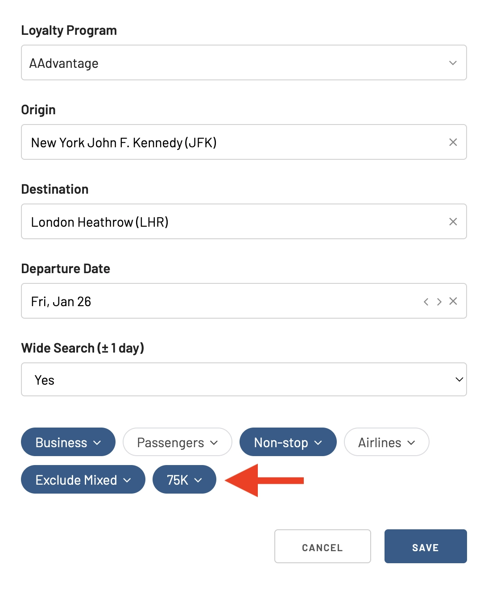
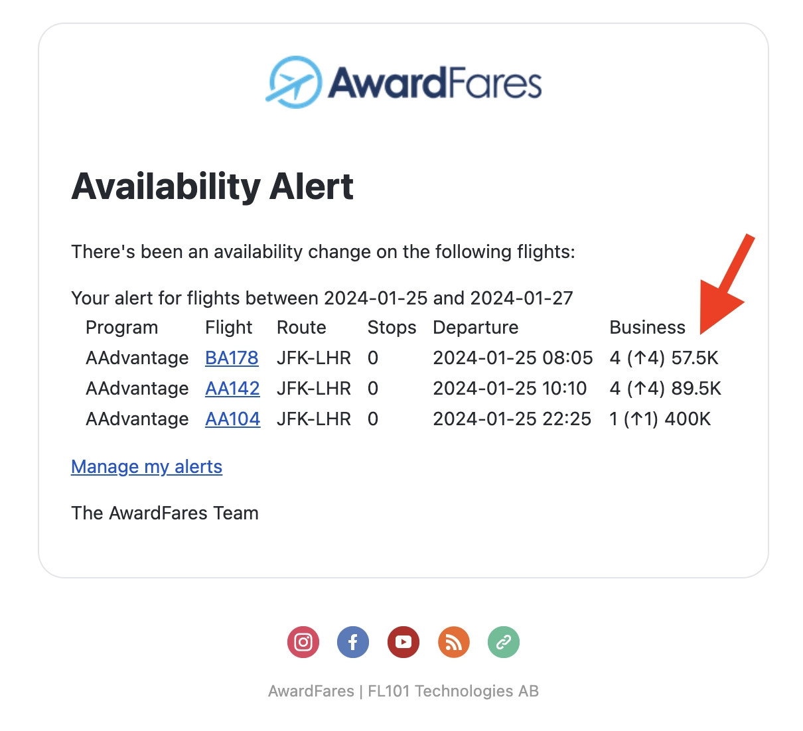
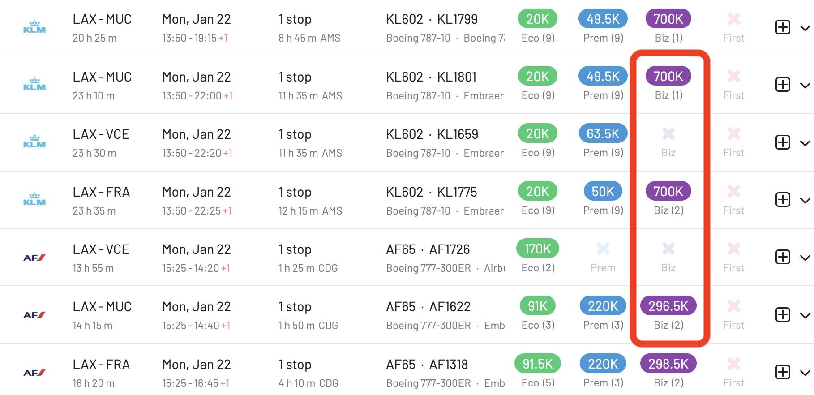
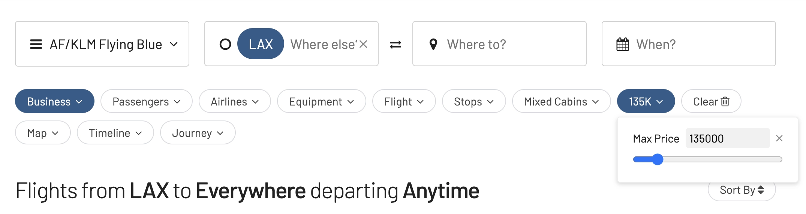
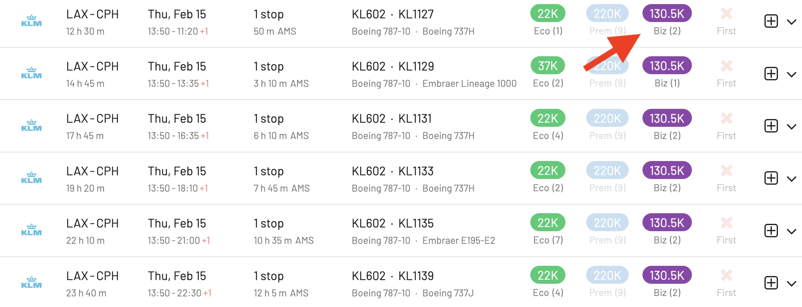

The days of refreshing search pages and missing out on dream deals are officially over. We're thrilled to announce two game-changing features that put you in the driver's seat of your award travel journey: **Price Alerts** and **Max Price Filters**.

## Never Miss a Price Drop Again with Price Alerts

Imagine this: you've found the perfect award flight to your bucket-list destination, but the price is just a tad out of reach. With Price Alerts, those sleepless nights spent watching the price fluctuate are a thing of the past.

Simply set an alert for your desired route and price point, sit back and relax. We'll send you a friendly notification as soon as the price dips below your threshold, ensuring you snag that dream flight before it disappears.

### How To Use It

Simply go to the *Alerts* tab, tap on **Add Alert**, and then set up a *Max Price*

Then, you'll get an email as soon as seats become available under that price threshold.

## Say Goodbye to Award Price Anxiety with Max Price Filters

We understand that planning a trip involves sticking to a budget. That's why we're introducing the Max Price Filter. This tool allows you to filter search results based on the round-trip price in points or miles. It's simple: set your maximum price, and we'll show you the flights that fit your criteria. Now, you can easily find the most cost-effective flights without sifting through options that don't match your budget.

### How To Get Started

Let's say we are exploring flights from Los Angeles to Europe using Flying Blue. We are looking for Business Class flights, since Flying Blue has a dynamic award chart, some of the award flights can become extremely expensive and definitely out of our reach. We see some options for over 700k miles one way!

To eliminate results out of our budget, tap on the *Max Price* field, and add the price you'd be willing to pay. In our case, let's cap the results at 135k Flying Blue miles.

Immediately, we see that there are flights from Los Angeles to Copenhagen with KLM, for 130.5k miles in Business Class. Now, it is much easier to find good deals and understand opportunities, especially on programs with [dynamic award charts](https://blog.awardfares.com/demystifying-award-charts/).

## Your Feedback Matters

At AwardFares, we're committed to enhancing your travel experience. We'd love to hear your feedback on these new features. Try them out on your next award flight search and share your thoughts with us. Your input helps us continue to innovate and serve you better.

You can [try AwardFares for free](https://awardfares.com/). We are rolling out new features and improvements regularly, so [sign up for our monthly newsletter](https://awardfares.com/newsletter) to stay on top of the latest news, announcements, and pro tips.

With our [Gold and Diamond tiers](https://awardfares.com/pricing), you can access premium features such as unlimited daily searches, alerts, seat maps, flight schedules, and more!

## Read More

Our guides have all the information you need to be a pro travel hacker and explore the world on points. Here are some related posts you might enjoy:

- [How To Find Cheap Award Flights And Identify Good Redemptions (Step-by-step)](https://blog.awardfares.com/how-to-find-cheap-award-flights/)
- [Seat Maps: Getting The Perfect Seat Even Before Booking](https://blog.awardfares.com/seatmaps-guide/)
- [Demystifying Award Charts: All You Need To Know (2024)](https://blog.awardfares.com/demystifying-award-charts/)
- [Ultimate Guide to Award Release Dates](https://blog.awardfares.com/ultimate-guide-to-award-release-dates)