We have some thrilling news to share that we believe will make your award travel planning even more exciting and efficient. After much anticipation and hard work, we are proud to announce the integration of **JetBlue TrueBlue** awards into AwardFares!

### What's New?

- [Expanding Your Award Travel Horizons](#expanding-your-award-travel-horizons)
- [Why JetBlue](#why-jetblue)
- [How To Find Cheap TrueBlue Awards](#how-to-find-cheap-trueblue-awards)
- [Top JetBlue Routes](#top-jetblue-routes)
- [JetBlue Mint](#jetblue-mint)
- [Getting Started](#getting-started)
- [Read More](#read-more)

## Expanding Your Award Travel Horizons

At AwardFares, we have always been committed to providing the most comprehensive and user-friendly award search tool. The addition of [**JetBlue TrueBlue**](https://trueblue.jetblue.com/login) awards is a significant milestone for us. JetBlue is a beloved airline, known for its customer-friendly services and extensive route network, and we are excited to bring their award options to your fingertips.

For our users who are JetBlue TrueBlue members or earn points through various partner programs and credit cards, this integration means a whole new world of possibilities. You can now easily find the best ways to redeem your points for JetBlue flights, right alongside searches for other airlines.

Our platform's new feature includes:

- **Up-to-the-minute availability**: We provide real-time information on award seat availability for JetBlue flights.
- **Flexible searching**: Whether you have fixed dates or are looking for the best options over a range of dates, we’ve got you covered with our Timeline view.
- **More choices, better decisions**: With JetBlue added to our platform, you can compare more options across different airlines and loyalty programs.
- **Maximizing your points**: AwardFares helps you sort and find the most value-efficient ways to use your points.

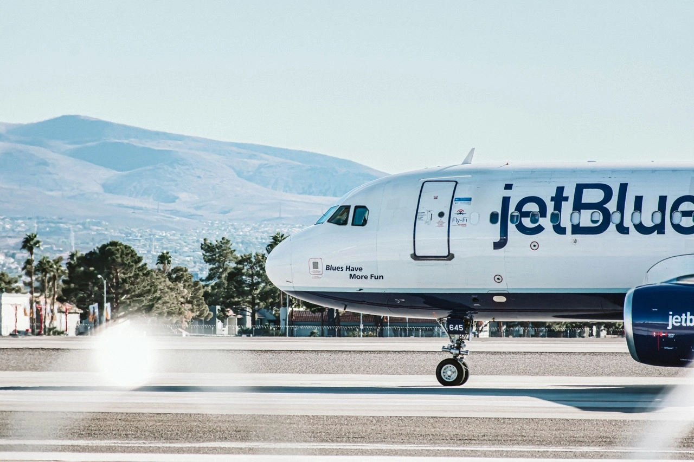

## Why JetBlue

JetBlue's TrueBlue program is popular for its straightforward points system and no blackout dates. This fits perfectly with our mission to make award travel accessible and simple. With TrueBlue, you get:

### 1. User-Friendly Points System

One of the standout features of TrueBlue is its straightforward points system. Unlike some programs that have complex rules and calculations, TrueBlue awards points based on the dollar amount spent, making it easier for members to understand how they are earning rewards. In 2024, this simplicity remains a significant draw for members who appreciate transparency in their loyalty programs.

### 2. No Blackout Dates

TrueBlue continues to uphold its policy of no blackout dates for award flights. This feature is particularly appealing to travelers who need the flexibility to book flights during peak travel periods. Members can use their points for any seat, on any JetBlue-operated flight, a benefit that is not universally offered in all loyalty programs.

### 3. Family Pooling of Points

JetBlue TrueBlue's family pooling feature, which allows families or small groups to combine points, is still a unique offering in the airline industry. This system enables families to accumulate points more quickly and use them more effectively, making it easier to plan family vacations or group trips.

### 4. Partnerships and Expanding Network

As of 2024, TrueBlue has expanded its network of partnerships, allowing members to earn and redeem points with a wider range of airlines, hotels, and other travel-related services. This expansion provides greater flexibility and choice for members, enhancing the value of the points they earn.

**Airline partners**: Hawaiian Airlines, Qatar Airways, Emirates, Aer Lingus, Cape Air, Icelandair, South African Airways, and Silver Airways.

### 5. Tiered Membership Benefits

TrueBlue offers tiered membership levels, including Mosaic, which provide additional benefits such as expedited security, early boarding, and bonus points earnings. These tiers cater to frequent flyers, offering perks that make travel more comfortable and efficient.

### 6. Commitment to Sustainability

JetBlue's commitment to sustainability also extends to its TrueBlue program. Members are increasingly looking for environmentally responsible travel options, and TrueBlue has responded by offering opportunities to earn points through sustainable travel choices and to use points for eco-friendly initiatives.

## How To Find Cheap TrueBlue Awards

### 1. Go to [AwardFares](https://awardfares.com/signup)

It's optional to create an account, but it's also free, and it gives you access to more features. Make sure to [sign up for one here](https://awardfares.com/signup).

### 2. Select **TrueBlue** under *Frequent Flyer Program*

Tap on the **Loyalty Program** field and select JetBlue TrueBlue in the dropdown menu.

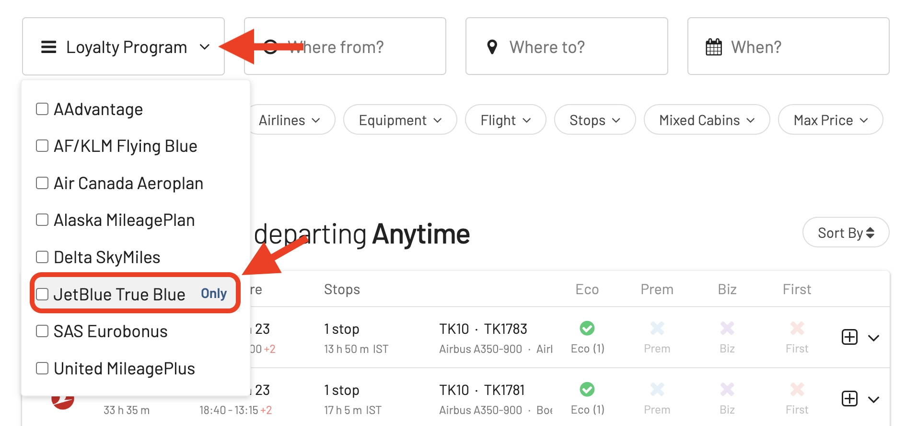

### 3. Add a Route

Use the **Origin** and **Destination** fields to add one (or more) airports to search for flights between those locations. AwardFares will search for award flights with any number of stops. In addition, you can use the **Stops** filter to search for non-stop flights only.

In this example, we search for flights [between New York (JFK) to Los Angeles (LAX)](https://awardfares.com/search?JFK.LAX.;z:jetblue).

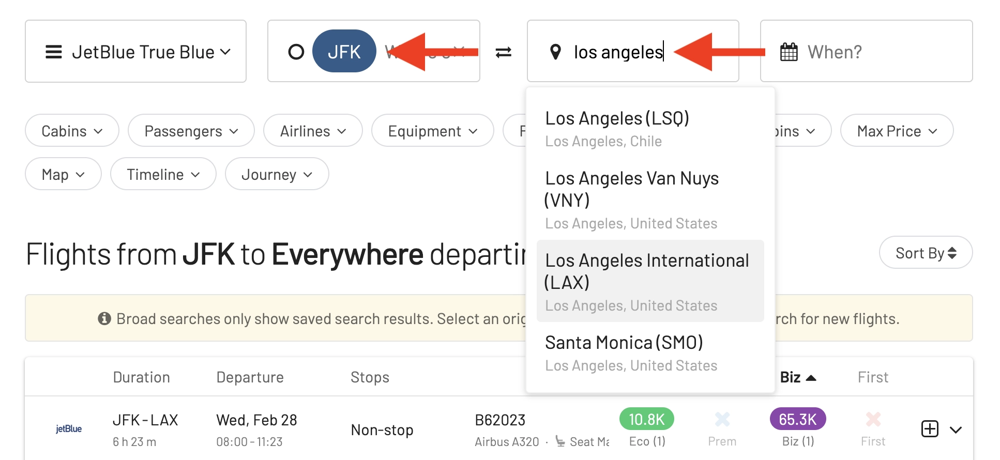

### 4. Choose or explore dates

If you have a particular date in mind, add it by tapping on the **Calendar** field.

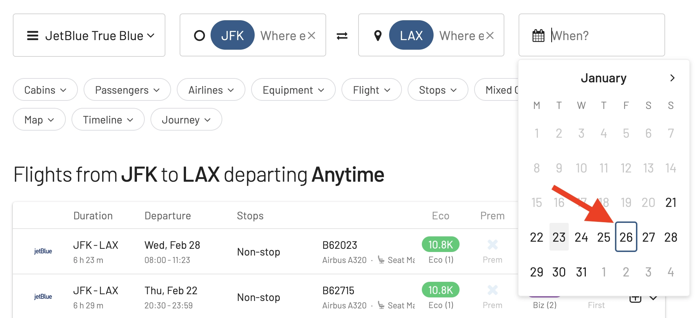

If you don't have a set date, you can take advantage of AwardFares' **Timeline View** to explore seat availability across different days. The Timeline View displays how many seats are available for each day of the week/month. The bars are color-coded, so it's easy to distinguish between cabin classes (Economy, Business/Mint). You can also trigger new searches by tapping the refresh icon underneath each day.

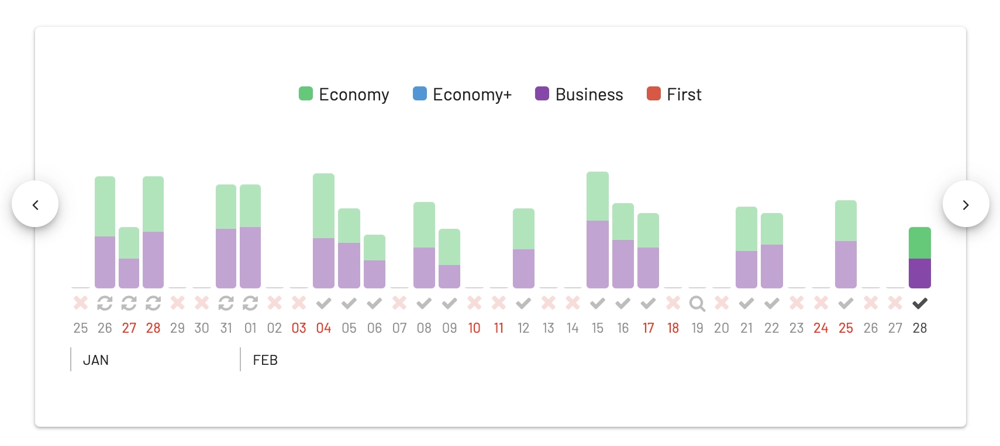

You'll see the result list right below:

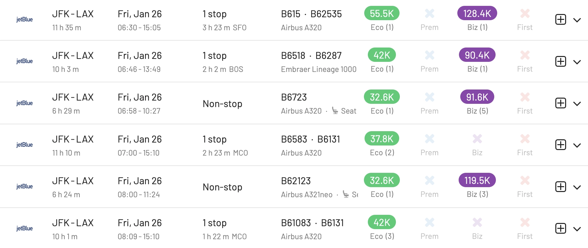

In addition, you can tap anywhere on the flight to display more details in an expanded view, such as aircraft type, and even [get the current seat maps](https://blog.awardfares.com/seatmaps-guide/) to see which seats are free or occupied.

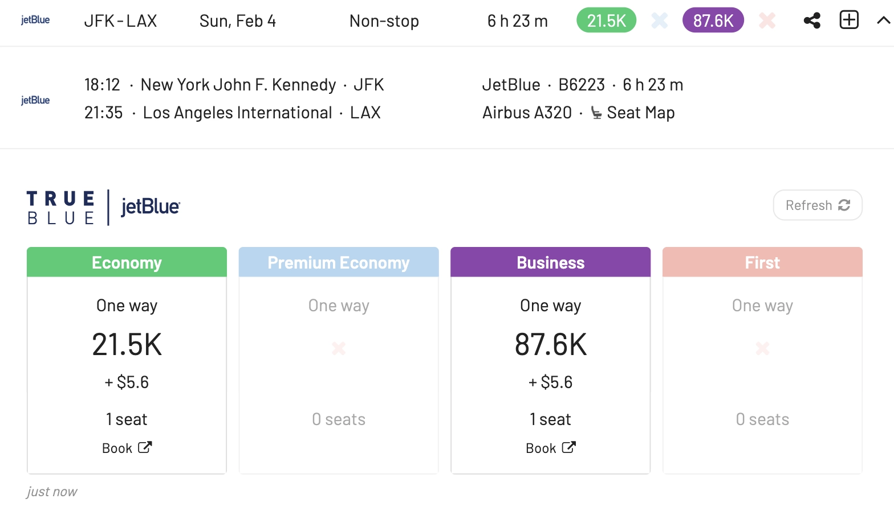

### 5. Sort by Price

Whether you are exploring dates using the Timeline View or have selected a specific day, AwardFares will show you the available seats (with real-time data) within seconds in the result list below.

You can tap on the different header columns to sort the results by price. Use the **Eco**, or **Biz** tags to find cheap awards across multiple dates, itineraries, and airlines.

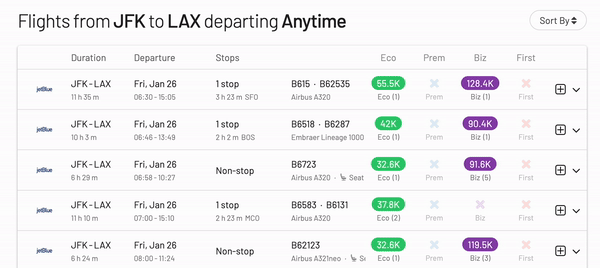

### 6. Book on JetBlue's Website

Once you have identified the flight(s) you want, tap on the **Book** button, and AwardFares will redirect you to JetBlue's website, setting your query directly, so you don't have to redo the search. Finish the booking process right there! 1.

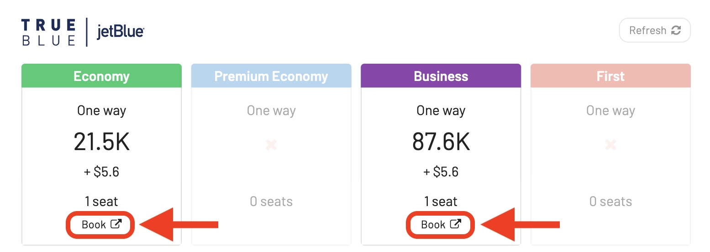

*Remember that AwardFares will never ask for the login credentials of any of your frequent flyer programs to work.*

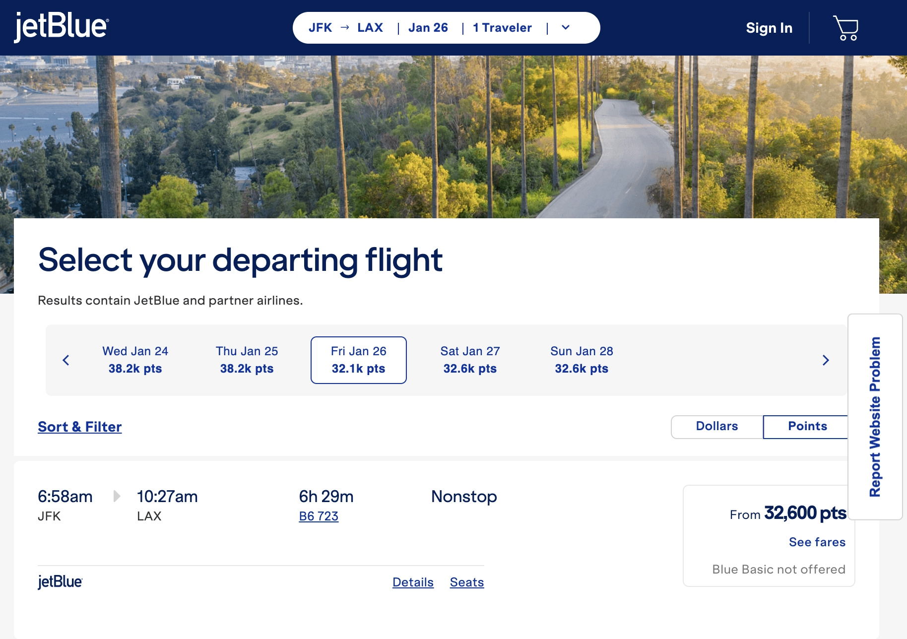

## Top JetBlue Routes

These are some of the best routes to look for TrueBlue awards:

- [New York (JFK) to Los Angeles (LAX)](https://awardfares.com/search?JFK.LAX.;z:jetblue)
- [New York (JFK) to San Francisco (SFO)](https://awardfares.com/search?JFK.SFO.;z:jetblue)
- [Boston (BOS) to Fort Lauderdale (FLL)](https://awardfares.com/search?BOS.FLL.;z:jetblue)
- [New York (JFK) to Orlando (MCO)](https://awardfares.com/search?JFK.MCO.;z:jetblue)
- [Boston (BOS) to New York (JFK)](https://awardfares.com/search?BOS.JFK.;z:jetblue)
- [Fort Lauderdale (FLL) to San Juan (SJU)](https://awardfares.com/search?FLL.SJU.;z:jetblue)
- [New York (JFK) to Boston (BOS)](https://awardfares.com/search?JFK.BOS.;z:jetblue)
- [Orlando (MCO) to New York (JFK)](https://awardfares.com/search?MCO.JFK.;z:jetblue)
- [New York (JFK) to Santo Domingo (SDQ), Dominican Republic](https://awardfares.com/search?JFK.SDQ.;z:jetblue)
- [New York (JFK) to West Palm Beach (PBI)](https://awardfares.com/search?JFK.PBI.;z:jetblue)

## JetBlue Mint

JetBlue Mint is JetBlue's premium cabin offering, comparable to business class seats on other airlines. All Mint seats convert into fully lie-flat beds, up to 6 ft 8 in (203 cm) in length, perfect for catching some rest on long flights For additional privacy, JetBlue offers Mint Suites with sliding doors and increased personal space. Seats are equipped with Tuft & Needle Adaptive Foam cushions for supreme comfort, along with memory foam pillows and customizable blankets.

<figure>

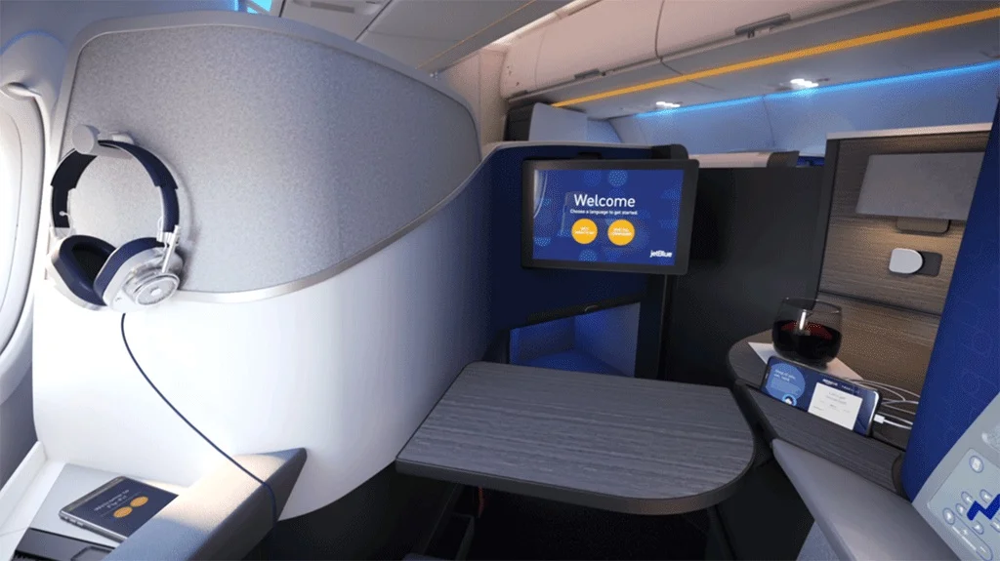
</figure>

With Mint, you also get

- Dedicated check-in and security: Breeze through the airport with priority lanes for a smoother travel experience.
- In-flight entertainment: Enjoy a wide selection of movies, TV shows, and more on personal seatback screens.
- Free Wi-Fi: Stay connected throughout your flight with complimentary Wi-Fi access.
- Food and beverages: Indulge in a delicious menu of regionally inspired dishes and complimentary drinks, including beer, wine, and spirits.
- LiveTV: On select flights, catch up on your favorite sports or news with live television.

JetBlue Mint is offered on select flights between:

- **West and East Coast of the United States**: Popular routes include New York to Los Angeles, Boston to San Francisco, and Seattle to Fort Lauderdale.
- **Caribbean**: Enjoy Mint service on seasonal flights to select destinations like Barbados, Punta Cana, and St. Lucia.
- **Europe**: Fly in style on transatlantic routes between New York and London (Heathrow and Gatwick), Dublin, Edinburgh, Amsterdam, and Paris.

Once you've identified the Mint award you are looking for in AwardFares, make sure you double check the cabin and seats on the JetBlue TrueBlue site once you are redirected to the booking page.

In this case, we see that this A321 is equipped with Mint on our selected flight from New York to Los Angeles.

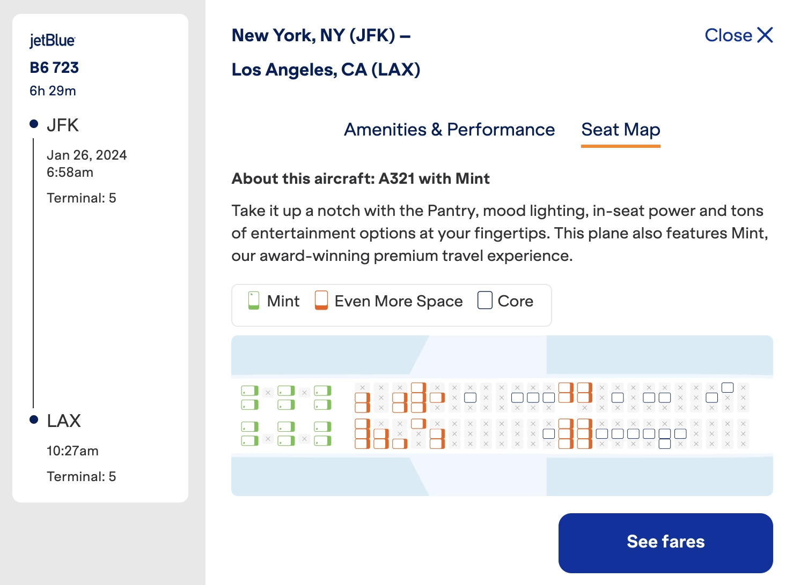

## Getting Started

You can [try AwardFares for free](https://awardfares.com/). We are rolling out new features and improvements regularly, so [sign up for our monthly newsletter](https://awardfares.com/newsletter) to stay on top of the latest news, announcements, and pro tips.

With our [Gold and Diamond tiers](https://awardfares.com/pricing), you can access premium features such as unlimited daily searches, alerts, seat maps, flight schedules, and more!

## Read More

Our guides have all the information you need to be a pro travel hacker and explore the world on points. Here are some related posts you might enjoy:

- [Top Frequent Flyer Programs To Consider In 2024 (Our Picks)](https://blog.awardfares.com/frequent-flyer-programs-2024/)
- [How To Find Cheap Award Flights And Identify Good Redemptions (Step-by-step)](https://blog.awardfares.com/how-to-find-cheap-award-flights/)
- [Demystifying Award Charts: All You Need To Know (2023)](https://blog.awardfares.com/demystifying-award-charts/)
- [Never Miss a Deal Again: Score the Perfect Fare with New Price Alerts and Filters](https://blog.awardfares.com/price-alerts/)