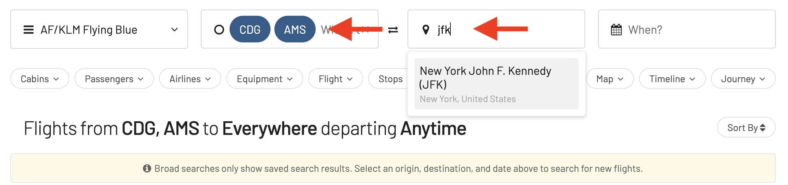
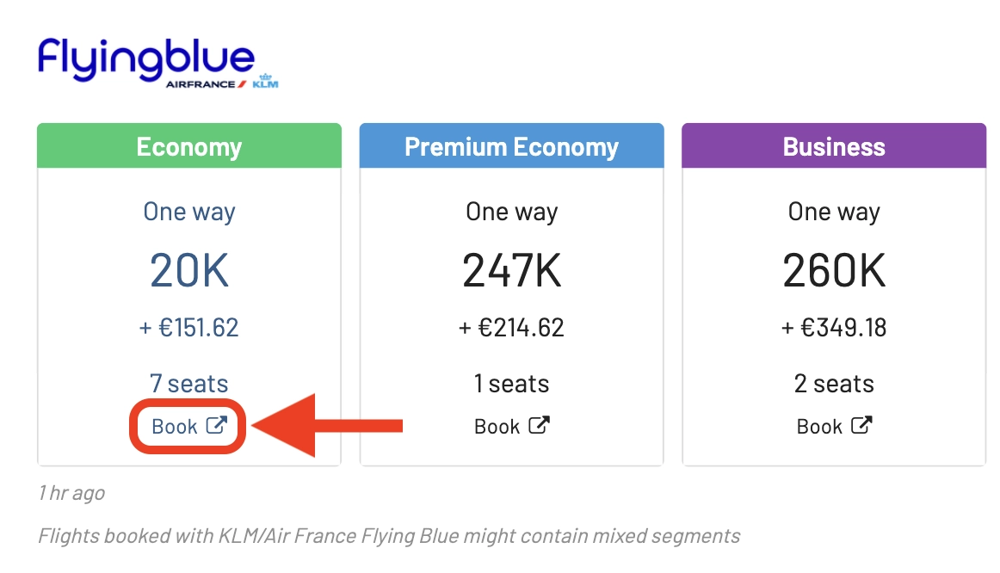

We have some thrilling news to share that we believe will make your award travel planning even more exciting and efficient. After much anticipation and hard work, we are proud to announce the integration of JetBlue TrueBlue awards into AwardFares!

### What's New?

- [Expanding Your Award Travel Horizons](#expanding-your-award-travel-horizons)
- [Why JetBlue](#why-jetblue)
- [What You Can Expect](#what-you-can-expect)
- [The TrueBlue Advantage](#the-trueblue-advantage)
- [How To Find Cheap TrueBlue Awards](#how-to-find-cheap-trueblue-awards)
- [Get started](#get-started)
- [Read more](#read-more)

## Expanding Your Award Travel Horizons

AwardFares has always been committed to providing the most comprehensive and user-friendly award search tool. The addition of JetBlue TrueBlue awards is a significant milestone for us. JetBlue is a beloved airline, known for its customer-friendly services and extensive route network, and we are excited to bring their award options to your fingertips.

## Why JetBlue

For our users who are JetBlue TrueBlue members or earn points through various partner programs and credit cards, this integration means a whole new world of possibilities. You can now easily find the best ways to redeem your points for JetBlue flights, right alongside searches for other airlines. It's all about giving you more flexibility and more options to make the best out of your points.

## What You Can Expect

Our platform's new feature includes:

- Up-to-the-Minute Availability: We provide real-time information on award seat availability for JetBlue flights.
- Flexible Searching: Whether you have fixed dates or are looking for the best options over a range of dates, we’ve got you covered.
- More Choices, Better Decisions: With JetBlue added to our platform, you can compare more options across different airlines and loyalty programs.
- Maximizing Your Points: Our platform will continue to help you find the most value-efficient ways to use your points.

## The TrueBlue Advantage

JetBlue's TrueBlue program is popular for its straightforward points system and no blackout dates. This fits perfectly with our mission to make award travel accessible and straightforward. With TrueBlue, you get:

- Earn Points on Every Dollar: Accumulate points with every dollar spent on JetBlue flights.
- Flexibility on Redemptions: No blackout dates on award flights means more freedom for you.
- Family Pooling: A great feature for families to combine points and earn flights faster.

## How To Find Cheap TrueBlue Awards

### 1. Go to [AwardFares](https://awardfares.com/signup)

It's optional to create an account, but it's also free, and it gives you access to more features. Make sure to [sign up for one here](https://awardfares.com/signup).

### 2. Select **TrueBlue** under *Frequent Flyer Program*

Tap on the **Loyalty Program** field and select JetBlue TrueBlue in the dropdown menu.

### 3. Add a Route

Use the **Origin** and **Destination** fields to add one (or more) airports to search for flights between those locations. AwardFares will search for award flights with any number of stops. In addition, you can use the **Stops** filter to search for non-stop flights only.

In the example below, we search for flights [between Amsterdam and Paris to New York](https://awardfares.com/search?area:NYC.area:CDG.;so:a;z:delta).

### 4. Choose or explore dates

If you have a particular date in mind, add it by tapping on the **Calendar** field.

If you don't have a set date, you can take advantage of AwardFare's **Timeline View** to explore seat availability across different days. The Timeline View displays how many seats are available for each day of the week/month. The bars are color-coded, so it's easy to distinguish between cabin classes (Economy, Business, First). You can also trigger new searches by tapping the refresh icon underneath each day.

In addition, you can tap anywhere on the flight to display more details in an expanded view, such as aircraft type, and even [get the current seat maps](https://blog.awardfares.com/seatmaps-guide/) to see which seats are free versus occupied!

### 5. Sort by Price

Whether you are exploring dates using the Timeline View or have selected a specific day, AwardFares will show you the available seats (with real-time data) within seconds in the result list below.

You can tap on the different header columns to sort the results by price. Use the **Eco**, **Prem**, **Biz**, and **First** class tags to find cheap awards across multiple dates, itineraries, and airlines.

### 6. Book on Air France Website

One of the slightly confusing parts of Flying Blue as a loyalty program is that they have multiple portals, both through Air France and KLM's website.

Once you have identified the flight(s) you want, tap on the **Book** button, and AwardFares will redirect you to Air France website, setting your query directly, so you don't have to redo the search. Simply login and complete the booking1.

 - *(1) Remember that AwardFares will never ask for the login credentials of any of your frequent flyer programs to work.*

## Get started

You can [try AwardFares for free](https://awardfares.com/). We are rolling out new features and improvements regularly, so [sign up for our monthly newsletter](https://awardfares.com/newsletter) to stay on top of the latest news, announcements, and pro tips.

With our [Gold and Diamond tiers](https://awardfares.com/pricing), you can access premium features such as unlimited daily searches, alerts, seat maps, flight schedules, and more!

## Read more

Our guides have all the information you need to be a pro travel hacker and explore the world on points. Here are some related posts you might enjoy:

- [How To Find Cheap Award Flights And Identify Good Redemptions (Step-by-step)](https://blog.awardfares.com/how-to-find-cheap-award-flights/)
- [Delta SkyMiles Award Search Now Available (New Features)](https://blog.awardfares.com/introducing-delta/)
- [Seat Maps: Getting The Perfect Seat Even Before Booking](https://blog.awardfares.com/seatmaps-guide/)
- [Demystifying Award Charts: All You Need To Know (2023)](https://blog.awardfares.com/demystifying-award-charts/)
- [Ultimate Guide to Award Release Dates](https://blog.awardfares.com/ultimate-guide-to-award-release-dates)