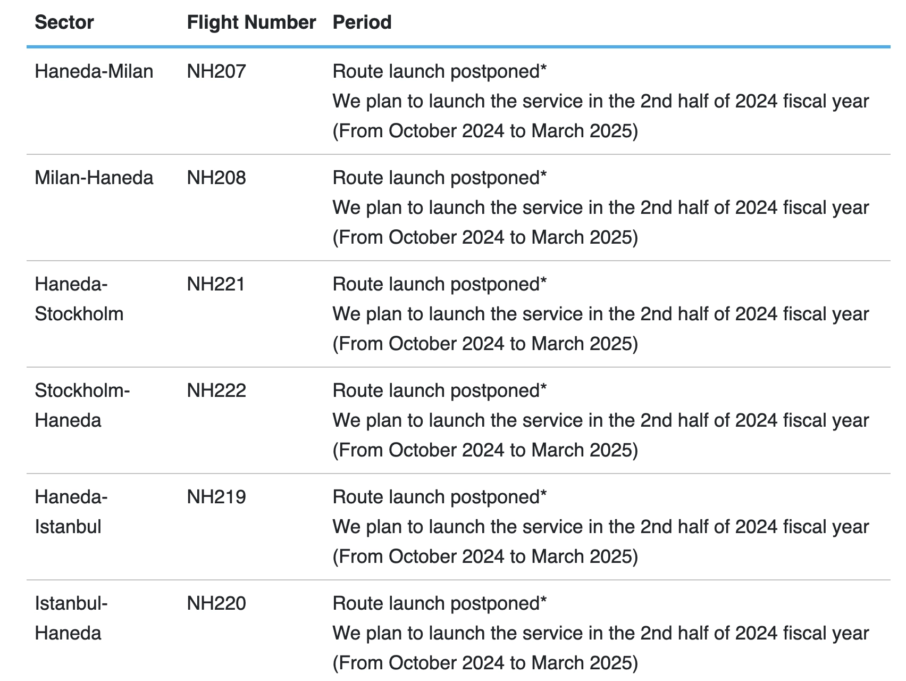
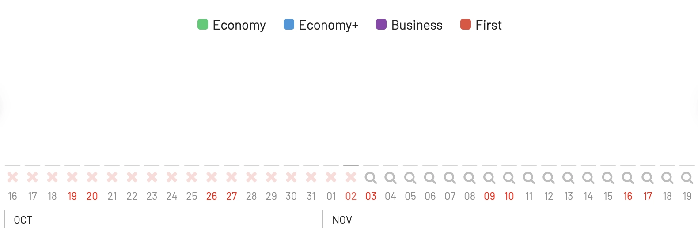

All Nippon Airways (ANA) is launching new flights to Milan, Stockholm, and Istanbul in the latter half of 2024. This is great news for travelers looking to experience the best of Japan, as these new routes will provide more convenient access to the country.

ANA is one of the most awarded airlines in the world, and is known for its excellent service and comfortable cabins. With the launch of these new routes, ANA is looking to tap into renewed post-pandemic demand for travel to Japan. The airline had previously planned to [launch service to these cities before the pandemic](https://blog.awardfares.com/ana-arn-hnd-award-availability/), but those plans were put on hold due to travel restrictions.

## ANA New Flights to Milan, Stockholm, and Istanbul

Here are some additional details about the new routes. As seen on their website, the routes were postponed from a pre-pandemic expansion plan, and they are scheduled to be relaunched between October 2024 and March 2025.

As flights are not yet on sale, there's no award availability on these routes. We'll keep monitoring them and updating this post as seats become available.

### Milan (NH207/NH208)

Flights will operate three times per week between Milan Malpensa Airport (MXP) and Tokyo Haneda Airport (HND).

### Stockholm (NH221/NH222)

Flights will operate twice per week between Stockholm Arlanda Airport (ARN) and Tokyo Narita Airport (NRT).

### Istanbul (NNH219/NH220)

Flights will operate three times per week between Istanbul Airport (IST) and Tokyo Haneda Airport (HND).

## More Expansion Plans

ANA will also resume and increase frequencies on several existing routes. Seasonal flights from Haneda to Vienna will restart on August 2, for the first time since May 2022, and will operate thrice weekly. Daily flights to Munich and Paris Charles de Gaulle will begin from July 1, up from four times weekly and three times weekly, respectively.

## Don't forget about THE ROOM

If you are after an unparalleled flying experience, try looking for ANA's THE ROOM, their premium business class cabin available on select Boeing 777-300ER aircraft. THE ROOM includes spacious, private "mini-suites" with sliding doors, wide seats that convert into full-flat lie-flat beds, and a 24-inch 4K monitor for your entertainment pleasure. Meals are gourmet-style, with premium beverages served on elegant tableware.

Currently, THE ROOM operates on routes across North America, including Los Angeles, San Francisco, San Jose, Seattle, Chicago, New York, and Washington D.C., as well as European destinations like London, Frankfurt, and Paris. 

## More Notable ANA Routes

* [Tokyo (HND or NRT) to New York (JFK)](https://awardfares.com/search?area:TYO.JFK.;a:NH;z:sas): A premier long-haul route where you can experience ANA's acclaimed First Class and Business Class products on their Boeing 777s or 787 Dreamliners.
* [Tokyo (HND or NRT) to London (LHR)](https://awardfares.com/search?area:TYO.LHR.;a:NH;z:sas): Another major long-haul route that showcases ANA's premium offerings, especially on their latest aircraft.
* [Tokyo (NRT) to Frankfurt (FRA)](https://awardfares.com/search?area:TYO.FRA.;a:NH;z:sas): A key connection between Asia and Europe, allowing passengers to experience ANA's award-winning service.
* [Tokyo (HND or NRT) to Los Angeles (LAX)](https://awardfares.com/search?area:TYO.LAX.;a:NH;z:sas): A popular transpacific route that links Japan with the US West Coast. Ideal for experiencing ANA's top cabins.
* [Tokyo (HND) to Sydney (SYD)](https://awardfares.com/search?area:TYO.SYD.;a:NH;z:sas): One of ANA's significant routes to Oceania, offering a chance to experience their long-haul product on a diverse route.

## Want More Award Travel Intel?

You can [try AwardFares for free](https://awardfares.com/). We are rolling out new features and improvements regularly, so [sign up for our monthly newsletter](https://awardfares.com/newsletter) to stay on top of the latest news, announcements, and pro tips.

With our [Gold and Diamond tiers](https://awardfares.com/pricing), you can access premium features such as unlimited daily searches, alerts, seat maps, flight schedules, and more!

## Read More

Our guides have all the information you need to be a pro travel hacker and explore the world on points. Here are some related posts you might enjoy:

- [ANA 777 Liveries: How To Fly The Pokémon Jets And Other Spectacular Planes](https://blog.awardfares.com/ana-777-fleet/)
- [ANA Resumes Route Tokyo To Perth](https://blog.awardfares.com/ana-resumes-tokyo-perth/)
- [Try These EuroBonus Award Flights Before SAS Leaves Star Alliance](https://blog.awardfares.com/eurobonus-star-alliance-awards/)
- [How To Find Cheap Award Flights And Identify Good Redemptions (Step-by-step)](https://blog.awardfares.com/how-to-find-cheap-award-flights/)