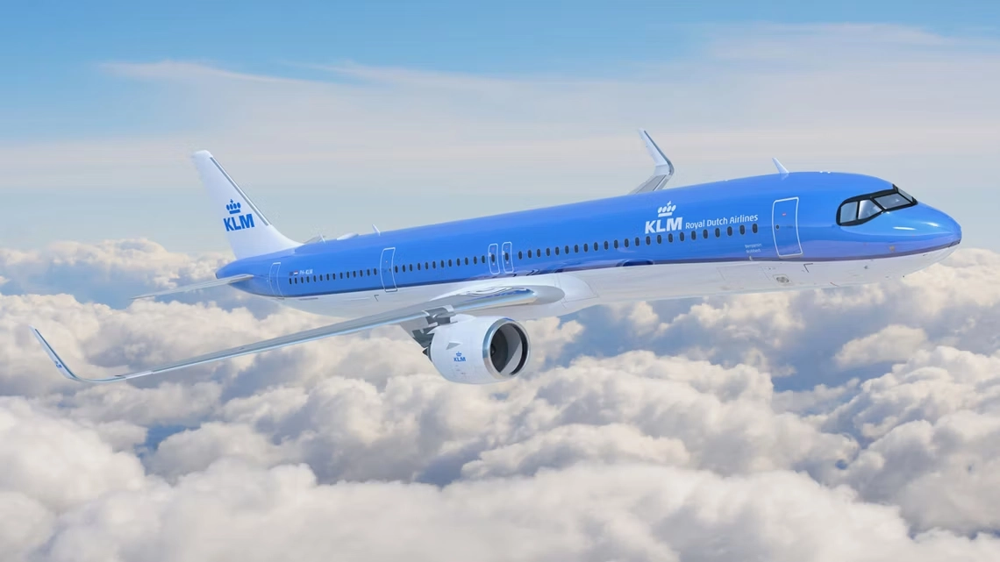
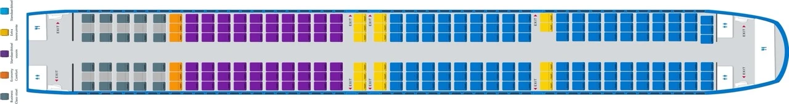

KLM Royal Dutch Airlines is ramping up for a big addition to its fleet this coming August – the Airbus A321neo. This new aircraft is not just a step up for KLM but a leap forward when it comes to eco-friendliness and passenger experience.

## What's New with KLM's Airbus A321neo

Scheduled to start operations on August 26, 2024, the Airbus A321neo will fly from Amsterdam to European cities like Stockholm, Berlin, and Copenhagen. With a capacity of 227 passengers, this plane is a key part of KLM's strategy to upgrade its fleet for more efficient and sustainable air travel.

One of the most notable features of the A321neo is its environmental friendliness. Equipped with Recaro seats, the aircraft aims to cut down fuel consumption and CO2 emissions by as much as 15%, aligning with global sustainability efforts.

## Seats and Cabin

In collaboration with Recaro, KLM's A321neo will sport a unique seating arrangement. The front of the cabin will have the BL3710 model seats, and the rear will feature the SL3710 model, striking a balance between passenger comfort and flight efficiency.

KLM plans to include a Business Class section (a.k.a. *Eurobusiness Class*) in these aircraft, providing business class travelers with more space and privacy, a perk especially appreciated on shorter flights.

The introduction of the A321neo is part of a broader initiative by the Air France-KLM Group. In 2021, the group placed an order for 100 aircraft from the Airbus A320neo family, highlighting their commitment to a more modern, sustainable fleet.

<figure>

</figure>

## Booking Flights With Flying Blue

As we see using AwardFares, there's plenty of availability to book flights on KLM's A321neo using Flying Blue miles (and even Delta SkyMiles too); even on the inaugural flight!

## How to Search for Awards on the KLM A321neo with AwardFares?

1. Go to [AwardFares](https://awardfares.com/signup).
2. Under *Frequent Flyer Program*, choose **Flying Blue**.
3. Tap on *Airline* and select **KLM only**.
4. Under *Departure* city, type **[Amsterdam](https://awardfares.com/search?AMS..;a:KL;e:32Q;z:flyingblue#)**.
5. Do the same under *Destination*, type **[Stockholm](https://awardfares.com/search?AMS.ARN.;a:KL;e:32Q;z:flyingblue)**, **[Copenhagen](https://awardfares.com/search?AMS.CPH.;a:KL;e:32Q;z:flyingblue)**, or **[Berlin](https://awardfares.com/search?AMS.BER.;a:KL;e:32Q;z:flyingblue)**.
6. Under *Equipment*, add **Airbus A321neo**.
7. Choose a date, or use the Timeline view to explore flights for different dates.

When choosing a date, remember that these flights are scheduled to start on August 26th, 2024. That's it! You will see the full list of results below.

## Want More Award Travel Intel?

You can [try AwardFares for free](https://awardfares.com/). We are rolling out new features and improvements regularly, so [sign up for our monthly newsletter](https://awardfares.com/newsletter) to stay on top of the latest news, announcements, and pro tips.

With our [Gold and Diamond tiers](https://awardfares.com/pricing), you can access premium features such as unlimited daily searches, alerts, seat maps, flight schedules, and more!

## Read More

Our guides have all the information you need to be a pro travel hacker and explore the world on points. Here are some related posts you might enjoy:

- [Sky's (Almost) The Limit: Conquering First Class With Flying Blue](https://blog.awardfares.com/flying-blue-skyteam-first-class/)
- [Flying Blue Award Search Now Available](https://blog.awardfares.com/introducing-flying-blue/)
- [How To Find Cheap Award Flights And Identify Good Redemptions (Step-by-step)](https://blog.awardfares.com/how-to-find-cheap-award-flights/)
- [KLM Europe Short-Haul Business Class In 2024 (737-900ER)](https://blog.awardfares.com/klm-europe-business-ams-cph/)