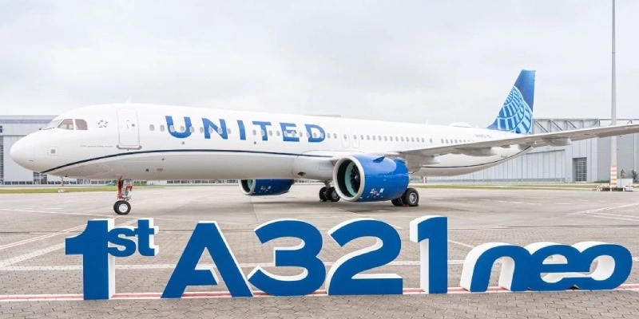
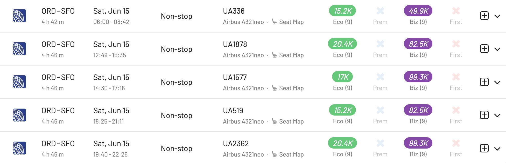

United Airlines announced a significant expansion of its flight network across North America, adding over 100 daily departures during summer 2024, and targeting popular outdoor destinations. The move comes after noticing the rising interest in nature-centric travel post-pandemic.

## Enhanced Canadian Flight Options

United is significantly expanding its presence in Canada. The expansion plan includes introducing flights to nine Canadian cities. This development not only resumes key routes but also introduces larger aircraft for these destinations, ensuring both increased capacity and enhanced passenger comfort.

## Better Access to Alaska

Alaska, known for its natural beauty, will be more accessible thanks to United's comprehensive new flight schedule. This is the airline's most extensive schedule to Alaska in over a decade, featuring several nonstop routes. The increase in frequency and introduction of direct flights is a boon for travelers looking to explore Alaskan destinations.

## Increased Flights from Major U.S. Hubs

United's expansion includes over 100 new flights from its major U.S. hubs:

* **[Denver](https://awardfares.com/search?DEN..;a:UA;z:united)**: As Denver's largest airline, United is adding more than 40 new flights this summer. This expansion establishes Denver as a major gateway not only to national parks but also to new destinations in Canada.
* **[Houston](https://awardfares.com/search?IAH..;a:UA;z:united)**: The airline is resuming its nonstop service between Houston and Ontario, California, and is planning to operate 100 routes with dual cabin aircraft this summer from Houston. The hub will see an addition of over 40 new flights to popular U.S. destinations.
* **[Chicago](https://awardfares.com/search?ORD..;a:UA;z:united)**: Offering over 500 daily nonstop flights, Chicago residents will have access to new flights and resumed services, including routes to Canadian cities such as Winnipeg and Quebec City.

## Fleet Upgrades and New Routes

United is also upgrading its fleet by integrating the Airbus A321neo into its operations. This aircraft will be employed on various routes, enhancing the travel experience with newer planes. Notable routes include nonstop services from Chicago to destinations like San Francisco, Seattle, and Portland.

| Route                                | Frequency | Period               | Flight Numbers                                                                                                                                                                             |
| ------------------------------------ | --------- | -------------------- | ------------------------------------------------------------------------------------------------------------------------------------------------------------------------------------------ |
| **Chicago O'Hare – San Francisco**   | 5 daily   | 23MAY24 - 26JUN24    | UA336, UA1878, UA1577, UA519, UA2362, UA2635, UA1998, UA468,UA1152, UA476 |
| **Chicago O'Hare – Fort Lauderdale** | 1 daily   | On/after 23MAY24     | -                                                                                                                                                                                           |
| **Chicago O'Hare – Fort Myers**      | 1 daily   | Effective 27JUN24    | -                                                                                                                                                                                           |
| **Chicago O'Hare – Houston**         | 3 daily   | Tentatively until 26JUN24 | -                                                                                                                                                                                           |
| **Chicago O'Hare – Las Vegas**       | 1 daily   | On/after 23MAY24     | -                                                                                                                                                                                           |
| **Chicago O'Hare – Orlando**         | 1 daily   | On/after 23MAY24     | -                                                                                                                                                                                           |
| **Chicago O'Hare – Phoenix**         | 1 daily   | On/after 23MAY24     | -                                                                                                                                                                                           |

Furthermore, United is introducing new routes from other major airports:

* **Washington/Dulles**: For the first time, nonstop flights to Anchorage, Alaska, will be available, along with over 20 new daily flights this summer.
* **New York/Newark**: Seasonal nonstop service to Halifax resumes, and flights to Montreal will be upgraded to mainline aircraft, starting in August.

## Awards Available With United MileagePlus

With [AwardFares](https://awardfares.com/search?..;z:united), checking if award flights on the new routes are available is straightforward. It takes less than five clicks! There are plenty of options to choose from throughout the entire summer, even on their A321neo.

Keep in mind that since United switched to a [dynamic award chart](https://blog.awardfares.com/demystifying-award-charts/), the price of the awards might depend on the demand and time you book it, even if it's the same route (as we see below).

## Want More Award Travel Intel?

You can [try AwardFares for free](https://awardfares.com/). We are rolling out new features and improvements regularly, so [sign up for our monthly newsletter](https://awardfares.com/newsletter) to stay on top of the latest news, announcements, and pro tips.

With our [Gold and Diamond tiers](https://awardfares.com/pricing), you can access premium features such as unlimited daily searches, alerts, seat maps, flight schedules, and more!

## Read More

Our guides have all the information you need to be a pro travel hacker and explore the world on points. Here are some related posts you might enjoy:

- [United MileagePlus Sweet Spots](https://blog.awardfares.com/mileageplus-sweet-spots/)
- [United 767-400 Polaris Business Class From Washington To Sao Paulo (2023)](https://blog.awardfares.com/united-polaris-review-2023/)