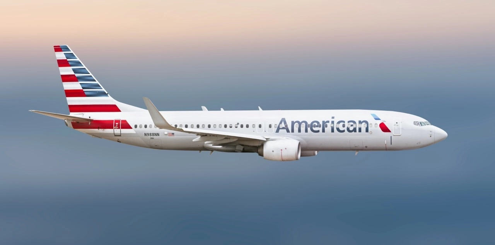
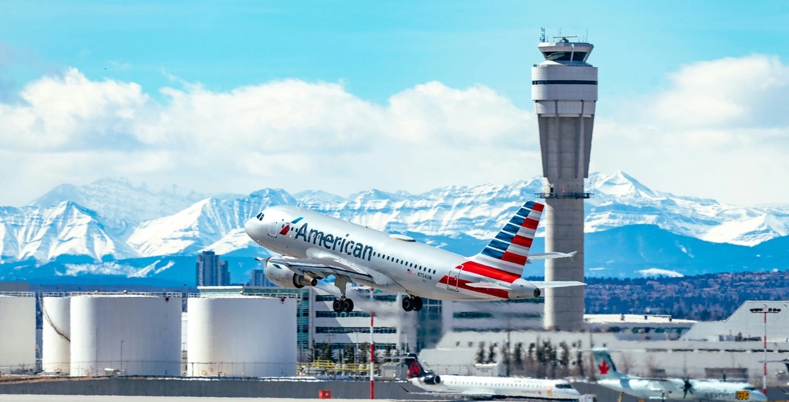
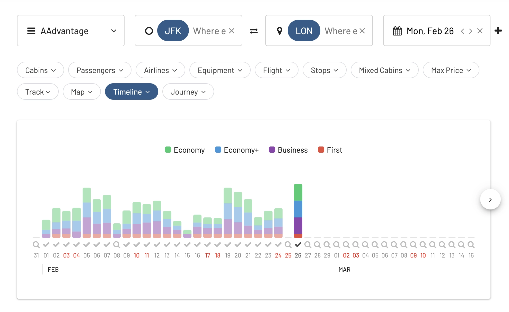

American Airlines is set to enhance the travel experience for AAdvantage members in 2024, introducing a range of new benefits and changes. Let's go through some of the updates!

## AAdvantage Changes in 2024: What You Need To Know

### Flexible Basic Economy Cancellations

Starting January 17, 2024, AAdvantage members will have the option to cancel non-refundable Basic Economy fare tickets on American's platforms (aa.com, the app, or American Airlines Reservations). This flexibility applies to domestic trips booked directly through American Airlines, allowing members to receive a partial Trip Credit for a fee before the travel begins. However, this option is not available for tickets booked through third-party services.

### Exclusive Same-Day Standby Opportunity

From March 1, 2024, the privilege of same-day standby for earlier flights will be exclusive to AAdvantage members. This can be conveniently arranged through aa.com or the app 24 hours before departure. To be eligible, the new flight must depart on the same day, from and to the same airports, and have the same number of stops, exclusively operated by American Airlines or American Eagle. Additionally, same-day standby remains available for Oneworld status members, active U.S. military, and Main Cabin Select customers.

### Enhanced Member-Only Benefits

Later in 2024, AAdvantage members will gain access to more benefits:

- **Extended Trip Credit**: Members will have an additional six months to use Trip Credit for canceled online travel.
- **Admirals Club One-Day Passes**: These will be exclusively purchasable by AAdvantage members.
- **Flagship Lounge Single Visit Passes**: Members can buy passes to enjoy the premium lounge.
- **24-hour Trip Hold**: Members can hold flights free of charge for up to 24 hours.
- Members will continue enjoying early boarding with Group 6 and exclusive access to American Airlines Vacations packages, among other benefits.

### Upgraded Miles Earning and Redemption

- **Earn Miles on Upgrades**: Members can soon earn miles when paying with cash for premium cabin upgrades.
- **Partner Airline Upgrades**: Stating in 2024, members will be able to redeem miles for upgrades with selected airline partners.
- **Online Systemwide Upgrades Management**: Members will have the ability to request systemwide upgrades online.

### New Loyalty Point Reward Choices

From March 1, 2024, members can select Loyalty Points toward AAdvantage status as a reward choice at specific Loyalty Point Reward levels, ranging from 1,000 to 15,000 points.

### Enhanced Dining Experiences

AAdvantage Platinum Pro members will soon be able to redeem miles for Flagship First Dining passes, offering a luxurious airport dining experience.

### Companion Upgrade Prioritization

Members can sponsor a companion for the same type of upgrade, maintaining priority level together. This applies even if the companion is not an AAdvantage member and can be arranged through Reservations.

### Prioritization in Upgrade Requests

Upgrade requests will be prioritized based on AAdvantage status, the type of upgrade, and 12-month Rolling Loyalty Points, followed by the booking code and the date/time of the request.

### Rolling Loyalty Points

These points are updated daily and are based on Loyalty Points earned in the last 12 months, including additional points from qualifying spends on eligible AAdvantage credit cards.

Stay tuned for these exciting changes that aim to enhance the travel experience for AAdvantage members in 2024.

## Finding The Best AAdvantage Awards With AwardFares

1. Go to [AwardFares](https://awardfares.com/signup).
2. Under *Frequent Flyer Program*, [choose **AAdvantage**](https://awardfares.com/search?..;z:aadvantage).
3. Choose a route using the *Departure* and *Destination* fiedls, for example, [**New York (JFK)** to **London (LHR)**](https://awardfares.com/search?JFK.area:LON.;z:aadvantage).
4. Choose a date, or use the Timeline view to explore flights for different dates.
5. Tap on the search results header to sort by price and cabin (e.g., tap on **Eco** if you want to see the cheapest award flights in economy first. Similarly, you can tap on **Prem**, **Biz**, or **First**).
6. Tap on **Book**. Once you've identified the flight you want in the result list, tap on the *Book* link and AwardFares will redirect you to AAdvatage's booking page (we'll not ask for any password or log-in data!).

## Want More Award Travel Intel?

You can [try AwardFares for free](https://awardfares.com/). We are rolling out new features and improvements regularly, so [sign up for our monthly newsletter](https://awardfares.com/newsletter) to stay on top of the latest news, announcements, and pro tips.

With our [Gold and Diamond tiers](https://awardfares.com/pricing), you can access premium features such as unlimited daily searches, alerts, seat maps, flight schedules, and more!

## Read More

Our guides have all the information you need to be a pro travel hacker and explore the world on points. Here are some related posts you might enjoy:

- [How To Find AAdvantage Awards](https://blog.awardfares.com/aadvantage-guide/)
- [Best AAdvantage Redemptions In 2023 (And How To Find Them)](https://blog.awardfares.com/aadvantage-best-redemptions-2023/)
- [How To Find Cheap Award Flights And Identify Good Redemptions (Step-by-step)](https://blog.awardfares.com/how-to-find-cheap-award-flights/)