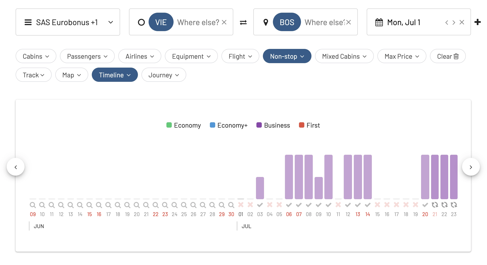

Austrian Airlines introduced a new direct flight connecting Vienna Airport (VIE) to Boston Logan International Airport (BOS). This significant addition, set to start in the summer, establishes the first nonstop link between Boston and the Austrian capital. The service, beginning July 1, will operate between five to six times weekly, enriching the travel choices for those looking to explore Vienna or venture further into Europe.

## Why Boston?

This initiative is a part of Lufthansa Group's strategy to enhance its network, making Boston's Logan International Airport a crucial hub for transatlantic journeys. Notably, Austrian Airlines will join its group counterparts, Lufthansa and Swiss, in serving the Boston market, further solidifying the airport's status as a key gateway for international travel.

## Operation & Schedule

Austrian Airlines will deploy its Boeing 767-300ER aircraft for the Boston-Vienna route, accommodating 211 passengers across three classes: Business, Premium Economy, and Economy. A highlight of the travel experience on this route is the airline's unique "Flying Chef" program in the business class, where passengers can enjoy meals crafted onboard by chefs, complemented by wine pairings suggested by sommeliers.

| Flight Direction | Departure Time | Arrival Time        | Days of Operation                                   |
|------------------|----------------|---------------------|-----------------------------------------------------|
| [VIE to BOS](https://awardfares.com/search?VIE.BOS.;x:0;z:sas,united)       | 10:40 a.m.     | 1:40 p.m.           | Mon, Wed, Fri, Sat, Sun, and alternating Tuesdays   |
| [BOS to VIE](https://awardfares.com/search?BOS.VIE.;x:0;z:sas,united)       | 5:10 p.m.      | 7:25 a.m. (+1 day)  | Mon, Wed, Fri, Sat, Sun, and alternating Tuesdays   |

## Awards Available

As of today, there are award seats available using both SAS EuroBonus points and United MileagePlus miles. There are no seats in Economy, but a couple of seats in Business Class for several dates starting July 3rd, 2024.

### Price

AwardFares let you easily check and compare the prices for award flights across frequent flyer programs. Simply tap on the result list to expand the details.

In this case, we see that it costs 78k EuroBonus points (one-way), or 130k round trip for a Business Class ticket. With United MileagePlus, the saver award one-way costs 88k miles.

## Want More Award Travel Intel?

You can [try AwardFares for free](https://awardfares.com/). We are rolling out new features and improvements regularly, so [sign up for our monthly newsletter](https://awardfares.com/newsletter) to stay on top of the latest news, announcements, and pro tips.

With our [Gold and Diamond tiers](https://awardfares.com/pricing), you can access premium features such as unlimited daily searches, alerts, seat maps, flight schedules, and more!

## Read More

Our guides have all the information you need to be a pro travel hacker and explore the world on points. Here are some related posts you might enjoy:

- [How To Find Cheap Award Flights And Identify Good Redemptions (Step-by-step)](https://blog.awardfares.com/how-to-find-cheap-award-flights/)
- [Lufthansa's A350 Long-Haul Business Class (Avoid)](https://blog.awardfares.com/lufthansa-long-haul-business-a350/)
- [Essential Guide To Book Lufthansa Flights With SAS EuroBonus Points](https://blog.awardfares.com/lufthansa-with-eurobonus-guide/)
- [Lufthansa New Routes In 2023](https://blog.awardfares.com/lh-routes-2023/)
