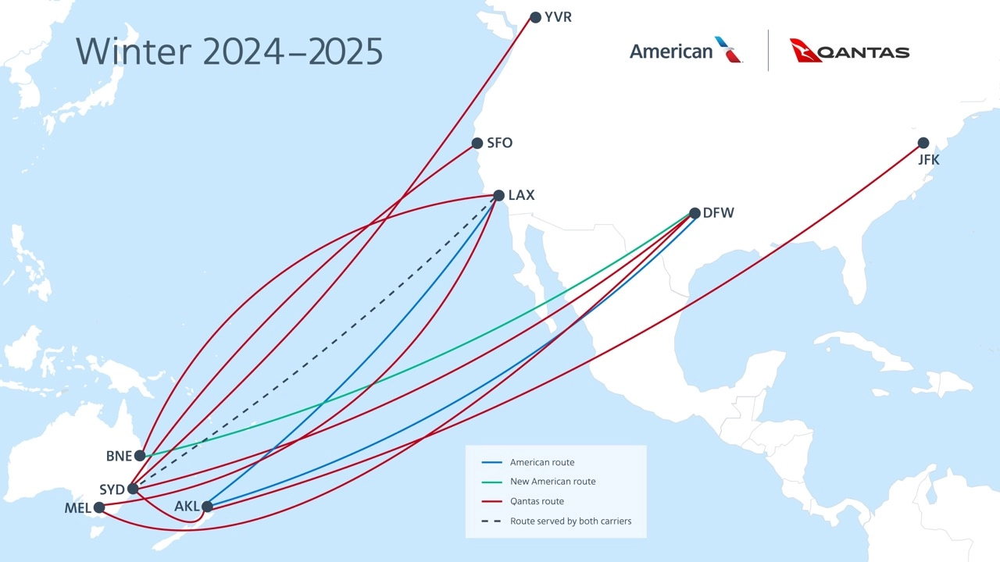
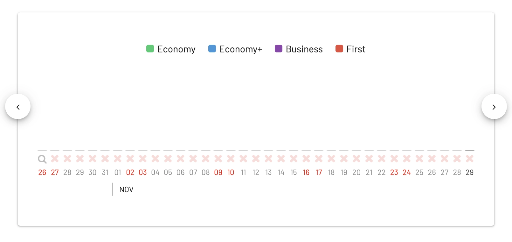
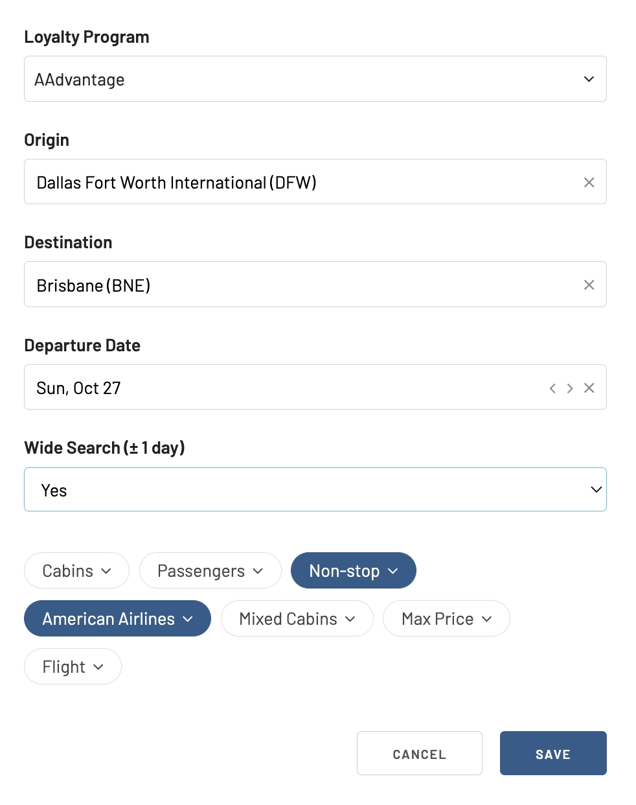

American Airlines just announced an expansion to its flight schedule introducing new services, including a notable route to Brisbane, Australia (BNE), starting in October, using the Boeing 787-9 aircraft equipped with Flagship Suite seats. This expansion also includes the launch of flights to Veracruz, Mexico (VER), further broadening its already massive domestic and short-haul international network. The airline will also resume its service to Kona, Hawaii (KOA) from its Dallas-Fort Worth (DFW) hub.

Tickets will be on sale starting Monday, February 5th, hence we see no available flights in AwardFares. We'll keep this post updated as the first seats appear.

## American Airlines Winter Schedule 2024: What's New?

### Direct Flights to Brisbane

Starting in October, American Airlines will offer direct flights [from DFW to Brisbane](https://awardfares.com/search?DFW.BNE.;z:aadvantage), providing passengers with access to one of Australia's most vibrant cities. This service is part of a broader initiative to connect passengers to over 100 U.S. destinations with only one stop, making it easier to explore Brisbane's renowned coastlines, cultural scenes, and zoological parks.

### Expanded Network with Qantas

The airline's partnership with Qantas enhances its service offerings, allowing for a more comprehensive network between the United States and the South Pacific. This collaboration enables travelers to reach almost 70 destinations across Australia, New Zealand, and the South Pacific, alongside more than 200 U.S. destinations.

### Tickets & Award Availability

Starting February 5, tickets for these new routes will be available for purchase on the American Airlines website and mobile app. As mentioned before, [AwardFares show no available seats with AAdvantage](https://awardfares.com/search?DFW.BNE.;z:aadvantage) on any of these new routes announced, as tickets are not yet on sale.

Remember to set up an alert on the route and date you desire. AwardFares will notify you via email as soon as seats become available.

### Enhancements to Existing Services

In its continuous effort to expand its global reach, American Airlines will also increase flights to [Rio de Janeiro (GIG)](https://awardfares.com/search?DFW.GIG.;z:aadvantage), [Grand Cayman (GCM)](https://awardfares.com/search?DFW.GCM.;z:aadvantage), [Turks & Caicos (PLS)](https://awardfares.com/search?DFW.PLS.;z:aadvantage), and [the U.S. Virgin Islands (STT)](https://awardfares.com/search?DFW.STT.;z:aadvantage) from its major hubs throughout the year.

### Flight Services to Brazil and Hawaii

On October 27, American Airlines will begin its service between [DFW and Rio de Janeiro (GIG)](https://awardfares.com/search?DFW.GIG.;z:aadvantage) and resume [flights to Kona, Hawaii (KOA)](https://awardfares.com/search?DFW.KOA.;z:aadvantage). These additions are aimed at providing travelers with more options for escaping the *winter cold* and also exploring warm destinations.

| Origin              | Destination               | Aircraft Type | Service Notes                                        |
|---------------------|---------------------------|---------------|------------------------------------------------------|
| Dallas-Fort Worth (DFW) | Brisbane, Australia (BNE) | Boeing 787-9  | New daily seasonal service begins Oct. 27, 2024      |
| DFW                 | Kahului, Hawaii (OGG)     | Boeing 787-8  | Restoring second-daily service operates Dec. 19, 2024, to Jan. 6, 2025 |
| DFW                 | Kona, Hawaii (KOA)        | Boeing 787-8  | Returning daily seasonal service begins Oct. 27, 2024 |
| DFW                 | Rio de Janeiro (GIG)      | Boeing 787-8  | New daily seasonal service begins Oct. 27, 2024      |
| JFK                 | GIG                       | Boeing 777-200| Expanded daily seasonal service starts Oct. 27, 2024 |
| Los Angeles (LAX)   | Auckland, New Zealand (AKL)| Boeing 787-9  | Earlier seasonal service restarts Dec. 5, 2024        |

## Summer Schedule Boost

American Airlines plans to expand its flight to the Caribbean and Mexico this summer, including new flights to Veracruz and increased flights to key destinations, reinforcing its position as the leading U.S. carrier to Mexico based on peak-day departures.

| Origin              | Destination                          | Aircraft Type | Service Notes                                               |
|---------------------|--------------------------------------|---------------|-------------------------------------------------------------|
| Dallas-Fort Worth (DFW) | Grand Cayman, Cayman Islands (GCM)  | Boeing 737    | Expanded service to two flights on Saturdays starts June 8, 2024 |
| DFW                 | Providenciales, Turks and Caicos (PLS)| Boeing 737    | Expanded service to two flights on Saturdays starts June 8, 2024 |
| DFW                 | St. Thomas, U.S. Virgin Islands (STT) | Airbus A319   | Expanded service to two flights on Saturdays starts June 8, 2024 |
| DFW                 | Veracruz, Mexico (VER)               | Embraer E175  | New daily service starts June 12, 2024                       |

## Oneworld Turns 25

This year marks the 25th anniversary of Oneworld, the alliance co-founded by American Airlines. In spite of recent changes and member airlines quitting, the alliance has major the support of major players in the industry and continues to offer a great travel experience and an extensive global network. The alliance, now including 13 member airlines, provides access to over 900 destinations worldwide.

## Want More Award Travel Intel?

You can [try AwardFares for free](https://awardfares.com/). We are rolling out new features and improvements regularly, so [sign up for our monthly newsletter](https://awardfares.com/newsletter) to stay on top of the latest news, announcements, and pro tips.

With our [Gold and Diamond tiers](https://awardfares.com/pricing), you can access premium features such as unlimited daily searches, alerts, seat maps, flight schedules, and more!

## Read More

Our guides have all the information you need to be a pro travel hacker and explore the world on points. Here are some related posts you might enjoy:

- [Changes to AAdvantage Coming in 2024](https://blog.awardfares.com/aadvantage-program-updates-2024/)
- [American Airlines Expansion Plans For 2024](https://blog.awardfares.com/american-airlines-2024/)
- [How To Find Cheap Award Flights And Identify Good Redemptions (Step-by-step)](https://blog.awardfares.com/how-to-find-cheap-award-flights/)
