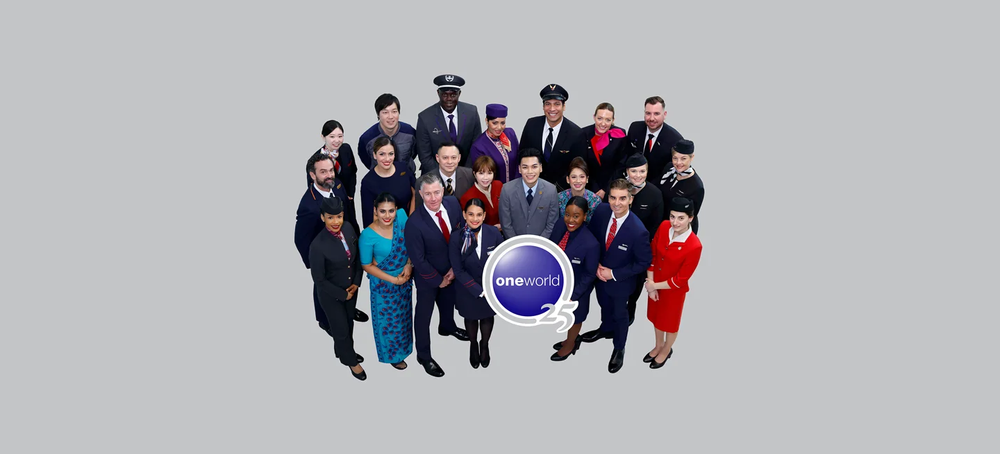
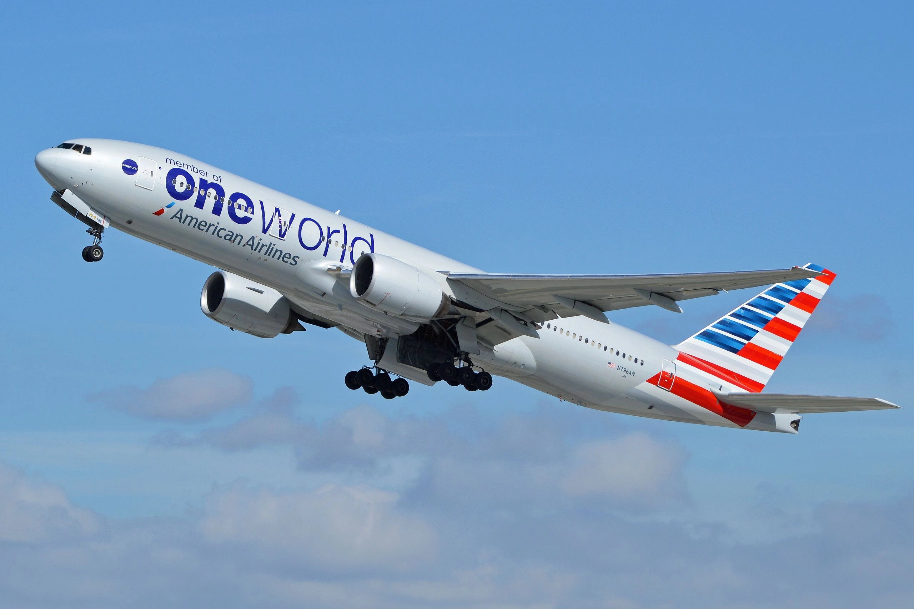
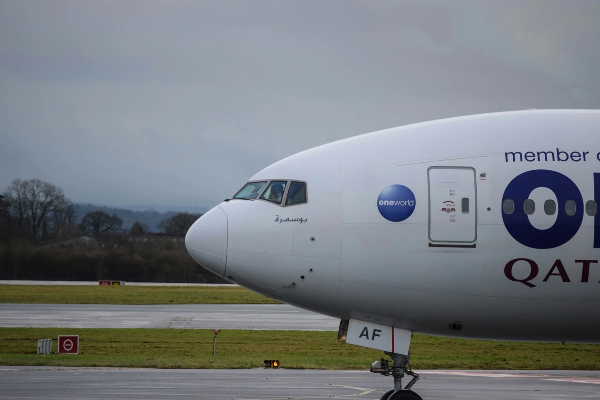
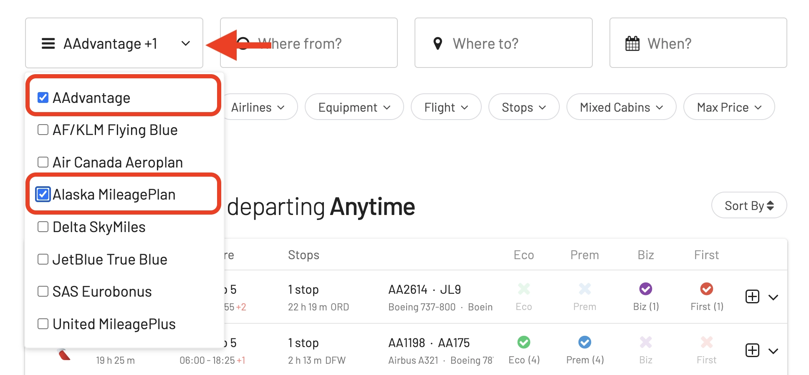

The [**oneworld alliance**](https://www.oneworld.com/), a global network of some of the world's leading airlines, is celebrating a major milestone today: its 25th anniversary. Launched in 1999 with four founding members – American Airlines, British Airways, Cathay Pacific, and Qantas – the alliance has grown to encompass 13 member airlines, serving over 900 destinations across 170 territories.

## The oneworld Journey In A Nutshell (10 Highlights)

The oneworld alliance, founded on February 1, 1999, has made significant strides in the aviation industry through strategic collaborations, technological advancements, and a strong commitment to sustainability and passenger experience. Here are ten historical facts, achievements, and fun curiosities about the oneworld alliance.

### 1. Formation and Milestone Expansion

The alliance was founded by American Airlines, British Airways, Cathay Pacific, and Qantas. A notable expansion was in 2007 when Japan Airlines, Asia's largest airline at the time, joined the alliance, significantly enhancing oneworld's presence in Asia.

### 2. Introduction of the oneworld Explorer (2000s)

oneworld was the first airline alliance to offer a round-the-world ticket. This innovative product revolutionized round-the-world travel by offering flexible fares based on the number of continents visited, rather than the distance flown, making globe-trotting more accessible.

### 3. Seamless Connectivity Achievements

oneworld has been pioneering in providing streamlined connections. In 2005, it introduced the first interline e-ticketing among all its members, enabling passengers to use a single electronic ticket for travel across multiple airlines.

### 4. Tier Status Recognition (Early 2000s)

The alliance's introduction of a three-tier frequent flyer status system was a game-changer, allowing elite status benefits to be recognized across the entire network, a move that greatly enhanced loyalty and customer satisfaction.

### 5. Adoption of Technological Innovations

In 2019, oneworld announced plans to launch a digital platform that would enable customers to enjoy a range of services, including booking flights on all member airlines through a single app, marking a significant step towards digital integration.

### 6. Commitment to the Environment

In 2020, oneworld became the first global airline alliance to commit to achieving net-zero carbon emissions by 2050, showcasing its leadership in the fight against climate change within the aviation sector.

### 7. Awards

oneworld has been named the World's Best Airline Alliance multiple times by Skytrax, with one such win in 2019. These awards testify to its consistent excellence in service and customer satisfaction.

### 8. Enhanced Safety and Health Measures (2020)

In response to the COVID-19 pandemic, oneworld, alongside its member airlines, launched an enhanced health and safety commitment to passengers, showcasing the alliance's agility and dedication to safety.

### 9. oneworld Connect (2018)

This innovative membership platform was introduced to extend the alliance's global reach by incorporating smaller regional airlines, such as Fiji Airways, its first oneworld connect partner, thus offering passengers more destinations.

### 10. Code-share Agreements and Partnerships

Over the years, oneworld has significantly increased its global footprint through strategic partnerships. For instance, in 2020, Alaska Airlines announced its intention to join oneworld, which became official on March 31, 2021, further expanding the alliance's network in North America.

### (Bonus) Fun Fact

The name "oneworld" was chosen to reflect the alliance's vision of being the world's leading airline alliance, providing a seamless travel experience across the world. The lowercase "o" in oneworld symbolizes the global connectivity and unity among its member airlines.

## Find oneworld Availability with AwardFares

At AwardFares we support several frequent flyer programs from airlines in the oneworld alliance, including two of the largest ones: [**American AAdvantage**](https://awardfares.com/search?..;z:aadvantage) and [**Alaska Mileage Plan**](https://awardfares.com/search?..;z:alaska). To start exploring award flights on these programs, simply select your favorite program on the first field.

## Want More Award Travel Intel?

You can [try AwardFares for free](https://awardfares.com/). We are rolling out new features and improvements regularly, so [sign up for our monthly newsletter](https://awardfares.com/newsletter) to stay on top of the latest news, announcements, and pro tips.

With our [Gold and Diamond tiers](https://awardfares.com/pricing), you can access premium features such as unlimited daily searches, alerts, seat maps, flight schedules, and more!

## Read More

Our guides have all the information you need to be a pro travel hacker and explore the world on points. Here are some related posts you might enjoy:

- [What Airlines Have Changed Or Left Alliances? A History of Departures and Switches](https://blog.awardfares.com/airline-alliances-changes/)
- [How To Find Cheap Award Flights And Identify Good Redemptions (Step-by-step)](https://blog.awardfares.com/how-to-find-cheap-award-flights/)
- [Ultimate Guide to Award Release Dates](https://blog.awardfares.com/ultimate-guide-to-award-release-dates)
- [Demystifying Award Charts: All You Need To Know (2024)](https://blog.awardfares.com/demystifying-award-charts/)

