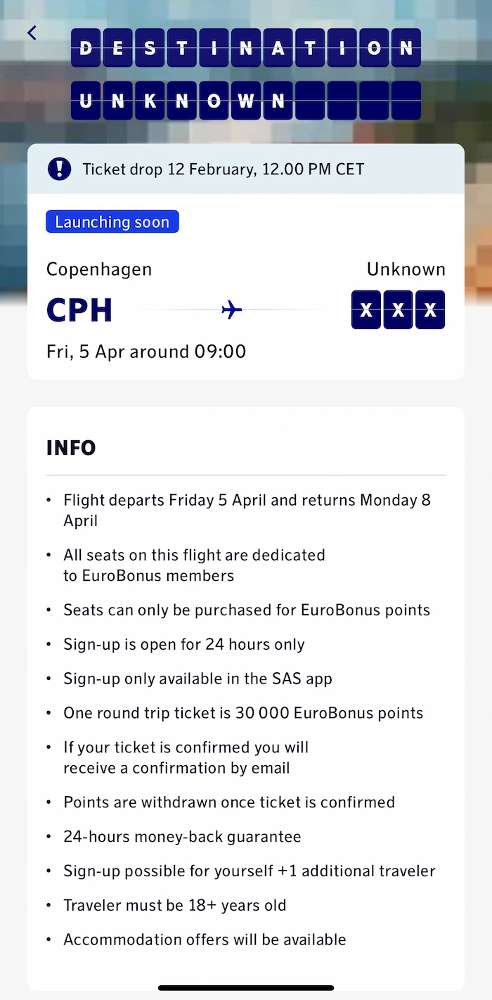

SAS Scandinavian Airlines is introducing an exhilarating twist to the conventional award booking. The airline has announced a cool promotion called *Destination Unknown*. This particular offer challenges passengers to sign-up on a journey to an undisclosed location, igniting the spirit of adventure that lies within us all.

The promotion is only valid for 24 hours! So mark your calendar if you'd like to sign up for it.

  TIME UNTIL PROMOTION

## What is Destination Unknown?

On February 12, SAS Scandinavian Airlines will unveil a limited opportunity for travelers to book a flight without knowing the destination. The concept is simple yet thrilling: a plane will depart on April 5, and the destination? A well-kept secret.

## How to Join

To participate in this unique experience, do this:

1. Download the SAS app and log in.
2. Ticket release takes place on February 12 at 12:00
3. You have 24 hours to sign up.
4. Sign up and wait!

## Official Information

- Flight departs Friday 5 April and returns Monday 8 April
- All seats on this flight are dedicated to EuroBonus members
- Seats can only be purchased for EuroBonus points
- Sign-up is open for 24 hours only
- Sign-up only available in the SAS app
- One round trip ticket is 30.000 EuroBonus points
- If your ticket is confirmed you will receive a confirmation by email
- Points are withdrawn once ticket is confirmed
- 24-hours money-back guarantee
- Sign-up possible for yourself +1 additional traveler
- Traveler must be 18+ years old
- Accommodation offers will be available

## Want More Award Travel Intel?

You can [try AwardFares for free](https://awardfares.com/). We are rolling out new features and improvements regularly, so [sign up for our monthly newsletter](https://awardfares.com/newsletter) to stay on top of the latest news, announcements, and pro tips.

With our [Gold and Diamond tiers](https://awardfares.com/pricing), you can access premium features such as unlimited daily searches, alerts, seat maps, flight schedules, and more!

## Read More

Our guides have all the information you need to be a pro travel hacker and explore the world on points. Here are some related posts you might enjoy:

- [SAS Ambitious New Direct Flight To Atlanta Takes Off In June (Awards Now Available)](https://blog.awardfares.com/sas-route-to-atlanta/)
- [SAS EuroBonus Conscious Traveler Takes Off In 2024: Greener Flying, Greater Rewards](https://blog.awardfares.com/sas-eurobonus-conscious-traveler/)
- [6 SAS Eurobonus Updates You Should Be Aware Of (January 2024)](https://blog.awardfares.com/eurobonus-updates-jan-2024/)
- [SAS Will Fly To 9 New Destinations During Summer 2024](https://blog.awardfares.com/sas-summer-2024/)

 