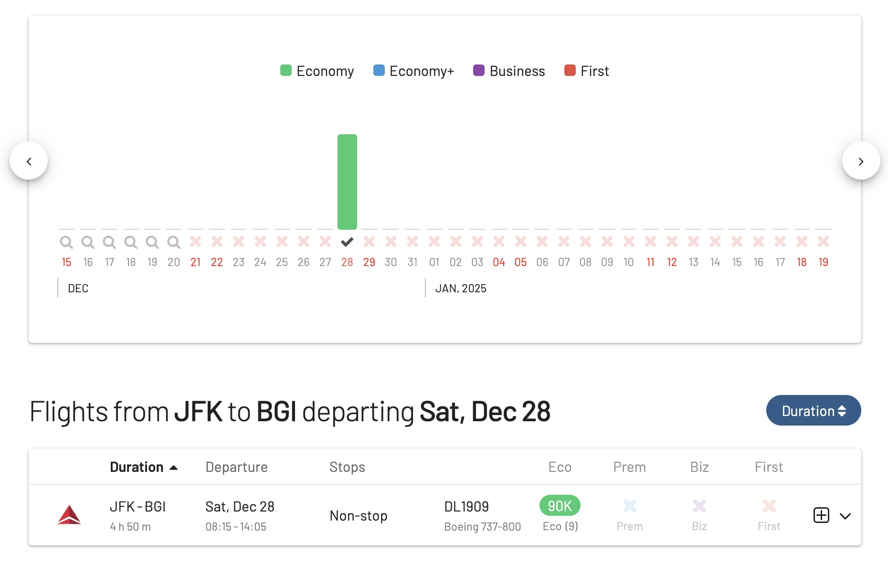
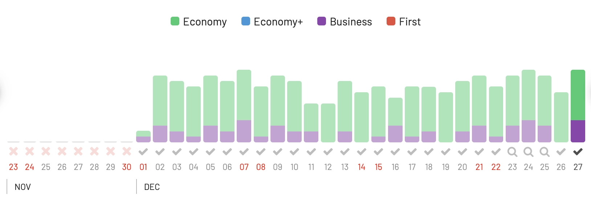
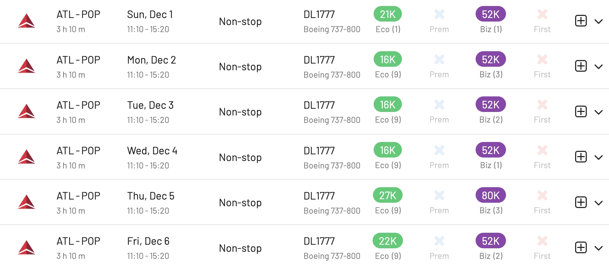
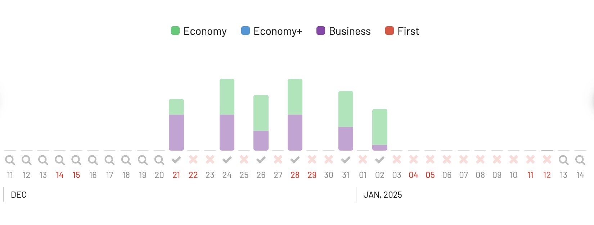
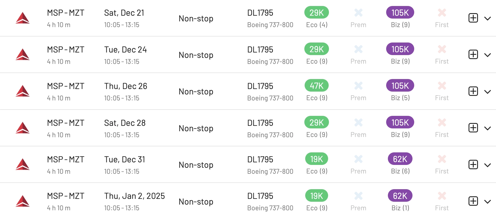
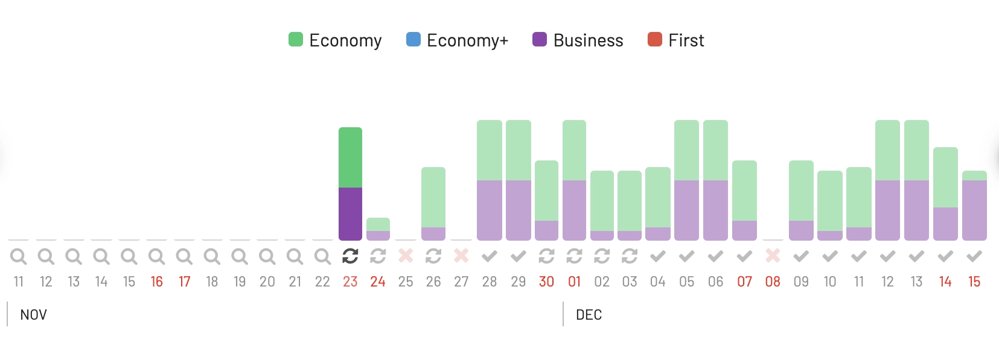
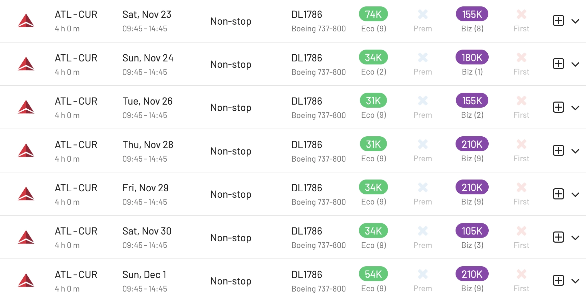

Delta Air Lines is making it easier for people to visit warm places in Latin America and the Caribbean by increasing its flights from Atlanta, New York-JFK, and Minneapolis/St. Paul. The airline will start flying to new places like Barbados, Puerto Plata, Mazatlán, and will fly more often to Curaçao.

In this post, we use AwardFares to have a look at the award availability in these new routes with [Delta SkyMiles](https://awardfares.com/search?..;z:delta). Keep in mind that, as a SkyTeam partner, it's also possible to find seats on these routes using [Flying Blue](https://awardfares.com/search?..;z:flyingblue).

## More Choices for Travelers

[Delta confirmed](https://news.delta.com/discover-more-sunshine-delta-new-routes-barbados-puerto-plata-mazatlan-and-more-flights-curacao) that is working hard to connect travelers from Atlanta and all over the US to their favorite vacation spots without hassle. The airline plans to offer around **1,000 flights every week** to various unique locations in Latin America and the Caribbean. By next winter, Delta will fly to 50 cities in these areas, making it easy for people to get to these places from nearly 200 cities around the world.

## New Destinations

### 1. Barbados

Starting November 23, Delta will have daily flights from Atlanta to Barbados and flights from New York-JFK on Saturdays starting December 21. Visitors can enjoy the island’s beaches, food, and history.

This is probably the hardest route to book with miles. So far, we've only seen seats on December 28th. They might release more as time passes.

### 2. Puerto Plata

From November 23, Delta will fly daily from Atlanta to Puerto Plata, where travelers can visit historical sites like the Fort of San Felipe and enjoy the beaches.

Plenty of seats available starting Dec 1st:

Prices range from 16k-27k Skymiles in Main Cabin (Economy) to 52k-80k SkyMiles in domestic First.

### 3. Mazatlán

Starting December 21, Delta will fly three times a week from Minneapolis/St. Paul to Mazatlán in Mexico, offering a chance to see its beaches and old town.

Several seats available between Dec 21st and January 2nd.

Prices range from 19k Skymiles in Main Cabin (Economy) to 62k SkyMiles in First.

### 4. Curaçao

Due to high demand, Delta is increasing its flights from Atlanta to Curaçao from once a week to daily starting November 23, making it easier to experience the island’s beauty.

Plenty of seats in all cabins from November 23rd.

Prices range from 31k Skymiles in Main Cabin (Economy) to 105k SkyMiles in First.

### In a Nutshell

| Route   | Departure Time | Arrival Time | Frequency        | Start Date | Aircraft |
|---------|----------------|--------------|------------------|------------|----------|
| [ATL-CUR](https://awardfares.com/search?ATL.CUR.;a:DL;x:0;z:delta) | 9:45 am         | 2:45 pm      | Daily            | Nov. 23    | 737-800  |
| [CUR-ATL](https://awardfares.com/search?CUR.ATL.;a:DL;x:0;z:delta) | 4:10 pm         | 7:30 pm      | Daily            | Nov. 23    | 737-800  |
| [ATL-BGI](https://awardfares.com/search?ATL.BGI.;a:DL;x:0;z:delta) | 9:45 am         | 3:20 pm      | Daily            | Nov. 23    | 737-800  |
| [BGI-ATL](https://awardfares.com/search?BGI.ATL.;a:DL;x:0;z:delta) | 4:40 pm         | 9:00 pm      | Daily            | Nov. 23    | 737-800  |
| [JFK-BGI](https://awardfares.com/search?JFK.BGI.;a:DL;x:0;z:delta) | 8:15 am         | 2:05 pm      | Saturday         | Dec. 21    | 737-800  |
| [BGI-JFK](https://awardfares.com/search?BGI.JFK.;a:DL;x:0;z:delta) | 3:25 pm         | 7:35 pm      | Saturday         | Dec. 21    | 737-800  |
| [MSP-MZT](https://awardfares.com/search?MSP.MZT.;a:DL;x:0;z:delta) | 10:05 am        | 1:15 pm      | Tues, Thurs, Sat | Dec. 21    | 737-800  |
| [MZT-MSP](https://awardfares.com/search?MZT.MSP.;a:DL;x:0;z:delta) | 2:35 pm         | 7:30 pm      | Tues, Thurs, Sat | Dec. 21    | 737-800  |
| [ATL-POP](https://awardfares.com/search?ATL.POP.;a:DL;x:0;z:delta) | 11:10 am        | 3:20 pm      | Daily            | Nov. 23    | 737-800  |
| [POP-ATL](https://awardfares.com/search?POP.ATL.;a:DL;x:0;z:delta) | 4:40 pm         | 7:10 pm      | Daily            | Nov. 23    | 737-800  |

## Better Travel Packages with Delta Vacations

Delta Vacations will offer special travel packages for Delta SkyMiles Members, including flights, hotels, and activities. Starting in 2024, members will get miles for their trips, earn more towards their Medallion Status, and can use miles to pay for their vacation.

## Fleet

Delta’s new and additional flights will be on Boeing 737-800 airplanes, which have first class, comfort plus, and main cabin seats. Delta is also upgrading these planes to make flights more comfortable, including new first-class seats and other improvements.

## Want To Find Better Awards On Delta?

You can [try AwardFares for free](https://awardfares.com/). We are rolling out new features and improvements regularly, so [sign up for our monthly newsletter](https://awardfares.com/newsletter) to stay on top of the latest news, announcements, and pro tips.

With our [Gold and Diamond tiers](https://awardfares.com/pricing), you can access premium features such as unlimited daily searches, alerts, seat maps, flight schedules, and more!

## Read More

Our guides have all the information you need to be a pro travel hacker and explore the world on points. Here are some related posts you might enjoy:

- [What To Do With 100k Delta SkyMiles? A 2024 Guide To Finding SkyMiles Sweet Spots](https://blog.awardfares.com/100k-skymiles/)
- [Delta SkyMiles Award Search Now Available (New Features)](https://blog.awardfares.com/introducing-delta/)
- [Delta Announces New Route To Taipei](https://blog.awardfares.com/delta-tpe-route/)