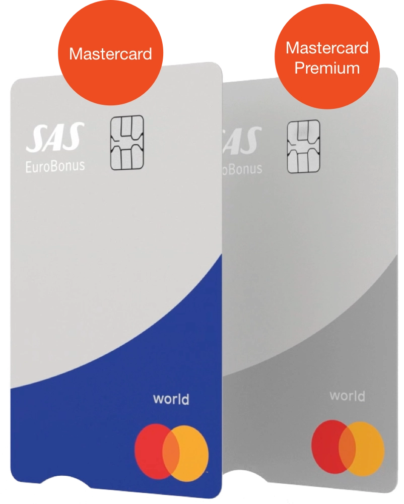
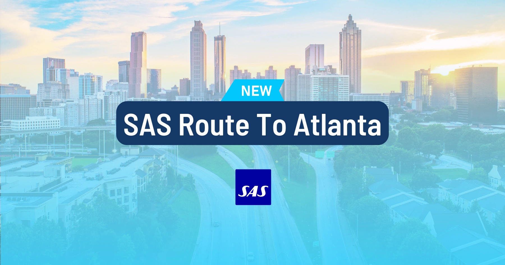

Another month, another roundup: welcome to the latest edition of our SAS EuroBonus Updates. Each month, we explore the most recent developments and offerings from SAS Scandinavian Airlines' loyalty program, so you don't have to.

February has plenty to uncover, from thrilling mystery tickets and partnerships with Delta Air Lines to updates on credit card fees and exciting ventures into hydrogen-powered flights, there's plenty to uncover. Let's start!

## SAS EuroBonus Updates (February 2024)

### 1. Sign Up For 'Destination Unknown': Mystery Ticket for 30.000 EuroBonus Points

Today (February 12), SAS Scandinavian Airlines will unveil a limited opportunity for travelers to book a flight without knowing the destination. The concept is simple yet thrilling: a round-trip mystery ticket to an unknown destination costs 30.000 EuroBonus points. The plane will depart on April 5 and return on April 8.

The promotion **STARTS TODAY at 12:00 PM CET**, and is only valid for 24 hours, so hurry up and grab your ticket.

Read more [in this post](https://blog.awardfares.com/sas-destination-unknown/).

### 2. Higher Fees For The SAS EuroBonus World Mastercard Premium

Starting May 1, 2024, the following changes will take place:
The price for the card will be increased by 40kr per month, which means that the annual price will be raised 25% (to 2335 kr). The new annual price will be charged the next time you pay for the card.

To sugarcoat the impact of the price increase, the card also announced (somewhat beneficial) changes to the calculation of status points. Status points will still be calculated as 25% of Extra Points earned during the month, but now introducing a minimum level of 500 Status points. For example, if you only earn 300 Status Points in any given month, you will now receive 500 Status Points. This way, members can make sure they get at least 6000 Status Points annually if the card is used every month.

The SAS EuroBonus World Mastercard Premium card will still offer the following benefits:

- Fly Premium: bonus trips in SAS Plus at the points price of SAS Go
- Status points when you use the card
- Up to 25 Extra Points per SEK 100 on all purchases
- Points campaigns several times a year
- Supplementary travel insurance with cancellation protection

*Source: [saseurobonusmastercard.se](https://saseurobonusmastercard.se/)*

### 3. New Route to Atlanta and Cooperation with Delta

SAS announced a new route from Copenhagen to Atlanta starting June 17, 2024. This route will allow passengers to connect to Delta Air Lines' network in the USA, the Caribbean, and Latin America. SAS also hinted at a closer cooperation with Delta Air Lines on other US routes.

When SAS announced the new route, they also mentioned a tighter collaboration with Delta Air Lines for onward connections from Atlanta. It all suggests that SAS customers will soon use Delta Air Lines more frequently for onward connections.

There are indications that the partnership between SAS and Delta Air Lines goes beyond just the Atlanta route. On SAS' website, Delta Air Lines is now offered as the onward connection for many destinations, including Las Vegas, Denver, Minneapolis, Boston, New York, Washington DC, and Los Angeles.

Read more [in this post](https://blog.awardfares.com/sas-route-to-atlanta/).

### 4. Gift cards for Valentine's Day

Surprise your loved ones with the freedom to explore over 100 SAS destinations worldwide. SAS is offering pre-designed or personalized gift cards with pictures and greetings. The cards let the recipient choose their dream travel experience, are valid for 1 year after purchase, and EuroBonus members can earn points when using them.

**How it works:**

1. Go to [SAS website](https://www.sas.se/giftcard/).
2. Select a value: Choose the desired amount to gift.
3. Customize: Add a personal touch with a photo and a message.
4. Retrieve & Send: Receive a link to access the gift card and send it via email or print it for a physical gift.

### 5. Reintroduction of the Airbus A350

SAS is bringing back an Airbus A350 it had previously rejected just over a year ago. The decision comes as the airline seeks to increase its widebody capacity. This particular A350-900, which once operated under the SAS registration SE-RSC between 2020 and 2022, will fly again under a new registration (VP-COC).

The move follows SAS filing for bankruptcy in July 2022. As part of restructuring efforts, the airline significantly reduced its fleet size by ending several aircraft leasing agreements early. This included letting go of **three A350s**, leaving them with only three remaining in the fleet.

It will be interesting to see how this reintroduction impacts SAS's operations and whether they will consider returning the other two previously rejected A350s. It will also be interesting to watch out for fleet development after the acquisition from Air France-KLM and others.

*Source: [FlightGlobal](https://www.flightglobal.com/airlines/sas-looks-to-re-introduce-a350-previously-shed-during-fleet-restructuring)*

### 6. SAS Partners With Airbus For Hydrogen-Powered Flights

Airbus, SAS, Swedavia, Vattenfall, and Avinor join forces to explore hydrogen-powered flights in Norway and Sweden. A significant collaboration has been announced to investigate the feasibility of hydrogen-fueled aircraft; the goal is to develop a framework for the rollout of hydrogen-powered flights in both countries.

Hydrogen is seen as a promising alternative to fossil fuels for aviation, as it produces zero carbon dioxide emissions from renewable electricity. The partnership will study hydrogen aircraft concepts and operations, regulatory requirements, infrastructure, supply, fuel storage, and airport refueling.

This is the first time a feasibility study of this kind has been conducted for two countries and over 50 airports. It reflects the partners' shared ambition to use their expertise to decarbonize aviation and achieve the goal of net zero carbon emissions by 2050.

*Source: [Airbus](https://www.airbus.com/en/newsroom/press-releases/2024-01-airbus-avinor-sas-swedavia-and-vattenfall-pave-the-way-for-hydrogen)*

## Want More Award Travel Intel?

You can [try AwardFares for free](https://awardfares.com/). We are rolling out new features and improvements regularly, so [sign up for our monthly newsletter](https://awardfares.com/newsletter) to stay on top of the latest news, announcements, and pro tips.

With our [Gold and Diamond tiers](https://awardfares.com/pricing), you can access premium features such as unlimited daily searches, alerts, seat maps, flight schedules, and more!

## Read More

Our guides have all the information you need to be a pro travel hacker and explore the world on points. Here are some related posts you might enjoy:

* [SAS EuroBonus Conscious Traveler Takes Off In 2024: Greener Flying, Greater Rewards](https://blog.awardfares.com/sas-eurobonus-conscious-traveler/)
* [SAS Ambitious New Direct Flight To Atlanta Takes Off In June (Awards Now Available)](https://blog.awardfares.com/sas-route-to-atlanta/)
* [SAS Will Fly To 9 New Destinations During Summer 2024](https://blog.awardfares.com/sas-summer-2024/)
* [Try These EuroBonus Award Flights Before SAS Leaves Star Alliance (Megapost)](https://blog.awardfares.com/eurobonus-star-alliance-awards/)