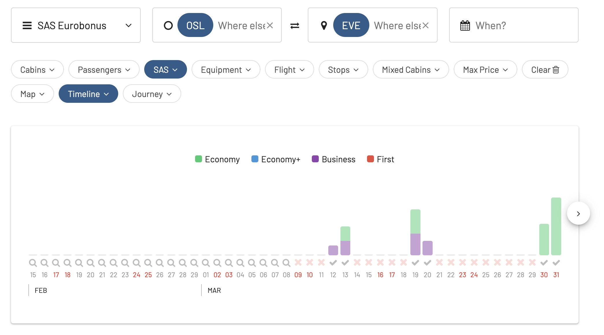
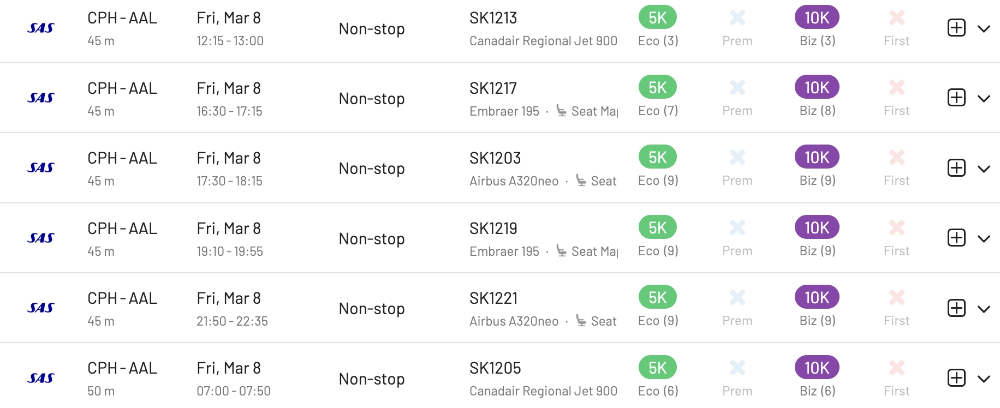

SAS launched a new campaign for EuroBonus members with a 25% points discount on [SAS Go and SAS Plus](https://flysas.com/)trips to selected destinations in Scandinavia.

Hurry up, because there's only a few days left to book. The offer applies to both one-way and return journeys in SAS Go Bonus and SAS Plus Bonus. Children 2-11 years old get 50% of the point price, even on the already discounted price.

  TIME LEFT TO BOOK

**Promotion details:**

* Discount: **25% OFF** in SAS Go Bonus and SAS Plus Bonus
* Book by **20 February 2024**
* Travel period: 1 March – 31 May 2024
* From **Sweden** to: [**Malmö**](https://awardfares.com/search?country:SE.MMX.;a:SK;z:sas), [**Visby**](https://awardfares.com/search?country:SE.VBY.;a:SK;z:sas)
* From **Norway** to: [**Bergen**](https://awardfares.com/search?country:NO.BGO.;a:SK;z:sas), [**Evenes**](https://awardfares.com/search?country:NO.EVE.;a:SK;z:sas)
* From **Denmark** to: [**Aalborg**](https://awardfares.com/search?country:DK.AAL.;a:SK;z:sas), [**Faroe Islands**](https://awardfares.com/search?country:DK.FAE.;a:SK;z:sas)

## SAS EuroBonus 25% Discount (February 2024)

There are plenty of seats available to all destinations. **Note that** you'll see the discount applied once you are logged in to your EuroBonus account:

If you are a SAS Mastercard cardholder and have the Fly Premium benefit, it's also possible to combine this benefit with the point discount, as seen in the image above.

Also, remember that there most destinations don't have available seats over Easter 2024 (March 28 to April 1).

### 1. [Visby, Sweden](https://awardfares.com/search?country:SE.VBY.;a:SK;z:sas)

Several seats available from many cities in Sweden, including Stockholm.

### 2. [Malmö, Sweden](https://awardfares.com/search?country:SE.MMX.;a:SK;z:sas)

### 3. [Bergen (Norway)](https://awardfares.com/search?country:NO.BGO.;a:SK;z:sas)

### 4. [Evenes (Norway)](https://awardfares.com/search?country:NO.EVE.;a:SK;z:sas)

This one is a tricky one. There are almost no seats, a few of them showing up right after Easter 2024.

### 5. [AAlborg (Denmark)](https://awardfares.com/search?country:DK.AAL.;a:SK;z:sas)

### 6. [Faroe Islands (Denmark)](https://awardfares.com/search?country:DK.FAE.;a:SK;z:sas)

## Search for seats with AwardFares?

1. Go to [AwardFares](https://awardfares.com/signup).
2. Under Frequent Flyer Program, choose **SAS EuroBonus only**.
3. Tap on Airline and select **SAS only**.
4. Enter your departure area or city (e.g. **Stockholm**).
5. Enter your destination airport (e.g. **Visby**).
6. Choose a date, or use the Timeline view to explore flights for different dates.

That's it! You will see the full result list on the list below. Sort them by price by tapping on the search results header.

## Upgrade For More

With our [premium features on Gold and Diamond](https://awardfares.com/pricing), you can also set up alerts to get notified when seats become available, as well as check seat maps, flight schedules, and more.

You can [try AwardFares for free](https://awardfares.com/). We are rolling out new features and improvements regularly, so sign up for our newsletter to stay on top of the latest news, announcements, and pro tips!

## Terms and Conditions

> - The price is set according to place of departure and destination, regardless of the chosen route (direct or with a stopover).
> - The offer applies one-way or return.
> - You must be logged in to see the points discount.
> - Taxes and service charges are added per person and may vary depending on destination and route. The exact amount will be shown when you book. Taxes and fees cannot be paid with points.
> - The points discount is only available for SAS Bonus tickets. It is not available when you mix points and cash, and for regular tickets for points.
> - When mixing a SAS Bonus ticket with a regular ticket for points in a single booking, only the Bonus ticket receives the discount.
> - Both the outbound and inbound journeys must begin during the stated travel period.
> - Children receive a 50% discount on the offer unless otherwise stated.
> - Infants travel free if you book a seat for your infant - 50% discount.
> - Offer start and end times are always midnight to midnight CET, unless otherwise stated.
> - The number of seats for bonus journeys is always limited.
> - Bookings cannot be changed once the booking period for the campaign has ended, but then normal bonus prices apply.
> - The traveler must pay all applicable fees, e.g. airport tax.
> - Cannot be combined with other discounts/offers for bonus travel with the exception of Mastercard FlyPremium (level 2-4).
> - The general membership conditions for EuroBonus apply.

## Read More

Make sure to also check these posts out

- [Updates For SAS EuroBonus Members (February 2024)](https://blog.awardfares.com/eurobonus-updates-feb-2024/)
- [SAS EuroBonus Analysis and Forecast (Free Tool)](https://blog.awardfares.com/eurobonus-analysis-and-forecast/)
- [Essential Guide To Book Lufthansa Flights With SAS EuroBonus Points](https://blog.awardfares.com/lufthansa-with-eurobonus-guide/)

 