Are you concerned about maybe flying on a [Boeing 737 MAX](https://www.boeing.com/commercial/737max) on your next trip? The 737 MAX's journey has been marred by tragedy, controversy, and ongoing concerns. After serious issues in 2018 and 2019, technical fixes and regulatory approvals have allowed its return to service. However, a recent flying-door episode with Alaska Airlines is again causing struggles for Boeing.

*Disclaimer: This blog post is intended for informational purposes only and meant to help our users navigate award bookings with better knowledge. It should not be construed as professional advice or endorsement for/against the Boeing 737 MAX.*

### In This Post

- [Issues with the 737 MAX: A Troubled History Since Inception](#issues-with-the-737-max-a-troubled-history-since-inception)
- [How To Avoid The 737 Max When Booking An Award Flight](#how-to-avoid-the-737-max-when-booking-an-award-flight)
- [More Tips](#more-tips)
- [Want More Award Travel Intel?](#want-more-award-travel-intel)
- [Read More](#read-more)

## Issues with the 737 MAX: A Troubled History Since Inception

The Boeing 737 MAX, once praised for its fuel efficiency and range, has been plagued by controversy and safety concerns since its inception. While cleared to fly again after two deadly crashes, recent incidents involving Alaska Airlines have reignited doubts about its reliability.

Let's delve into the troubled history of the 737 MAX and its ongoing issues.

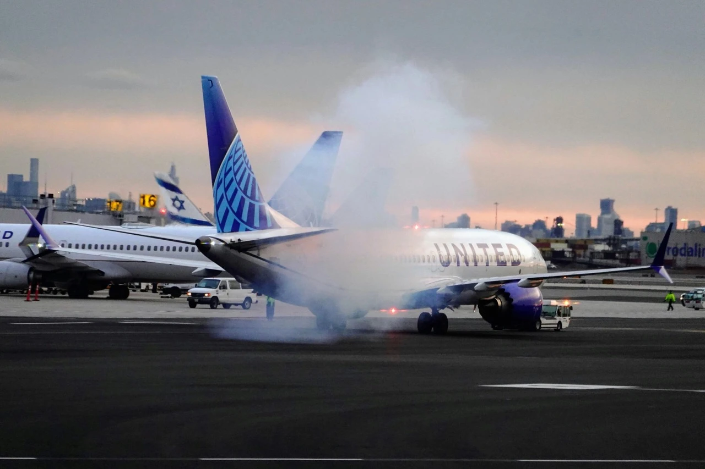

### 2018 & 2019: The Shadow of Fatal Crashes

[Lion Air Flight 610](https://en.wikipedia.org/wiki/Lion_Air_Flight_610) and [Ethiopian Airlines Flight 302](https://en.wikipedia.org/wiki/Ethiopian_Airlines_Flight_302) tragically claimed 346 lives due to faulty [Maneuvering Characteristics Augmentation System (MCAS)](https://en.wikipedia.org/wiki/Maneuvering_Characteristics_Augmentation_System) software, leading to a 20-month global grounding.

The MCAS, intended to prevent stalls, was criticized for its design and lack of pilot transparency, contributing to the crashes. Extensive redesign and pilot training became mandatory.

At that time, there were also production and quality concerns: faulty wiring, manufacturing defects, and supplier issues have raised concerns about production quality and consistency.

### 2024: Alaska Airlines Incident

In January 2024, a window and fuselage panel blew out on a 737 MAX 9, prompting inspections and grounding of specific model variants. Loose bolts were also discovered on other MAX 9s, raising further safety concerns.

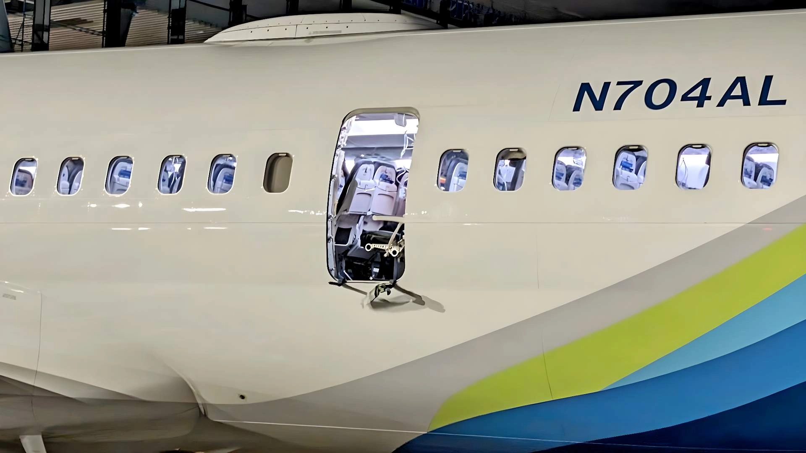

The Federal Aviation Administration (FAA) carried an investigation and found four key bolts were missing, allowing the door to detach and create a hole in the fuselage. Boeing apologized and vowed to improve quality control, including additional inspections and independent assessments.

The missing bolts were originally installed by supplier Spirit AeroSystems, but seem to have gone missing during repairs at Boeing's factory. This incident adds to existing concerns about Boeing's quality control processes, as other planes have been found with loose bolts and fixings.

While no other planes are currently missing the specific bolts involved in this incident, Boeing is implementing a comprehensive plan to strengthen quality and regain stakeholder confidence. This includes stricter inspections, improved documentation, and an independent assessment of their supply chain.

### Uncertain Future

The recent issues have caused delays in deliveries and potential financial losses for Boeing. Regaining public trust and overcoming negative perceptions remain major challenges for Boeing and the 737 MAX.

Alaska Airlines is already facing over USD $150 Million in losses due to grounding of their MAX fleet. Other airlines are also suffering and noticing a shift in traffic due to their users changing flights to ones operated by a different aircraft, and even returning tickets.

## How To Avoid The 737 Max When Booking An Award Flight

There's [so much concern about this aircraft](https://www.boeing.com/737-9-updates) that it's completely reasonable to feel uncomfortable and prefer not to fly it on your next trip. Luckily, if you are using AwardFares to search for your next free flight, we make it super simple to filter out results, making sure you don't get any options on the 737 MAX.

### 1. Go to [AwardFares](https://awardfares.com/signup)

### 2. Under *Loyalty Program* choose your favorite Frequent Flyer Program

In our example, we are going to use United MileagePlus. Keep in mind that, as a Star Alliance partners, we'll not only see award flights operated by United, but also on partner airlines such as Turkish, Copa, Air Canada, Lufthansa, Swiss, etc. Many of them operate the Boeing 737 MAX.

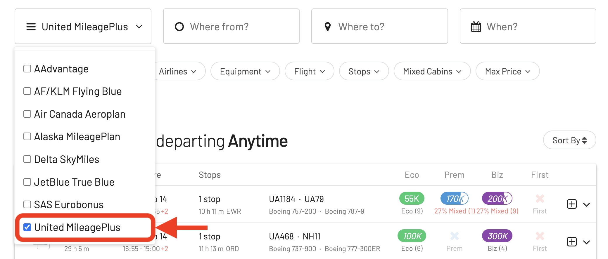

### 3. Add a Route

Use the **Origin** and **Destination** fields to different airports and search for flights between those locations. If needed, use the **Stops** filter to search for direct flights only.

In the example below, we are trying to find flights [from Chicago (ORD) to Cancún (CUN)](https://awardfares.com/search?ORD.CUN.;z:united).

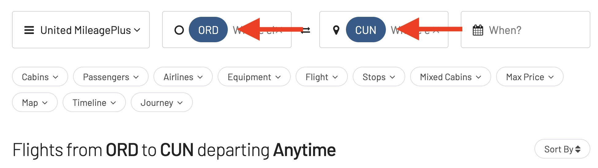

### 4. Use the *Equipment* Field To EXCLUDE the 737 MAX

**This is the key step**. Under *Equipment*, type **737 MAX**. You'll see a dropdown menu displaying all the MAX variants, including the 737 MAX 8 and 737 MAX 9.

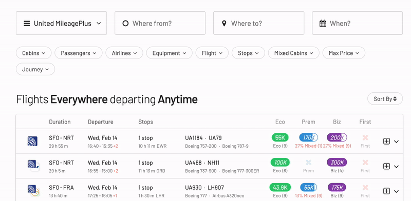

Uncheck the small checkboxes on the left to exclude both aircraft types from the result list. You'll notice that once applied, the pill will display "Excluded: 737 MAX 8, 9".

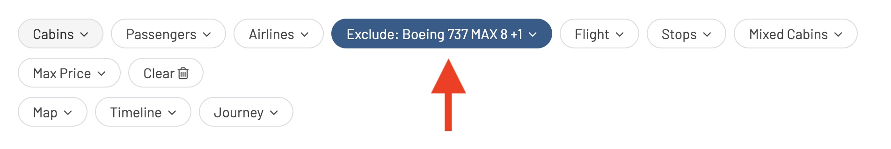

### 5. Choose or explore dates

If you have a particular date in mind, add it by tapping on the **Calendar** field.

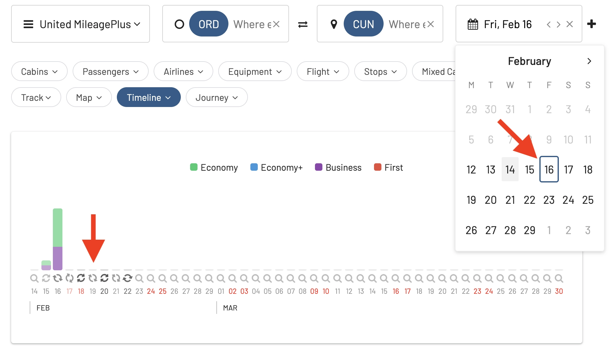

If you don't have a set date, you can take advantage of AwardFares' **Timeline View** to explore seat availability across different days.

### 6. Explore results

Once you've set up your search, the result list below will show you all available seats on different routes. **None of these will be operated by the 737 MAX**, unless the airline changes the equipment last-minute. That's why it's important to keep monitoring for equipment changes even after you've booked the flight.

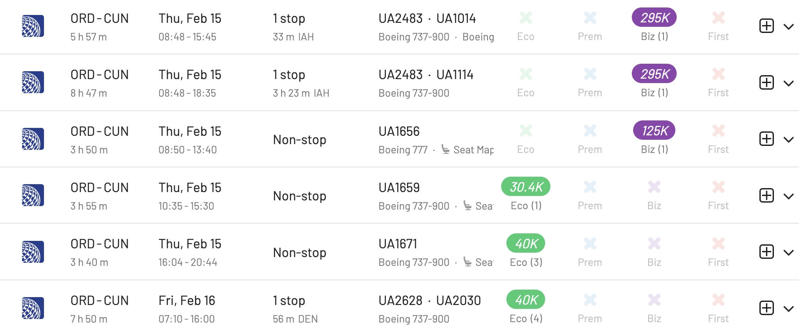

Note that AwardFares clearly shows the aircraft type for each flight in the details. Here's an example when the result list **does not exclude** the MAX:

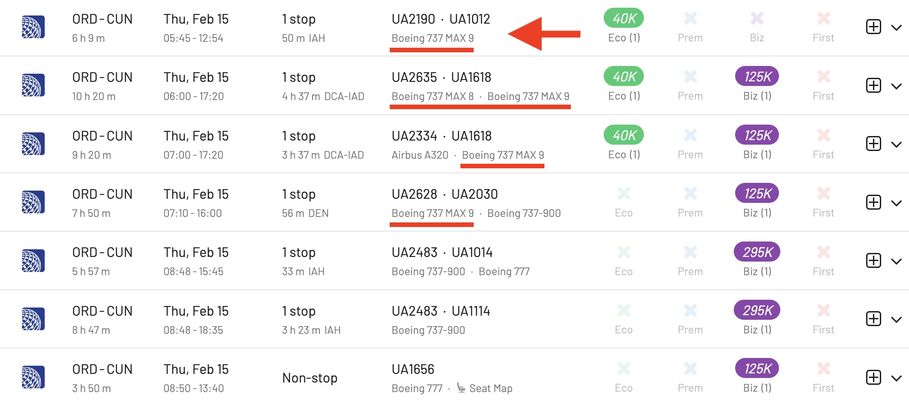

### 7. Confirm and book

Once you have identified the flights you want, go to airline's website and make the booking.

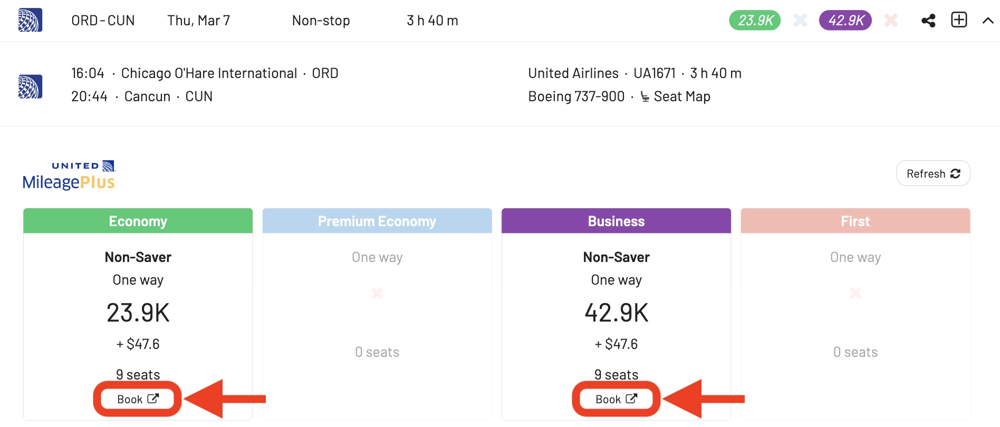

In this step, you can double-check all the information and make sure that the equipment used is not a MAX.

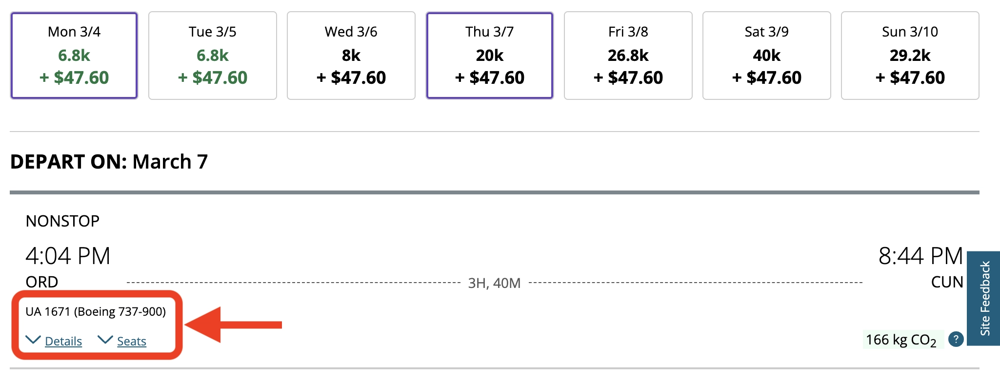

## More Tips

- If you are booking a cash ticket, **use a flight search engine that displays the aircraft type**. Many flight search engines, such as [Google Flights](https://www.google.com/travel/flights), Kayak, and Skyscanner, now display the aircraft type for each flight. This is the easiest way to see if a flight is operated by a 737 MAX before you book.
- **Check the airline's website.** Most airlines list the aircraft type for each flight on their website. You can usually find this information on the flight details page.
- **Use a website or app that tracks aircraft types.** There are a few websites and apps that track aircraft types, such as [Flightradar24](https://www.flightradar24.com/). These can be helpful if you want to see the exact aircraft that will be operating your flight.
- **Consider flying a different airline.** Not all airlines operate the 737 MAX. You can do a quick search online to see which airlines do not fly the 737 MAX.
- **Keep an eye on your flight details.** Airlines sometimes change aircraft types after a flight has been booked. Be sure to check your flight details closer to your departure date to make sure the aircraft type has not changed to a 737 MAX.
- **Contact the airline if you are concerned.** If you are concerned about flying on a 737 MAX, you can contact the airline to see if they can switch you to a different flight.

## Want More Award Travel Intel?

You can [try AwardFares for free](https://awardfares.com/). We are rolling out new features and improvements regularly, so [sign up for our monthly newsletter](https://awardfares.com/newsletter) to stay on top of the latest news, announcements, and pro tips.

With our [Gold and Diamond tiers](https://awardfares.com/pricing), you can access premium features such as unlimited daily searches, alerts, seat maps, flight schedules, and more!

## Read More

Our guides have all the information you need to be a pro travel hacker and explore the world on points. Here are some related posts you might enjoy:

- [How To Find Cheap Award Flights And Identify Good Redemptions (Step-by-step)](https://blog.awardfares.com/how-to-find-cheap-award-flights/)
- [Seat Maps: Getting The Perfect Seat Even Before Booking](https://blog.awardfares.com/seatmaps-guide/)
- [Demystifying Award Charts: All You Need To Know (2024)](https://blog.awardfares.com/demystifying-award-charts/)
- [Ultimate Guide to Award Release Dates](https://blog.awardfares.com/ultimate-guide-to-award-release-dates)