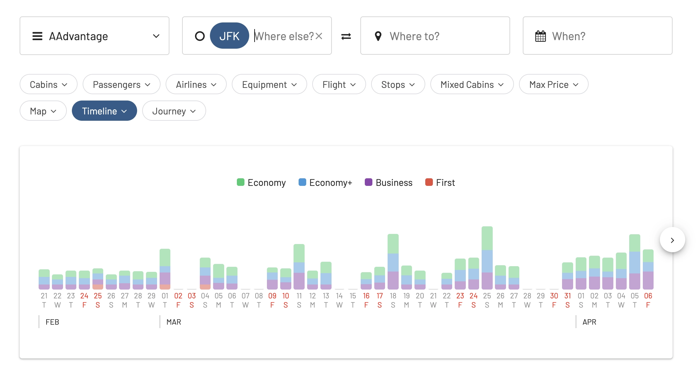

Flying with American Airlines? Starting February 20, 2024, the airline is implementing several changes that will impact how you pack, earn miles, and book your next trip. These changes aim to reward loyalty and incentivize booking directly with American Airlines. AAdvantage members will enjoy additional benefits, while some fees will increase for non-direct bookings.

Let's have a quick look at the updates!

## American Airlines Changes (February 2024)

### Changes to Earning Miles and Loyalty Points

- Starting May 1st, only bookings made directly with American, through participating partners, or with specific travel agencies will earn miles and Loyalty Points.
- Basic Economy fare tickets will only earn miles when booked directly with American.
- AAdvantage members can still earn miles and points through partner programs like hotels, shopping portals, and events.

### Checked Bag Fees

- **More expensive**: Expect to pay $35 for your first checked bag online, or $40 at the airport (previously $30). A second checked bag costs $45 online or at the airport (previously $40).
- **Good news for some**: AAdvantage members and credit cardholders with specific cards will continue to enjoy complimentary checked bags.
- **Overweight and oversized bag fees** will be restructured with lower costs for slightly exceeding standard dimensions.
- **Goodbye bulky items**: Starting April 17th, javelins, pole vaults, and hang gliders are no longer allowed as checked baggage.
- **Pet-in-cabin** fees will increase to $150.

### Enhanced AAdvantage Benefits

To sugarcoat some of the changes, American will also roll out some benefits only valid for AAdvantage members.

- Reduced costs for transferring miles between accounts.
- Ability to use miles for Wi-Fi on select flights (coming soon).
- Upgrade flights with partner airlines using miles (coming soon).
- Cancel non-refundable Basic Economy tickets for a fee and receive a trip credit.
- Free same-day standby for earlier domestic flights.
- Extended validity period for trip credits.

Want more details? Check out [the full article on American Airlines' website](https://news.aa.com/news/news-details/2024/Booking-directly-with-American-Airlines-and-its-airline-partners-makes-travel-even-better-for-AAdvantage-members-AADV-02/) for the latest information.

## Your Gateway To AAdvantage Awards

You can [try AwardFares for free](https://awardfares.com/). We are rolling out new features and improvements regularly, so [sign up for our monthly newsletter](https://awardfares.com/newsletter) to stay on top of the latest news, announcements, and pro tips.

With our [Gold and Diamond tiers](https://awardfares.com/pricing), you can access premium features such as unlimited daily searches, alerts, seat maps, flight schedules, and more!

## Read More

Our guides have all the information you need to be a pro travel hacker and explore the world on points. Here are some related posts you might enjoy:

- [How To Find AAdvantage Awards In 2024](https://blog.awardfares.com/aadvantage-guide/)
- [Changes to AAdvantage Coming in 2024](https://blog.awardfares.com/aadvantage-program-updates-2024/)
- [American Airlines Announces Winter Schedule For 2024: New Route to Brisbane with Flagship Suites & More](https://blog.awardfares.com/american-winter-routes-2024/)