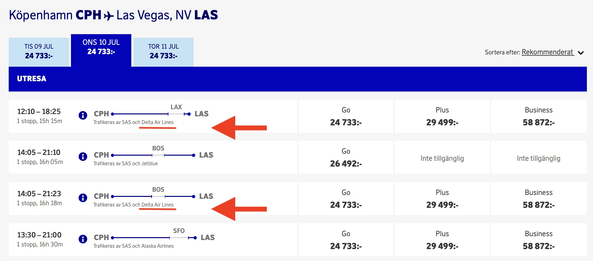

Today, we woke up to some unexpected developments in the SAS EuroBonus saga. It appears that booking flights on United Airlines using EuroBonus points is no longer an option. Their system fails to display any itineraries that include United flights. These changes could be linked to the recent slowdowns observed in their search engine and are likely associated with the new partnership with Delta Air Lines and the intention to join SkyTeam.

Let's review what we know so far! If you have additional information, please make sure to share it with us.

**UPDATE Mar 1st, 2024**: Air France confirms that SAS will leave Star Alliance during Q2, 2024, joining SkyTeam immediately. There are still very little information regarding the implementation of the transition.

**UPDATE Feb 27th, 2024**: SAS confirms the issue with a note at the top of the EuroBonus booking portal.

## United Disappears from EuroBonus Bookings (What We Know)

Booking United flights directly through EuroBonus seems to be a thing of the past. While the official reason remains unclear, we can assume it's related to a change in the partnership dynamics.

### SAS Prioritizes Delta and JetBlue

For revenue tickets, SAS has been increasingly favoring connections with [Delta](https://awardfares.com/search?..;z:delta) and [JetBlue](https://awardfares.com/search?..;z:jetblue) over United. For example, on SAS' website, Delta Air Lines is now offered as the onward connection for many destinations, including Las Vegas, Denver, Minneapolis, Boston, New York, Washington DC, and Los Angeles.

When SAS announced the new route to Atlanta, they also mentioned a tighter collaboration with Delta Air Lines for onward connections, and might be even more [if the airline joins SkyTeam soon](https://blog.awardfares.com/sas-and-skyteam/).

Keep in mind that while these routes/itineraries are convenient, they do not accrue points in the EuroBonus programs yet, for the legs operated by Delta. Read more [in this post](https://blog.awardfares.com/sas-route-to-atlanta/).

### Limited Options for Transatlantic Travel

The disappearance of United flights from the EuroBonus platform significantly narrows the choices for members looking to travel between Europe and the United States.

United Airlines has:

1. A large network
2. Good availability
3. Consistent award prices

This change means members must now look for alternatives within the Star Alliance network or consider other airlines not affiliated with the program, potentially at higher costs or less convenient schedules.

The lack of an apparent alternative for award bookings presents a significant challenge. Trips to the U.S. outside SAS's direct routes might become trickier to redeem points on.

### The Last Hurrah?

Our cached data indicates that the most recent EuroBonus redemption for a United flight was recorded yesterday morning. We still don't know whether this situation is temporary or permanent, but as of today, there are no available award seats on United.

## What To Do Now? Tips for EuroBonus Members

- **Flexibility is Key**: Be prepared to explore alternative airlines and routes, especially for award travel to the U.S. Consider options like connecting through other Star Alliance members or utilizing other loyalty programs.
- **Stay Informed**: Keep an eye on our blog and socials, we'll be here to keep you informed. You can also sign-up to our monthly newsletter here.
- **Start Exploring Other Options**: Consider expanding your points portfolio beyond EuroBonus. Diversifying your loyalty program memberships can provide more flexibility and options when faced with such changes. Here's our take on the [best Frequent Flyer Programs of 2024](https://blog.awardfares.com/frequent-flyer-programs-2024/).
  

**Remember**: While this development might be inconvenient, it's important to adapt and remain resourceful. Award travel requires flexibility and a willingness to explore alternative options. Here at AwardFares, we're dedicated to helping you navigate these changes and find the best possible redemption opportunities. So, stay tuned, stay flexible, and happy travels!

## Want More Award Travel Intel?

You can [try AwardFares for free](https://awardfares.com/). We are rolling out new features and improvements regularly, so [sign up for our monthly newsletter](https://awardfares.com/newsletter) to stay on top of the latest news, announcements, and pro tips.

With our [Gold and Diamond tiers](https://awardfares.com/pricing), you can access premium features such as unlimited daily searches, alerts, seat maps, flight schedules, and more!

## Read More

Our guides have all the information you need to be a pro travel hacker and explore the world on points. Here are some related posts you might enjoy:

* [SAS EuroBonus Conscious Traveler Takes Off In 2024: Greener Flying, Greater Rewards](https://blog.awardfares.com/sas-eurobonus-conscious-traveler/)
* [SAS Ambitious New Direct Flight To Atlanta Takes Off In June (Awards Now Available)](https://blog.awardfares.com/sas-route-to-atlanta/)
* [SAS Will Fly To 9 New Destinations During Summer 2024](https://blog.awardfares.com/sas-summer-2024/)
* [Try These EuroBonus Award Flights Before SAS Leaves Star Alliance (Megapost)](https://blog.awardfares.com/eurobonus-star-alliance-awards/)