This year marks a giant leap for Scandinavian Airlines, particularly for SAS EuroBonus members. The airline will be acquired, among others, by Air France-KLM, leaving Star Alliance in Q2 2024 and joining SkyTeam immediately! (recently confirmed during a press statement.) This means the game for frequent travelers will change very soon: award flights you can redeem using SAS EuroBonus points will be different forever.

**How to prepare for the transition?** Don't worry—we've got you covered. That's why we prepared this post as the Ultimate Guide to Using SAS EuroBonus Points. The intention is to help you find the best (free) flights on SAS and Star Alliance before the airline leaves and, ultimately, on SkyTeam partners once the airline enters the new alliance and integrates with those partners.

  TIME UNTIL Q2 2024

### In This Post

- [SAS Transition to SkyTeam (Our Thoughts)](#sas-transition-to-skyteam-our-thoughts)
  - [EuroBonus Award Chart](#eurobonus-award-chart)
  - [Earning EuroBonus Points](#earning-eurobonus-points)
  - [EuroBonus Award Search Portal](#eurobonus-award-search-portal)
  - [Amex 2-for-1 Vouchers / Companion Tickets](#amex-2-for-1-vouchers--companion-tickets)
  - [Award Release Dates](#award-release-dates)
- [How To Find Cheap EuroBonus Award Flights (Step-by-step)](#how-to-find-cheap-eurobonus-award-flights-step-by-step)
  - [Booking SAS Flights](#booking-sas-flights)
  - [Booking Star Alliance Flights](#booking-star-alliance-flights)
- [Become an EuroBonus Pro](#become-an-eurobonus-pro)

## SAS Transition to SkyTeam (Our Thoughts)

There have yet to be any official announcements about how the EuroBonus program will change once the acquisition occurs. While there is one scenario in which EuroBonus shuts down and Flying Blue becomes SAS's new official loyalty program, the conditions for that to happen are far from being met. If so, it won't be on the 2024 horizon.

Instead, from a technical standpoint, it makes more sense that the airline(s) take more gradual steps until new changes are implemented. Here are some of our thoughts on different areas from our humble perspective as technologists and experience as travelers.

### EuroBonus Award Chart

The award charts show how many points you need for a free flight. On SAS flights, the airline may adjust the numbers (bumping them up), making flights cost more. These devaluations are easy to do and typically happen on short notice (effective the month after or so).

As of today, the table below shows how many EuroBonus points you would need for a one-way flight with SAS and Widerøe, excluding taxes and fees.

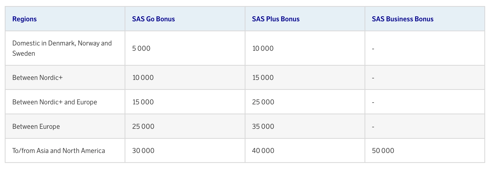

The Star Alliance part of the chart will be removed immediately, as redemptions will be stopped right away. A new chart for redemptions on SkyTeam partners should come simultaneously or soon, depending on how fast they implement redemptions on those partners.

The table below shows how many EuroBonus points you would need for a round trip flight on Star Alliance airlines as of today, excluding taxes and carrier-imposed fees. The price in points depends on your destination and travel class.

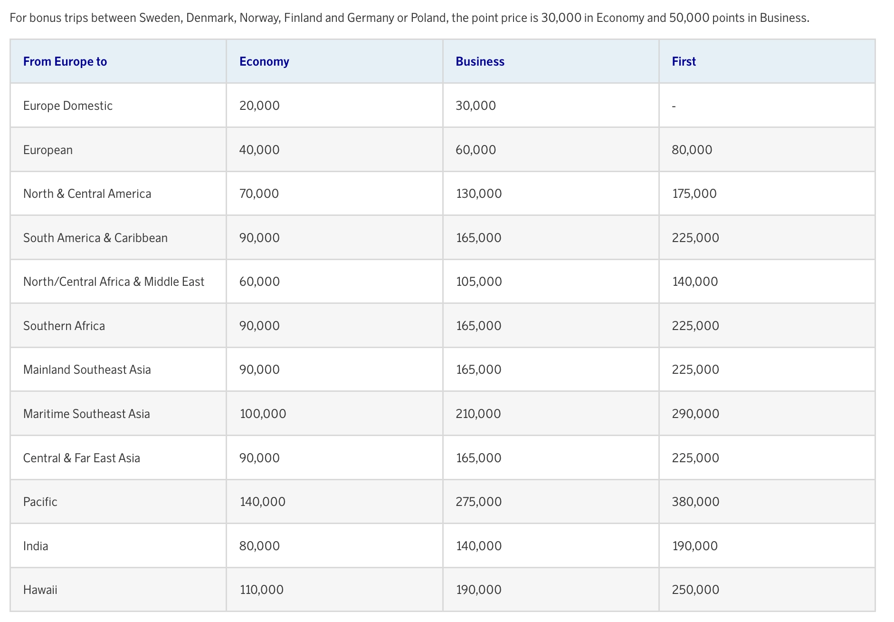

*You can check the full chart and [all other to/from combinations beyond Europe here](https://www.flysas.com/en/eurobonus/points/fly-with-points/star-alliance-point-chart/).*

The EuroBonus [award chart is zone-based](https://blog.awardfares.com/demystifying-award-charts/), and this aspect is unlikely to change during 2024. While most programs are shifting to dynamic pricing, airlines typically announce significant changes like these with 4-6 months of notice to their members. Mainly to avoid screwing up Elite Status qualification windows and to have more time for planning.

[Flying Blue (Air France-KLM)](https://blog.awardfares.com/introducing-flying-blue/) adopted dynamic pricing recently, so it's likely that if EuroBonus is kept as a separate program, it will follow along.

### Earning EuroBonus Points

* **On SAS**: No changes in the short term.

* **On Star Alliance Partners**: Be prepared to stop accruing points for flights on Star Alliance airlines taken as soon as the new agreement with SkyTeam becomes effective.

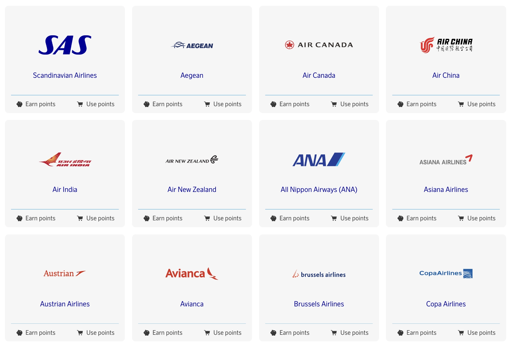

* **On SkyTeam Partners**: In an ideal scenario, once SAS is officially part of SkyTeam, it is possible to earn points on partners' flights right away. Hold on, it could be more straightforward. Implementing accrual and redemptions takes time, months, and sometimes even years.

We have already seen some integration between SAS and Delta when booking revenue tickets so that the changes might happen sooner for significant partners such as DL, Air France, and KLM.

### EuroBonus Award Search Portal

* **For SAS Flights**: Probably the same in the beginning. Same as we know already.

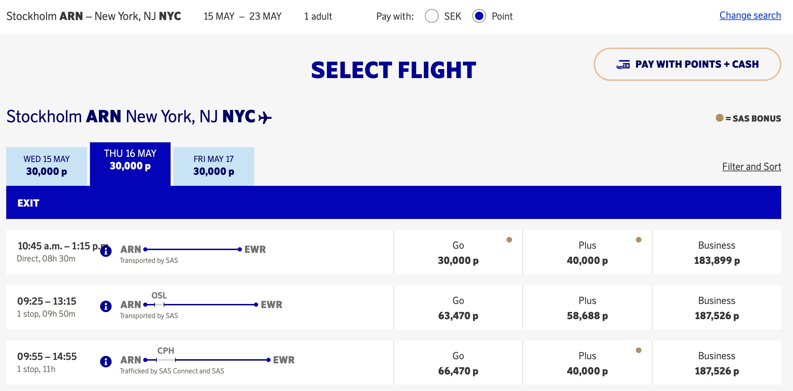

* **For Redemptions on Star Alliance**: These will be turned off immediately after SAS joins SkyTeam. Members will no longer be able to search and redeem for flights on Lufthansa, ANA,

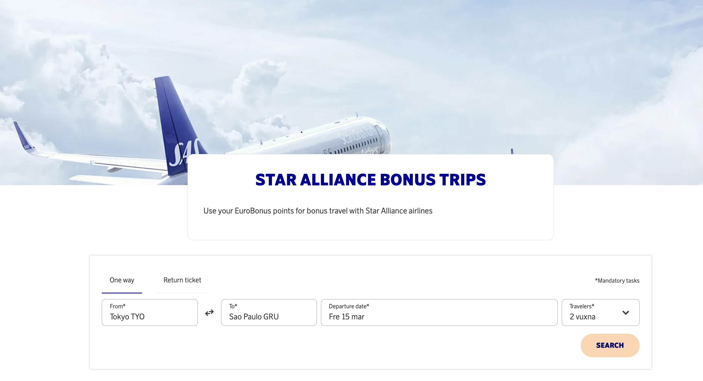

* **For Redemptions on SkyTeam Partners**: Not at launch, but we have hopes that some portal will appear for SkyTeam flights during Q2-Q3, at least for a handful of partners.

### Amex 2-for-1 Vouchers / Companion Tickets

For residents of Norway and Sweden and cardholders of the SAS American Express Elite card, one question remains: how does the transition impact the 2-for-1 vouchers also valid on Star Alliance flights?

The wording on the American Express website remains unchanged (until more details are known).

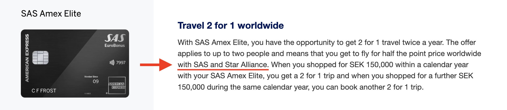

It's safer to assume that vouchers will only be usable on SAS flights from the moment it join SkyTeam. As we said earlier, it's unclear if/when redemptions on SkyTeam partners will become available and whether the vouchers will be usable on those or not.

If you have unused vouchers and are looking into flying with Star Alliance Airlines, this might be a good time to consolidate bookings. For example, it might be a good time to try cabins such as Lufthansa First, ANA The Room, etc.

### Award Release Dates

While the general timeframe of 330-359 days likely applies, specific release dates for EuroBonus members will depend on how SAS and SkyTeam airlines integrate their loyalty programs.

We will keep monitoring the situation and updating our [Ultimate Guide to Award Release Dates](https://blog.awardfares.com/ultimate-guide-to-award-release-dates/) accordingly.

## How To Find Cheap EuroBonus Award Flights (Step-by-step)

### Booking SAS Flights

#### 1. Go to [AwardFares](https://awardfares.com/signup)

Creating an account is optional, but it's also free, and it gives you access to more features. Make sure to [sign up for one here](https://awardfares.com/signup).

#### 2. Select **EuroBonus** as the Frequent Flyer Program

Tap on the **Loyalty Program** field and select SAS EuroBonus

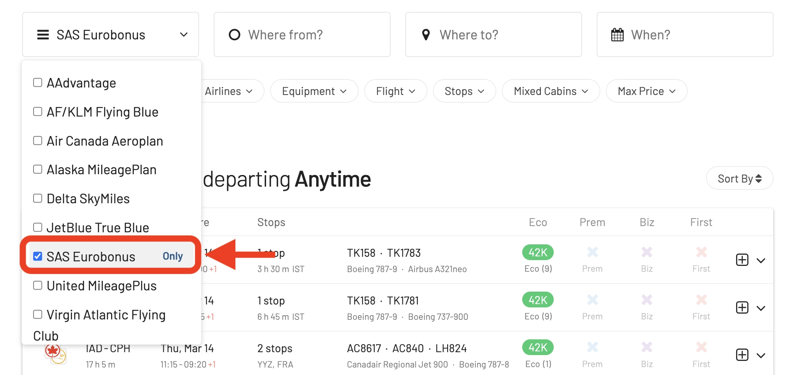

#### 3. Under *Airlines*, select **SAS only**

From now on, you will only see available award seats operated by SAS on the results list.

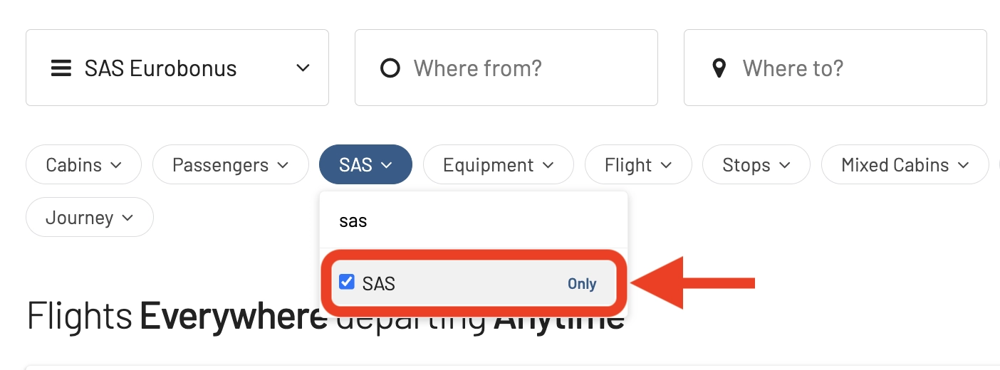

#### 4. Add a Route

In the **Origin** and **Destination** fields, add one or more airports to search for flights between those locations. AwardFares will search for award flights regardless of the number of stops. You can use the **Stops** filter to only search for direct/non-stop flights.

In the example below, we search for flights [between Copenhagen and New York](https://awardfares.com/search?CPH.area:NYC.;a:SK;z:sas). Note that we use the metropolitan area codes **NYC** to get results to and from any airport in New York (JFK, EWR, LGA).

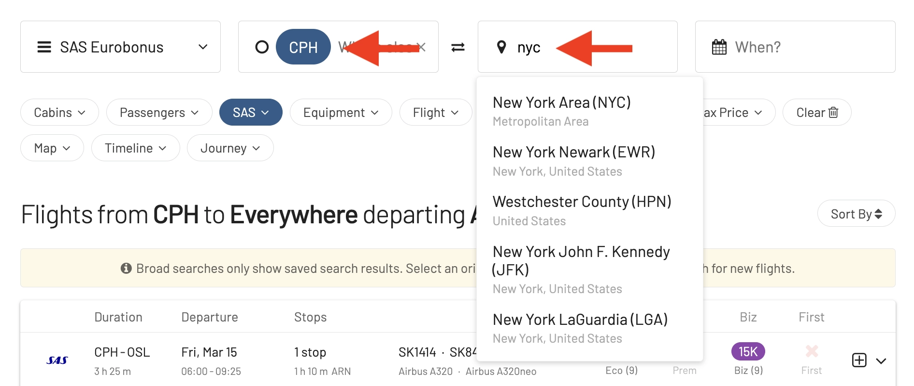

#### 4. Explore dates

If you have a particular date in mind, add it by tapping on the **Calendar** field.

Alternatively, you can use AwardFares **Timeline View** to explore the seat availability on different dates. The Timeline View displays how many seats are available for each day of the week/month. The bars are color-coded, so it's easy to distinguish between cabin classes (Economy, Business, First). You can also trigger new searches by tapping the refresh icon underneath each day.

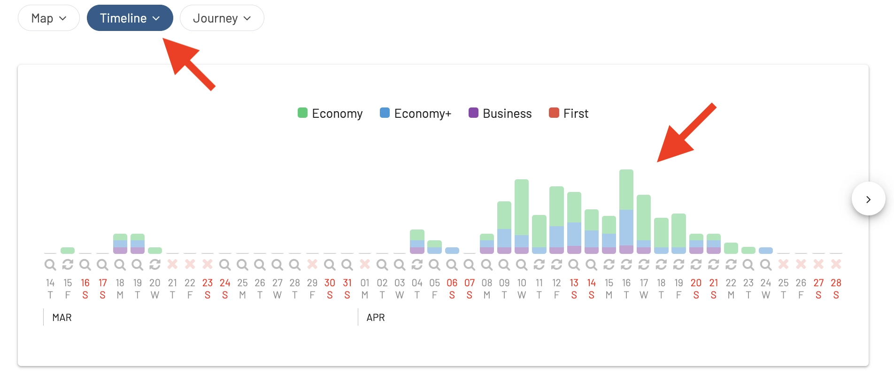

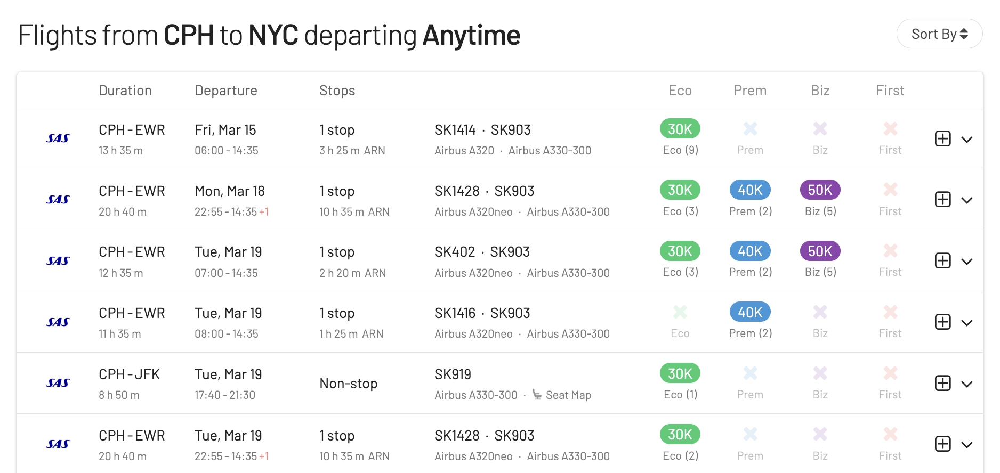

In addition, you can also tap anywhere on the flight to display more details in an expanded view, such as aircraft type, and even [get the current seat maps](https://blog.awardfares.com/seatmaps-guide/) to see which seats are free versus occupied!

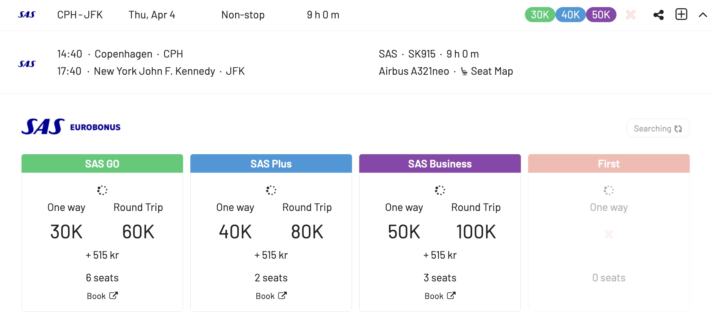

#### 5. Sort by Price or Stops

Whether you are exploring dates using the Timeline View or have selected a specific day, AwardFares will show you the available seats (with real-time data) within seconds in the result list below.

You can tap on the different header columns to sort the results by price. Use the **Eco**, **Prem**, **Biz**, and **First** class tags to find cheap awards across multiple dates, itineraries, and airlines.

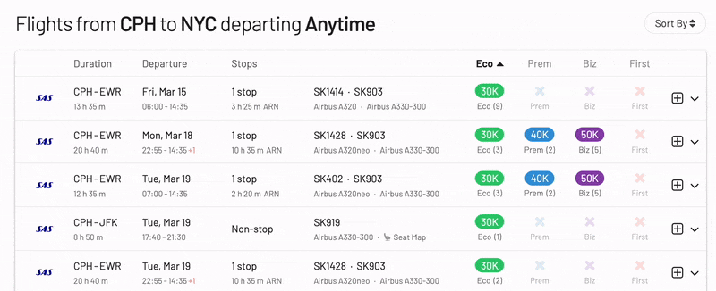

You can also tap on the **Stops** header to display the shortest trips first (among similarly priced flights)

#### 6. Book on the SAS EuroBonus Portal

Once you have identified the flights you want (or built an itinerary using our [Journey Planner](https://blog.awardfares.com/journey-planner/)), go to the EuroBonus portal on SAS website and proceed with the booking.

### Booking Star Alliance Flights

#### 1. Under *Airlines*, select **Star Alliance only**

From now on, you will only see available award seats operated by Star Alliance partners on the results list. You will also see SAS results unless you exclude it from the results explicitly.

#### 2. Add a Route

In the **Origin** and **Destination** fields, add one or more airports to search for flights between those locations. AwardFares will search for award flights regardless of the number of stops. You can use the **Stops** filter to only search for direct/non-stop flights.

In the example below, we search for flights [between Copenhagen and New York](https://awardfares.com/search?CPH.area:NYC.;a:SK;z:sas). Note that we use the metropolitan area codes **NYC** to get results to and from any airport in New York (JFK, EWR, LGA).

#### 4. Explore dates

If you have a particular date in mind, add it by tapping on the **Calendar** field.

Alternatively, you can use AwardFares **Timeline View** to explore the seat availability on different dates. The Timeline View displays how many seats are available for each day of the week/month. The bars are color-coded, so it's easy to distinguish between cabin classes (Economy, Business, First). You can also trigger new searches by tapping the refresh icon underneath each day.

In addition, you can also tap anywhere on the flight to display more details in an expanded view, such as aircraft type, and even [get the current seat maps](https://blog.awardfares.com/seatmaps-guide/) to see which seats are free versus occupied!

#### 5. Sort by Price or Stops

Whether you are exploring dates using the Timeline View or have selected a specific day, AwardFares will show you the available seats (with real-time data) within seconds in the result list below.

You can tap on the different header columns to sort the results by price. Use the **Eco**, **Prem**, **Biz**, and **First** class tags to find cheap awards across multiple dates, itineraries, and airlines.

You can also tap on the **Stops** header to display the shortest trips first (among similarly priced flights)

##### Cheapest Award Flights in Economy & Premium Economy

In this case, we want to understand the cheapest days to fly in Economy Class using United MileagePlus miles from New York to London.

With the Timeline View, we see there are plenty of available seats. We tap on the **Eco** column and sort award fights by price in Economy Class.

AwardFares will show you all available seats sorted by price, and then by date.

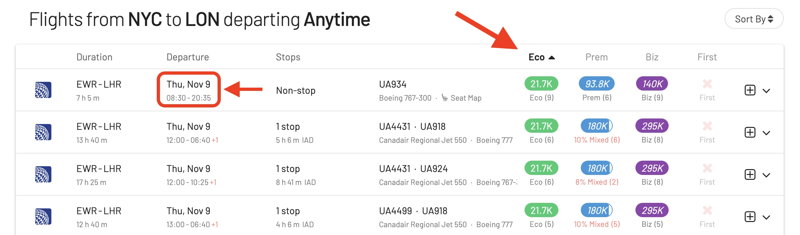

As we see, the cheapest flights start on November 9th, with multiple options. You can tap the anywhere on the flight to show the detailed view.

In this case, we see that a *saver* award in Economy is just 21.7k miles plus USD 5.6 in taxes, and there are over nine seats available.

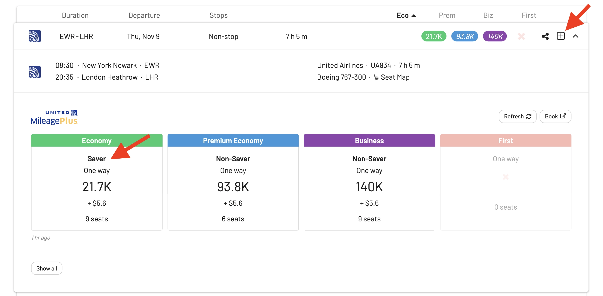

Similarly, you can explore other options (nonstop and with stopovers) going back to the result list.

##### Cheapest Award Flights in Premium Economy

Similarly, you can explore other options (nonstop and with stopovers) by returning to the result list.

We can repeat the process but now tap on the **Prem** column. Now, AwardFares will sort results based on the prices for the Premium Economy cabin.

As we can see, this cabin's cheapest options start on October 18th. All the options include at least one stopover, and most itineraries are mixed-cabin (which means there is at least one segment in another cabin, such as Economy).

By skimming through the results, you can quickly identify the most convenient options at this price point (50k miles).

You can also keep scrolling to find more dates or use the filters to exclude mixed cabin itineraries.

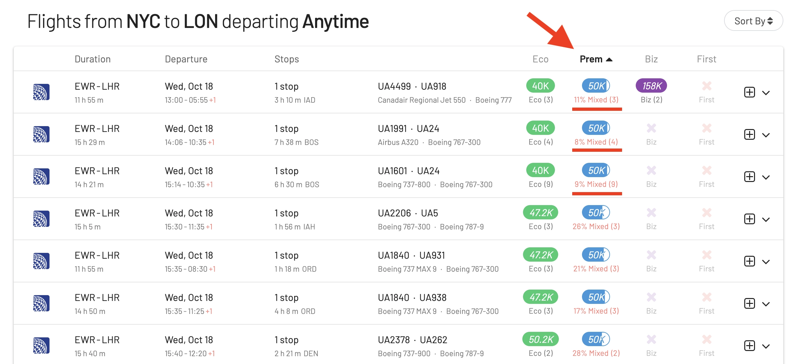

##### Cheapest Award Flights in Business & First Class

Similarly, by tapping the **Biz** header, flights will be sorted by price in the Business Class cabin. In this case, we see plenty of seats at this price point (80k miles) almost daily.

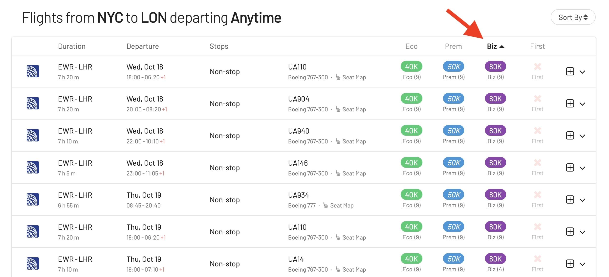

#### 6. Book on the EuroBonus Star Alliance Portal

Once you have identified the flights you want go to the airline's website and make the booking. Remember that some of these itineraries are not bookable online for specific programs (e.g., mixed-cabin awards on SAS EuroBonus). In those situations, you will need to call their service center.

## Become an EuroBonus Pro

You can [try AwardFares for free](https://awardfares.com/). We are rolling out new features and improvements regularly, so [sign up for our monthly newsletter](https://awardfares.com/newsletter) to stay on top of the latest news, announcements, and pro tips.

With our [Gold and Diamond tiers](https://awardfares.com/pricing), you can access premium features such as unlimited daily searches, alerts, seat maps, flight schedules, and more!

Our guides have all the information you need to be a pro travel hacker and explore the world on points. Here are some related posts you might enjoy:

- [Booking United Flights with EuroBonus Points No Longer an Option?](https://blog.awardfares.com/united-stops-working-with-eurobonus/)
- [SAS Will Leave Star Alliance! Here’s What To Do Next](https://blog.awardfares.com/sas-acquisition/)
- [SAS EuroBonus Conscious Traveler Takes Off In 2024: Greener Flying, Greater Rewards](https://blog.awardfares.com/sas-eurobonus-conscious-traveler/)
- [7 Benefits Of SAS Joining SkyTeam (The Bright Side)](https://blog.awardfares.com/sas-and-skyteam/)

 