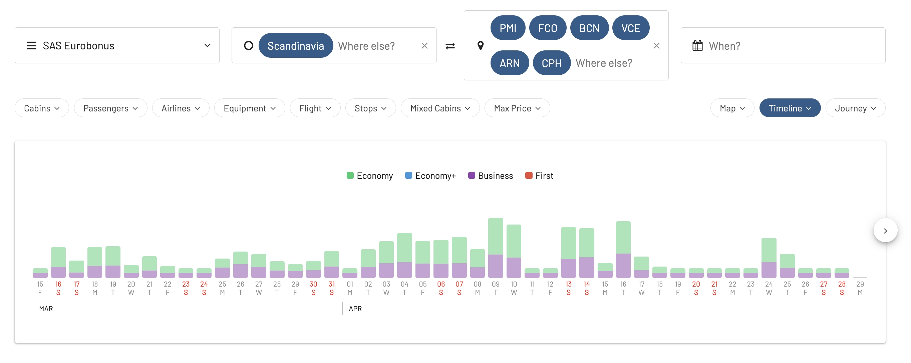
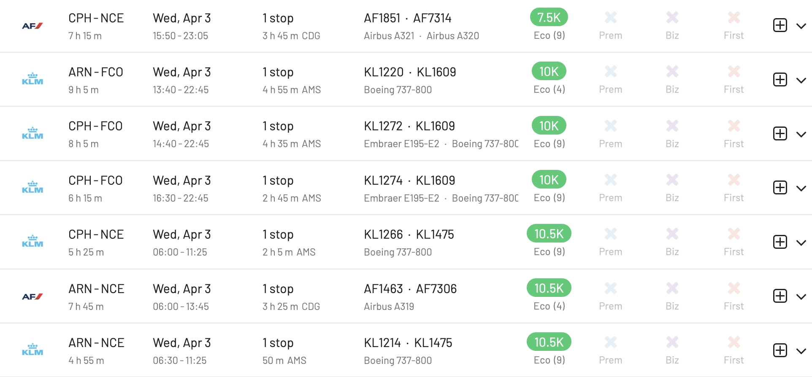

Easter is a time of renewal and exploration, and what better way to celebrate than by using those hard-earned miles for a springtime getaway? If you haven't booked or planned anything yet, there's still plenty of opportunities out there, as we see in AwardFares.

From European getaways to the sunny shores of the Caribbean, each frequent flyer program offers unique destinations that get popular every year. Here's a look at some of the most popular Easter destinations for each loyalty program.

## Popular Easter Destinations to Book with Miles and Points

### SAS EuroBonus - From 10k Points

* [**Mallorca, Spain**](https://awardfares.com/search?.PMI.;z:sas) - Soak up the sun in charming Mediterranean villages rich in history.
* [**Rome, Italy**](https://awardfares.com/search?.FCO.;z:sas) - Witness the grandeur of the Colosseum and Vatican City during the festive spirit.
* [**Copenhagen, Denmark**](https://awardfares.com/search?.CPH.;z:sas) - Explore the enchanting streets and canals of Copenhagen, bursting with spring colors.
* [**Paris, France**](https://awardfares.com/search?.CDG.;z:sas) - A classic destination for EuroBonus members, offering romance and beauty in the spring.
* [**Stockholm, Sweden**](https://awardfares.com/search?.ARN.;z:sas) - Visit the capital's historic sites and enjoy Easter traditions.
* [**Oslo, Norway**](https://awardfares.com/search?.OSL.;z:sas) - Discover Norway's natural beauty with a springtime visit to its capital.
* [**Helsinki, Finland**](https://awardfares.com/search?.HEL.;z:sas) - Experience the unique blend of Finnish culture and nature in spring.

### FlyingBlue (Air France and KLM) - From 29k Miles

* [**Amsterdam, Netherlands**](https://awardfares.com/search?.AMS.;z:flyingblue) - Enjoy the tulip season in full bloom with a visit to the Keukenhof gardens.
* [**Paris, France**](https://awardfares.com/search?.PAR.;z:flyingblue) - Immerse yourself in the art and culture of the City of Light.
* [**Nice, France**](https://awardfares.com/search?.NCE.;z:flyingblue) - Bask in the Mediterranean sun along the French Riviera.
* [**Rome, Italy**](https://awardfares.com/search?.FCO.;z:flyingblue) - Experience Easter traditions in the heart of the Catholic world.
* [**Barcelona, Spain**](https://awardfares.com/search?.BCN.;z:flyingblue) - Explore Gaudi's architectural marvels and enjoy the Mediterranean climate.

### AAdvantage (American Airlines) -

* [**Cancun, Mexico**](https://awardfares.com/search?.CUN.;z:aadvantage) - Soak up the sun on the beautiful beaches of Cancun.
* [**London, England**](https://awardfares.com/search?.LON.;z:aadvantage) - Visit historic sites and enjoy spring in one of the world's most vibrant cities.
* [**Dublin, Ireland**](https://awardfares.com/search?.DUB.;z:aadvantage) - Join the lively Easter celebrations and explore Irish culture.
* [**Honolulu, Hawaii**](https://awardfares.com/search?.HNL.;z:aadvantage) - Experience island paradise with a tropical Easter getaway.
* [**Tokyo, Japan**](https://awardfares.com/search?.TYOt.;z:aadvantage) - Witness the breathtaking beauty of cherry blossom season.

### United MileagePlus

* [**San Francisco, California**](https://awardfares.com/search?.SFO.;z:united) - Enjoy the city's iconic sites and springtime festivals.
* [**New York City, New York**](https://awardfares.com/search?.NYC.;z:united) - Experience the Easter Parade and springtime in Central Park.
* [**London, England**](https://awardfares.com/search?.LON.;z:united) - Explore the historic and cultural sights of London in spring.
* [**Sydney, Australia**](https://awardfares.com/search?.SYD.;z:united) - Enjoy autumn in Sydney, with its mild weather and vibrant festivals.
* [**Paris, France**](https://awardfares.com/search?.PAR.;z:united) - Visit the romantic capital of the world, blooming with spring flowers.

### Delta SkyMiles

* [**Amsterdam, Netherlands**](https://awardfares.com/search?.AMS.;z:delta) - Experience the tulip season and vibrant city life.
* [**Atlanta, Georgia**](https://awardfares.com/search?.ATL.;z:delta) - Enjoy unique Easter celebrations.
* [**New York City, New York**](https://awardfares.com/search?.NYC.;z:delta) - Catch the Easter Parade and enjoy the city's springtime attractions.
* [**Rome, Italy**](https://awardfares.com/search?.FCO.;z:delta) - Dive into history and witness Easter traditions.
* [**Paris, France**](https://awardfares.com/search?.PAR.;z:delta) - Revel in the beauty of Paris in the spring, a perennial favorite.

### Aeroplan (Air Canada)

* [**Vancouver, Canada**](https://awardfares.com/search?.YVR.;z:aeroplan) - Enjoy the outdoors and beautiful spring weather.
* [**Toronto, Canada**](https://awardfares.com/search?.area:YTO.;z:aeroplan) - Explore Canada's largest city and its multicultural Easter celebrations.
* [**Montreal, Canada**](https://awardfares.com/search?.area:YMQ.;z:aeroplan) - Experience the unique blend of French and English cultures.
* [**London, England**](https://awardfares.com/search?.area:LON.;z:aeroplan) - Take in the historic sites and spring scenery.

### Alaska Mileage Plan

* [**Seattle, Washington**](https://awardfares.com/search?.SEA.;z:alaska) - Discover the city's natural beauty and urban attractions.
* [**San Diego, California**](https://awardfares.com/search?.SAN.;z:alaska) - Enjoy the warm weather, beaches, and springtime events.
* [**Honolulu, Hawaii**](https://awardfares.com/search?.HNL.;z:alaska) - Escape to paradise and celebrate Easter with a tropical twist.
* [**Mexico City, Mexico**](https://awardfares.com/search?.MEX.;z:alaska) - Delve into the rich culture and history of Mexico's capital.
* [**Portland, Oregon**](https://awardfares.com/search?.PDX.;z:alaska) - Enjoy the blooming beauty and unique culture of Portland in spring.

### JetBlue TrueBlue

* [**Nassau, Bahamas**](https://awardfares.com/search?.NAS.;z:jetblue) - Dive into the clear blue waters and enjoy the white sandy beaches of the Bahamas.
* [**San Juan, Puerto Rico**](https://awardfares.com/search?.SJU.;z:jetblue) - Explore the rich history and vibrant culture of this Caribbean gem.
* [**Orlando, Florida**](https://awardfares.com/search?.MCO.;z:jetblue) - Ideal for families looking to spend Easter with their favorite theme park characters.
* [**New York City, New York**](https://awardfares.com/search?.NYC.;z:jetblue) - Experience the bustling city life with spring in full bloom.
* [**Los Angeles, California**](https://awardfares.com/search?.LAX.;z:jetblue) - Enjoy the diverse culture, beautiful beaches, and springtime events in L.A.
* [**Havana, Cuba**](https://awardfares.com/search?.HAV.;z:jetblue) - Immerse yourself in the rich cultural heritage and historic landmarks of Havana.
* [**Cancun, Mexico**](https://awardfares.com/search?.CUN.;z:jetblue) - A popular destination for those seeking both ancient ruins and modern beach resorts.
* [**Boston, Massachusetts**](https://awardfares.com/search?.BOS.;z:jetblue) - Discover the city's rich history and enjoy the Easter festivities.
* [**Fort Lauderdale, Florida**](https://awardfares.com/search?.FLL.;z:jetblue) - Gateway to the Everglades, offering sunny beaches and water sports.
* [**Lima, Peru**](https://awardfares.com/search?.LIM.;z:jetblue) - Experience the culinary delights and historic wonders of the Peruvian capital.

### Virgin Atlantic Flying Club

* [**London, England**](https://awardfares.com/search?.area:LON.;z:flyingclub) - Explore the historic streets, parks, and Easter traditions in the UK's capital.
* [**Barbados**](https://awardfares.com/search?.BGI.;z:flyingclub) - Enjoy the sun-soaked beaches and vibrant culture of this Caribbean paradise.
* [**Shanghai, China**](https://awardfares.com/search?.area:SHA.;z:flyingclub) - Dive into the bustling metropolis known for its unique blend of modern and traditional.
* [**Delhi, India**](https://awardfares.com/search?.DEL.;z:flyingclub) - Experience the colors, smells, and sounds of Delhi during the spring season.
* [**Los Angeles, California**](https://awardfares.com/search?.LAX.;z:flyingclub) - From Hollywood to Santa Monica, L.A. offers diverse Easter experiences.
* [**Johannesburg, South Africa**](https://awardfares.com/search?.JNB.;z:flyingclub) - Discover the wildlife and rich history of South Africa's biggest city.
* [**Dubai, UAE**](https://awardfares.com/search?.DXB.;z:flyingclub) - Marvel at the futuristic skyline and luxury shopping destinations.
* [**Hong Kong**](https://awardfares.com/search?.HKG.;z:flyingclub) - Enjoy the vibrant street markets, lush landscapes, and festive atmosphere.
* [**Cape Town, South Africa**](https://awardfares.com/search?.DXB.;z:flyingclub) - Experience the beauty of Table Mountain and the city's unique culture.

## Want More Award Travel Intel?

You can [try AwardFares for free](https://awardfares.com/). We are rolling out new features and improvements regularly, so [sign up for our monthly newsletter](https://awardfares.com/newsletter) to stay on top of the latest news, announcements, and pro tips.

With our [Gold and Diamond tiers](https://awardfares.com/pricing), you can access premium features such as unlimited daily searches, alerts, seat maps, flight schedules, and more!

## Read More

Our guides have all the information you need to be a pro travel hacker and explore the world on points. Here are some related posts you might enjoy:

- [How To Find Cheap Award Flights And Identify Good Redemptions (Step-by-step)](https://blog.awardfares.com/how-to-find-cheap-award-flights/)
- [Seat Maps: Getting The Perfect Seat Even Before Booking](https://blog.awardfares.com/seatmaps-guide/)
- [Demystifying Award Charts: All You Need To Know (2024)](https://blog.awardfares.com/demystifying-award-charts/)
- [Ultimate Guide to Award Release Dates](https://blog.awardfares.com/ultimate-guide-to-award-release-dates)