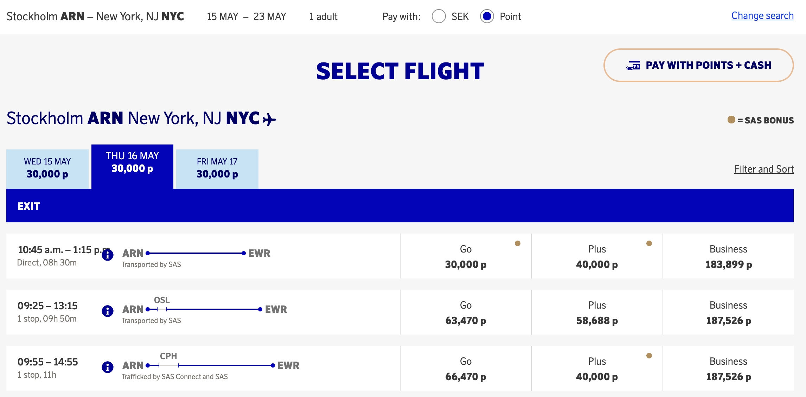
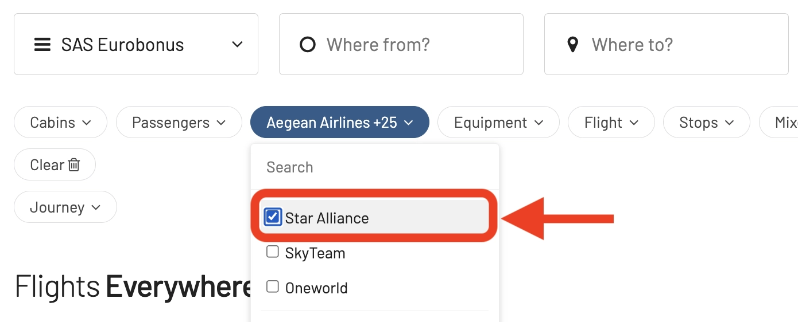

I dette år markerer et kæmpe spring for Scandinavian Airlines, især for SAS EuroBonus-medlemmer. Flyselskabet vil blive overtaget, blandt andre, af Air France-KLM, forlader Star Alliance (planlagt til 2. kvartal 2024) og tilslutter sig SkyTeam øjeblikkeligt! Dette betyder, at spillet for hyppige rejsende vil ændre sig meget snart: præmieflights, som du kan indløse ved brug af SAS EuroBonus-point, vil være forskellige for altid.

Hvordan forbereder man sig til overgangen? Bare rolig – vi har dig dækket. Det er derfor, vi har forberedt dette indlæg som den ultimative guide til brug af SAS EuroBonus-point. Hensigten er at hjælpe dig med at finde de bedste (gratis) flyrejser på SAS og Star Alliance, før flyselskabet forlader og i sidste ende på SkyTeam-partnere, når flyselskabet træder ind i den nye alliance og integreres med disse partnere.

  TID TIL Q2 2024

### I dette indlæg

- [SAS Overgang til SkyTeam (Vores tanker)](#sas-overgang-til-skyteam-vores-tanker)
- [Sådan finder du billige EuroBonus-præmieflights (Trin for trin)](#sådan-finder-du-billige-eurobonus-præmieflights-trin-for-trin)
- [Bliv en EuroBonus Pro](#bliv-en-eurobonus-pro)

## SAS Overgang til SkyTeam (Vores tanker)

Der er endnu ikke nogen officielle meddelelser om, hvordan EuroBonus-programmet vil ændre sig, når overtagelsen sker. Selvom der er et scenarie, hvor EuroBonus lukker ned, og Flying Blue bliver SAS's nye officielle loyalitetsprogram, er betingelserne for, at dette sker, langt fra opfyldte. Hvis det er tilfældet, vil det ikke være på horisonten i 2024.

I stedet giver det fra et teknisk perspektiv mere mening, at flyselskabet(tene) tager mere gradvise skridt, indtil nye ændringer implementeres. Her er nogle af vores tanker om forskellige områder fra vores ydmyge perspektiv som teknologer og erfaring som rejsende.

### EuroBonus Award Chart

Præmietabellerne viser, hvor mange point du har brug for en gratis flyrejse. På SAS-flyvninger kan flyselskabet justere tallene (bump dem op), hvilket gør flyvninger dyrere. Disse devalueringer er nemme at gøre og sker typisk med kort varsel (træder i kraft måneden efter eller sådan).

Pr. i dag viser tabellen nedenfor, hvor mange EuroBonus-point du ville have brug for en enkeltrejse med SAS og Widerøe, eksklusive skatter og gebyrer.

Den del af tabellen for Star Alliance vil blive fjernet øjeblikkeligt, da indløsninger vil blive stoppet med det samme. En ny tabel for indløsninger på SkyTeam-partnere bør komme samtidigt eller snart, afhængigt af hvor hurtigt de implementerer indløsninger på disse partnere.

Tabellen nedenfor viser, hvor mange EuroBonus-point du ville have brug for en returrejse på Star Alliance-flyselskaber pr. i dag, eksklusive skatter og gebyrer pålagt af flyselskabet. Prisen i point afhænger af din destination og rejsklasse.

*Du kan tjekke den fulde tabel og [alle andre til/fra kombinationer ud over Europa her](https://www.flysas.com/en/eurobonus/points/fly-with-points/star-alliance-point-chart/).*

EuroBonus [præmietabellen er zonebaseret](https://blog.awardfares.com/demystifying-award-charts/), og dette aspekt forventes ikke at ændre sig i 2024. Mens de fleste programmer skifter til dynamisk prissætning, annoncerer flyselskaber typisk betydelige ændringer som disse med 4-6 måneders varsel til deres medlemmer. Hovedsageligt for at undgå at ødelægge Elite Status kvalifikationsvinduer og for at have mere tid til planlægning.

[Flying Blue (Air France-KLM)](https://blog.awardfares.com/introducing-flying-blue/) har for nylig vedtaget dynamisk prissætning, så det er sandsynligt, at hvis EuroBonus opretholdes som et separat program, vil det følge efter.

### Optjening af EuroBonus-point

- **På SAS**: Ingen ændringer på kort sigt.

- **På Star Alliance-partnere**: Vær forberedt på at stoppe med at optjene point for flyvninger på Star Alliance-flyselskaber, så snart den nye aftale med SkyTeam træder i kraft.

- **På SkyTeam-partnere**: I et ideelt scenarie, når SAS officielt er en del af SkyTeam, vil det være muligt at optjene point på partnerflyvninger med det samme. Hold på, det kunne være mere ligetil. Implementering af optjening og indløsninger tager tid, måneder og undertiden endda år.

Vi har allerede set noget integration mellem SAS og Delta, når der bookes billetter med indtægter, så ændringerne kan ske tidligere for betydelige partnere som DL, Air France og KLM.

### EuroBonus-præmiesøgeportal

- **For SAS-flyvninger**: Sandsynligvis det samme i starten. Som vi allerede kender det.

- **For indløsninger på Star Alliance**: Disse vil blive slukket øjeblikkeligt efter SAS tilslutter sig SkyTeam. Medlemmer vil ikke længere kunne søge og indløse for flyvninger på Lufthansa, ANA, EVA Air, Thai Airways.

- **For indløsninger på SkyTeam-partnere**: Ikke ved lanceringen, men vi har håb om, at en portal vil dukke op for SkyTeam-flyvninger i løbet af 2. og 3. kvartal, i det mindste for en håndfuld partnere.

### Udgivelsesdatoer for Præmier

Mens den generelle tidsramme på 330-359 dage sandsynligvis gælder, vil specifikke udgivelsesdatoer for EuroBonus-medlemmer afhænge af, hvordan SAS og SkyTeam-flyselskaber integrerer deres loyalitetsprogrammer.

Vi vil fortsætte med at overvåge situationen og opdatere vores [Ultimative Guide til Udgivelsesdatoer for Præmier](https://blog.awardfares.com/ultimate-guide-to-award-release-dates/) i overensstemmelse hermed.

## Sådan finder du billige EuroBonus-præmieflights (Trin for trin)

### Booking af SAS-flyvninger

#### 1. Gå til [AwardFares](https://awardfares.com/signup)

At oprette en konto er valgfrit, men det er også gratis, og det giver dig adgang til flere funktioner. Sørg for at [oprette en her](https://awardfares.com/signup).

#### 2. Vælg **EuroBonus** som Frequent Flyer-program

Tryk på *Loyalty Program*-feltet og vælg SAS EuroBonus

#### 3. Under *Airlines*, skal du vælge **SAS only**

Fra nu af vil du kun se tilgængelige præmiesæder opereret af SAS på resultatslisten.

#### 4. Tilføj en rute

I **Origin** og **Destination**-felterne tilføjer du en eller flere lufthavne for at søge efter flyvninger mellem disse lokationer. AwardFares vil søge efter præmieflights uanset antallet af stop. Du kan bruge **Stops**-filteret til kun at søge efter direkte/non-stop flyvninger.

I eksemplet nedenfor søger vi efter flyvninger mellem [København og New York](https://awardfares.com/search?CPH.area:NYC.;a:SK;z:sas). Bemærk, at vi bruger de metropolitane områdecoder NYC for at få resultater til og fra enhver lufthavn i New York (JFK, EWR, LGA).

#### 5. Udforsk datoer

Hvis du har en bestemt dato i tankerne, tilføj den ved at trykke på **Calendar**-feltet.

Alternativt kan du bruge AwardFares' Tidslinjevisning (**Timeline View**) til at udforske sæde tilgængeligheden på forskellige datoer. Tidslinjevisningen viser, hvor mange sæder der er tilgængelige for hver dag i ugen/måneden. Barerne er farvekodede, så det er let at skelne mellem kabineklasser (Økonomi, Business, Første klasse). Du kan også udløse nye søgninger ved at trykke på opdateringsikonet under hver dag.

#### 6. Sorter efter Pris eller Stop

Uanset om du udforsker datoer ved hjælp af Tidslinjevisningen eller har valgt en specifik dag, vil AwardFares vise dig de tilgængelige sæder (med realtidsdata) inden for sekunder i resultatlisten nedenfor.

Du kan trykke på de forskellige kolonneoverskrifter for at sortere resultaterne efter pris. Brug **Eco**, **Prem**, **Biz** og **First**-klassetags for at finde billige præmier på tværs af flere datoer, ruter og flyselskaber.

Du kan også trykke på **Stops**-overskriften for at vise de korteste ture først (blandt lignende prissatte flyvninger).

#### 7. Book på SAS EuroBonus Portal

Når du har identificeret de flyvninger, du ønsker (eller har bygget en rejseplan ved hjælp af vores [Journey Planner](https://blog.awardfares.com/journey-planner/)), gå til EuroBonus-portalen på SAS' hjemmeside og fortsæt med bookingen.

-------

### Booking af Star Alliance-flyvninger

#### 1. Under *Airlines*, vælg **Star Alliance only**

Fra nu af vil du kun se tilgængelige præmiesæder opereret af Star Alliance-partnere på resultatslisten. Du vil også se SAS-resultater, medmindre du udtrykkeligt udelukker det fra resultaterne.

#### 2. Tilføj en rute

Samme som ovenfor, brug **Origin** og **Destination**-felterne til at tilføje en eller flere lufthavne for at søge efter flyvninger mellem disse lokationer.

I eksemplet nedenfor søger vi efter flyvninger mellem [Boston og München](https://awardfares.com/search?BOS.MUC.;a:A3,AC,AI,AV,BR,CA,CM,ET,LH,LO,LX,MS,NH,NZ,OS,OU,OZ,SA,SK,SN,SQ,TG,TK,TP,UA,ZH;z:sas).

#### 3. Udforsk og Sorter Resultater

Uanset om du udforsker datoer ved hjælp af Tidslinjevisningen eller har valgt en specifik dag, vil AwardFares vise dig de tilgængelige sæder (med realtidsdata) inden for sekunder i resultatlisten nedenfor.

Tryk på de forskellige kolonneoverskrifter for klasser (**Eco**, **Prem**, **Biz** og **First**) for at sortere resultaterne efter pris.

Du kan også trykke på **Stops**-overskriften for at vise de korteste ture først (blandt lignende prissatte flyvninger).

**Billigste præmieflights i Business & First Class**

AwardFares' hurtige sorteringsfunktion er meget nyttig, når du forsøger at booke premiumkabiner som Business og First, især når præmietabellerne bruger dynamisk prissætning. Dette kan være dit hemmelige våben til at maksimere værdien af dine EuroBouns-point, hvis det skifter til en dynamisk prissætningsordning, som Flying Blue.

#### 6. Book på EuroBonus Star Alliance Portal

Når du har identificeret de flyvninger, du ønsker, gå til SAS' hjemmeside, [log ind og vælg Star Alliance Bonus Trips](https://www.flysas.com/nl-en/eurobonus/star-alliance-award-trips/) for at fortsætte med bookingen. Husk, at nogle af disse rejseplaner ikke kan bookes online for specifikke programmer (f.eks. blandet kabinepræmier). I disse situationer skal du ringe til SAS' servicecenter.

## Bliv en EuroBonus Pro

Du kan [prøve AwardFares gratis](https://awardfares.com/). Vi lancerer løbende nye funktioner og forbedringer, [så tilmeld dig vores månedlige nyhedsbrev](https://awardfares.com/newsletter) for at holde dig opdateret med de seneste nyheder, meddelelser og pro-tips.

Med vores [Gold- og Diamond-niveauer](https://awardfares.com/pricing) kan du få adgang til premiumfunktioner såsom ubegrænsede daglige søgninger, alarmer, sædeoversigter, flyplaner og meget mere!

Vores guider indeholder al den information, du har brug for at blive en pro-rejsehacker og udforske verden med point. Her er nogle relaterede indlæg, du måske vil nyde:

- [Booking United Flights with EuroBonus Points No Longer an Option?](https://blog.awardfares.com/united-stops-working-with-eurobonus/)
- [SAS Will Leave Star Alliance! Here’s What To Do Next](https://blog.awardfares.com/sas-acquisition/)
- [SAS EuroBonus Conscious Traveler Takes Off In 2024: Greener Flying, Greater Rewards](https://blog.awardfares.com/sas-eurobonus-conscious-traveler/)
- [7 Benefits Of SAS Joining SkyTeam (The Bright Side)](https://blog.awardfares.com/sas-and-skyteam/)

