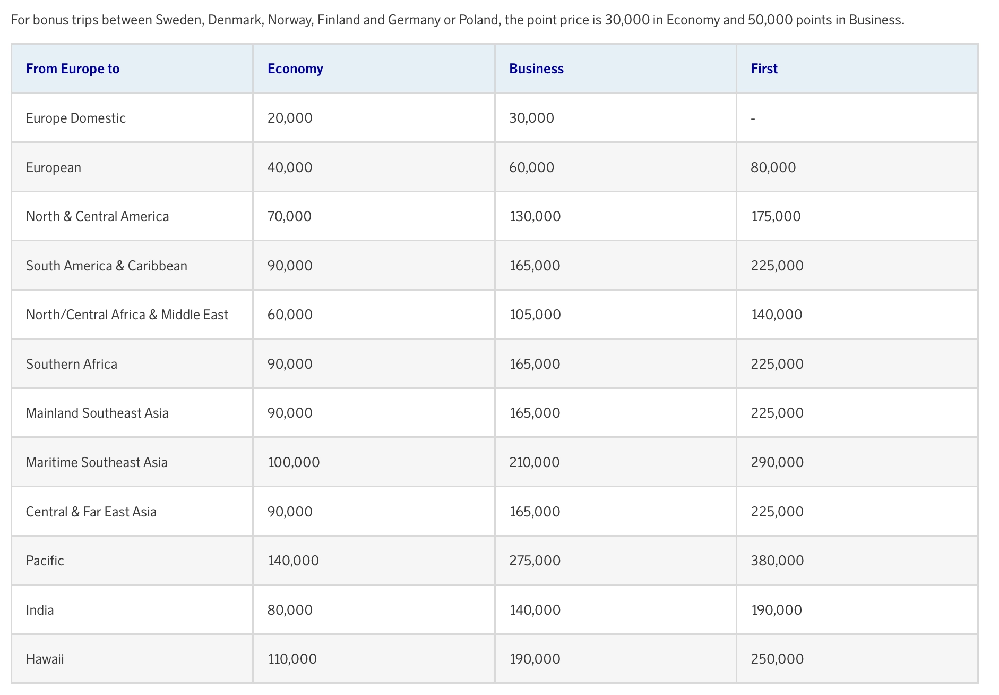
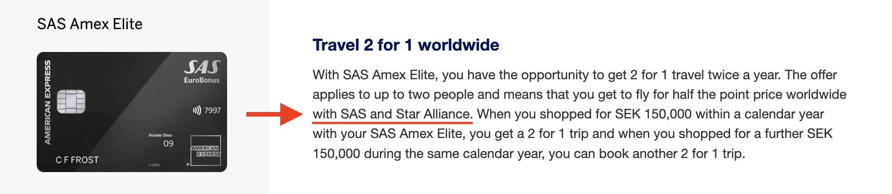
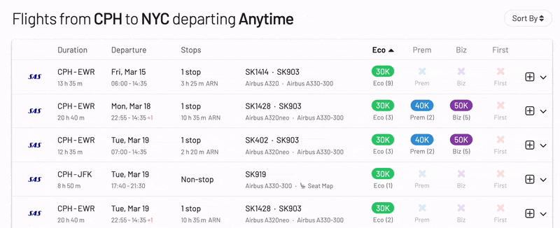
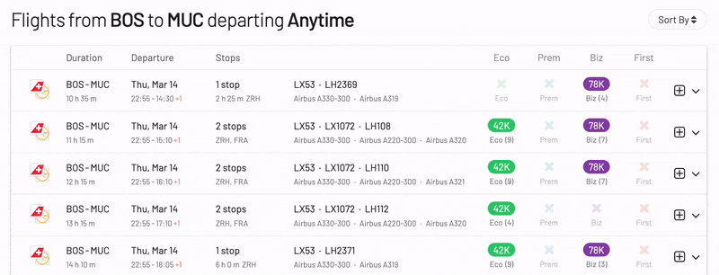

Dette året markerer et stort steg for Scandinavian Airlines, spesielt for SAS EuroBonus-medlemmer. Flyselskapet vil bli kjøpt opp, av blant annet Air France-KLM, og forlate Star Alliance for så å bli med i SkyTeam fra 1. september 2024. Dette betyr at spillet for hyppige reisende vil endre seg veldig snart: award-flyvninger du kan innløse ved å bruke SAS EuroBonus-poeng vil være annerledes for alltid.

**Hvordan forbereder jeg meg til overgangen?** Ikke bekymre deg - vi har alltid ryggen din. Derfor har vi utarbeidet dette innlegget som den ultimate guiden for å bruke SAS EuroBonus-poeng. Hensikten er å hjelpe deg med å finne de beste (gratis) flyvningene på SAS og Star Alliance før flyselskapet forlater, og deretter på SkyTeam-partnere når flyselskapet går inn i det nye alliansen og innlemmer seg med disse partnerne.

  TID TIL 2. KVARTAL 2024

### I Dette Innlegget

- [SAS’ overgang til SkyTeam (våre tanker)](#sas-overgang-til-skyteam-våre-tanker)
- [Slik finner du billige EuroBonus award-flyvninger (trinn for trinn)](#slik-finner-du-billige-eurobonus-award-flyvninger-trinn-for-trinn)
- [Bli en EuroBonus Pro](#bli-en-eurobonus-pro)

## SAS’ overgang til SkyTeam (våre tanker)

SAS publiserte nylig ny informasjon om overgangen fra Star Alliance til SkyTeam. De har bekreftet at EuroBonus-programmet ikke vil bli nedlagt (iallfall ikke for nå), og at Flying Blue ikke vil bli SAS sitt nye offisielle lojalitetsprogram.

Les [alle detaljene om kunngjøringen i dette innlegget](2024-03-17-eurobonus-guide.md).

### EuroBonus Award Chart

Award-tabellene viser hvor mange poeng du trenger for en gratis flyvning. På SAS-flyvninger kan flyselskapet justere tallene (øke dem), slik at flyvninger koster mer. Disse nedvurderingene er enkle å gjøre og skjer vanligvis med kort varsel (effektive måneden etter eller så).

Per i dag viser tabellen nedenfor hvor mange EuroBonus-poeng du trenger for en enveis flyvning med SAS og Widerøe, før skatter og avgifter.

Vær oppmerksom på at Star Alliance-delen av tabellen kan bli fjernet 1. september, da innløsninger med dem vil stoppe. En ny tabell for innløsninger hos SkyTeam-partnere bør komme samtidig eller snart.

Tabellen nedenfor viser hvor mange EuroBonus-poeng du vil trenge for en tur-retur-flyvning med Star Alliance-flyselskaper per i dag, ekskludert skatter og avgifter. Prisen i poeng avhenger av destinasjonen og reiseklassen.

Du kan sjekke den fulle tabellen [og alle andre til/fra-kombinasjoner utenfor Europa her](https://www.flysas.com/en/eurobonus/points/fly-with-points/star-alliance-point-chart/).

EuroBonus award chart [er sonedelt](https://blog.awardfares.com/demystifying-award-charts/), og det er lite sannsynlig at denne delen endrer seg i løpet av 2024. Mens de fleste programmer går over til dynamisk prissetting, kunngjør flyselskaper vanligvis betydelige endringer som disse med 4-6 måneders forvarsel til medlemmene sine. Grunnen til dette er hovedsakelig for å unngå å forstyrre kvalifiseringsvinduer for status og for å ha mer tid til planlegging.

[Flying Blue (Air France-KLM)](https://blog.awardfares.com/introducing-flying-blue/) tok nylig i bruk dynamisk prissetting, så det er sannsynlig at hvis EuroBonus beholdes som et eget program, vil det følge etter.

### Opptjening av EuroBonus-poeng

- **Hos SAS**: Ingen endringer på kort sikt.

- **Hos Star Alliance Partnere**: Vær forberedt på sannsynligvis å slutte å opptjene poeng for flyvninger med Star Alliance-flyselskaper så snart den nye avtalen med SkyTeam trer i kraft.

- **Hos SkyTeam Partnere**: I et ideelt scenario, når SAS offisielt blir en del av SkyTeam, er det mulig å opptjene poeng på partneres flyvninger umiddelbart. Men hold deg fast, det er sjeldent så enkelt! Implementering av opptjening av poeng, og innløsninger tar tid. Måneder og noen ganger, til og med år.

Vi har allerede sett noe integrasjon mellom SAS og Delta ved bestilling av billetter med inntekt, slik at endringene kan skje tidligere for de store partnerne som Delta Air Lines, Air France og KLM.

### EuroBonus Award Search Portal

- **SAS-bestillinger**: Sannsynligvis det samme i begynnelsen. Slik som vi allerede er vant med.

- **Star Alliance-bestillinger**: Det vil være mulig å bestille award-flyvninger på Star Alliance-flyselskaper ved å bruke poengene dine til 31. august, selv for reiser etter den datoen. Ingen nye Star Alliance award-bestillinger vil være mulige etter 31. august. Du kan ombooke eksisterende Star Alliance-awards (inntil 24 timer før avreise) frem til 31. august, selv om flyet ditt går etter 1. september. Avbestillinger vil følge de samme reglene som i dag, inntil 24 timer før avreise.

- **SkyTeam-bestillinger**: Du vil kunne bruke poengene dine til å bestille award-flyvninger på de fleste SkyTeam-flyselskaper fra 1. september og fremover. Reglene for ombooking og avbestilling av SkyTeam-awards reiser vil gjenspeile den eksisterende Star Alliance-policyen (24 timer før avreise). 

### Amex 2-for-1-voucher / Companion Tickets

For medlemmer i Norge og Sverige som har SAS Amex Elite, vil Amex 2-for-1-voucherne (companion tickets) fortsatt være gyldige, og du vil fortsatt kunne bruke voucherne til SAS Bonus-billetter. Du kan også bruke nye vouchere til Star Alliance Bonus-tur-bestillinger frem til 31. august 2024. Alle bonus bestillinger som er gjort ved hjelp av voucher vil forbli uendret og blir respektert.

Fra 1. september 2024 vil du kunne bruke Amex 2-for-1-voucherne dine på de fleste SkyTeam-flyselskaper.

Teksten på American Express-nettstedet forblir uendret. 

Hvis du har ubrukte vouchere og vurderer å fly med Star Alliance-fly, kan dette være et godt tidspunkt å samle bestillinger. For eksempel kan det være et godt tidspunkt å prøve ut kabiner som Lufthansa First, ANA The Room, osv.

### Utgivelsesdatoer for award-reiser

Mens den generelle tidsrammen på 330-359 dager sannsynligvis gjelder, vil spesifikke utgivelsesdatoer for EuroBonus-medlemmer avhenge av hvordan SAS og SkyTeam-flyselskaper integrerer lojalitetsprogrammene sine.

Vi vil fortsette å overvåke situasjonen og oppdatere vår [Ultimate Guide to Award Release Dates](https://blog.awardfares.com/ultimate-guide-to-award-release-dates/).

### EuroBonus-status og fordeler

Fra det øyeblikket SAS blir med i SkyTeam, vil EuroBonus Silver-medlemmer bli anerkjent som SkyTeam Elite-nivå, mens Gold- og Diamond-medlemmer vil bli anerkjent som Elite Plus. 

## Slik finner du billige EuroBonus award-flyvninger (trinn for trinn)

### Bestille SAS-fly

#### 1. Gå til [AwardFares](https://awardfares.com/signup)

Det er valgfritt å opprette en konto, men det er også gratis, og det gir deg tilgang til flere funksjoner. [Sørg for å registrere deg her](https://awardfares.com/signup).

#### 2. Velg **EuroBonus** som ditt fordelsprogram

Trykk på **Loyalty Program**-feltet og velg SAS EuroBonus

#### 3. Under *Airlines*, velg kun **SAS**

Fra nå av vil du bare se tilgjengelige award-seter operert av SAS på resultatlisten.

#### 4. Legg til en Rute

I **Origin** og **Destination**-feltene, legg til en eller flere flyplasser for å søke etter flyvninger mellom disse stedene. AwardFares vil søke etter award-flyvninger uavhengig av antall stopp. Du kan bruke **Stops**-filteret for å bare søke etter direkte/ikke direkte-flyvninger.

I eksempelet nedenfor søker vi etter flyvninger mellom [**København og New York**](https://awardfares.com/search?CPH.area:NYC.;a:SK;z:sas). Legg merke til at vi bruker metropolområdene NYC for å få resultater til og fra hvilken som helst flyplass i New York (JFK, EWR, LGA).

#### 4. Utforsk Datoer

Hvis du har en bestemt dato i tankene, legg den til ved å trykke på **Calendar**-feltet.

Alternativt kan du bruke AwardFares **Timeline View** for å utforske setetilgjengeligheten på forskjellige datoer. Timeline View viser hvor mange seter som er tilgjengelige for hver dag i uken/måneden. Stolpene er fargekodet, slik at det er enkelt å skille mellom kabinene (Økonomi, Business, Første klasse). Du kan også oppdatere søk ved å trykke på oppdateringsikonet under hver dag.

I tillegg kan du også trykke hvor som helst på flyvningen for å vise flere detaljer i en utvidet visning, for eksempel flytype, du kan til og med [få de nåværende setekartene](https://blog.awardfares.com/seatmaps-guide/) for å se hvilke seter som er ledig eller opptatt!

#### 5. Sorter etter pris eller stopp

Enten du utforsker datoer ved hjelp av Timeline View eller har valgt en bestemt dag, vil AwardFares vise de tilgjengelige setene (med sanntidsdata) innen få sekunder i resultatlisten nedenfor.

Du kan trykke på de forskjellige kolonnene for å sortere resultatene etter pris. Bruk **Eco**, **Prem**, **Biz**, og **First** klasse-merkene for å finne billige award-er over flere datoer, reiseruter og flyselskaper.

Du kan også trykke på **Stops** for å vise de korteste turene først (blant flyvninger med lignende pris).

#### 6. Bestill på SAS EuroBonus Portal

Når du har identifisert flyvningene du ønsker (eller bygget en reiserute ved hjelp av vår [Journey Planner](https://blog.awardfares.com/journey-planner/)), gå til EuroBonus-portalen på SAS-nettstedet og fortsett med bestillingen.

-------

### Bestille Star Alliance-flyvninger

#### 1. Under *Airlines*, velg kun**Star Alliance**

Fra nå av vil du bare se tilgjengelige award-seter operert av Star Alliance-partnere på resultatlisten. Du vil også se SAS-resultater med mindre du eksplisitt utelukker det fra resultatene.

#### 2. Legg til en Rute

Samme som ovenfor, bruk **Origin** og **Destination**-feltene for å legge til en eller flere flyplasser for å søke etter flyvninger mellom disse stedene.

I eksempelet nedenfor søker vi etter flyvninger mellom [Boston og München](https://awardfares.com/search?BOS.MUC.;a:A3,AC,AI,AV,BR,CA,CM,ET,LH,LO,LX,MS,NH,NZ,OS,OU,OZ,SA,SK,SN,SQ,TG,TK,TP,UA,ZH;z:sas).

#### 3. Utforsk og Sorter Resultater

Enten du utforsker datoer ved hjelp av **Timeline View** eller har valgt en bestemt dag, vil AwardFares vise de tilgjengelige setene (med sanntidsdata) innen få sekunder i resultatlisten nedenfor.

Trykk på de forskjellige hodekolonnene (**Eco**, **Prem**, **Biz** og **First**) for å sortere resultatene etter pris.

Du kan også trykke på **Stops** for å vise de korteste turene først (blant flyvninger med lignende pris).

**Billigste award-flyvninger i Business & First Class**

AwardFares' raske sorteringsfunksjon er veldig nyttig når du prøver å bestille premiumkabiner som Business og First, og spesielt når award-tabellene bruker dynamisk prissetting. Dette kan være ditt hemmelige våpen for å maksimere verdien av EuroBouns-poengene dine hvis det går over til dynamisk prissetting, som Flying Blue.

#### 4. Bestill på EuroBonus Star Alliance Portal

Når du har identifisert flyvningene går du til SAS-nettstedet, [logger inn og velg Star Alliance Bonus Trips](https://www.flysas.com/nl-en/eurobonus/star-alliance-award-trips/) for å fortsette med bestillingen. Husk at noen av disse reiserutene ikke kan bestilles på nettet for spesifikke programmer (f.eks. mixed-cabin awards). I slike situasjoner må du ringe SAS-service-senter.

## Bli en EuroBonus Pro

Du kan prøve [AwardFares gratis](https://awardfares.com/). Vi ruller ut nye funksjoner og forbedringer jevnlig, så [meld deg på vårt månedlige nyhetsbrev](https://awardfares.com/newsletter) for å holde deg oppdatert på de nyeste nyhetene, kunngjøringene og pro tipsene våre.

Med våre [Gold- og Diamond-nivåer](https://awardfares.com/pricing) får du tilgang til premiumfunksjoner som ubegrenset daglig søk, varsler, setekart, flytider og mer!

Våre guider har all informasjonen du trenger for å være en proff reisehacker og utforske verden med bruk av poeng. Her er noen relaterte innlegg du kanskje vil like:

- [Booking United Flights with EuroBonus Points No Longer an Option?](https://blog.awardfares.com/united-stops-working-with-eurobonus/)
- [SAS Will Leave Star Alliance! Here’s What To Do Next](https://blog.awardfares.com/sas-acquisition/)
- [SAS EuroBonus Conscious Traveler Takes Off In 2024: Greener Flying, Greater Rewards](https://blog.awardfares.com/sas-eurobonus-conscious-traveler/)
- [7 Benefits Of SAS Joining SkyTeam (The Bright Side)](https://blog.awardfares.com/sas-and-skyteam/)

