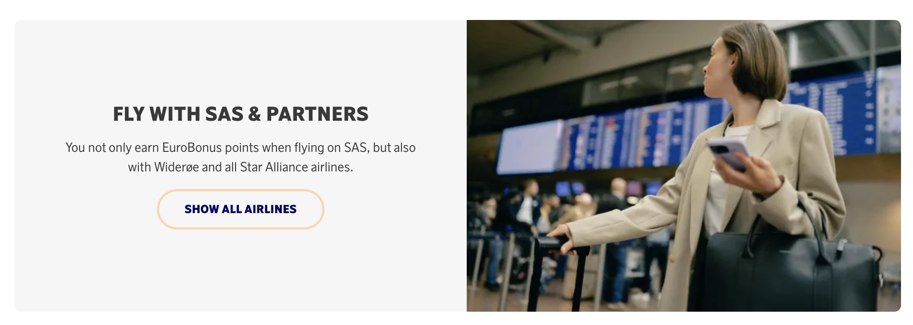
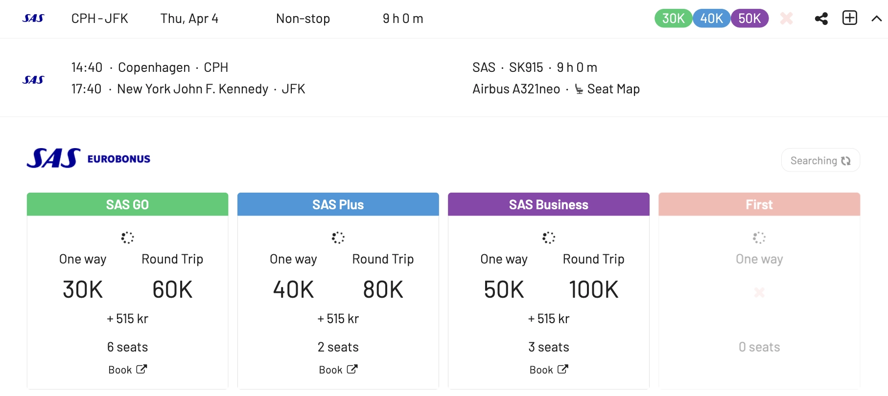

I dette året markerer et stort sprang for Scandinavian Airlines, spesielt for SAS EuroBonus-medlemmer. Flyselskapet vil bli kjøpt, blant annet, av Air France-KLM, forlater Star Alliance (planlagt for 2. kvartal 2024) og slutter seg til SkyTeam umiddelbart! Dette betyr at spillet for hyppige reisende vil endre seg veldig snart: prisflyvninger du kan innløse ved å bruke SAS EuroBonus-poeng vil være annerledes for alltid.

**Hvordan forberede seg på overgangen?** Ikke bekymre deg – vi har dekket deg. Det er derfor vi forberedte dette innlegget som den ultimate guiden til å bruke SAS EuroBonus-poeng. Hensikten er å hjelpe deg med å finne de beste (gratis) flyvningene på SAS og Star Alliance før flyselskapet forlater og, til slutt, på SkyTeam-partnere når flyselskapet går inn i den nye alliansen og integrerer med disse partnerne.

  TID TIL 2. KVARTAL 2024

### I Dette Innlegget

- [SAS Overgang til SkyTeam (Våre Tanker)](#sas-overgang-til-skyteam-våre-tanker)
- [Hvordan Finne Billige EuroBonus Prisflyvninger (Steg-for-steg)](#hvordan-finne-billige-eurobonus-prisflyvninger-steg-for-steg)
- [Når du har identifisert flyvningene du ønsker (eller bygget en reiserute ved hjelp av vår Journey Planner), gå til EuroBonus-portalen på SAS' nettsted og fortsett med bookingen.](#når-du-har-identifisert-flyvningene-du-ønsker-eller-bygget-en-reiserute-ved-hjelp-av-vår-journey-planner-gå-til-eurobonus-portalen-på-sas-nettsted-og-fortsett-med-bookingen)
- [Bli en EuroBonus Pro](#bli-en-eurobonus-pro)

## SAS Overgang til SkyTeam (Våre Tanker)

Det har ennå ikke vært noen offisielle kunngjøringer om hvordan EuroBonus-programmet vil endre seg når oppkjøpet skjer. Selv om det er ett scenario der EuroBonus legges ned og Flying Blue blir SASs nye offisielle lojalitetsprogram, er vilkårene for at dette skal skje langt fra å være oppfylt. Hvis så, vil det ikke være på horisonten for 2024.

I stedet, fra et teknisk ståsted, gir det mer mening at flyselskapet (eller flyselskapene) tar mer gradvise skritt til nye endringer blir implementert. Her er noen av våre tanker om forskjellige områder fra vårt ydmyke perspektiv som teknologer og erfaring som reisende.

### EuroBonus Award Chart

Pristabellene viser hvor mange poeng du trenger for en gratis flyvning. På SAS-flyvninger kan flyselskapet justere tallene (øke dem), noe som gjør flyvningene dyrere. Disse devalueringene er enkle å gjøre og skjer vanligvis på kort varsel (trår i kraft måneden etter eller så).

Per i dag viser tabellen nedenfor hvor mange EuroBonus-poeng du ville trenge for en enveisflyvning med SAS og Widerøe, eksklusive skatter og avgifter.

Star Alliance-delen av tabellen vil bli fjernet umiddelbart, ettersom innløsninger vil bli stoppet med en gang. En ny tabell for innløsninger på SkyTeam-partnere bør komme samtidig eller snart, avhengig av hvor raskt de implementerer innløsninger på disse partnerne.

Tabellen nedenfor viser hvor mange EuroBonus-poeng du ville trenge for en rundtur på Star Alliance-flyselskaper per i dag, eksklusive skatter og pålagte avgifter fra transportøren. Prisen i poeng avhenger av destinasjonen og reiseklassen.

Du kan sjekke hele tabellen og [alle andre til/fra-kombinasjoner utover Europa her](https://www.flysas.com/en/eurobonus/points/fly-with-points/star-alliance-point-chart/).

EuroBonus [pristabellen er basert på soner](https://blog.awardfares.com/demystifying-award-charts/), og dette aspektet vil sannsynligvis ikke endre seg i løpet av 2024. Mens de fleste programmer går over til dynamisk prissetting, pleier flyselskaper vanligvis å kunngjøre betydelige endringer som disse med 4-6 måneders varsel til sine medlemmer. Hovedsakelig for å unngå å rote til kvalifiseringsvinduene for Elite Status og for å ha mer tid til planlegging.

[Flying Blue (Air France-KLM)](https://blog.awardfares.com/introducing-flying-blue/) har nylig adoptert dynamisk prissetting, så det er sannsynlig at hvis EuroBonus opprettholdes som et separat program, vil det følge etter.

### Tjene EuroBonus Poeng

- **På SAS**: Ingen endringer på kort sikt.

- **På Star Alliance Partnere**: Vær forberedt på å stoppe å akkumulere poeng for flyvninger på Star Alliance-flyselskaper så snart den nye avtalen med SkyTeam trer i kraft.

- **På SkyTeam Partnere**: I et ideelt scenario, når SAS offisielt blir en del av SkyTeam, vil det være mulig å tjene poeng på partnerflyvninger med en gang. Vent litt, det kan være mer rett frem. Implementering av opptjening og innløsninger tar tid, måneder, og noen ganger til og med år.

Vi har allerede sett noe integrasjon mellom SAS og Delta når det gjelder booking av inntektsbilletter, så endringene kan skje raskere for viktige partnere som DL, Air France og KLM.

### EuroBonus Portal

- **For SAS-flyvninger**: Sannsynligvis det samme i begynnelsen. Samme som vi allerede kjenner.

- **På Star Alliance Partnere**: Disse vil bli slått av umiddelbart etter at SAS blir med i SkyTeam. Medlemmer vil ikke lenger kunne søke og innløse for flyvninger på Lufthansa, ANA, EVA Air, Thai Airways.

- **For Innløsninger på SkyTeam Partnere**: Ikke ved lanseringen, men vi håper at en portal vil dukke opp for SkyTeam-flyvninger i løpet av 2.-3. kvartal, i det minste for et utvalg av partnere.

### SAS Amex Companion Tickets

For innbyggere i Norge og kortinnehavere av SAS American Express Elite-kortet, gjenstår ett spørsmål: hvordan påvirker overgangen 2-for-1 voucherene som også er gyldige på Star Alliance-flyvninger?

Formuleringen på American Express-nettstedet forblir uendret (inntil flere detaljer er kjent).

Det er tryggere å anta at vouchers bare vil være brukbare på SAS-flyvninger fra det øyeblikket det blir med i SkyTeam. Som vi sa tidligere, er det uklart om/når innløsninger på SkyTeam-partnere blir tilgjengelige og om vouchers vil være brukbare på disse eller ikke.

Hvis du har ubrukte vouchers og ser på å fly med Star Alliance-flyselskaper, kan dette være et godt tidspunkt å konsolidere bookinger. For eksempel, kan det være en god anledning til å prøve kabiner som Lufthansa First, ANA The Room, osv.

### Award Release Dates

Mens den generelle tidsrammen på 330-359 dager sannsynligvis gjelder, vil spesifikke utgivelsesdatoer for EuroBonus-medlemmer avhenge av hvordan SAS og SkyTeam-flyselskapene integrerer sine lojalitetsprogrammer.

Vi vil fortsette å overvåke situasjonen og oppdatere vår [Ultimate Guide to Award Release Dates](https://blog.awardfares.com/ultimate-guide-to-award-release-dates/) deretter.

## Hvordan Finne Billige EuroBonus Prisflyvninger (Steg-for-steg)

### Booking av SAS-flyvninger

#### 1. Gå til [AwardFares](https://awardfares.com/signup)

Å opprette en konto er valgfritt, men det er også gratis, og det gir deg tilgang til flere funksjoner. Sørg for å [registrere deg for en her](https://awardfares.com/signup).

#### 2. Velg **EuroBonus** som Frequent Flyer-program

Trykk på **Loyalty Program** og velg SAS EuroBonus

#### 3. Under *Airlines*, velg **SAS only**

Fra nå av vil du kun se tilgjengelige bonusseter operert av SAS i resultatlisten.

#### 4. Legg til en Rute

I **Origin** og **Destination**-feltene, legg til en eller flere flyplasser for å søke etter flyvninger mellom disse stedene. AwardFares vil søke etter prisflyvninger uavhengig av antall stopp. Du kan bruke **Stops**-filteret for kun å søke etter direkte/non-stop-flyvninger.

I eksemplet nedenfor, søker vi etter flyvninger [mellom København og New York](https://awardfares.com/search?CPH.area:NYC.;a:SK;z:sas). Merk at vi bruker de metropolitiske områdekodene NYC for å få resultater til og fra hvilken som helst flyplass i New York (JFK, EWR, LGA).

#### 4. Utforsk Datoer

Hvis du har en spesifikk dato i tankene, legg den til ved å trykke på **Calendar**-feltet.

Alternativt kan du bruke AwardFares **Timeline View** for å utforske setetilgjengeligheten på forskjellige datoer. Tidslinjevisningen viser hvor mange seter som er tilgjengelige for hver dag i uken/måneden. Stolpene er fargekodet, så det er enkelt å skille mellom kabin klasser (Økonomi, Business, Første). Du kan også utløse nye søk ved å trykke på oppdateringsikonet under hver dag.

I tillegg kan du også trykke hvor som helst på flyvningen for å vise flere detaljer i en utvidet visning, som flytype, og til og med [få de nåværende setekartene](https://blog.awardfares.com/seatmaps-guide/) for å se hvilke seter som er ledige kontra opptatte!

#### 5. Sorter etter Pris eller Stopp

Uansett om du utforsker datoer ved bruk av Tidslinjevisningen eller har valgt en spesifikk dag, vil AwardFares vise deg de tilgjengelige setene (med sanntidsdata) innen sekunder i resultatlisten nedenfor.

Du kan trykke på de forskjellige overskriftskolonnene for å sortere resultatene etter pris. Bruk **Eco**, **Prem**, **Biz**, og **First** klassetagene for å finne billige priser på tvers av flere datoer, reiseruter og flyselskaper.

Du kan også trykke på **Stops**-overskriften for å vise de korteste turene først (blant lignende prisede flyvninger)

#### 6. Bestill på SAS EuroBonus Portal

Når du har identifisert flyvningene du ønsker (eller bygget en reiserute ved hjelp av vår [Journey Planner](https://blog.awardfares.com/journey-planner/)), gå til EuroBonus-portalen på SAS' nettsted og fortsett med bookingen.
-------

### Booking av Star Alliance-flyvninger

#### 1. Under *Airlines*, velg **Star Alliance only**

Fra nå av vil du kun se tilgjengelige bonusseter operert av Star Alliance-partnere i resultatlisten. Du vil også se SAS-resultater med mindre du eksplisitt ekskluderer det fra resultatene.

#### 2. Legg til en Rute

Samme som ovenfor, bruk **Origin** og **Destination**-feltene for å legge til en eller flere flyplasser for å søke etter flyvninger mellom disse stedene.

I eksemplet nedenfor, søker vi etter flyvninger [mellom Boston og München](https://awardfares.com/search?BOS.MUC.;a:A3,AC,AI,AV,BR,CA,CM,ET,LH,LO,LX,MS,NH,NZ,OS,OU,OZ,SA,SK,SN,SQ,TG,TK,TP,UA,ZH;z:sas).

#### 3. Utforsk og Sorter Resultater

Enten du utforsker datoer ved bruk av Tidslinjevisningen eller har valgt en spesifikk dag, vil AwardFares vise deg de tilgjengelige setene (med sanntidsdata) innen sekunder i resultatlisten nedenfor.

Trykk på de forskjellige overskriftskolonnene klasser (**Eco**, **Prem**, **Biz**, og **First**) for å sortere resultatene etter pris.

Du kan også trykke på **Stops**-overskriften for å vise de korteste turene først (blant lignende prisede flyvninger)

**Billigste Prisflyvninger i Business & Første Klasse**

AwardFares' hurtigsorteringsfunksjon er svært nyttig når du prøver å bestille premiumkabiner som Business og Første, spesielt når pristabellene bruker dynamisk prissetting. Dette kan være din hemmelige våpen for å maksimere verdien av dine EuroBonus-poeng hvis det skifter til et dynamisk prissettingssystem, som Flying Blue.

#### 6. Bestill på EuroBonus Star Alliance Portal

Når du har identifisert flyvningene du ønsker, gå til SAS' nettsted, [logg inn og velg Star Alliance Bonus Trips](https://www.flysas.com/nl-en/eurobonus/star-alliance-award-trips/) for å fortsette med bookingen. Husk at noen av disse reiserutene ikke er bookbare online for spesifikke programmer (f.eks. mixed-cabin awards). I disse situasjon ene, må du ringe SAS' kundeservice.

## Bli en EuroBonus Pro

Du kan prøve [AwardFares gratis](https://awardfares.com/). Vi lanserer nye funksjoner og forbedringer jevnlig, så [registrer deg for vårt månedlige nyhetsbrev](https://awardfares.com/newsletter) for å holde deg oppdatert på de siste nyhetene, kunngjøringene og profftipsene.

Med våre [Gull- og Diamantnivåer](https://awardfares.com/pricing), kan du få tilgang til premiumfunksjoner som ubegrensede daglige søk, varsler, setekart, flyplaner og mer!

Våre guider har all den informasjonen du trenger for å bli en proff reisehacker og utforske verden med poeng. Her er noen relaterte innlegg du kanskje liker:

- [Booking United Flights with EuroBonus Points No Longer an Option?](https://blog.awardfares.com/united-stops-working-with-eurobonus/)
- [SAS Will Leave Star Alliance! Here’s What To Do Next](https://blog.awardfares.com/sas-acquisition/)
- [SAS EuroBonus Conscious Traveler Takes Off In 2024: Greener Flying, Greater Rewards](https://blog.awardfares.com/sas-eurobonus-conscious-traveler/)
- [7 Benefits Of SAS Joining SkyTeam (The Bright Side)](https://blog.awardfares.com/sas-and-skyteam/)

