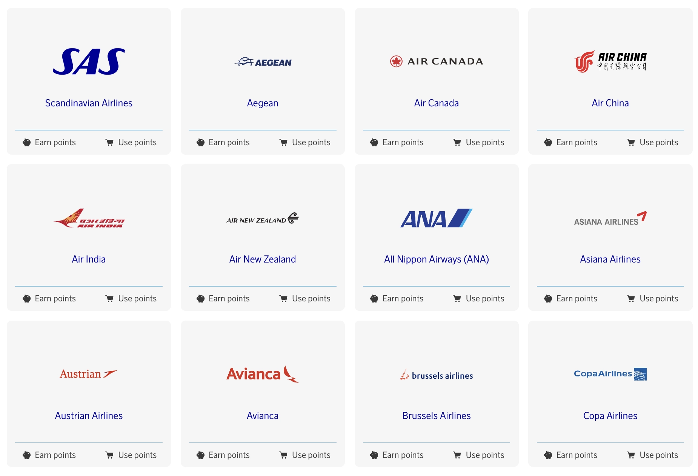

I dette året markerer et stort sprang for Scandinavian Airlines, spesielt for SAS EuroBonus-medlemmer. Flyselskapet vil bli kjøpt, blant annet, av Air France-KLM, forlater Star Alliance (planlagt for 2. kvartal 2024) og slutter seg til SkyTeam umiddelbart! Dette betyr at spillet for hyppige reisende vil endre seg veldig snart: prisflyvninger du kan innløse ved å bruke SAS EuroBonus-poeng vil være annerledes for alltid.

**Hvordan forberede seg på overgangen?** Ikke bekymre deg – vi har dekket deg. Det er derfor vi forberedte dette innlegget som den ultimate guiden til å bruke SAS EuroBonus-poeng. Hensikten er å hjelpe deg med å finne de beste (gratis) flyvningene på SAS og Star Alliance før flyselskapet forlater og, til slutt, på SkyTeam-partnere når flyselskapet går inn i den nye alliansen og integrerer med disse partnerne.

  TID TIL 2. KVARTAL 2024

### I Dette Innlegget

- [SAS Overgang til SkyTeam (Våre Tanker)](#sas-overgang-til-skyteam-våre-tanker)
- [Hvordan Finne Billige EuroBonus Prisflyvninger (Steg-for-steg)](#hvordan-finne-billige-eurobonus-prisflyvninger-steg-for-steg)
- [Become a EuroBonus Pro](#become-a-eurobonus-pro)

## SAS Overgang til SkyTeam (Våre Tanker)

Det har ennå ikke vært noen offisielle kunngjøringer om hvordan EuroBonus-programmet vil endre seg når oppkjøpet skjer. Selv om det er ett scenario der EuroBonus legges ned og Flying Blue blir SASs nye offisielle lojalitetsprogram, er vilkårene for at dette skal skje langt fra å være oppfylt. Hvis så, vil det ikke være på horisonten for 2024.

I stedet, fra et teknisk ståsted, gir det mer mening at flyselskapet (eller flyselskapene) tar mer gradvise skritt til nye endringer blir implementert. Her er noen av våre tanker om forskjellige områder fra vårt ydmyke perspektiv som teknologer og erfaring som reisende.

### EuroBonus Award Chart

Pristabellene viser hvor mange poeng du trenger for en gratis flyvning. På SAS-flyvninger kan flyselskapet justere tallene (øke dem), noe som gjør flyvningene dyrere. Disse devalueringene er enkle å gjøre og skjer vanligvis på kort varsel (trår i kraft måneden etter eller så).

Per i dag viser tabellen nedenfor hvor mange EuroBonus-poeng du ville trenge for en enveisflyvning med SAS og Widerøe, eksklusive skatter og avgifter.

Star Alliance-delen av tabellen vil bli fjernet umiddelbart, ettersom innløsninger vil bli stoppet med en gang. En ny tabell for innløsninger på SkyTeam-partnere bør komme samtidig eller snart, avhengig av hvor raskt de implementerer innløsninger på disse partnerne.

Tabellen nedenfor viser hvor mange EuroBonus-poeng du ville trenge for en rundtur på Star Alliance-flyselskaper per i dag, eksklusive skatter og pålagte avgifter fra transportøren. Prisen i poeng avhenger av destinasjonen og reiseklassen.

Du kan sjekke hele tabellen og [alle andre til/fra-kombinasjoner utover Europa her](https://www.flysas.com/en/eurobonus/points/fly-with-points/star-alliance-point-chart/).

EuroBonus [pristabellen er basert på soner](https://blog.awardfares.com/demystifying-award-charts/), og dette aspektet vil sannsynligvis ikke endre seg i løpet av 2024. Mens de fleste programmer går over til dynamisk prissetting, pleier flyselskaper vanligvis å kunngjøre betydelige endringer som disse med 4-6 måneders varsel til sine medlemmer. Hovedsakelig for å unngå å rote til kvalifiseringsvinduene for Elite Status og for å ha mer tid til planlegging.

[Flying Blue (Air France-KLM)](https://blog.awardfares.com/introducing-flying-blue/) har nylig adoptert dynamisk prissetting, så det er sannsynlig at hvis EuroBonus opprettholdes som et separat program, vil det følge etter.

### Tjene EuroBonus Poeng

- **På SAS**: Ingen endringer på kort sikt.

- **På Star Alliance Partnere**: Vær forberedt på å stoppe å akkumulere poeng for flyvninger på Star Alliance-flyselskaper så snart den nye avtalen med SkyTeam trer i kraft.

- **På SkyTeam Partnere**: I et ideelt scenario, når SAS offisielt blir en del av SkyTeam, vil det være mulig å tjene poeng på partnerflyvninger med en gang. Vent litt, det kan være mer rett frem. Implementering av opptjening og innløsninger tar tid, måneder, og noen ganger til og med år.

Vi har allerede sett noe integrasjon mellom SAS og Delta når det gjelder booking av inntektsbilletter, så endringene kan skje raskere for viktige partnere som DL, Air France og KLM.

### EuroBonus Portal

- **For SAS-flyvninger**: Sannsynligvis det samme i begynnelsen. Samme som vi allerede kjenner.

- **På Star Alliance Partnere**: Disse vil bli slått av umiddelbart etter at SAS blir med i SkyTeam. Medlemmer vil ikke lenger kunne søke og innløse for flyvninger på Lufthansa, ANA, EVA Air, Thai Airways.

- **For Innløsninger på SkyTeam Partnere**: Ikke ved lanseringen, men vi håper at en portal vil dukke opp for SkyTeam-flyvninger i løpet av 2.-3. kvartal, i det minste for et utvalg av partnere.

### SAS Amex Companion Tickets

For innbyggere i Norge og kortinnehavere av SAS American Express Elite-kortet, gjenstår ett spørsmål: hvordan påvirker overgangen 2-for-1 voucherene som også er gyldige på Star Alliance-flyvninger?

Formuleringen på American Express-nettstedet forblir uendret (inntil flere detaljer er kjent).

Det er tryggere å anta at vouchers bare vil være brukbare på SAS-flyvninger fra det øyeblikket det blir med i SkyTeam. Som vi sa tidligere, er det uklart om/når innløsninger på SkyTeam-partnere blir tilgjengelige og om vouchers vil være brukbare på disse eller ikke.

Hvis du har ubrukte vouchers og ser på å fly med Star Alliance-flyselskaper, kan dette være et godt tidspunkt å konsolidere bookinger. For eksempel, kan det være en god anledning til å prøve kabiner som Lufthansa First, ANA The Room, osv.

### Award Release Dates

Mens den generelle tidsrammen på 330-359 dager sannsynligvis gjelder, vil spesifikke utgivelsesdatoer for EuroBonus-medlemmer avhenge av hvordan SAS og SkyTeam-flyselskapene integrerer sine lojalitetsprogrammer.

Vi vil fortsette å overvåke situasjonen og oppdatere vår [Ultimate Guide to Award Release Dates](https://blog.awardfares.com/ultimate-guide-to-award-release-dates/) deretter.

## Hvordan Finne Billige EuroBonus Prisflyvninger (Steg-for-steg)

### Booking av SAS-flyvninger

#### 1. Gå til [AwardFares](https://awardfares.com/signup)

Å opprette en konto er valgfritt, men det er også gratis, og det gir deg tilgang til flere funksjoner. Sørg for å [registrere deg for en her](https://awardfares.com/signup).

#### 2. Velg **EuroBonus** som Frequent Flyer-program

Trykk på **Loyalty Program** og velg SAS EuroBonus

#### 3. Under *Airlines*, select **SAS only**

From now on, you will only see available award seats operated by SAS on the results list.

#### 4. Add a Route

In the **Origin** and **Destination** fields, add one or more airports to search for flights between those locations. AwardFares will search for award flights regardless of the number of stops. You can use the **Stops** filter to only search for direct/non-stop flights.

In the example below, we search for flights [between Copenhagen and New York](https://awardfares.com/search?CPH.area:NYC.;a:SK;z:sas). Note that we use the metropolitan area codes **NYC** to get results to and from any airport in New York (JFK, EWR, LGA).

#### 4. Explore dates

If you have a particular date in mind, add it by tapping on the **Calendar** field.

Alternatively, you can use AwardFares **Timeline View** to explore the seat availability on different dates. The Timeline View displays how many seats are available for each day of the week/month. The bars are color-coded, so it's easy to distinguish between cabin classes (Economy, Business, First). You can also trigger new searches by tapping the refresh icon underneath each day.

In addition, you can also tap anywhere on the flight to display more details in an expanded view, such as aircraft type, and even [get the current seat maps](https://blog.awardfares.com/seatmaps-guide/) to see which seats are free versus occupied!

#### 5. Sort by Price or Stops

Whether you are exploring dates using the Timeline View or have selected a specific day, AwardFares will show you the available seats (with real-time data) within seconds in the result list below.

You can tap on the different header columns to sort the results by price. Use the **Eco**, **Prem**, **Biz**, and **First** class tags to find cheap awards across multiple dates, itineraries, and airlines.

You can also tap on the **Stops** header to display the shortest trips first (among similarly priced flights)

#### 6. Book on the SAS EuroBonus Portal

Once you have identified the flights you want (or built an itinerary using our [Journey Planner](https://blog.awardfares.com/journey-planner/)), go to the EuroBonus portal on SAS website and proceed with the booking.

-------

### Booking Star Alliance Flights

#### 1. Under *Airlines*, select **Star Alliance only**

From now on, you will only see available award seats operated by Star Alliance partners on the results list. You will also see SAS results unless you exclude it from the results explicitly.

#### 2. Add a Route

Same as above, use the **Origin** and **Destination** fields to add one or more airports to search for flights between those locations.

In the example below, we search for flights [between Boston and Munich](https://awardfares.com/search?BOS.MUC.;a:A3,AC,AI,AV,BR,CA,CM,ET,LH,LO,LX,MS,NH,NZ,OS,OU,OZ,SA,SK,SN,SQ,TG,TK,TP,UA,ZH;z:sas).

#### 3. Explore and Sort Results

Whether you are exploring dates using the Timeline View or have selected a specific day, AwardFares will show you the available seats (with real-time data) within seconds in the result list below.

Tap on the different header columns classes (**Eco**, **Prem**, **Biz**, and **First**) to sort the results by price.

You can also tap on the **Stops** header to display the shortest trips first (among similarly priced flights)

**Cheapest Award Flights in Business & First Class**

AwardFares' quick sorting feature is very useful when trying to book premium cabins such as Business and First, and specially when the award charts use dynamic pricing. This might be your secret weapon to maximizing the value of your EuroBouns points if it shifts to a dynamic pricing scheme, like Flying Blue.

#### 6. Book on the EuroBonus Star Alliance Portal

Once you have identified the flights you want go to SAS website, [log-in and choose *Star Alliance Bonus Trips*](https://www.flysas.com/nl-en/eurobonus/star-alliance-award-trips/) to proceed with the booking. Remember that some of these itineraries are not bookable online for specific programs (e.g., mixed-cabin awards). In those situations, you will need to call SAS service center.

## Become a EuroBonus Pro

You can [try AwardFares for free](https://awardfares.com/). We are rolling out new features and improvements regularly, so [sign up for our monthly newsletter](https://awardfares.com/newsletter) to stay on top of the latest news, announcements, and pro tips.

With our [Gold and Diamond tiers](https://awardfares.com/pricing), you can access premium features such as unlimited daily searches, alerts, seat maps, flight schedules, and more!

Our guides have all the information you need to be a pro travel hacker and explore the world on points. Here are some related posts you might enjoy:

- [Booking United Flights with EuroBonus Points No Longer an Option?](https://blog.awardfares.com/united-stops-working-with-eurobonus/)
- [SAS Will Leave Star Alliance! Here’s What To Do Next](https://blog.awardfares.com/sas-acquisition/)
- [SAS EuroBonus Conscious Traveler Takes Off In 2024: Greener Flying, Greater Rewards](https://blog.awardfares.com/sas-eurobonus-conscious-traveler/)
- [7 Benefits Of SAS Joining SkyTeam (The Bright Side)](https://blog.awardfares.com/sas-and-skyteam/)

 