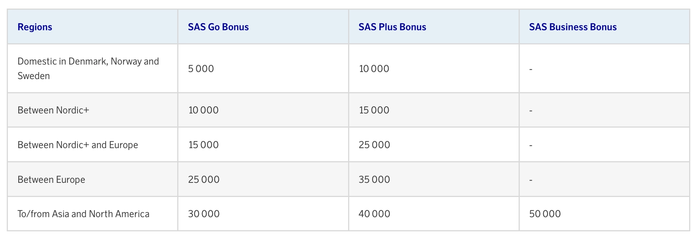
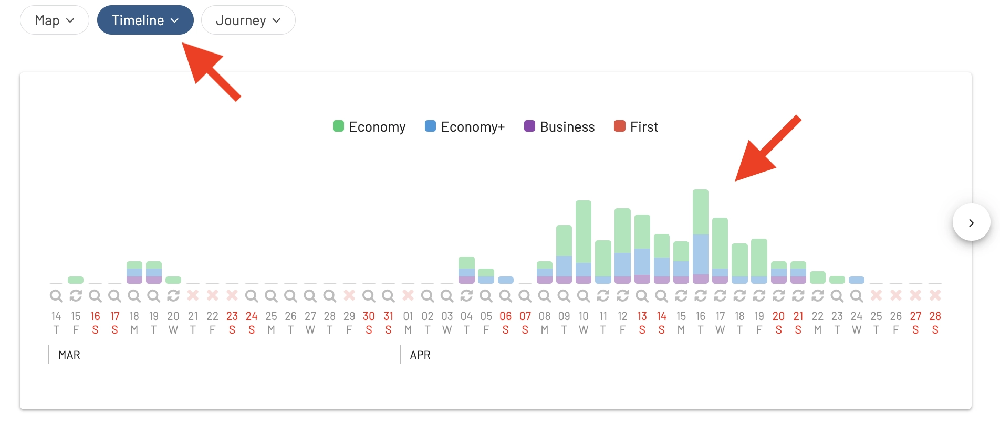
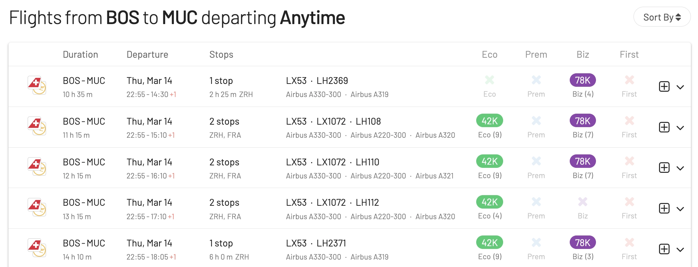

I år sker stora förändringar för Scandinavian Airlines, särskilt för SAS EuroBonus-medlemmar. Flygbolaget kommer att förvärvas av bland andra Air France-KLM, de lämnar Star Alliance (planerat till Q2 2024) och går med i SkyTeam omedelbart! Detta innebär att situationen för frekventa resenärer kommer att förändras inom kort: att boka flyg med SAS EuroBonus-poäng kommer att förändras för alltid.

**Hur förbereder man sig för övergången?** Oroa dig inte – vi har all info. Det är därför vi har förberett det här inlägget som den ultimata guiden till att använda SAS EuroBonus-poäng. Avsikten är att hjälpa dig att hitta de bästa (gratis) flighterna på SAS och Star Alliance innan flygbolaget lämnar och slutligen, på SkyTeam-partners när flygbolaget går med i den nya alliansen och integreras med dessa partners.

  TID TIL Q2 2024

### I det här inlägget

- [SAS övergång till SkyTeam (Våra Tankar)](#sas-övergång-till-skyteam-våra-tankar)
- [Hitta Billiga EuroBonus Bonusresor (Steg-för-steg)](#hitta-billiga-eurobonus-bonusresor-steg-för-steg)
- [Bli ett EuroBonus-proffs](#bli-ett-eurobonus-proffs)

## SAS övergång till SkyTeam (Våra Tankar)

Det har inte kommunicerats något officiellt än om hur EuroBonus-programmet kommer att förändras när väl förvärvet sker. Även om det skulle kunna hända att EuroBonus läggs ner och Flying Blue blir SAS nya officiella lojalitetsprogram verkar det inte som att det är något som skulle hända i närtid. Om det faktiskt händer sker det definitivt inte under 2024.

Istället, ur ett tekniskt perspektiv, är det mer meningsfullt att flygbolagen tar mer gradvisa steg tills nya förändringar implementeras. Här är några av våra tankar om olika områden från vårt blygsamma perspektiv som tekniker och vår erfarenhet som resenärer.

### EuroBonus Award Chart

Pristabellerna visar hur många poäng du behöver för en gratis flygning. På SAS-flyg kan flygbolaget justera siffrorna (bumpa upp dem), vilket gör flygningarna dyrare. Dessa devalveringar är lätta att göra och sker vanligtvis med kort varsel (träder i kraft ungefär månaden efter).

Tabellen nedan visar hur många EuroBonus-poäng du skulle behöva för en enkelresa med SAS och Widerøe, exklusive skatter och avgifter, just nu.

Star Alliance-delen av tabellen kommer att tas bort omedelbart, eftersom bokningar med partners kommer att stoppas direkt. En ny tabell för partner-bokningar på SkyTeam-partners borde komma samtidigt eller kort senare, beroende på hur snabbt de implementerar möjligheten att boka på dessa partners.

_Du kan se hela tabellen och [alla andra till/från kombinationer bortom Europa här](https://www.flysas.com/en/eurobonus/points/fly-with-points/star-alliance-point-chart/)._

EuroBonus [pristabell är zonbaserad](https://blog.awardfares.com/demystifying-award-charts/) och detta aspekt kommer sannolikt inte att förändras under 2024. Medan de flesta programmen övergår till dynamisk prissättning, brukar flygbolagen presentera betydande förändringar som dessa med 4-6 månaders varsel till sina medlemmar. Framför allt för att undvika att störa kvalificeringsfönster till t.ex. Gold och Diamond och för att ha mer tid att planera övergången.

[Flying Blue (Air France-KLM)](https://blog.awardfares.com/introducing-flying-blue/) antog nyligen dynamisk prissättning, så det är troligt att om EuroBonus behålls som ett separat program kommer det att följa i samma fotspår.

### Tjäna EuroBonus-poäng

- **På SAS**: Inga förändringar på kort sikt.

- **På Star Alliance-partner**: Var beredd på att sluta ackumulera poäng för flygningar på Star Alliance-flygbolag så snart det nya avtalet med SkyTeam träder i kraft.

- **På SkyTeam-partner**: I ett perfekt scenario, när SAS officiellt är en del av SkyTeam, är det möjligt att tjäna poäng på partnerflygningar direkt. Men detta kan vara lättare sagt än gjort. Att implementera ackumulering och poängköp tar tid, månader och ibland till och med år.

Vi har redan sett viss integration mellan SAS och Delta när det gäller bokning av betalda biljetter, så förändringarna kan komma fortare för viktiga partner som Delta, Air France och KLM.

### EuroBonus Award Search Portal

- För SAS-flygningar: Förmodligen oförändrat i början. Samma som vi redan känner använder.

- **För Star Alliance**: Dessa kommer att stängas av omedelbart efter att SAS går med i SkyTeam. Medlemmar kommer inte längre att kunna söka och köpa resor för poäng på Lufthansa, ANA,

- **För SkyTeam-partner**: Inte vid start, men vi hoppas att någon portal kommer att dyka upp för SkyTeam-flygningar under Q2-Q3, åtminstone för ett handfull partner.

### SAS Amex 2-för-1 Vouchers

För kortinnehavare av SAS American Express Elite- och Premium-kort i Sverige finns det en viktig fråga: hur påverkar övergången 2-för-1 vouchers som också är giltiga på Star Alliance-flyg?

Formuleringen på American Express webbplats är oförändrad än så länge (tills fler detaljer är kända).

Det är säkrast att anta att vouchers endast kommer att fungera på SAS-flyg från och med att SAS går med i SkyTeam. Som vi tidigare sagt är det oklart om/när SkyTeam-partner kommer att bli tillgängliga för poängbokningar och om vouchers kommer att kunna användas på dessa eller inte.

Om du har oanvända vouchers och funderar på att flyga med Star Alliance-bolag, kan det vara en bra tid att få till bokningar. Till exempel kan det vara en bra tid att prova kabiner såsom Lufthansa First, ANA The Room, etc.

### Award Release Dates

Medan den allmänna tidsramen på 330-359 dagar sannolikt gäller, kommer specifika släpp för EuroBonus-medlemmar att bero på hur SAS och SkyTeam-flygbolagen integrerar sina lojalitetsprogram.

Vi kommer att fortsätta övervaka situationen och uppdatera vår [Ultimate Guide to Award Release Dates](https://blog.awardfares.com/ultimate-guide-to-award-release-dates/) därefter.

## Hitta Billiga EuroBonus Bonusresor (Steg-för-steg)

### Boka SAS-flygningar

#### 1. Gå till [AwardFares](https://awardfares.com/signup)

Att skapa ett gratis konto är valfritt men det ger dig tillgång till fler funktioner. Se till att [registrera dig här](https://awardfares.com/signup).

#### 2. Välj **EuroBonus** som Frequent Flyer Program

Tryck på **Loyalty Program** och välj SAS EuroBonus

#### 3. Under _Airlines_, välj **SAS only**

Nu ser du bara bonusplatser med SAS flighter i resultatlistan.

#### 4. Lägg till en rutt

I fälten **Origin** och **Destination**, lägg till en eller flera flygplatser för att söka efter flygningar mellan dessa platser. AwardFares kommer att söka efter bonusplatser oavsett antal stopp. Du kan använda filtret **Stops** för att enbart söka efter flyg utan mellanlandningar.

I exemplet nedan söker vi efter flygningar [mellan Köpenhamn och New York](https://awardfares.com/search?CPH.area:NYC.;a:SK;z:sas). Observera att vi använder storstadskoder som NYC för att få resultat till och från vilken flygplats som helst i New York (JFK, EWR, LGA).

#### 5. Utforska datum

Om du har ett specifikt datum i åtanke, lägg till det genom att trycka på **Calendar**.

Alternativt kan du använda AwardFares **Timeline View** för att utforska tillgängligheten på olika datum. Tidslinjevyn visar hur många platser som är tillgängliga för varje dag i veckan/månaden. Den är är färgkodad, så det är enkelt att skilja mellan kabin-klasser (Ekonomi, Business, Första klass). Du kan också starta nya sökningar genom att trycka på en av dagarna (Om du har köpt ett abonnemang).

Dessutom kan du också trycka var som helst på flygningen för att visa mer detaljer i en utvidgad vy, såsom flygplanstyp, och till och med få aktuella [seat maps](https://blog.awardfares.com/seatmaps-guide/) för att se vilka platser som är lediga!

#### 5. Sortera efter pris eller mellanlandningar

Oavsett om du utforskar datum med Tidslinjevyn eller har valt en specifik dag, kommer AwardFares att visa dig tillgängliga platser (med realtidsdata) inom sekunder i resultatlistan nedan.

Du kan trycka på de olika rubrik-kolumnerna för att sortera resultaten efter pris. Använd **Eco**, **Prem**, **Biz**, och **First**-klassmärkena för att hitta billiga poängresor över flera datum, resvägar och flygbolag.

Du kan också trycka på **Stops** för att först visa de kortaste resorna (bland likvärdigt prissatta flygningar).

#### 6. Boka på SAS EuroBonus Portal

När du har identifierat de flygningar du vill ha (eller byggt en resväg med vår [Journey Planner](https://blog.awardfares.com/journey-planner/)), gå till EuroBonus-portalen på SAS webbplats och fortsätt med bokningen. Du kan också trycka på länken **Book** som tar dig direkt till SAS bokningssida.

---

### Boka Star Alliance-flygningar

#### 1. Under _Airlines_, välj **Star Alliance only**

Nu kommer du endast att se tillgängliga bonusplatser på fligher som flygs av Star Alliance-partner i resultatlistan. Du kommer också att se SAS-resultat om du inte uttryckligen utesluter det från resultaten.

#### 2. Lägg till en rutt

Precis som ovan, använd **Origin** (Ursprung) och **Destination**-fälten för att lägga till en eller flera flygplatser för att söka efter flygningar mellan dessa platser.

I exemplet nedan söker vi efter flygningar [mellan Boston och München](https://awardfares.com/search?BOS.MUC.;a:A3,AC,AI,AV,BR,CA,CM,ET,LH,LO,LX,MS,NH,NZ,OS,OU,OZ,SA,SK,SN,SQ,TG,TK,TP,UA,ZH;z:sas).

#### 3. Utforska och Sortera Resultat

Oavsett om du utforskar datum med Tidslinjevyn eller har valt en specifik dag, kommer AwardFares att visa dig tillgängliga platser (med realtidsdata) inom sekunder i resultatlistan nedan.

Tryck på de olika rubrik-kolumnklasserna (**Eco**, **Prem**, **Biz**, och **First**) för att sortera resultaten efter pris.

Du kan också trycka på **Stops** för att först visa de kortaste resorna (bland likvärdigt prissatta flygningar).

**Billigaste Bonusresor i Business & Första Klass**

AwardFares snabbsorteringsfunktion är mycket användbar när du försöker boka premiumkabiner som Business och Första klass, och särskilt när prisdiagrammen använder dynamisk prissättning. Det här kan vara ditt hemliga vapen för att maximera värdet av dina EuroBonus-poäng om det övergår till ett dynamiskt prissättningssystem, liknande Flying Blue.

#### 6. Boka på EuroBonus Star Alliance Portal

När du har identifierat de flygningar du vill, gå till SAS webbplats, [logga in och välj Star Alliance Bonusresor](https://www.flysas.com/nl-en/eurobonus/star-alliance-award-trips/) för att fortsätta med bokningen. Kom ihåg att vissa av dessa resvägar inte är bokningsbara online för specifika program (t.ex. blandade kabinpriser). I dessa situationer kommer du att behöva ringa SAS servicecenter.

## Bli ett EuroBonus-Proffs

Du kan prova [AwardFares gratis](https://awardfares.com/). Vi lanserar nya funktioner och förbättringar regelbundet, så [registrera dig för vårt nyhetsbrev](https://awardfares.com/newsletter) för att hålla dig uppdaterad med de senaste nyheterna och tipsen.

Med våra [Guld- och Diamantnivåer](https://awardfares.com/pricing) kan du få tillgång till premiumfunktioner som obegränsade dagliga sökningar, bevakningar, sittplanskartor, flygscheman och mer!

Våra guider har all information du behöver för att vara en proffsig resehackare och upptäcka världen med poäng. Här är några relaterade inlägg som du kanske gillar:

- [Booking United Flights with EuroBonus Points No Longer an Option?](https://blog.awardfares.com/united-stops-working-with-eurobonus/)
- [SAS Will Leave Star Alliance! Here’s What To Do Next](https://blog.awardfares.com/sas-acquisition/)
- [SAS EuroBonus Conscious Traveler Takes Off In 2024: Greener Flying, Greater Rewards](https://blog.awardfares.com/sas-eurobonus-conscious-traveler/)
- [7 Benefits Of SAS Joining SkyTeam (The Bright Side)](https://blog.awardfares.com/sas-and-skyteam/)

