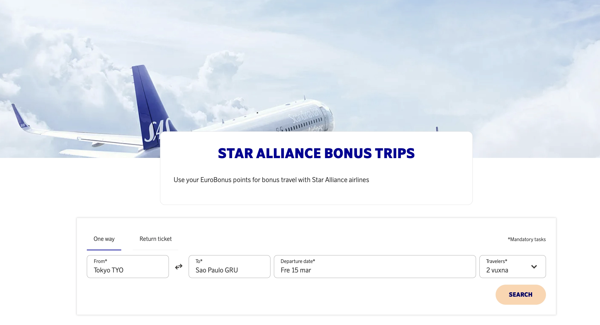
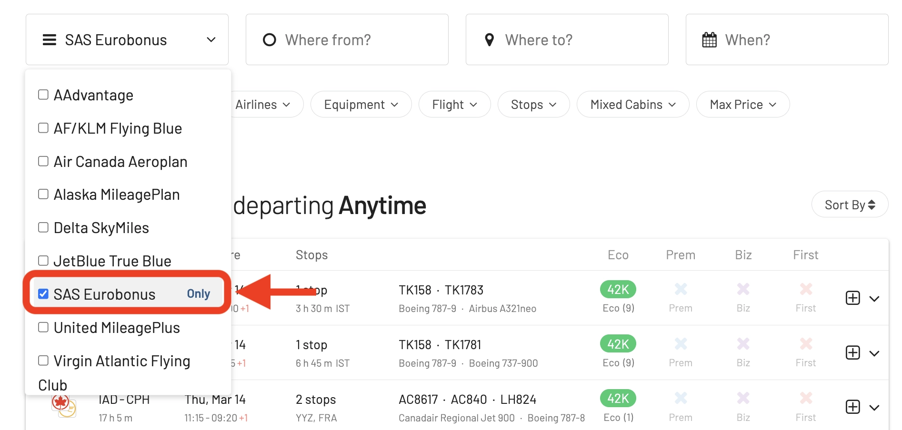
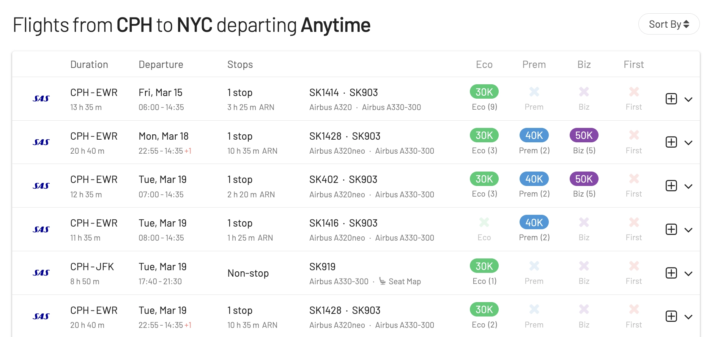

This year marks a giant leap for Scandinavian Airlines, particularly for SAS EuroBonus members. The airline will be acquired, among others, by Air France-KLM, leaving Star Alliance and joining SkyTeam [starting September 1st, 2024](https://blog.awardfares.com/sas-transition-to-skyteam/). This means the game for frequent travelers will change very soon: award flights you can redeem using SAS EuroBonus points will be different forever.

**How to prepare for the transition?** Don't worry—we've got you covered. That's why we prepared this post as the Ultimate Guide to Using SAS EuroBonus Points. The intention is to help you find the best (free) flights on SAS and Star Alliance before the airline leaves and, ultimately, on SkyTeam partners once the airline enters the new alliance and integrates with those partners.

  TIME UNTIL TRANSITION

### In This Post

- [SAS Transition to SkyTeam (Our Thoughts)](#sas-transition-to-skyteam-our-thoughts)
- [How To Find Cheap EuroBonus Award Flights (Step-by-step)](#how-to-find-cheap-eurobonus-award-flights-step-by-step)
- [Become a EuroBonus Pro](#become-a-eurobonus-pro)

## SAS Transition to SkyTeam (Our Thoughts)

SAS recently published new information about the transition from Star Alliance to SkyTeam. They have confirmed that the EuroBonus program will not shut down (at least for now), and that Flying Blue won't become SAS's new official loyalty program.

Read [all the details about the announcement in this post](https://blog.awardfares.com/eurobonus-star-alliance-awards/).

### EuroBonus Award Chart

The award charts show how many points you need for a free flight. On SAS flights, the airline may adjust the numbers (bumping them up), making flights cost more. These devaluations are easy to do and typically happen on short notice (effective the month after or so).

As of today, the table below shows how many EuroBonus points you would need for a one-way flight with SAS and Widerøe, excluding taxes and fees.

Keep under consideration that the Star Alliance part of the chart may be removed on September 1st, as redemptions will be stopped. A new chart for redemptions on SkyTeam partners should come simultaneously or soon.

The table below shows how many EuroBonus points you would need for a round trip flight on Star Alliance airlines as of today, excluding taxes and carrier-imposed fees. The price in points depends on your destination and travel class.

*You can check the full chart and [all other to/from combinations beyond Europe here](https://www.flysas.com/en/eurobonus/points/fly-with-points/star-alliance-point-chart/).*

The EuroBonus [award chart is zone-based](https://blog.awardfares.com/demystifying-award-charts/), and this aspect is unlikely to change during 2024. While most programs are shifting to dynamic pricing, airlines typically announce significant changes like these with 4-6 months of notice to their members. Mainly to avoid screwing up Status qualification windows and to have more time for planning.

[Flying Blue (Air France-KLM)](https://blog.awardfares.com/introducing-flying-blue/) adopted dynamic pricing recently, so it's likely that if EuroBonus is kept as a separate program, it will follow along.

### Earning EuroBonus Points

* **On SAS**: No changes in the short term.

* **On Star Alliance Partners**: Be prepared to probably stop accruing points for flights on Star Alliance airlines taken as soon as the new agreement with SkyTeam becomes effective.

* **On SkyTeam Partners**: In an ideal scenario, once SAS is officially part of SkyTeam, it is possible to earn points on partners' flights right away. Hold on, it's never that straightforward. Implementing accrual and redemptions takes time, months, and sometimes even years.

We have already seen some integration between SAS and Delta when booking revenue tickets so that the changes might happen sooner for significant partners such as Delta Air Lines, Air France, and KLM.

### EuroBonus Award Search Portal

* **SAS Bookings**: Probably the same in the beginning. Same as we know already.

* **Star Alliance Bookings**: It will be possible to book award flights on Star Alliance airlines using your points until August 31st, even for travel after that date. No new Star Alliance award bookings will be possible after August 31st. You can rebook existing Star Alliance awards (up to 24 hours before departure) until August 31st, even if your flight is after September 1st. Cancellations will follow the same rules as of today, up to 24 hours before departure.

* **SkyTeam Bookings**: You will be able to use your points to book award flights on *most* SkyTeam airlines from September 1st onwards. Rebooking and cancellation rules for SkyTeam awards will mirror the existing Star Alliance policy (24 hours before departure).

### Amex 2-for-1 Vouchers / Companion Tickets

For members in Norway and Sweden that are holders of the SAS Amex Elite, the Amex 2-for-1 vouchers (companion ticket) will remain, and you’ll still be able to use vouchers for SAS Bonus tickets. You can also use new vouchers for Star Alliance Bonus trip bookings until 31 August 2024. All Bonus trip bookings made using vouchers will remain unchanged and will be honored.

From **1 September 2024**, you’ll be able to use your Amex 2-for-1 vouchers on most SkyTeam airlines

The wording on the American Express website remains unchanged.

If you have unused vouchers and are looking into flying with Star Alliance airlines, this might be a good time to consolidate bookings. For example, it might be a good time to try cabins such as Lufthansa First, ANA The Room, etc.

### Award Release Dates

While the general timeframe of 330-359 days likely applies, specific release dates for EuroBonus members will depend on how SAS and SkyTeam airlines integrate their loyalty programs.

We will keep monitoring the situation and updating our [Ultimate Guide to Award Release Dates](https://blog.awardfares.com/ultimate-guide-to-award-release-dates/) accordingly.

### EuroBonus Status and Benefits

From the moment SAS joins SkyTeam, EuroBonus **Silver** members will be recognized as **SkyTeam Elite** level, while **Gold** and **Diamond** members will be recognized as **Elite Plus**.

## How To Find Cheap EuroBonus Award Flights (Step-by-step)

### Booking SAS Flights

#### 1. Go to [AwardFares](https://awardfares.com/signup)

Creating an account is optional, but it's also free, and it gives you access to more features. Make sure to [sign up for one here](https://awardfares.com/signup).

#### 2. Select **EuroBonus** as the Frequent Flyer Program

Tap on the **Loyalty Program** field and select SAS EuroBonus

#### 3. Under *Airlines*, select **SAS only**

From now on, you will only see available award seats operated by SAS on the results list.

#### 4. Add a Route

In the **Origin** and **Destination** fields, add one or more airports to search for flights between those locations. AwardFares will search for award flights regardless of the number of stops. You can use the **Stops** filter to only search for direct/non-stop flights.

In the example below, we search for flights [between Copenhagen and New York](https://awardfares.com/search?CPH.area:NYC.;a:SK;z:sas). Note that we use the metropolitan area codes **NYC** to get results to and from any airport in New York (JFK, EWR, LGA).

#### 5. Explore dates

If you have a particular date in mind, add it by tapping on the **Calendar** field.

Alternatively, you can use AwardFares **Timeline View** to explore the seat availability on different dates. The Timeline View displays how many seats are available for each day of the week/month. The bars are color-coded, so it's easy to distinguish between cabin classes (Economy, Business, First). You can also trigger new searches by tapping the refresh icon underneath each day.

In addition, you can also tap anywhere on the flight to display more details in an expanded view, such as aircraft type, and even [get the current seat maps](https://blog.awardfares.com/seatmaps-guide/) to see which seats are free versus occupied!

#### 6. Sort by Price or Stops

Whether you are exploring dates using the Timeline View or have selected a specific day, AwardFares will show you the available seats (with real-time data) within seconds in the result list below.

You can tap on the different header columns to sort the results by price. Use the **Eco**, **Prem**, **Biz**, and **First** class tags to find cheap awards across multiple dates, itineraries, and airlines.

You can also tap on the **Stops** header to display the shortest trips first (among similarly priced flights)

#### 7. Book on the SAS EuroBonus Portal

Once you have identified the flights you want (or built an itinerary using our [Journey Planner](https://blog.awardfares.com/journey-planner/)), go to the EuroBonus portal on SAS website and proceed with the booking.

-------

### Booking Star Alliance Flights

#### 1. Under *Airlines*, select **Star Alliance only**

From now on, you will only see available award seats operated by Star Alliance partners on the results list. You will also see SAS results unless you exclude it from the results explicitly.

#### 2. Add a Route

Same as above, use the **Origin** and **Destination** fields to add one or more airports to search for flights between those locations.

In the example below, we search for flights [between Boston and Munich](https://awardfares.com/search?BOS.MUC.;a:A3,AC,AI,AV,BR,CA,CM,ET,LH,LO,LX,MS,NH,NZ,OS,OU,OZ,SA,SK,SN,SQ,TG,TK,TP,UA,ZH;z:sas).

#### 3. Explore and Sort Results

Whether you are exploring dates using the Timeline View or have selected a specific day, AwardFares will show you the available seats (with real-time data) within seconds in the result list below.

Tap on the different header columns classes (**Eco**, **Prem**, **Biz**, and **First**) to sort the results by price.

You can also tap on the **Stops** header to display the shortest trips first (among similarly priced flights)

**Cheapest Award Flights in Business & First Class**

AwardFares' quick sorting feature is very useful when trying to book premium cabins such as Business and First, and specially when the award charts use dynamic pricing. This might be your secret weapon to maximizing the value of your EuroBouns points if it shifts to a dynamic pricing scheme, like Flying Blue.

#### 4. Book on the EuroBonus Star Alliance Portal

Once you have identified the flights you want go to SAS website, [log-in and choose *Star Alliance Bonus Trips*](https://www.flysas.com/nl-en/eurobonus/star-alliance-award-trips/) to proceed with the booking. Remember that some of these itineraries are not bookable online for specific programs (e.g., mixed-cabin awards). In those situations, you will need to call SAS service center.

## Become a EuroBonus Pro

You can [try AwardFares for free](https://awardfares.com/). We are rolling out new features and improvements regularly, so [sign up for our monthly newsletter](https://awardfares.com/newsletter) to stay on top of the latest news, announcements, and pro tips.

With our [Gold and Diamond tiers](https://awardfares.com/pricing), you can access premium features such as unlimited daily searches, alerts, seat maps, flight schedules, and more!

Our guides have all the information you need to be a pro travel hacker and explore the world on points. Here are some related posts you might enjoy:

- [From Star Alliance to SkyTeam: The SAS Transition (Official Info)](https://blog.awardfares.com/sas-transition-to-skyteam/)
- [Booking United Flights with EuroBonus Points No Longer an Option?](https://blog.awardfares.com/united-stops-working-with-eurobonus/)
- [SAS Will Leave Star Alliance! Here’s What To Do Next](https://blog.awardfares.com/sas-acquisition/)
- [SAS EuroBonus Conscious Traveler Takes Off In 2024: Greener Flying, Greater Rewards](https://blog.awardfares.com/sas-eurobonus-conscious-traveler/)
- [7 Benefits Of SAS Joining SkyTeam (The Bright Side)](https://blog.awardfares.com/sas-and-skyteam/)

