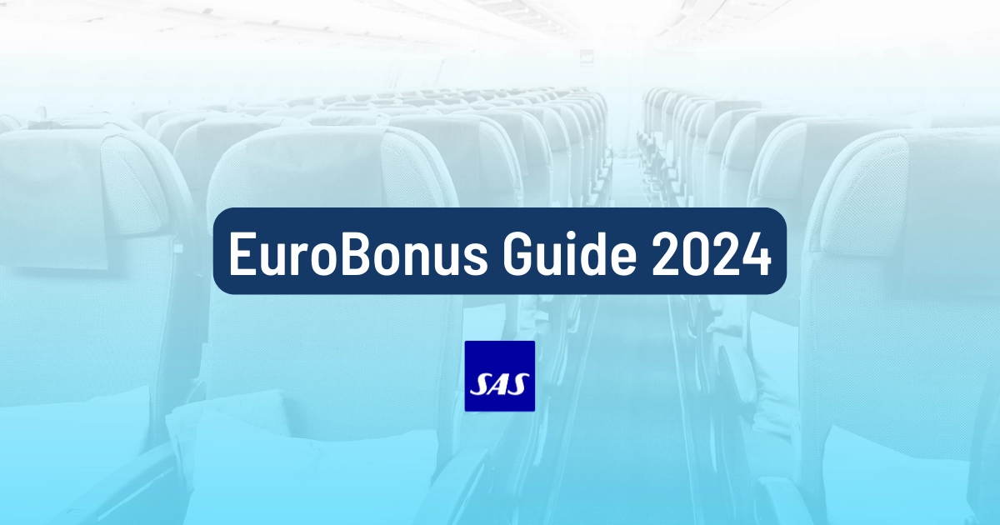
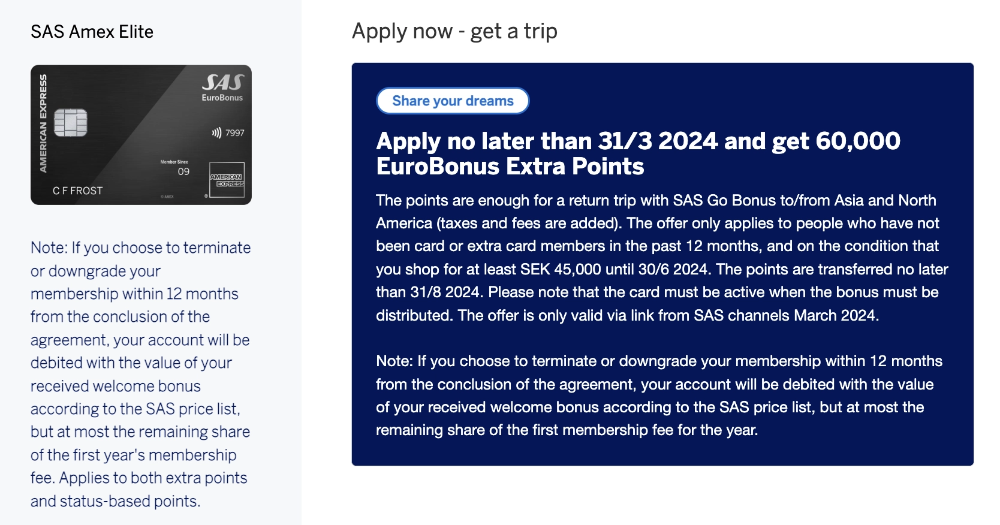
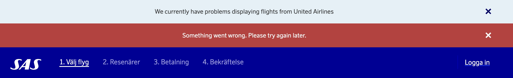
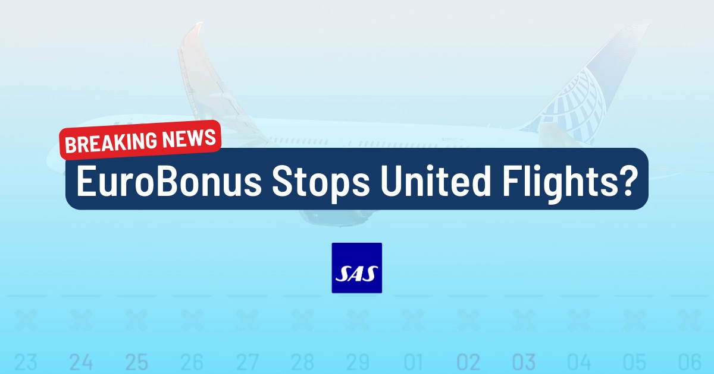
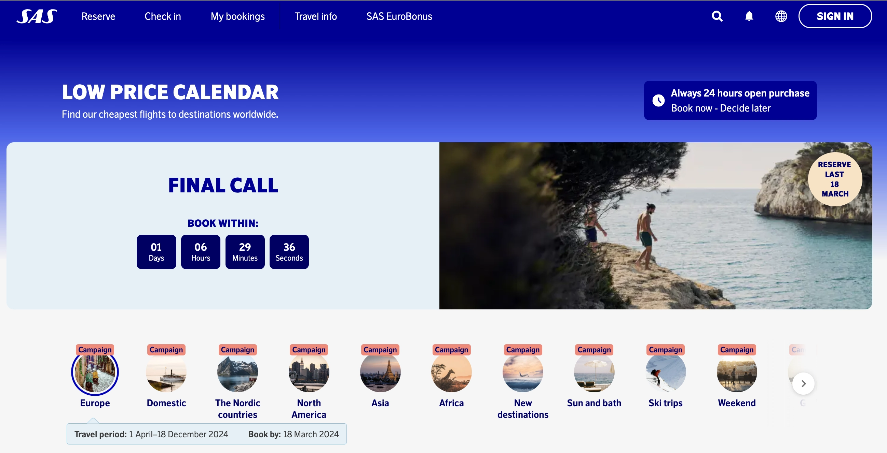
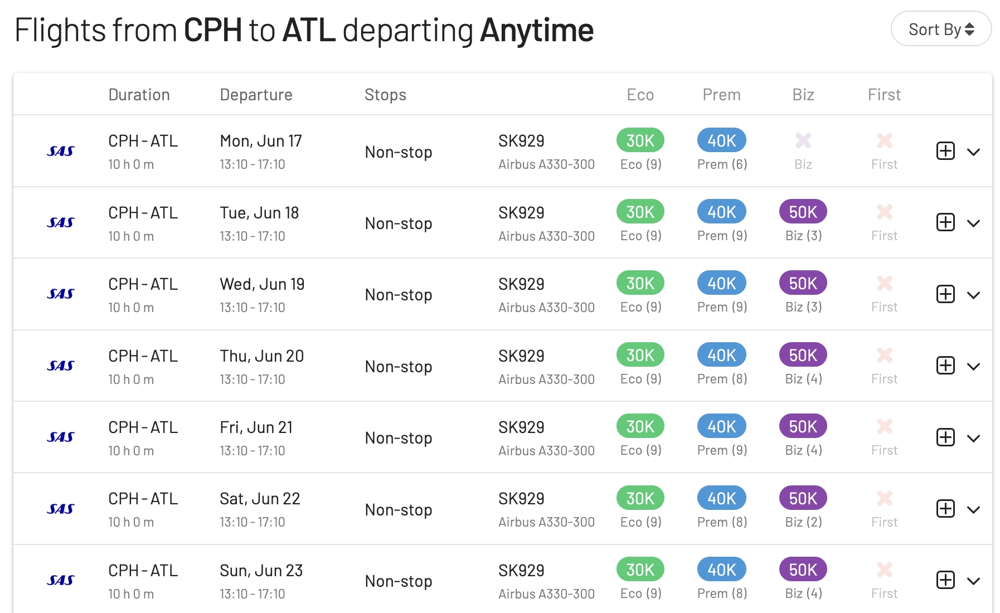
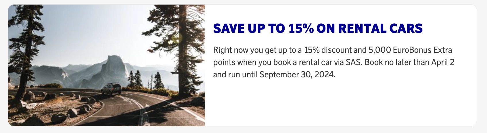

Welcome to our SAS EuroBonus monthly updates, March edition! The EuroBonus front is very hot right now, with lots of things going on. Each month, we explore and summarize the most recent developments so you don't have to.

March has some thick items under development, one of which is the transition from Star Alliance to SkyTeam. Let's start!

## SAS EuroBonus Updates (March 2024)

### 1. SAS plans to join SkyTeam during Q2, 2024

This year marks a giant leap for Scandinavian Airlines, particularly for SAS EuroBonus members. The airline will be acquired, among others, by Air France-KLM.

Recently, it was stated in a press release that SAS is planning on leaving Star Alliance in Q2 2024 and joining SkyTeam immediately! This means the game for frequent travelers will change very soon.

**How to prepare for the transition?** Don’t worry—we’ve got you covered. We prepared the [Ultimate Guide to Using SAS EuroBonus Points](https://blog.awardfares.com/eurobonus-guide/). The intention is to help you find the best (free) flights on SAS and Star Alliance before the airline leaves and, ultimately, on SkyTeam partners once the airline enters the new alliance and integrates with those partners.

### 2. Free Trip to Asia with SAS Amex Elite (Get 60.000 EB Points)

American Express and SAS offer a new promotion with an insane welcome bonus when applying to the SAS Amex Elite (their highest tier) credit card. This time they offer **60.000 EuroBonus points** (both valid in Sweden and Norway), which is comparable to what premium cards offer in the United States. Typically, it ranges between 12k and 30k points.

The 60k points are enough for a return trip with SAS Go Bonus to/from Asia and North America.

  TIME LEFT TO APPLY

Here are the conditions:

- The offer is only valid [via the link on the SAS website and channels during March 2024](https://www.americanexpress.com/se/kreditkort/sas-eurobonus-elite/?ieep=05MC2993&cpid=100537334).
- The offer only applies to people who have not been card **or extra card members** in the past 12 months.
- To get the bonus, you must spend at least SEK 45,000 until June 30, 2024.
- The points are transferred by August 31, 2024.
- The card must be active when the bonus is distributed.
- **Important**: If you cancel or downgrade the card within 12 months of being granted, your account will be debited with the value of your received welcome bonus. This prevents people from applying, getting the bonus, and canceling before the entire year.

### 3. United Disappears from EuroBonus Booking Portal

Booking flights on United Airlines using EuroBonus points is no longer an option. Their system fails to display any itineraries, including United flights. These changes could be linked to the recent slowdowns observed in their search engine and are likely associated with the new partnership with Delta Air Lines and the intention to join SkyTeam.

Read more [in this post](https://blog.awardfares.com/united-stops-working-with-eurobonus/).

### 4. Low Price Calendar (ENDS TODAY)

Every month, SAS puts together discounted prices for a handful of destinations. Discounts can be up to 30% off the regular price. Their **low price calendar** helps you find the best discount prices in a simple interface.

Check it out and see if there's something you like. Also, hurry up to book because the promotion ends **today**.

- **Book by**: 18 March 2024
- **Travel Period**: 1 April – 18 December, 2024

  TIME LEFT TO BOOK

### 5. Book the Inaugural Flight to Atlanta with Points

There are plenty of award seats left on the inaugural flight from Copenhagen to Atlanta (June 17th) using EuroBonus points.

Availability is also excellent for the following days during June 2024. You can easily find your seat using [AwardFares' timeline view](https://awardfares.com/search?CPH.ATL.;a:SK;x:0;z:sas).

Make sure to add _SAS_ and _nonstop_ to the filters when you search for award seats.

### 6. 15% Discount and 5k Points on Car Rentals

Book your next car rental through [the SAS EuroBonus portal](https://www.sas.se/boka/hyrbil/) and get 5k points and a 15% discount. Valid for bookings by April 2, travel until September 30, 2024.

### 7. 20% Discount and 2x Points on Hotel Stays

Get a 20% discount and earn double points on bookings [through the EuroBonus portal](https://www.hotelsbysas.com). The offer is valid for hotels booked between March 12th March 26th and applies to stays between March 12th and September 26th.

## Become a EuroBonus Pro

You can [try AwardFares for free](https://awardfares.com/). We are rolling out new features and improvements regularly, so [sign up for our monthly newsletter](https://awardfares.com/newsletter) to stay on top of the latest news, announcements, and pro tips.

With our [Gold and Diamond tiers](https://awardfares.com/pricing), you can access premium features such as unlimited daily searches, alerts, seat maps, flight schedules, and more!

Our guides have all the information you need to be a pro travel hacker and explore the world on points. Here are some related posts you might enjoy:

- [Guide To Using SAS EuroBonus Points (Before & After They Join SkyTeam)](https://blog.awardfares.com/eurobonus-guide/)
- [SAS EuroBonus Conscious Traveler Takes Off In 2024: Greener Flying, Greater Rewards](https://blog.awardfares.com/sas-eurobonus-conscious-traveler/)
- [SAS Ambitious New Direct Flight To Atlanta Takes Off In June (Awards Now Available)](https://blog.awardfares.com/sas-route-to-atlanta/)
- [SAS Will Fly To 9 New Destinations During Summer 2024](https://blog.awardfares.com/sas-summer-2024/)
- [Try These EuroBonus Award Flights Before SAS Leaves Star Alliance (Megapost)](https://blog.awardfares.com/eurobonus-star-alliance-awards/)

