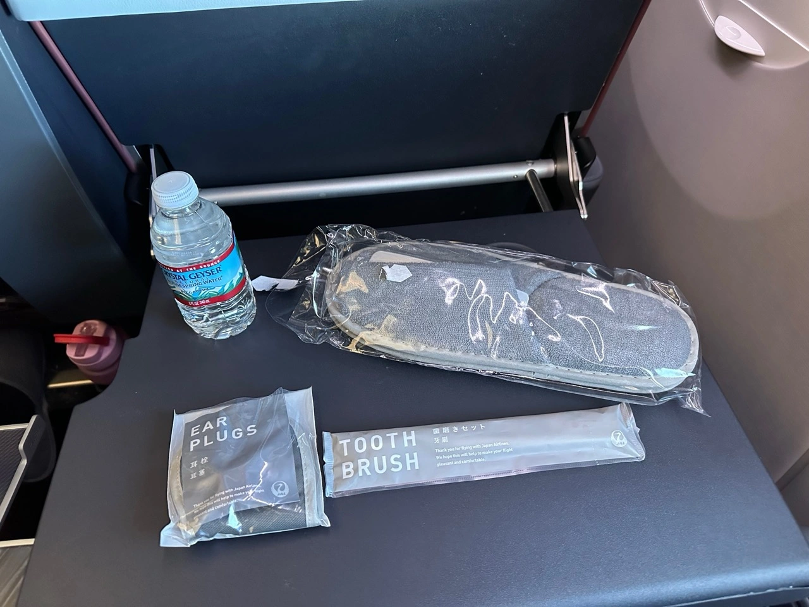
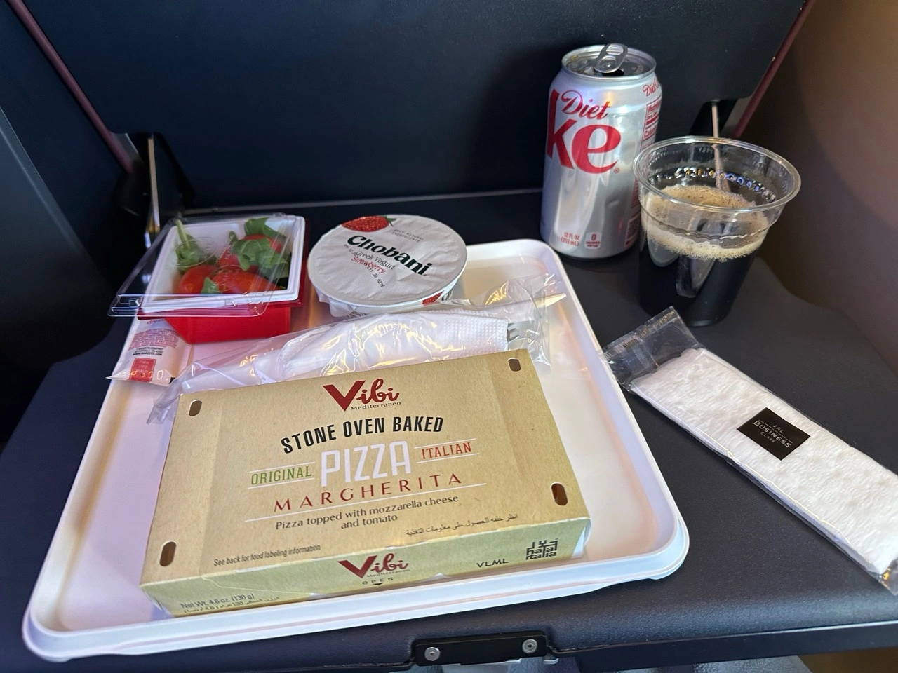

I recently had the chance to make my first round-the-world trip, starting from the south of Argentina, going to Tokyo and back. As I was assembling the itinerary, I realized there was an opportunity to go via New York (JFK) and take Japan Airlines to Tokyo Haneda, operated by their new flagship, A350-1000. The flight runs daily, but some days are still operated by a 777, so even though the plan was exciting, there was still a chance that they changed the equipment last minute.

<table align="center">
<tr>
  <td><b>Route</b></td>
  <td>JFK-HND</td>
</tr>
<tr>
  <td><b>Flight</b></td>
  <td>JL05</td>
</tr>
<tr>
  <td><b>Cabin</b></td>
  <td>Premium Economy</td>
</tr>
<tr>
  <td><b>Equipment</b></td>
  <td>Airbus A350-1000</td>
</tr>
<tr>
  <td><b>Aircraft</b></td>
  <td>JA02WJ</td>
</tr>
<tr>
  <td><b>Flight Time</b></td>
  <td>14h 32m</td>
</tr>
<tr>
  <td><b>Cost</b></td>
  <td>50,000 AAdvantage miles + $5.6 in taxes</td>
</tr>
</table>

## Japan Airlines (JAL) A350-1000 Premium Economy Review: New York to Tokyo

### Booking

I had a few AAdvantage miles sitting still, so I used AwardFares to check availability. I found several seats released (4+) in both Economy and Premium Economy, but no Biz or First. I went ahead and booked it; I was excited to try their Premium Economy and see if it made a difference with Economy.

If you want to perform the exact search, use the following query:

- **Loyalty Program**: [AAdvantage](https://awardfares.com/search?JFK.HND.;a:JL;e:351;z:aadvantage)
- **Route**: [New York (JFK) to Tokyo (HND)](https://awardfares.com/search?JFK.HND.;a:JL;e:351;z:aadvantage)
- **Airline**: [Japan Airlines](https://awardfares.com/search?JFK.HND.;a:JL;e:351;z:aadvantage)
- **Equipment**: [Airbus A350-1000](https://awardfares.com/search?JFK.HND.;a:JL;e:351;z:aadvantage)

<figure>

</figure>

### Airplane

I landed at JFK very early from another flight (before 6 am) and went straight to my next flight gate. Hours later, the A350-1000 showed up. It was shiny and beautiful, and you could tell it was new.

<figure>

</figure>

Interestingly, most seats are allocated to First and Business Class, with only a few to Premium Economy and Economy. To put this in perspective, I had seat 18K even though I was towards the end of the aircraft!

### Seat

The boarding was surprisingly smooth and quiet. They even used biometric procedures to check passengers. Hence, it took seconds to go in front of a camera and be allowed to board.

When you get on the plane, the crew welcomes you warmly and shows you your seat. You first notice how huge the Business Class cabin is. There are dozens of private suites in Business, which look incredibly comfortable and private.

At the seat, a pillow, blanket, and an amenity kit were waiting, along with a printed immigration form.

<figure>

</figure>

When it comes to the design, the seat has a myriad of details that make it feel premium and more comfortable than other Premium Economy seats I've tried:

- First, there's a privacy screen you can close that completely blocks the passenger sitting by your side.
- Storage under the front seat is decent and lets you quickly put shoes without sacrificing mobility.
- The headrest looked sleek and felt fresh due to its leather cover.
- The armrests had room for storage on both sides.
- The tray table was large and sturdy. Very comfortable for working and also eating.
- The seat had a phone/tablet and holder on top of the tray table that was quite handy for charging your phone or holding a glass if you wanted to close the table.
- There was an adjustable footrest that could come all the way up without any gaps. It turned out to be very comfortable if you want to put your legs up during part of the trip.
- The IFE screen was huge.
- Maybe one uncomfortable thing was the very thick and heavy seatbelt.

<figure>

</figure>

### Cabin

The Premium Economy cabin was tiny, with only three rows. It felt very private and cozy and had direct access to the toilets behind it. The seats in the middle of the plane have extra privacy in the center, so the layout is perfect if you were traveling in pairs or groups of 2.

<figure>

</figure>

A galley (with kitchen) dividing Economy from Premium Economy is right next to the toilets. From there, you can feel how small the Economy cabin is.

### IFE

One of the things I loved the most was the IFE. Not only was the screen huge, but it was also very modern and responsive. Their system lets you log in and continue watching from your account or favorites. If you don't have an account, they also provide a code with the specific timestamp and movie you are watching in case you want to continue watching on the following flight (if you are connecting).

Of course, as with every other A350, you can access the tail and bottom cameras.

<figure>

</figure>

### Amenities

The amenity kit contained a toothbrush, earplugs, sleepers, and a sleep mask. It also included a bottle of water.

### WIFI

JAL's A350-1000 offers WIFI onboard, which is paid. The entire flight costs $19.95. Luckily, there was an ongoing promotion on JAL's 70th anniversary, and they offered free internet for the **full flight** in exchange for filling out a survey.

The process was quite simple, and after 2 minutes, I was connected for the whole flight. The speed was astonishing; even though some areas were without coverage, it worked for most of the flight.

<figure>

</figure>

### Toilets

The toilets were one of the highlights of the flight. Keep in mind that these toilets are shared with Economy Class. The design was elegant and modern, and they were equipped with Bidet functionality (as Japanese lavatories). The most impressive part was that they always felt fresh and spotless (yes, all of them). I shout out to JAL's crew, who did an excellent job.

<figure>

</figure>

### Meals

Another aspect of which I was pleasantly surprised was the catering. Considering it was a 12-hour flight, and comparing it to European and US-based airlines, they served an astonishing amount of food, which was also delicious.

There were 3 'main' meals, plus two snacks in between with coffee, tea and other drinks.

#### Meal 1. Lunch

During boarding, you are given a simple menu with all the options they will have throughout the flight.

<figure>

</figure>

Before the main service, they offer you a welcome drink with a snack. I ordered a Gin & Tonic and then Asahi beer.

<figure>

</figure>

For lunch, there were two options: fish or chicken. A nice touch was that the crew held a card with pictures of the meal so you could have an idea before ordering! It was super handy. I went for the salmon, and my travel partner for the chicken.

The meal was carefully crafted and was full of flavor; kudos to JAL's catering, even if it was ex-US. It came with several small side dishes that were also very tasty.

<figure>

</figure>

They gave Haagen Daaz ice cream and green tea for dessert.

### Meal 2. Udon Snack

After 5 hours, they offered Udon ramen and a muffin. You could also choose other options, such as a plate of cheese and fruit. I love the JAL-branded pot of noodles.

<figure>

</figure>

### Meal 3. Pre Arrival

About one and a half hours before arrival, they served a 'light dinner'. I went for the Western-style option, which was a pizza. It was surprisingly good! It also came with a Chobani Greek-style yogurt.

<figure>

</figure>

## Arrival

The approach and landing in Tokyo were beautiful. It was cloudy initially, but for moments, you could see the entire city, even Mt. Fuji.

<figure>

</figure>

## Conclusion: Is JAL A350-1000 Premium Economy Worth It?

I've been fortunate to take many flights in Premium Economy, mainly between South America and Europe or the US. While it was undoubtedly a slight upgrade from Economy, the experience often feels closer to *Economy* than to a *Premium* cabin. However, this time was different.

JAL offers an excellent product that stands out from the regular Economy Class. The seat is wider, more private, and has plenty of small features that make it feel closer to a Business Class seat (including a great IFE system). The cabin is cozy and intimate, working great when traveling in pairs. Toilets are accessible and always clean and fresh. The meals were tasty and abundant, with unlimited snacks, coffee, and drinks in between if you are bored or hungry.

Last, I want to make a unique distinction to the crew. Their attention to detail, warmth, and kindness felt genuine and caring. It made this flight worth remembering, above all other items.

Overall, I had a great experience and wouldn't hesitate to upgrade from Economy if I had the chance again. It's totally worth it.

## Read More

Make sure to also check these posts out

- [How To Book The New JAL Flagship A350 With Miles or Points](https://blog.awardfares.com/jal-flagship-a350/)
- [JAL First Class Lounge Haneda](https://blog.awardfares.com/jal-first-class-lounge-haneda/)
- [STARLUX A321neo Economy Class from Taipei to Tokyo (2024)](https://blog.awardfares.com/starlux-economy-tpe-nrt/)
- [KLM Europe Short-Haul Business Class In 2024 (737-900ER)](https://blog.awardfares.com/klm-europe-business-ams-cph/)
- [Lufthansa's A350 Long-Haul Business Class (Avoid)](https://blog.awardfares.com/lufthansa-long-haul-business-a350/)

