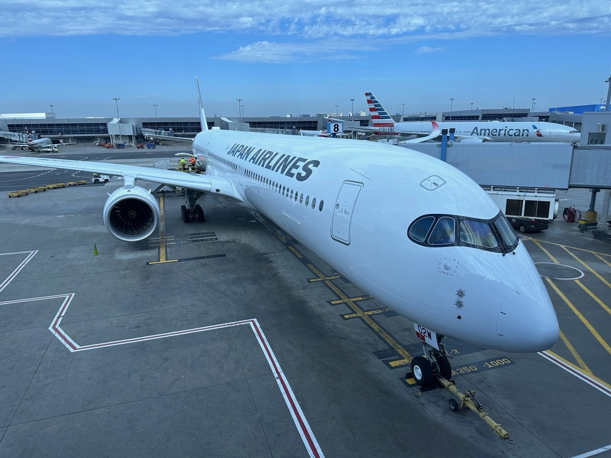
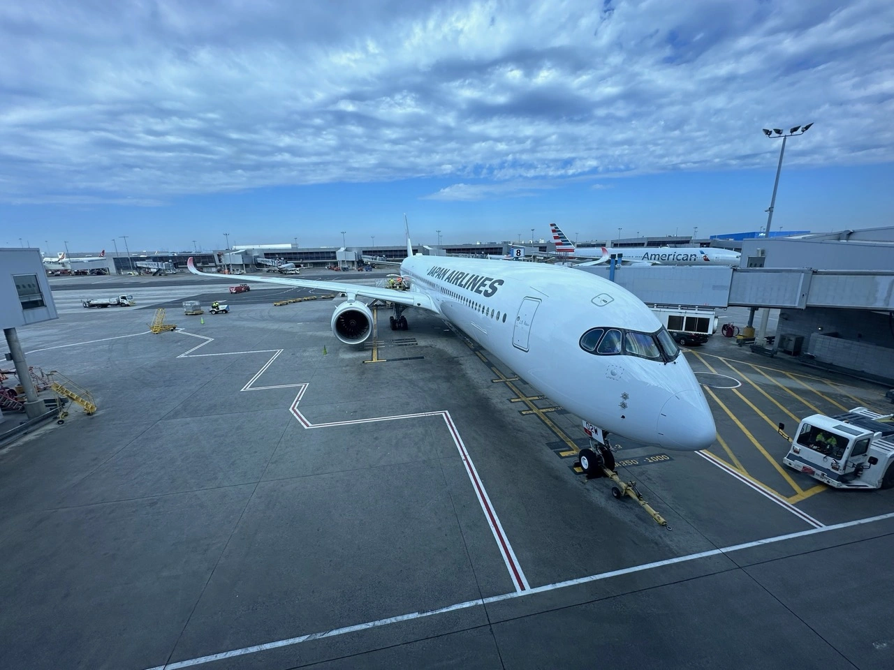
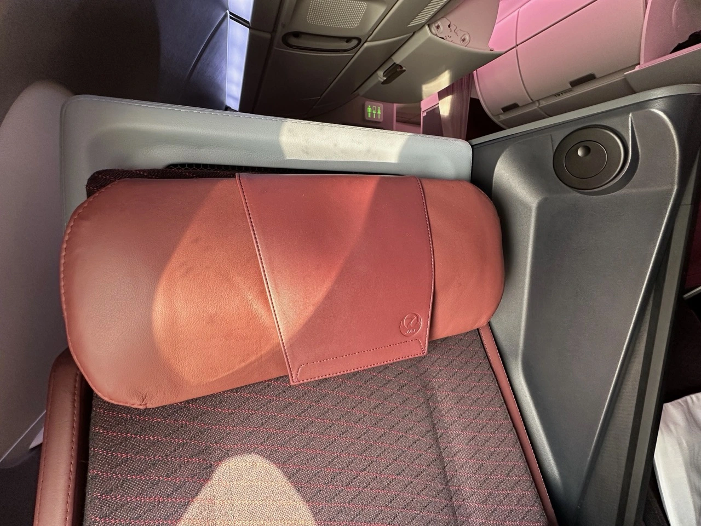
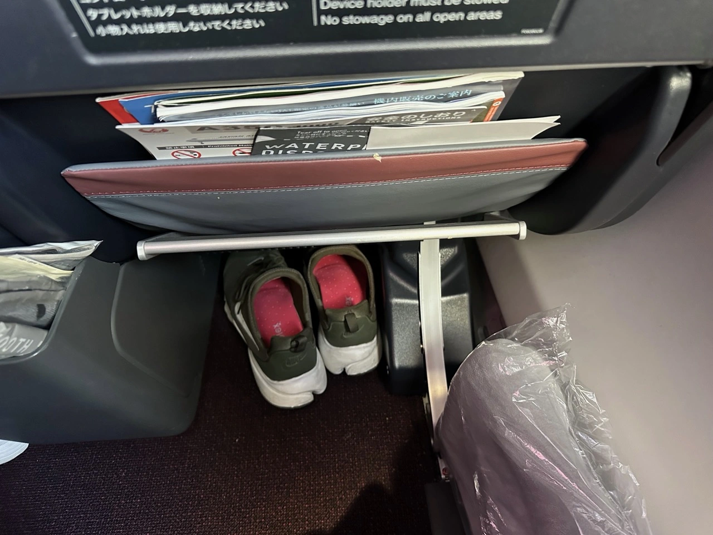
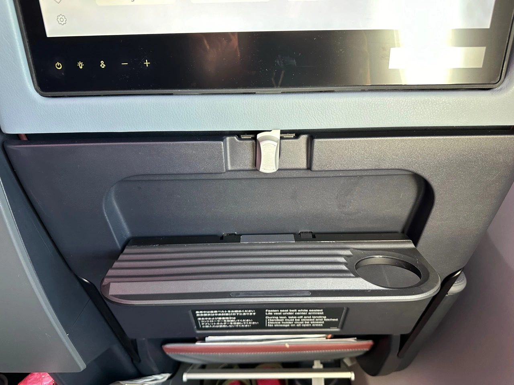
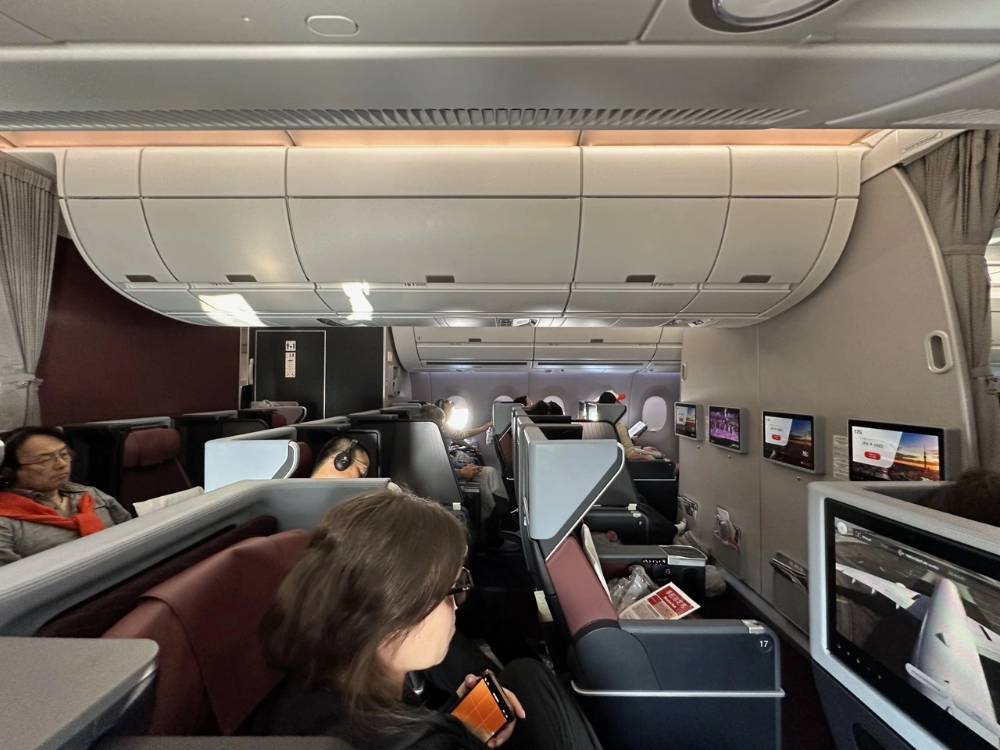
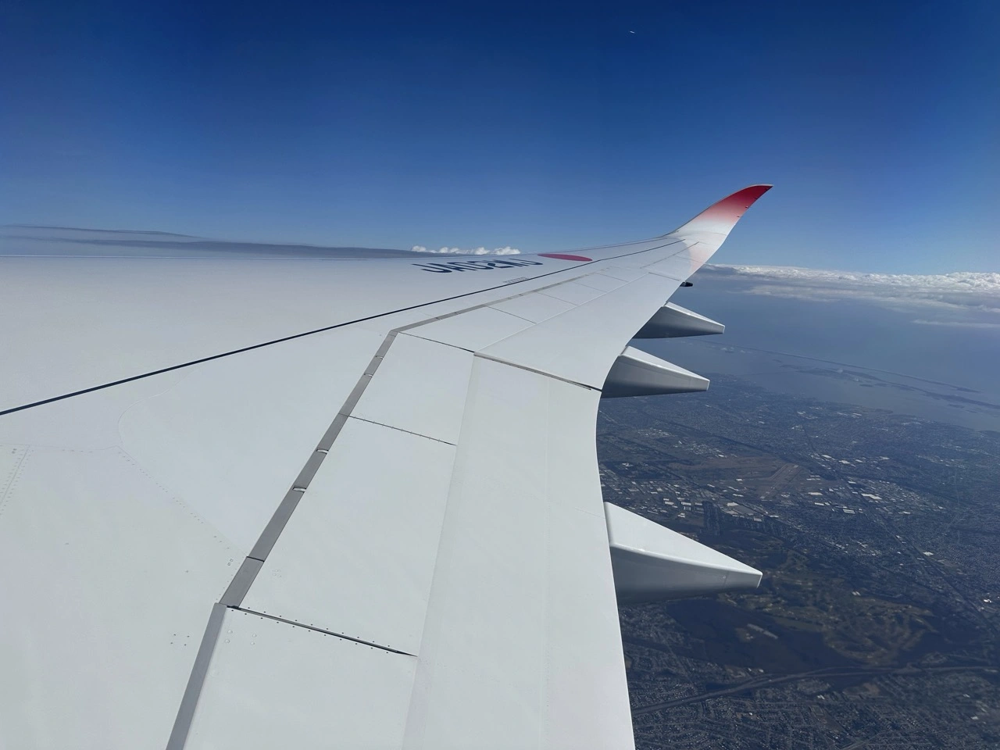
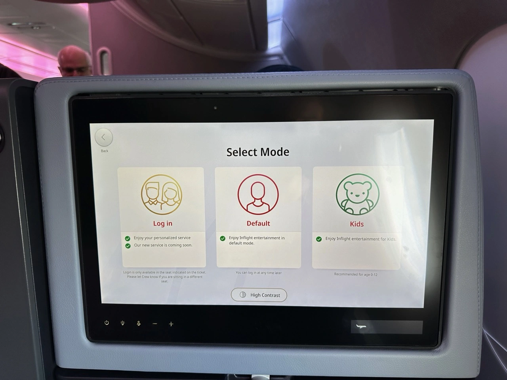
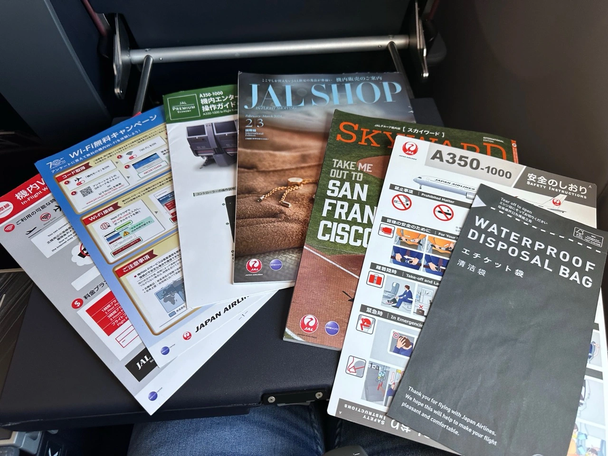
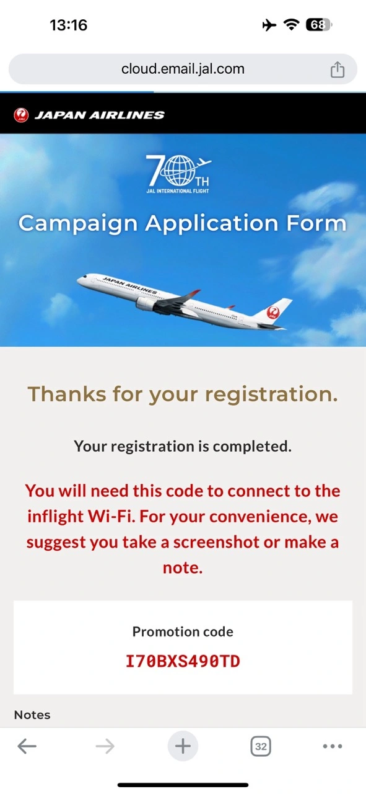

Intro

<table align="center">
<tr>
  <td><b>Route</b></td>
  <td>JFK-HND</td>
</tr>
<tr>
  <td><b>Flight</b></td>
  <td>JL05</td>
</tr>
<tr>
  <td><b>Cabin</b></td>
  <td>Premium Economy</td>
</tr>
<tr>
  <td><b>Equipment</b></td>
  <td>Airbus A350-1000</td>
</tr>
<tr>
  <td><b>Aircraft</b></td>
  <td>JA02WJ</td>
</tr>
<tr>
  <td><b>Flight Time</b></td>
  <td>14h 32m</td>
</tr>
<tr>
  <td><b>Cost</b></td>
  <td>59,000 AAdvantage miles</td>
</tr>
</table>

## Airplane

<figure>

</figure>

## Seat

<figure>

</figure>

<figure>

</figure>

## Cabin

## IFE

<figure>

</figure>

## WIFI

<figure>

</figure>

## Meals

<figure>

</figure>

## Read More

Make sure to also check these posts out

- [How To Book The New JAL Flagship A350 With Miles or Points](https://blog.awardfares.com/jal-flagship-a350/)
- [JAL First Class Lounge Haneda](https://blog.awardfares.com/jal-first-class-lounge-haneda/)
- [STARLUX A321neo Economy Class from Taipei to Tokyo (2024)](https://blog.awardfares.com/starlux-economy-tpe-nrt/)
- [KLM Europe Short-Haul Business Class In 2024 (737-900ER)](https://blog.awardfares.com/klm-europe-business-ams-cph/)
- [Lufthansa's A350 Long-Haul Business Class (Avoid)](https://blog.awardfares.com/lufthansa-long-haul-business-a350/)
