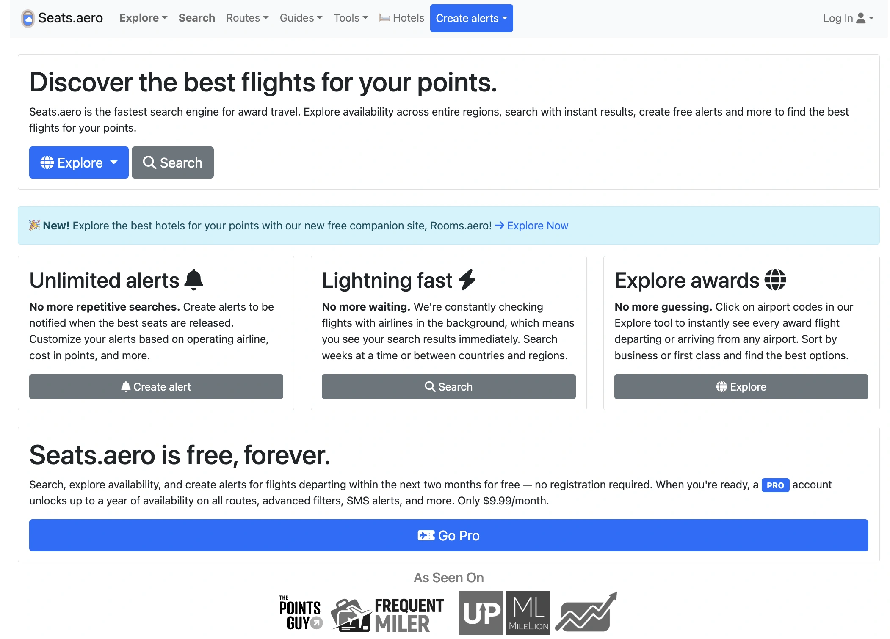
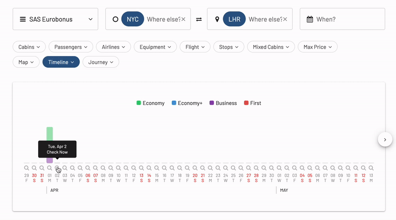
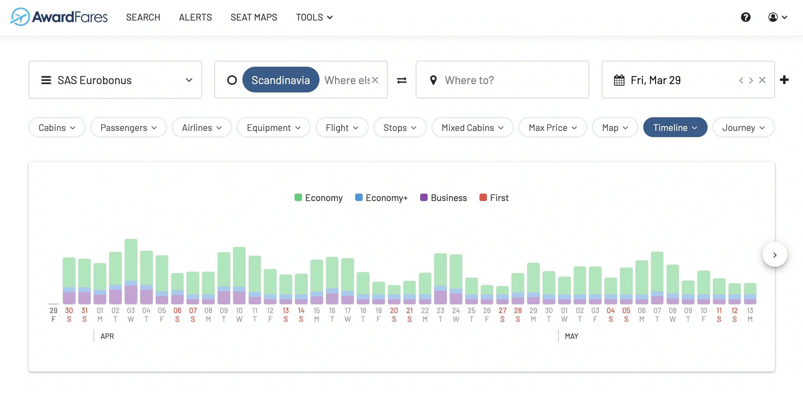
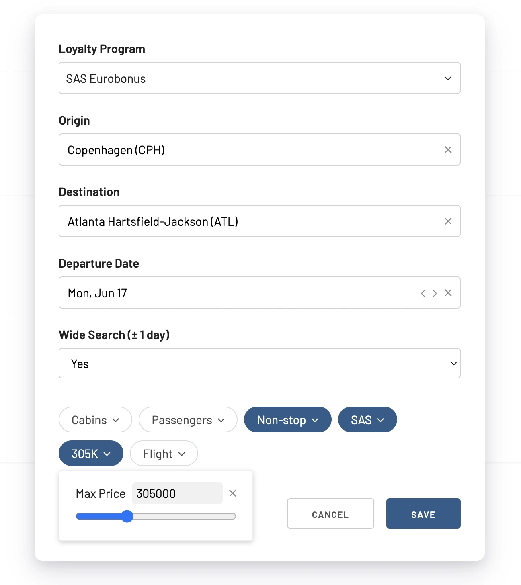
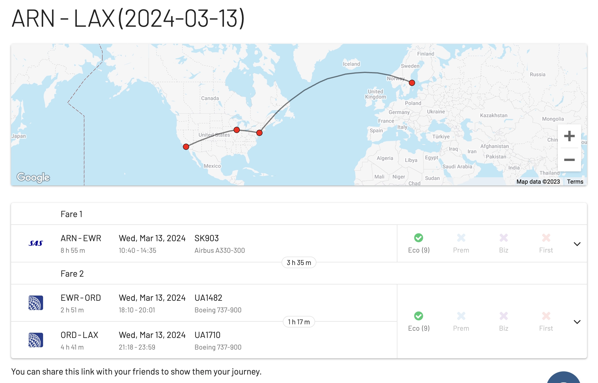
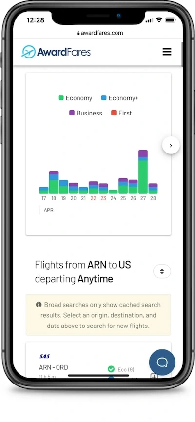
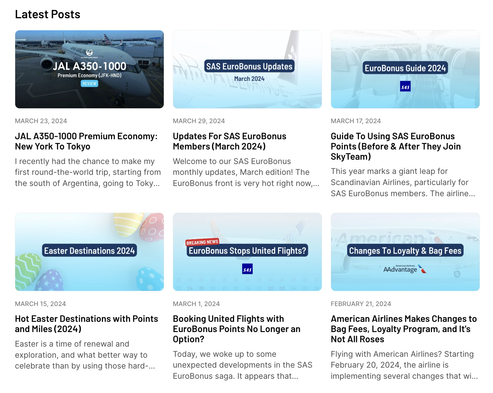

Traveling on points and miles is a fantastic way to experience the world, but finding award availability can feel like deciphering ancient scrolls. That's where award search tools come in. AwardFares is one of the easiest ways to search for your next free flight using points or miles. With a few clicks, you can search and gather helpful information without logging in to your frequent flyer account or dealing with slow award search portals. AwardFares's modern user interface allows search availability across multiple frequent flyer programs, set up alerts, look at seat maps, and plan journeys in a few minutes.

In a similar way, [seats.aero](https://seats.aero/) is a web-based search tool specifically designed to help frequent flyers find award availability on various airlines and mileage programs. It excels at searching for award seats on long-haul international flights. While both platforms have their competitive edges, there are specific differences worth mentioning.

In this post we look at some essential differences between AwardFares and seats.aero.

### In this post

- [What is seats.aero?](#what-is-seatsaero)
- [AwardFares vs. seats.aero: Key Differences](#awardfares-vs-seatsaero-key-differences)
- [Conclusion](#conclusion)
- [Become a Pro Travel Hacker](#become-a-pro-travel-hacker)

## What is seats.aero?

[**seats.aero**](https://seats.aero/) is a web-based search tool specifically designed to help frequent flyers find award availability on various airlines and mileage programs. It's renowned for its advanced search functionalities, allowing users to fine-tune searches with great detail, including searching +/- days, specifying the number of seats, and filtering by cabin class. Its alert system is versatile, offering regular alerts for specific routes and dates, and cabin alerts for broader searches. Additionally, seats.aero includes tools like the Air Canada eUpgrade Finder. However, it does assume a certain level of expertise from its users and might not cover all routes or mileage programs, notably missing Avios and Cathay Asia Miles​.

## AwardFares vs. seats.aero: Key Differences

### 1. Realtime Results

No more chasing ghost availabilities! AwardFares pulls live data, giving you the most up-to-date picture of award seats. Seats.aero pre-loads availability, which can be a timesaver, but the data might not always be current.

### 2. Effortless Navigation

AwardFares' user-friendly interface makes hunting your dream award flight a breeze, even for beginners. It's ideal for users who want quick answers without going through unnecessary details. From color-coded charts to clear graphics, everything is thought-through to make the miles game an easy win.

### 3. Granular Alerts (Price-based)

AwardFares alert system is robust and highly customizable. It allows you to set up specific notifications for routes, dates, and even prices, ensuring you take advantage of every opportunity.

> Read our [complete Alerts tutorial here](https://blog.awardfares.com/alerts/).

### 4. Map It Out with Journey Planner

One of the most impressive features is our Journey Planner. This powerful feature lets you unlock itineraries to your dream destination by planning multiple segments quickly and conveniently. Users can select add or remove legs, find connections within 24 hours, duplicate journeys, and see the itinerary on a map in just a few clicks. Plus, it's possible to work on multiple journeys simultaneously and share them with friends and family via a unique link!

> Read our [complete Journey Planner tutorial here](https://blog.awardfares.com/journey-planner/).

### 5. Mobile Optimization

AwardFares has been meant for mobile from day one. It doesn’t compromise the intuitive searches nor the beautiful user interface when going mobile, and you can even [install it on your phone](https://blog.awardfares.com/awardfares-mobile-app/).

### 6. Broad Region and Metro Area Searches

AwardFares allows users to search for award flights across entire regions, countries, or continents, providing a broader perspective and more options. This feature is particularly useful for travelers with flexible destinations or those looking to explore multiple options within a specific area​.

Read our [full tutorial on Metro Area Searches here](https://blog.awardfares.com/metro-area-search-guide/).

### 7. Blog, Guides, and Resources

At AwardFares, we spend significant time crafting state-of-the-art guides and updated resources to match what our users seek. The best flight redemptions, per-program sweet spots, tips for building perfect award trips, and featuring deep dives are available on our fantastic blog and monthly newsletter.

## Conclusion

Both AwardFares and seats.aero offer a wide range of tools that help frequent flyers. If budget is a major concern, and you're comfortable with potentially outdated data, seats.aero presents an entirely free option. However, for those who **prioritize simplicity**, **up-to-the-minute accuracy**, and a **modern interface**, AwardFares stands out. Ultimately, the best tool depends on your individual preferences and travel style.

## Become a Pro Travel Hacker

You can [try AwardFares for free](https://awardfares.com/). We regularly roll out new features and improvements, so [sign up for our monthly newsletter](https://awardfares.com/newsletter) to stay on top of the latest news, announcements, and pro tips.

With our [Gold and Diamond tiers](https://awardfares.com/pricing), you can access premium features such as unlimited daily searches, alerts, seat maps, flight schedules, and more!

Our guides have all the information you need to be a pro travel hacker and explore the world on points. Here are some related posts you might enjoy:

- [AwardFares vs. Point.me](https://blog.awardfares.com/awardfares-vs-point-me/)
- [AwardFares vs. ExpertFlyer](https://blog.awardfares.com/awardfares-vs-expertflyer/)
- [AwardFares & AwardHacker: A Dynamic Duo for Maximizing Your Miles and Points](https://blog.awardfares.com/awardhacker/)
- [AwardFares vs. Cowtool](https://blog.awardfares.com/awardfares-vs-cowtool/)
- [Demystifying Award Charts: All You Need To Know (2023)](https://blog.awardfares.com/demystifying-award-charts/)
- [How To Find Cheap Award Flights And Identify Good Redemptions (Step-by-step)](https://blog.awardfares.com/how-to-find-cheap-award-flights/)