We're glad to announce a major expansion to AwardFares' award search capabilities – **Virgin Atlantic Flying Club** is now on board!

This integration brings a world of new possibilities to our users who are Flying Club members or collect Virgin Points through partner programs and credit cards. Now, you can easily search AwardFares to find the best ways to redeem your points for flights on Virgin Atlantic, alongside award options from other airlines in our comprehensive search engine.

### What's New?

- [Why Virgin Atlantic Flying Club?](#why-virgin-atlantic-flying-club)
- [What AwardFares Offers to Flying Club Members](#what-awardfares-offers-to-flying-club-members)
- [Finding Virgin Atlantic Award Flights with AwardFares](#finding-virgin-atlantic-award-flights-with-awardfares)
- [Top Flying Club Routes](#top-flying-club-routes)
- [Virgin Atlantic Upper Class](#virgin-atlantic-upper-class)
- [Become a Flying Club Pro](#become-a-flying-club-pro)

## Why Virgin Atlantic Flying Club?

For frequent flyers across the Atlantic, **Virgin Atlantic Flying Club** offers a compelling loyalty program. Beyond standard mileage accrual, the Club's strength lies in its tier structure. Upper tiers unlock benefits like complimentary upgrades on flights operated by Virgin Atlantic itself - important as partner airlines often have limited upgrade availability. Virgin Atlantic also boasts a unique partnership with Delta Air Lines, allowing for status matching and earning/redeeming miles on both carriers' extensive networks.

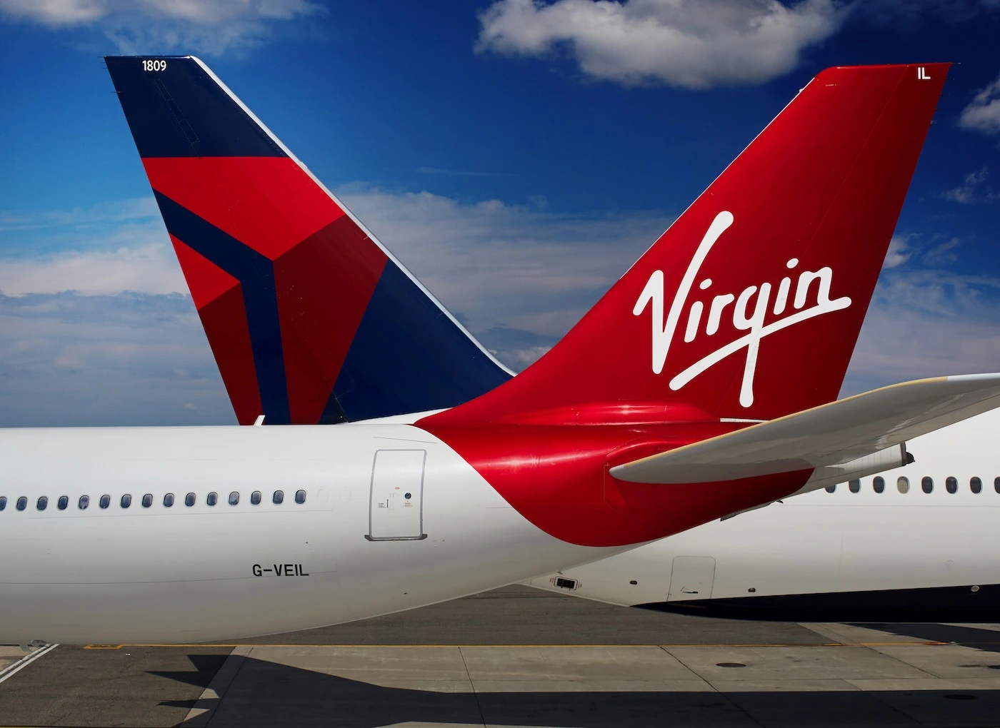

## What AwardFares Offers to Flying Club Members

- **Up-to-the-minute Availability**: We provide real-time information on award seat availability for Virgin Atlantic flights.
- **Flexible Searching**: Search for specific dates or explore options across a date range with our Timeline View.
- **More Choices, Better Decisions**: Compare award options across different airlines and loyalty programs to find the best fit for your travel plans.
- **Maximize Your Points**: AwardFares helps you sort and find the most value-efficient ways to use your Virgin Points.

## Finding Virgin Atlantic Award Flights with AwardFares

**AwardFares never asks for your frequent flyer program login credentials.
**

### 1. Visit [AwardFares](https://awardfares.com/signup)

Creating an account is optional, but registration is free and unlocks additional features. [Sign up here to get started.](https://awardfares.com/signup)

### 2. Choose Flying Club in the *Loyalty Program Field*

Select **Virgin Atlantic Flying Club** from the dropdown menu to start your award flight search.

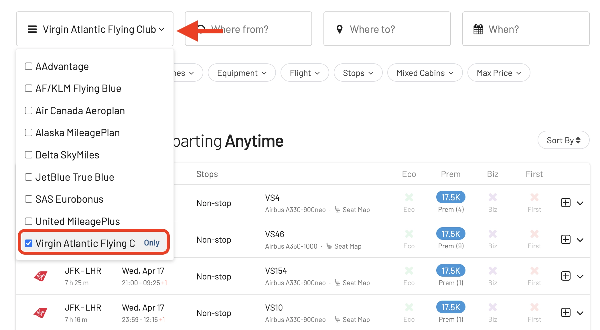

### 3. Input Your Desired Route

Add your origin and destination airports, and AwardFares will search for available award flights, including those with stops. Filters for non-stop flights are also available.

In this example, we search for flights [between London (LHR) to New York (NYC)](https://awardfares.com/search?LHR.NYC.;z:flyingclub).

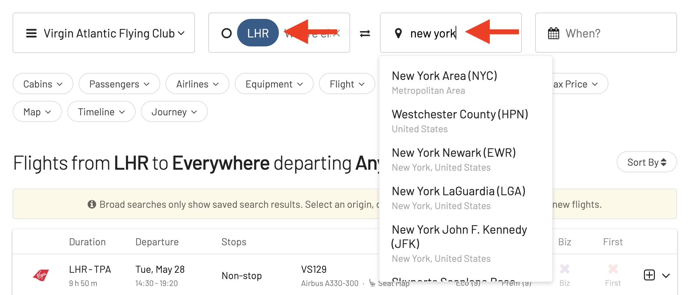

### 4. Select Dates

Either input specific dates or use the Timeline View to explore availability over different periods. This view helps you easily compare the availability and class of service across various days.

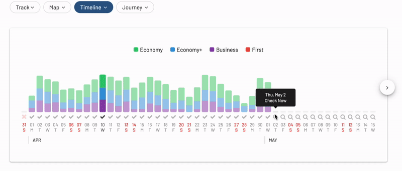

You'll see the result list right below:

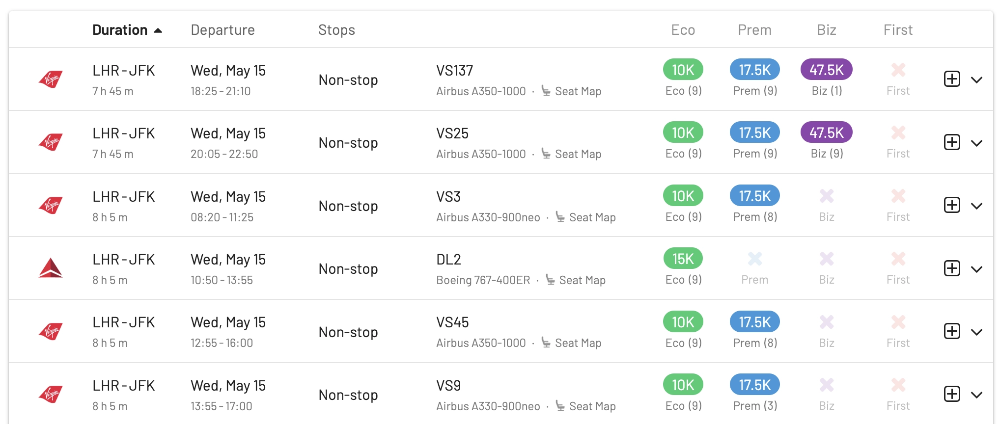

In addition, you can tap anywhere on the flight to display more details in an expanded view, such as aircraft type, and even [get the current seat maps](https://blog.awardfares.com/seatmaps-guide/) to see which seats are free or occupied.

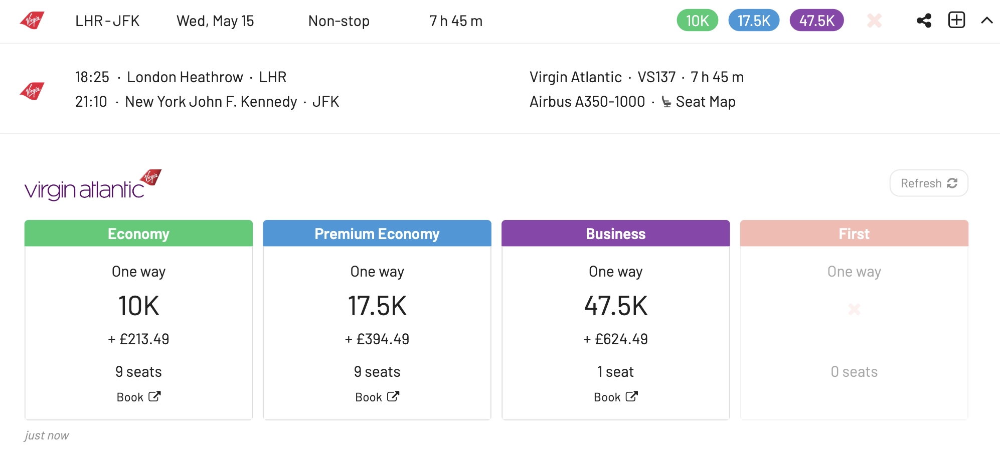

### 5. Sort by Price

AwardFares displays results in real-time, allowing you to sort options by cost-effectiveness across different dates and airlines.

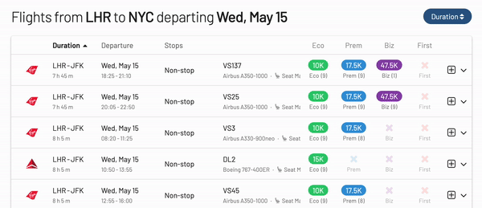

### 6. Book via Virgin Atlantic's Website

Once you find your desired flight, click the **Book** button.

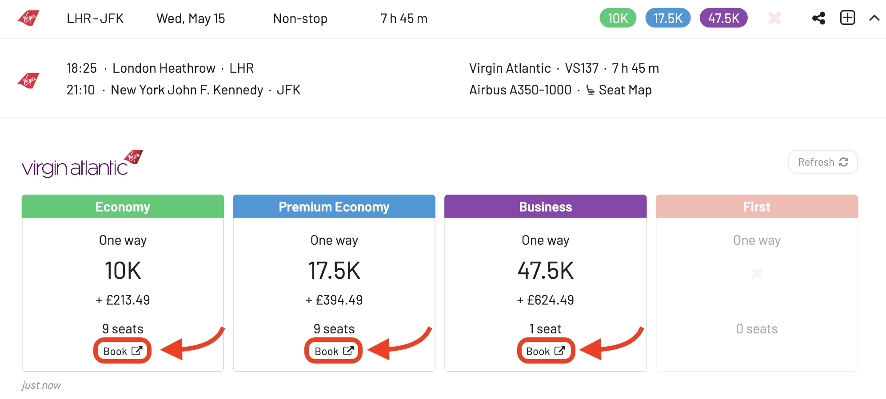

AwardFares will redirect you to Virgin Atlantic's website to complete your booking without the need to re-enter your search criteria, as it will be pre-populated.

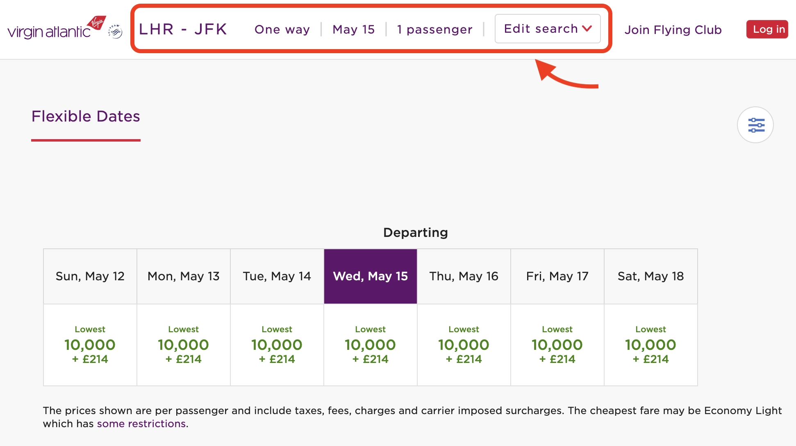

## Top Flying Club Routes

Using Virgin Atlantic Flying Club miles can be particularly rewarding on routes where the airline offers unique services, exceptional value, or access to destinations that are either popular or hard to reach. Here are some of the top Virgin Atlantic routes to consider for redeeming Flying Club miles, each chosen for its potential value, the experience it offers, or the popularity among travelers:

1. [**London Heathrow (LHR) to New York (JFK)**](https://awardfares.com/search?LHR.JFK.;z:flyingclub). This iconic transatlantic route is among the most popular for using Flying Club miles. Not only does it serve as a key business and leisure corridor, but it also frequently has award availability. The route is serviced by Virgin Atlantic's newest aircraft, offering an exceptional experience in any class, particularly in Upper Class.
2. [**London Heathrow (LHR) to Los Angeles (LAX)**](https://awardfares.com/search?LHR.LAX.;z:flyingclub). For those looking to experience the West Coast of the United States, this route provides an excellent opportunity to use your miles for a long-haul flight. The service includes Virgin Atlantic's renowned in-flight entertainment and meal service, making the journey as enjoyable as the destination.
3. [**London Heathrow (LHR) to Barbados (BGI)**](https://awardfares.com/search?LHR.BGI.;z:flyingclub). A favorite among British holidaymakers, flights to Barbados offer a great way to use your miles for a tropical getaway. Redeeming miles for this route can provide excellent value, especially during peak travel seasons when cash fares tend to skyrocket.
4. [**London Heathrow (LHR) to Shanghai (PVG)**](https://awardfares.com/search?LHR.PVG.;z:flyingclub). For travelers heading to Asia, Shanghai represents an exciting destination with rich cultural experiences. Flying Club miles can unlock direct flights to this bustling metropolis, allowing travelers to explore China's economic and technological hub.
5. [**Manchester (MAN) to Orlando (MCO)**](https://awardfares.com/search?LHR.MCO.;z:flyingclub). Ideal for families planning a trip to the theme parks, this route directly connects the UK with the heart of Florida's entertainment district. Using miles for this route can be particularly valuable during school holidays when prices tend to be higher.
6. [**London Heathrow (LHR) to Johannesburg (JNB)**](https://awardfares.com/search?LHR.JNB.;z:flyingclub). South Africa is a destination of unparalleled beauty and diversity. Using Flying Club miles for this long-haul flight can open the door to exploring everything from Johannesburg's vibrant city life to safaris in the national parks.
7. [**London Heathrow (LHR) to Mumbai (BOM)**](https://awardfares.com/search?LHR.BOM.;z:flyingclub). Offering a direct link to one of India's most dynamic cities, this route allows travelers to use their miles for an adventure in Mumbai, known for its bustling markets, historic architecture, and vibrant culture.
8. [**London Heathrow (LHR) to Hong Kong (HKG)**](https://awardfares.com/search?LHR.HKG.;z:flyingclub). This route is perfect for travelers looking to immerse themselves in the fusion of East and West. Redeeming miles for a flight to Hong Kong provides access to a city known for its skyline, culinary scene, and bustling markets.

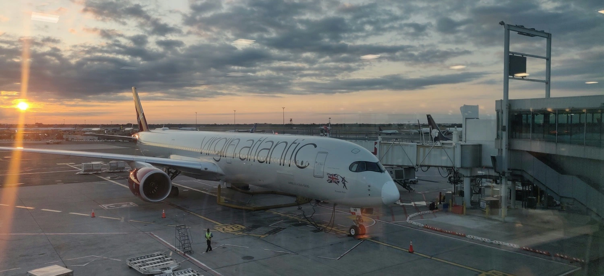

## Virgin Atlantic Upper Class

By incorporating Virgin Atlantic Flying Club awards into our platform, it's easy to start exploring incredible award seats such as Upper Class on Virgin Atlantic Flights.

Upper Class is their premium cabin experience, designed to feel like a luxurious "home away from home" at 30,000 feet. Here are some of its strengths:

- **Seats**: These convert into fully flat beds for a comfortable night's sleep.  While some reviews mention a lack of width compared to competitors, Virgin Atlantic makes up for it with ample legroom and storage space.
- **Exclusive Perks**: Upper Class passengers enjoy a premium pre-flight experience with priority check-in, fast-track security, and access to Virgin Atlantic Clubhouses, which offer complimentary food, drinks, and relaxation areas.
- **Fine Dining**: Forget airplane food. Upper Class offers a delicious à la carte menu with multiple courses, featuring high-quality ingredients and pre-order options.
- **The Retreat Suite**: For an extra level of luxury, Virgin Atlantic offers exclusive Retreat Suites on their A330neo aircraft. These private havens boast even more space, adjustable mood lighting, and an unparalleled à la carte dining experience.

<figure>
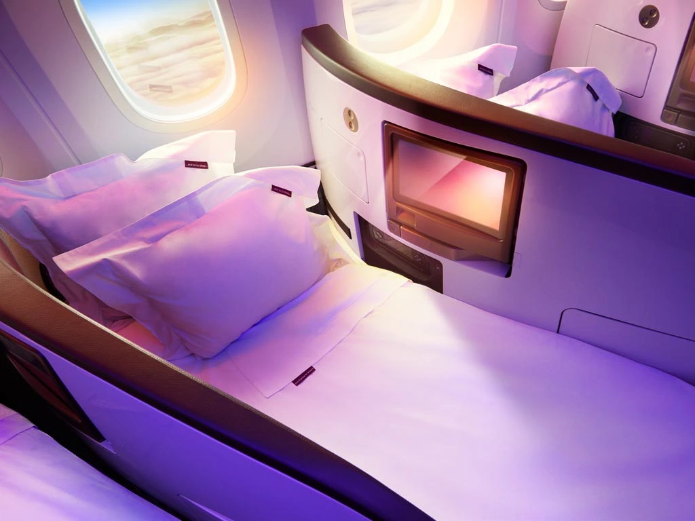
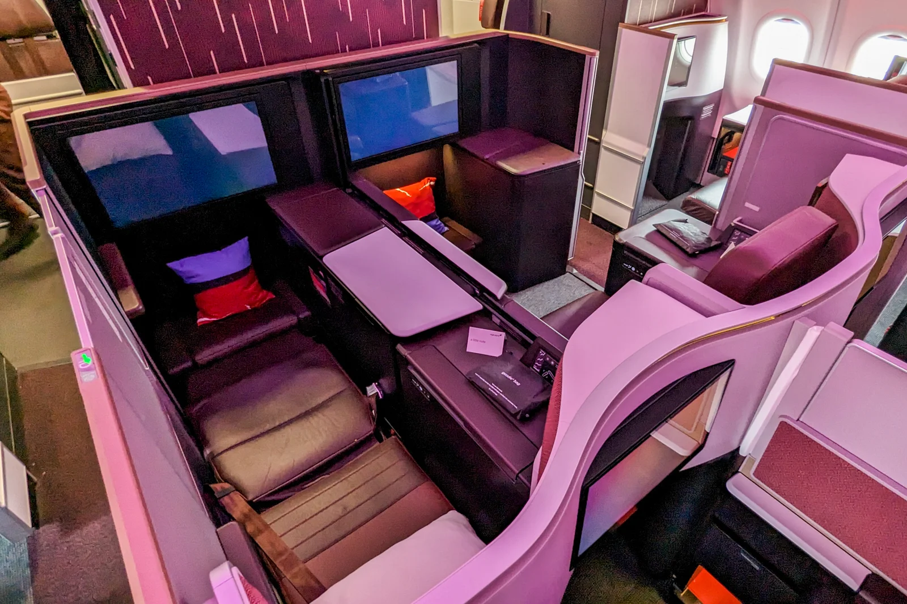
</figure>

## Become a Flying Club Pro

You can [try AwardFares for free](https://awardfares.com/). We regularly roll out new features and improvements, so [sign up for our monthly newsletter](https://awardfares.com/newsletter) to stay on top of the latest news, announcements, and pro tips.

With our [Gold and Diamond tiers](https://awardfares.com/pricing), you can access premium features such as unlimited daily searches, alerts, seat maps, flight schedules, and more!

Our guides have all the information you need to be a pro travel hacker and explore the world on points. Here are some related posts you might enjoy:

- [Top Frequent Flyer Programs To Consider In 2024 (Our Picks)](https://blog.awardfares.com/frequent-flyer-programs-2024/)
- [How To Find Cheap Award Flights And Identify Good Redemptions (Step-by-step)](https://blog.awardfares.com/how-to-find-cheap-award-flights/)
- [Demystifying Award Charts: All You Need To Know (2023)](https://blog.awardfares.com/demystifying-award-charts/)
- [Never Miss a Deal Again: Score the Perfect Fare with New Price Alerts and Filters](https://blog.awardfares.com/price-alerts/)