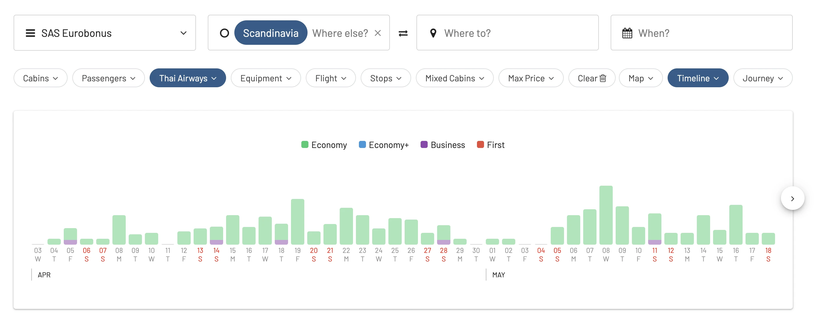
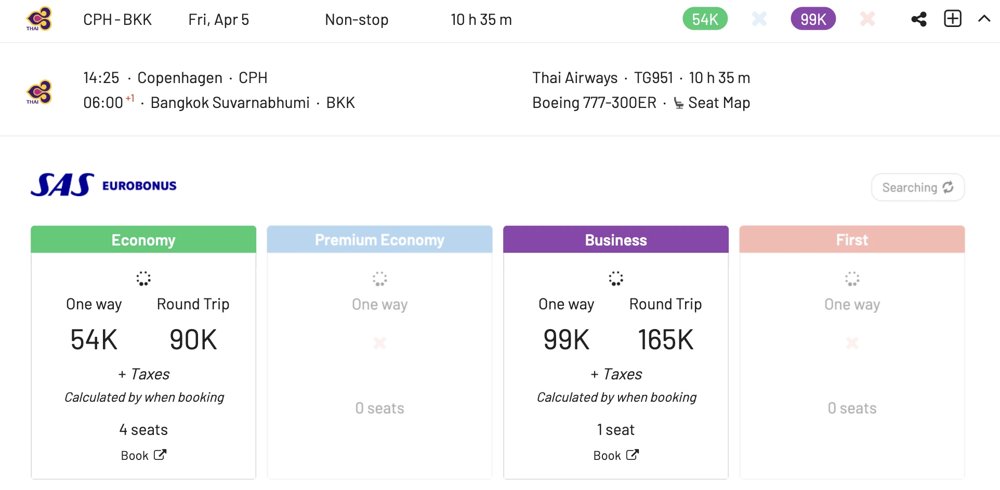
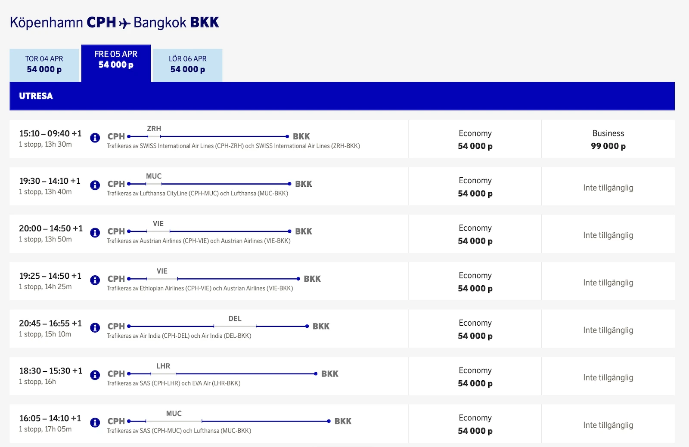

More breaking news (under development) on the SAS front. It all looks like it's no longer possible to book flights on Thai Airways with EuroBonus points. After [United being disabled last March](https://blog.awardfares.com/united-stops-working-with-eurobonus/), now the EuroBonus portal fails to book redemptions with Thai.

Several of our users have reported the same issue, and it has even been confirmed via SAS on the support line. This issue must be very recent, given that our cached data shows the most recent seats on Thai from yesterday.

Is this the beginning of the end of Star Alliance partners in EuroBonus?

## Thai Disappears from EuroBonus Bookings (What We Know)

As of this morning, Thai flights are no longer showing up on the SAS EuroBonus portal. We still see a ton of fresh results in our cached data, from yesterday.

Here's an example of a flight from Copenhagen (CPH) to Bangkok (BKK). However, when we refresh the search, it disappears.

This flight also doesn't show up on the Star Alliance search in the EuroBonus portal.

## What To Do Now? Tips for EuroBonus Members

- **Flexibility is Key**: Be prepared to explore alternative airlines and routes, especially for award travel to Asia. Consider options like connecting through other Star Alliance members (ANA, EVA Air, Lufthansa/Swiss) or utilizing other loyalty programs. Asia is becoming particularly difficult since EuroBonus already lost Singapore and Thai, plus availability on ANA is not great.
- **Stay Informed**: Keep an eye on our blog and socials, we'll be here to keep you informed. You can also sign-up to our monthly newsletter here.
- **Start Exploring Other Options**: Consider expanding your points portfolio beyond EuroBonus. Diversifying your loyalty program memberships can provide more flexibility and options when faced with such changes. Here's our take on the [best Frequent Flyer Programs of 2024](https://blog.awardfares.com/frequent-flyer-programs-2024/).
  
**Remember**: While this development might be inconvenient, it's important to adapt and remain resourceful. Award travel requires flexibility and a willingness to explore alternative options. Here at AwardFares, we're dedicated to helping you navigate these changes and find the best possible redemption opportunities. So, stay tuned, stay flexible, and happy travels!

## Save Your EuroBonus Points

You can [try AwardFares for free](https://awardfares.com/). We are rolling out new features and improvements regularly, so [sign up for our monthly newsletter](https://awardfares.com/newsletter) to stay on top of the latest news, announcements, and pro tips.

With our [Gold and Diamond tiers](https://awardfares.com/pricing), you can access premium features such as unlimited daily searches, alerts, seat maps, flight schedules, and more!

Our guides have all the information you need to be a pro travel hacker and explore the world on points. Here are some related posts you might enjoy:

- [Guide To Using SAS EuroBonus Points (Before & After They Join SkyTeam)](https://blog.awardfares.com/eurobonus-guide/)
- [Updates For SAS EuroBonus Members (March 2024)](https://blog.awardfares.com/eurobonus-updates-mar-2024/)
- [SAS EuroBonus Conscious Traveler Takes Off In 2024: Greener Flying, Greater Rewards](https://blog.awardfares.com/sas-eurobonus-conscious-traveler/)
- [Try These EuroBonus Award Flights Before SAS Leaves Star Alliance](https://blog.awardfares.com/eurobonus-star-alliance-awards/)