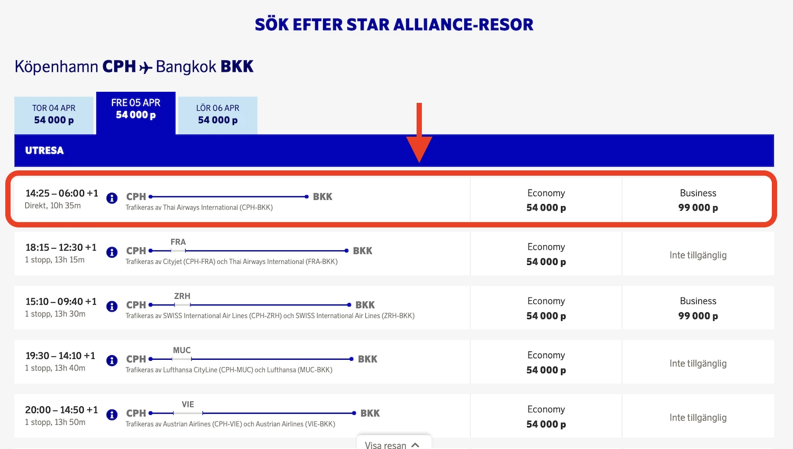

More breaking news (under development) on the SAS front. It looks like it's no longer possible to book flights on Thai Airways with EuroBonus points. After [United was disabled last March](https://blog.awardfares.com/united-stops-working-with-eurobonus/), the EuroBonus portal now fails to book redemptions with Thai.

Several users have reported the same issue, which was confirmed via SAS on the support line. This issue must be very recent, given that our cached data shows the most recent seats on Thai from yesterday.

Is this the beginning of the end of Star Alliance partners in EuroBonus?

**UPDATE April 3, 2024**: Seems the awards are showing up again, see [here](#back).

## Thai Disappears from EuroBonus Bookings (What We Know)

As of this morning, Thai flights are no longer showing up on the SAS EuroBonus portal. However, we still see a ton of fresh results in our cached data from yesterday.

Here's an example of a flight from Copenhagen (CPH) to Bangkok (BKK). However, when we refresh the search, it disappears.

This flight also doesn't show up on the Star Alliance search in the EuroBonus portal.

### UPDATE: Temporary Glitch? {#back}

Looks like award flights on Thai Airways are being restored. We still see a difference (fewer seats) compared to the data we had yesterday. It might have all been a temporary glitch from SAS IT, related to fixing ['ghost availability', as it happens with Ethiopian and Turkish sometimes](https://blog.awardfares.com/ethiopian-ghost-availability/).

In our example above, we see the flight was restored, and now the SAS portal show seats available.

## Become a EuroBonus Pro

You can [try AwardFares for free](https://awardfares.com/). We are rolling out new features and improvements regularly, so [sign up for our monthly newsletter](https://awardfares.com/newsletter) to stay on top of the latest news, announcements, and pro tips.

With our [Gold and Diamond tiers](https://awardfares.com/pricing), you can access premium features such as unlimited daily searches, alerts, seat maps, flight schedules, and more!

Our guides have all the information you need to be a pro travel hacker and explore the world on points. Here are some related posts you might enjoy:

- [Guide To Using SAS EuroBonus Points (Before & After They Join SkyTeam)](https://blog.awardfares.com/eurobonus-guide/)
- [Updates For SAS EuroBonus Members (March 2024)](https://blog.awardfares.com/eurobonus-updates-mar-2024/)
- [SAS EuroBonus Conscious Traveler Takes Off In 2024: Greener Flying, Greater Rewards](https://blog.awardfares.com/sas-eurobonus-conscious-traveler/)
- [Try These EuroBonus Award Flights Before SAS Leaves Star Alliance](https://blog.awardfares.com/eurobonus-star-alliance-awards/)