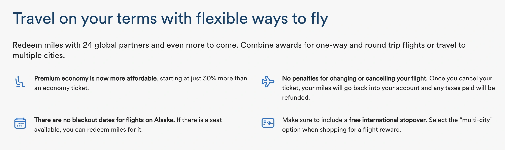
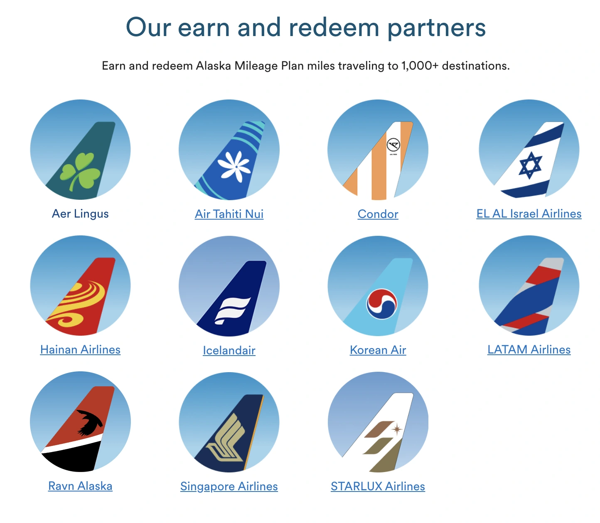

Alaska Airlines claims is *revolutionizing* the way its Mileage Plan members can redeem miles for award flights, introducing a new, streamlined award chart system set to take effect in March 2024. This overhaul simplifies the previously complex and varied award pricing, making it easier for members to understand and utilize their miles across Alaska's extensive network of partner airlines.

Here's everything you need to know about the upcoming changes and what they mean for travelers.

## Key Changes to Alaska Airlines Mileage Plan

### Unified Distance-Based Award Charts

Alaska Airlines is transitioning to a [**distance-based award chart**](https://blog.awardfares.com/demystifying-award-charts/) system. This new framework categorizes flights into three main geographic regions: the Americas, Europe, the Middle East, and Africa (EMEA), and the Asia-Pacific region. Within these regions, the number of miles required for an award flight will depend on the distance flown and the class of service. This is a significant shift from the previous model, which users loved, but also where award pricing varied widely among partners.

### Simplified Redemption Rates

Award flights will now start at just 4,500 miles for short-haul trips under 700 miles in the Americas, making some flights more accessible than before. For example, a flight from Dallas to México will require as few as 7,500 miles in Economy Class. The new charts hope to provide clearer guidelines for members, and also making more consistent redemption rates across all partner airlines.

### Enhancements and Flexibility

Alongside the new award charts, Alaska Airlines is introducing several member-friendly updates. Members can look forward to more combinations and flight cabins available for redemption, allowing for a broader range of travel options. Additionally, Alaska plans to maintain its generous stopover policy, offering travelers the chance to explore an extra city for up to 14 days en route to their final destination.

### Mixed Reactions

While Alaska Airlines claims the new award chart will reduce the miles required for 60% of nonstop partner routes in Economy and 64% in Business Class, some routes will see a price increase (in miles).

Long-haul flights on LATAM covering 4,001 to 6,000 miles will jump from 45,000 to 50,000 miles. Meanwhile, Cathay Pacific's coveted awards from the U.S. to Hong Kong will see significant increases in all classes.

### Additional Program Updates

Alaska is also promising increased partner award inventory, new partner award sales with special pricing, and upcoming flexibility to combine flights from two partner airlines in a single itinerary. These changes aim to enhance the Mileage Plan's attractiveness and utility for members.

## Mileage Plan: The New Partner Award Charts

These are the new values for partner award prices starting in March 2024.

### The Americas

| Distance (miles) | Economy starting at | Premium Economy starting at | Business starting at | First starting at |
|------------------|---------------------|-----------------------------|----------------------|-------------------|
| Less than 700    | 4,500               | 6,000                       | 9,000                | 13,500            |
| 701–1,400        | 7,500               | 10,000                      | 15,000               | 25,000            |
| 1,401–2,100      | 12,500              | 17,500                      | 25,000               | 40,000            |
| 2,101–4,000      | 17,500              | 22,500                      | 35,000               | 52,500            |
| 4,001–6,000      | 25,000              | 32,500                      | 50,000               | 75,000            |
| 6,001 and above  | 30,000              | 40,000                      | 60,000               | 90,000            |

### Europe, Middle East & Africa

| Distance (miles)  | Economy starting at | Premium Economy starting at | Business starting at | First starting at |
|-------------------|---------------------|-----------------------------|----------------------|-------------------|
| Less than 1,500   | 7,500               | 10,000                      | 15,000               | 22,500            |
| 1,501–3,500       | 22,500              | 30,000                      | 45,000               | 67,500            |
| 3,501–5,000       | 27,500              | 35,000                      | 55,000               | 82,500            |
| 5,001–7,000       | 35,000              | 45,000                      | 70,000               | 105,000           |
| 7,001–10,000      | 42,500              | 55,000                      | 85,000               | 130,000           |
| 10,000 and above  | 55,000              | 72,500                      | 110,000              | 165,000           |

### Asia Pacific

| Distance (miles) | Economy starting at | Premium Economy starting at | Business starting at | First starting at |
|------------------|---------------------|-----------------------------|----------------------|-------------------|
| Less than 1,500  | 7,500               | 10,000                      | 15,000               | 22,500            |
| 1,501–3,000      | 25,000              | 32,500                      | 50,000               | 75,000            |
| 3,001–5,000      | 30,000              | 40,000                      | 60,000               | 90,000            |
| 5,001–7,000      | 37,500              | 50,000                      | 75,000               | 110,000           |
| 7,001–10,000     | 42,500              | 55,000                      | 85,000               | 130,000           |
| 10,000 and above | 65,000              | 85,000                      | 130,000              | 195,000           |

Some of Alaska Airlines Mileage Plan non-oneworld partners (for earn and redeem) include Aer Lingus, LATAM Airlines, STARLUX Airlines, Singapore Airlines, Air Tahiti Nui, and Icelandair, among others.

## Award Chart on Alaska Airlines

| From Contiguous US including Alaska and Canada to               | Economy starting at | First starting at |
|-----------------------------------------------------------------|---------------------|-------------------|
| Contiguous US, Alaska and Canada: less than 700 miles           | 5,000               | 15,000            |
| Contiguous US, Alaska and Canada: 701–1,400 miles               | 7,500               | 25,000            |
| Contiguous US, Alaska and Canada: 1,401–2,100 miles             | 10,000              | 25,000            |
| Contiguous US, Alaska and Canada: 2,101 miles and above         | 12,500              | 30,000            |
| Hawaii: all distances                                           | 15,000              | 40,000            |
| Mexico, Central America and Caribbean: all distances            | 10,000              | 30,000            |

And for Miles and Money:

| Contiguous US including Alaska and Canada | Economy         |
|-------------------------------------------|-----------------|
| 50% discount up to $100                   | 10,000          |
| 50% discount up to $200                   | 20,000          |

To read the [full announcement and program changes, go here](https://www.alaskaair.com/content/mileage-plan/use-miles/award-charts).

## Become a Mileage Plan Pro

You can [try AwardFares for free](https://awardfares.com/). We are rolling out new features and improvements regularly, so [sign up for our monthly newsletter](https://awardfares.com/newsletter) to stay on top of the latest news, announcements, and pro tips.

With our [Gold and Diamond tiers](https://awardfares.com/pricing), you can access premium features such as unlimited daily searches, alerts, seat maps, flight schedules, and more!

## Learn More

Our guides have all the information you need to be a pro travel hacker and explore the world on points. Here are some related posts you might enjoy:

- [How To Find Cheap Award Flights And Identify Good Redemptions (Step-by-step)](https://blog.awardfares.com/how-to-find-cheap-award-flights/)
- [Seat Maps: Getting The Perfect Seat Even Before Booking](https://blog.awardfares.com/seatmaps-guide/)
- [Demystifying Award Charts: All You Need To Know (2024)](https://blog.awardfares.com/demystifying-award-charts/)
- [Ultimate Guide to Award Release Dates](https://blog.awardfares.com/ultimate-guide-to-award-release-dates/)
