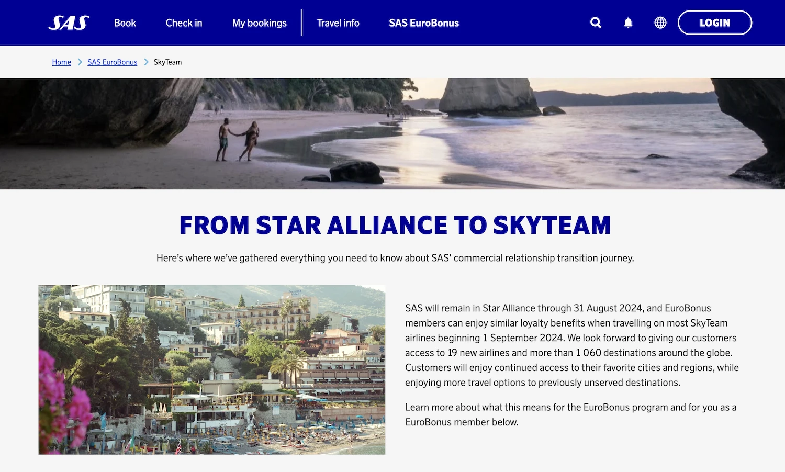
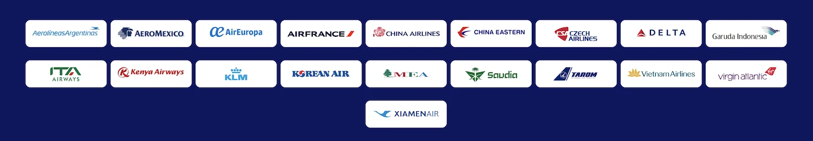

The wait is over for SAS EuroBonus members. After months of rumors, [SAS confirmed today](https://www.flysas.com/en/eurobonus/skyteam/) they'll be moving from Star Alliance to SkyTeam starting **September 1st, 2024**. The shift will impact how you earn and redeem points, but also opens doors to a whole new network of airlines.

Here's a breakdown of the key points.

  TIME UNTIL TRANSITION

## What happens to my EuroBonus membership?

Relax, your EuroBonus membership is safe! The program itself remains with SAS, and your current tier status and points won't be affected.

## Earning Points

* Until August 31st, 2024: Business as usual! You'll earn points on Star Alliance flights as per your membership level.
* From September 1st, 2024: You'll switch to earning points on flights with most SkyTeam airlines, not Star Alliance. Specific details on earning rates are still to come, but SAS promises information will be available soon on their EuroBonus partners page.

## Using Points

### Star Alliance Bookings

* You can still book award flights on Star Alliance airlines using your points until August 31st, even for travel after that date.
* No new Star Alliance award bookings will be possible after August 31st.
Existing Amex 2-for-1 vouchers can still be used for Star Alliance awards until August 31st.
* You can rebook existing Star Alliance awards (up to 24 hours before departure) until August 31st, even if your flight is after September 1st.
* Cancellations follow the same rules - up to 24 hours before departure.

### SkyTeam Bookings

* The good news! You can use your points to book award flights on most SkyTeam airlines from September 1st onwards.
* Amex 2-for-1 vouchers will also be valid for SkyTeam awards.
* Rebooking and cancellation rules for SkyTeam awards will mirror the existing Star Alliance policy (24 hours before departure).

### Rebooking on different airlines?

Something still not 100% clear to us is that "From 1 September 2024, you can rebook your Bonus trip to a SAS or certain SkyTeam airline flights (subject to availability)". For example, when having a trip booked on Star Alliance airlines, sounds it should be possible to rebook it on SkyTeam.

Another unclear thing is the possibility of mixed bookings Star Alliance + SkyTeam.

**Overall, this move opens doors to a new network of airlines (19 new ones to be exact) and over 1,000 additional destinations**. While some specifics are still being ironed out, SAS claims it is committed to making the transition smooth for EuroBonus members. Keep an eye on SAS's website and our blog for further updates as they become available.

In the meantime, this is a great opportunity to [explore using your points on Star Alliance airlines before the switch](https://blog.awardfares.com/eurobonus-star-alliance-awards/). Consider booking that dream trip you've been eyeing!

## Frequently Asked Questions (FAQ)

### What will happen to EuroBonus?

* EuroBonus will remain SAS’ loyalty program, even after SAS leaves Star Alliance. As a member, you can continue to earn and use points on SAS as you do today. Your status and benefits as a EuroBonus member when you fly on SAS will not change.
* Offering an attractive loyalty program for SAS’ travelers remains the top priority for SAS and its new owners, even after SAS changes ownership and alliance.
* On 31 August 2024, SAS will leave Star Alliance. EuroBonus members will enjoy similar customer benefits on most SkyTeam airlines beginning 1 September 2024.
* As long as SAS is a member of Star Alliance, EuroBonus members can continue to enjoy the same benefits as they do today when flying on a Star Alliance airline.
* In general, EuroBonus members will enjoy similar benefits when they fly on most SkyTeam airlines as they do today when they fly on a Star Alliance airline.

### What will happen to my EuroBonus points?

Your EuroBonus points will remain and retain their current expiry date. You’ll still have all the points you’ve earned, and you can continue to earn and use points as you do today.

### What will happen to my EuroBonus membership level?

Your EuroBonus level will remain as well as your progress toward the next level during your qualification period. The change of alliance will not impact the requirements to reach new membership levels.  

### What will happen to my EuroBonus Lifetime Gold status?

The EuroBonus Lifetime Gold program will remain. Your progress toward earning Lifetime Gold will not be impacted.  

### Will I enjoy the same EuroBonus membership benefits when I travel on a Star Alliance airline?

EuroBonus benefits when traveling on partner airlines are summarized above.

### Can I still earn points when I fly on another Star Alliance airlines?

You’ll be able to earn EuroBonus Basic points when you fly on a Star Alliance airline until 31 August 2024.

### What will happen to my existing Star Alliance Bonus trip bookings?

Existing Bonus trip bookings will remain unchanged and will be honored even if your flight is scheduled to depart after SAS leaves Star Alliance. See above for more details.

### Can I still use my points for flights on Star Alliance airlines?

You can use your EuroBonus points to book Star Alliance Bonus trips until 31 August 2024. See above for more details.

### Can I still earn points from credit cards and other non-airline partners?

Yes.

### What about other Star Alliance airlines’ loyalty program members flying on SAS?

As long as SAS is part of Star Alliance, members of other Star Alliance airlines’ loyalty programs will enjoy the same membership benefits when they fly on SAS. They will also be able to spend miles/points on SAS flights.

### What will happen to my Amex 2-for-1 vouchers/companion ticket?

For members in Norway and Sweden that are holders of the SAS Amex Elite, the Amex 2-for-1 vouchers (companion ticket) will remain, and you’ll still be able to use vouchers for SAS Bonus tickets. You can also use new vouchers for Star Alliance Bonus trip bookings until 31 August 2024. All Bonus trip bookings made using vouchers will remain unchanged and will be honored.

From 1 September 2024, you'll be able to use your Amex 2-for-1 vouchers on most SkyTeam airlines

### What will happen to my FlyPremium benefits?

For holders of the SAS Mastercard (in Sweden and Norway), FlyPremium benefits will remain, and members will continue to enjoy FlyPremium when they book SAS Bonus tickets.

### Can I still use my EuroBonus points on non-airline partners such as rental cars and hotels?

Yes.

## Become a EuroBonus Pro

You can [try AwardFares for free](https://awardfares.com/). We are rolling out new features and improvements regularly, so [sign up for our monthly newsletter](https://awardfares.com/newsletter) to stay on top of the latest news, announcements, and pro tips.

With our [Gold and Diamond tiers](https://awardfares.com/pricing), you can access premium features such as unlimited daily searches, alerts, seat maps, flight schedules, and more!

## Learn More

Our guides have all the information you need to be a pro travel hacker and explore the world on points. Here are some related posts you might enjoy:

* [Guide To Using SAS EuroBonus Points (Before & After They Join SkyTeam)](https://blog.awardfares.com/eurobonus-guide/)
* [Updates For SAS EuroBonus Members (March 2024)](https://blog.awardfares.com/eurobonus-updates-mar-2024/)
* [Try These EuroBonus Award Flights Before SAS Leaves Star Alliance](https://blog.awardfares.com/eurobonus-star-alliance-awards/)
* [SAS Will Leave Star Alliance! Here’s What To Do Next](https://blog.awardfares.com/sas-acquisition/)
* [7 Benefits Of SAS Joining SkyTeam (The Bright Side)](https://blog.awardfares.com/sas-and-skyteam/)

