Estamos muy felices de anunciar que, desde hoy, es posible buscar vuelos Aeroméxico Rewards con AwardFares! Encontrar los mejores vuelos usando Puntos Premier acaba de volverse más fácil. AwardFares te permite buscar sin esfuerzo las opciones más convenientes para volar en Aeroméxico y otras aerolíneas de SkyTeam, y así obtener lo mejor de tus puntos.

### En Este Artículo

- [Lo mejor de Aeroméxico Rewards](#lo-mejor-de-aeroméxico-rewards)
- [¿Qué ofrece AwardFares a los miembros de Aeroméxico Rewards?](#qué-ofrece-awardfares-a-los-miembros-de-aeroméxico-rewards)
- [Entendiendo los Boletos Aeroméxico Rewards](#entendiendo-los-boletos-aeroméxico-rewards)
- [Cómo encontrar vuelos de Aeroméxico Rewards con AwardFares](#cómo-encontrar-vuelos-de-aeroméxico-rewards-con-awardfares)
- [Nuestras Rutas Favoritas con Aeroméxico](#nuestras-rutas-favoritas-con-aeroméxico)
- [Clase Premier de Aeroméxico](#clase-premier-de-aeroméxico)
- [Conviértete en un Pro de Aeroméxico Rewards](#conviértete-en-un-pro-de-aeroméxico-rewards)
- [Aprende Más](#aprende-más)

## Lo mejor de Aeroméxico Rewards

[**Aeroméxico Rewards**](https://www.aeromexico.com/en-us/aeromexico-rewards) es un programa sólido para viajeros frecuentes que buscan flexibilidad en sus billetes premio. Los puntos nunca expiran, y se pueden obtener en compras diarias y vuelos con Aeroméxico (a una tasa de 8 puntos por dólar gastado en la tarifa base). A medida que acumulas puntos y subes de nivel en el programa, se desbloquean beneficios como el embarque prioritario, equipaje facturado gratis y acceso a salones exclusivos en aeropuertos.

El verdadero poder está en cómo puedes redimir tus puntos. Se pueden utilizar para vuelos en Aeroméxico y aerolíneas asociadas, obtener mejoras a una cabina más lujosa, o en vacaciones con paquetes de Aeroméxico. Dado que Aeroméxico pertenece a la alianza SkyTeam, también tienes el potencial de extender tu alcance y redimir puntos en vuelos con otras aerolíneas miembro, abriendo un mundo de posibilidades de viaje.

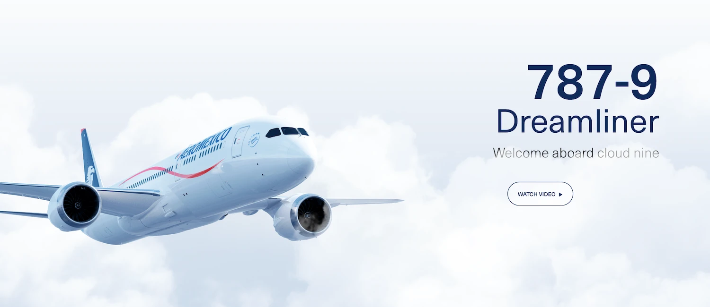

## ¿Qué ofrece AwardFares a los miembros de Aeroméxico Rewards?

- Disponibilidad al minuto: Proporcionamos información en tiempo real sobre la disponibilidad de asientos de premio para vuelos de Aeroméxico (y socios de SkyTeam).
- Búsqueda Flexible: Busca por fechas específicas o explora opciones a lo largo de un rango de fechas con nuestra Vista de Línea de Tiempo.
- Más Opciones, Mejores Decisiones: Compara opciones de premios a través de diferentes aerolíneas y programas de lealtad para encontrar la mejor opción para tus planes de viaje (por ejemplo, contra otros programas de SkyTeam como SkyMiles o Flying Blue).
- Maximiza Tus Puntos: AwardFares te ayuda a ordenar y encontrar las maneras más eficientes en cuanto a valor para usar tus Puntos de Aeroméxico Rewards.

## Entendiendo los Boletos Aeroméxico Rewards

Aeroméxico Rewards ofrece dos tipos de boletos usando tus Puntos Premier: Boletos Clásicos de Premio y Tarifas Dinámicas.

- **Boletos Aeroméxico Rewards Clásico**: Boleto de avión que se adquiere con Puntos Aeroméxico Rewards y siempre tiene una tarifa fija.
- **Boletos Aeroméxico Rewards con tarifa dinámica**: Estos son boletos de avión comprados con Puntos de Aeroméxico Rewards donde la tarifa depende del destino, cabina, disponibilidad y demanda.

| **Aspecto**                        | **Boleto Aeroméxico Rewards**                                                                                                     | **Boleto Aeroméxico Rewards con tarifa dinámica**                                                                                                                                                        |
|------------------------------------|-----------------------------------------------------------------------------------------------------------------------------------|----------------------------------------------------------------------------------------------------------------------------------------------------------------------------------------------------------|
| **Aerolíneas**                     | Aeroméxico y SkyTeam y otras Aerolíneas afiliadas                                                                                 | Aeroméxico, Delta, KLM, Air France (únicamente)                                                                                                                                                          |
| **Zonas**                          | Destinos Aeroméxico, Skyteam y y otras Aerolíneas afiliadas                                                                       | Destinos Aeroméxico, Delta, KLM y Air France                                                                                                                                                             |
| **Precio en Puntos Aeroméxico Rewards** | Fijo, consulta la tabla de redención                                                                                               | La cantidad de Puntos Aeroméxico Rewards necesarios para redimir tu vuelo dependerá del destino, clase/cabina, disponibilidad del vuelo y demanda de éste.                                                 |
| **Disponibilidad**                 | Limitada                                                                                                                           | Amplia                                                                                                                                                                                                    |
| **Maletas**                        | Incluye Equipaje documentado excepto en las zonas de Estados Unidos y Canadá. Aplican Términos y Condiciones                       | Depende de la Familia tarifaria (Aeroméxico, Delta, KLM, Air France)                                                                                                                                      |
| **Cargo por servicio**             | Sí Aplica Reservación en aeromexico.com: $323.00 MXN Otros canales: $640.00 MXN                                              | Sí Aplica Reservación en aeromexico.com: $323.00 MXN Otros canales: $640.00 MXN                                                                                                                     |
| **Cambios**                        | Estará sujeto a disponibilidad de la clase tarifaria seleccionada.| Sólo se podrán cambiar aquellos boletos cuya familia tarifaria lo permita. Se aplicará una cuota por cambio de fecha por parte de la aerolínea y ésta dependerá nuevamente de la familia tarifaria adquirida. Si hubiera alguna diferencia en la tarifa adquirida, el socio cubrirá la diferencia. |

- Vuelos nacionales: $700 MXN.

Vuelos internacionales con costo dependiendo de la región:

- Asia: $5,400 MXN
- Europa (excepto Francia y Países Bajos): $5,400 MXN
- Francia y Países Bajos: $3,600 MXN
- Sudamérica LH (Brasil, Argentina, Chile): $5,400 MXN
- Sudamérica SH (Colombia, Ecuador, Perú): $3,600 MXN
- Canadá: $2,700 MXN
- Centroamérica y el Caribe: $3,600 MXN
- Estados Unidos: $4,000 MXN
- Reserva en Aeroméxico.com: $323 MXN
- Otros: $640 MXN

### Tabla de redención del Boleto Aeroméxico Rewards (Clásico) con Puntos

Desde México.

| Destino                                      | Cabina turista                                      | Cabina Premier                                      |
|----------------------------------------------|-----------------------------------------------------|-----------------------------------------------------|
| **México**                                   | Temporada baja: 10,000 Temporada alta: 14,000    | Temporada baja: 23,000 Temporada alta: 28,000    |
| **Norteamérica 1:** EUA (excepto Nueva York, Seattle y Chicago) | Temporada baja: 18,000 Temporada alta: 22,000    | Temporada baja: 36,000 Temporada alta: 43,000    |
| **Norteamérica 2:** Canadá + Nueva York, Seattle y Chicago | Temporada baja: 30,000 Temporada alta: 38,000    | Temporada baja: 52,000 Temporada alta: 72,000    |
| **América Central y el Caribe**              | Temporada baja: 30,000 Temporada alta: 39,000    | Temporada baja: 70,000 Temporada alta: 91,000    |
| **Sudamérica Norte**                         | Temporada baja: 30,000 Temporada alta: 39,000    | Temporada baja: 70,000 Temporada alta: 91,000    |
| **Sudamérica Sur**                           | Temporada baja: 50,000 Temporada alta: 66,000    | Temporada baja: 100,000 Temporada alta: 130,000  |
| **Noreste de Asia**                          | Temporada baja: 80,000 Temporada alta: 110,000   | Temporada baja: 230,000 Temporada alta: 326,000  |
| **Sudeste de Asia**                          | Temporada baja: 80,000 Temporada alta: 110,000   | Temporada baja: 230,000 Temporada alta: 326,000  |
| **Europa**                                   | Temporada baja: 75,000 Temporada alta: 90,000    | Temporada baja: 150,000 Temporada alta: 180,000  |
| **Norte de África**                          | Temporada baja: 93,000 Temporada alta: 114,000   | Temporada baja: 202,000 Temporada alta: 243,000  |
| **Medio Oriente**                            | Temporada baja: 93,000 Temporada alta: 114,000   | Temporada baja: 202,000 Temporada alta: 243,000  |
| **África**                                   | Temporada baja: 120,000 Temporada alta: 143,000  | Temporada baja: 257,000 Temporada alta: 303,000  |
| **Hawái**                                    | Temporada baja: 34,000 Temporada alta: 41,000    | Temporada baja: 76,000 Temporada alta: 89,000    |
| **Sudoeste de Asia**                         | Temporada baja: 115,000 Temporada alta: 145,000  | Temporada baja: 312,000 Temporada alta: 409,000  |
| **Australia, Nueva Zelanda y Pacífico Sur**  | Temporada baja: 128,000 Temporada alta: 283,000  | Temporada baja: 148,000 Temporada alta: 326,000  |

Para más [información acerca de los precios dinámicos en los boletos Aeroméxico Rewards, puedes consultar aquí](https://www.aeromexico.com/en-us/aeromexico-rewards/award-ticket).

## Cómo encontrar vuelos de Aeroméxico Rewards con AwardFares

*AwardFares nunca pide credenciales de inicio de sesión para tu programa de viajero frecuente.*

### 1. Ve a [AwardFares](https://awardfares.com/signup)

Si bien crear una cuenta es opcional, es gratuito y te permite desbloquear funciones adicionales. [Regístrate aquí para comenzar](https://awardfares.com/signup).

### 2. Elije Aeroméxico Rewards en *Loyalty Program*

Selecciona **Aeroméxico Rewards** en el menú desplegable para buscar tu vuelo de premio.

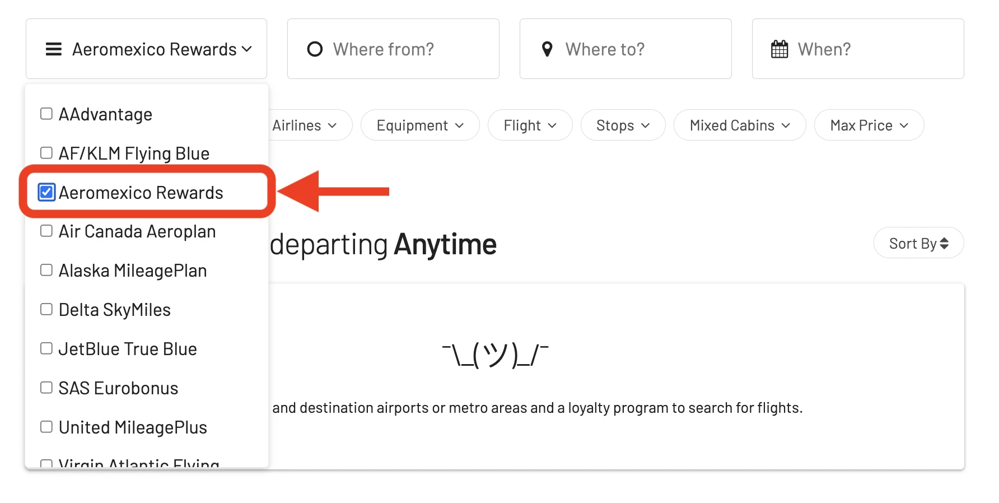

### 3. Introduce Tu Ruta Deseada

Agrega tus aeropuertos de origen y destino, y AwardFares buscará vuelos premio disponibles, incluyendo aquellos con escalas. También puedes usar los filtros para sólo ver vuelos directos.

En este ejemplo, buscamos vuelos [entre Cancún (CUN) y Nueva York (NYC)](https://awardfares.com/search?CUN.NYC.;z:aeromexico).

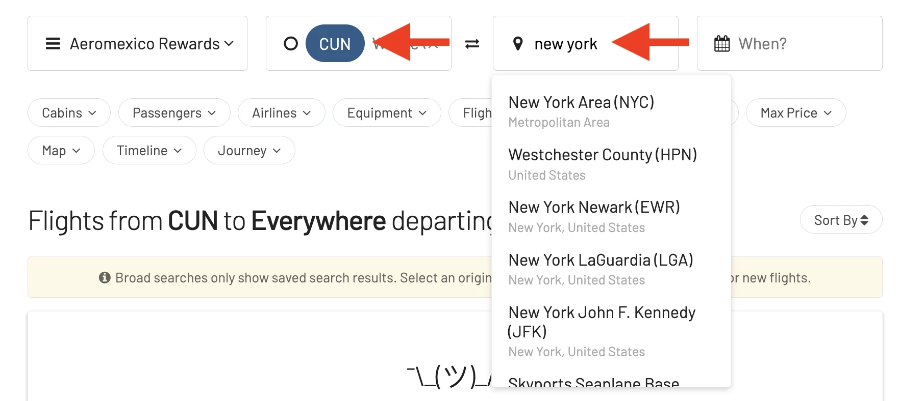

### 4. Selecciona Fechas

Utilizando el calendario puedes seleccionar fechas específicas, o incluso usar nuestra *Timeline View* (Línea de Tiempo) para explorar disponibilidad en diferentes fechas. Esta vista te ayuda a comparar fácilmente distintos días, sin tener que repetir la búsqueda manualmente, como en la web de los programas de viajero frecuente.

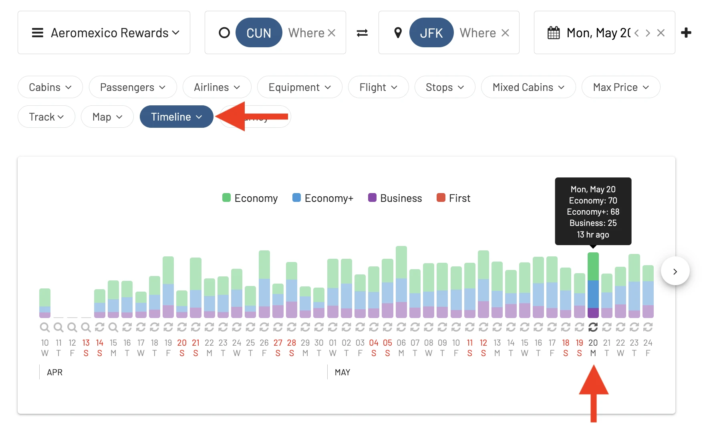

Una vez realizada la búsqueda, AwardFares te mostrará los resultados justo en la lista debajo.

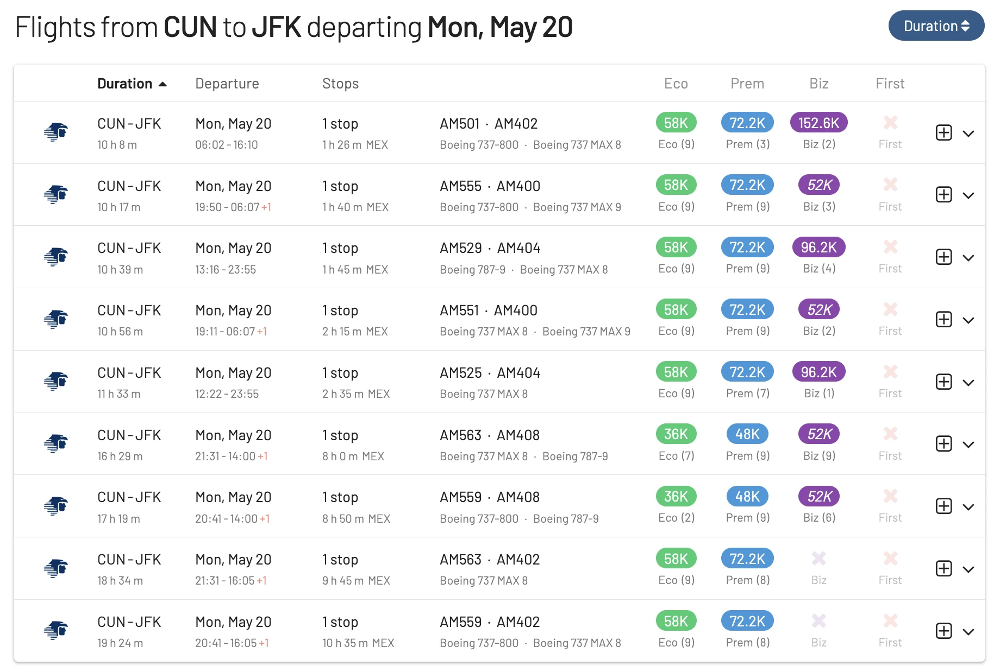

Además, puedes tocar en cualquier vuelo para ver más detalles, por ejemplo, el tipo de avión, e incluso [obtener el mapa de asientos actual](https://blog.awardfares.com/seatmaps-guide/) para ver qué asientos están libres u ocupados.

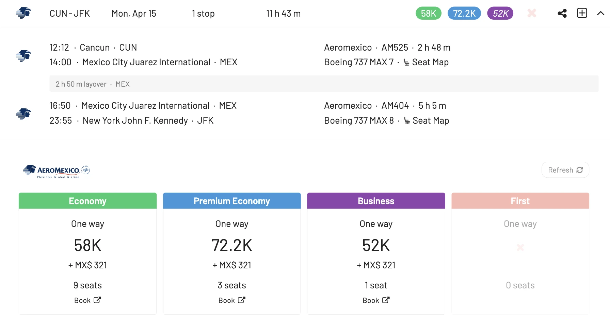

### 5. Ordena por Precio

AwardFares muestra resultados en tiempo real, permitiéndote ordenar las opciones por coste y tiempo en un simple click.

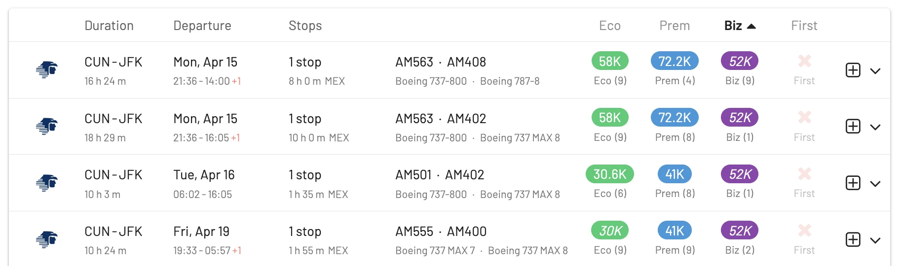

### 6. Construye Viajes de Ida y Vuelta

Usa nuestro **Journey Planner** (*Planificador de Viajes*) para agregar vuelos a tu itinerario y construir vuelos de ida y vuelta! Si quieres aprender más sobre el Journey Planner, [puedes hacerlo en nuestra guía completa](https://blog.awardfares.com/journey-planner/).

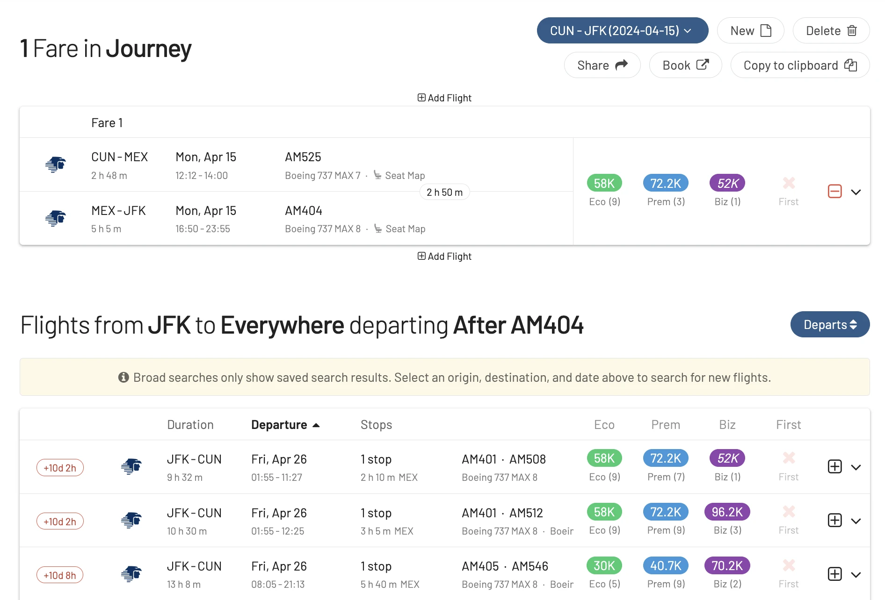

### 7. Reserva a través del Sitio Web de Aeroméxico

Una vez que encuentres tu vuelo deseado, haz clic en el botón **Book** (Reservar).

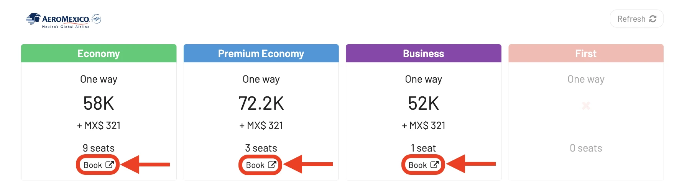

AwardFares te redirigirá al sitio web de Aeroméxico Rewards para completar tu reserva sin tener que volver a ingresar tus criterios de búsqueda, ya que estarán pre-completados.

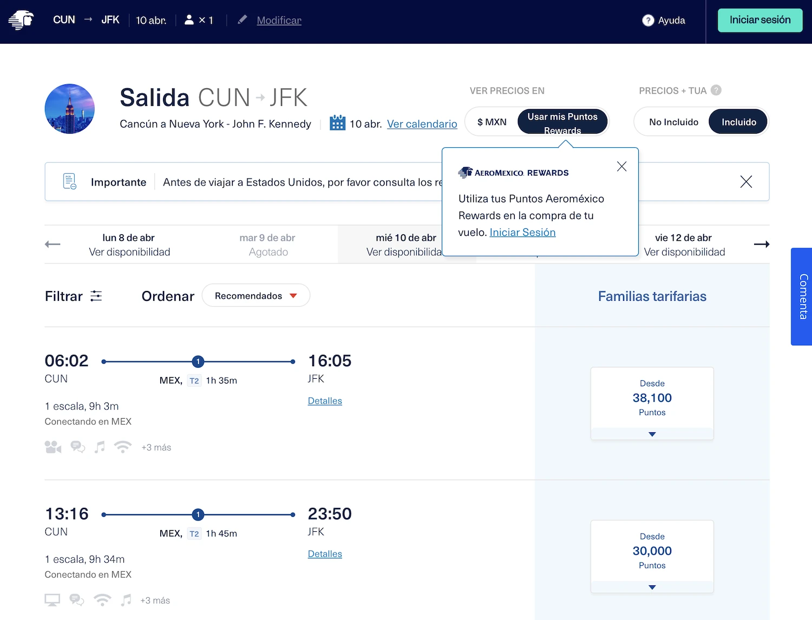

## Nuestras Rutas Favoritas con Aeroméxico

Estas son nuestras formas favoritas de usar Puntos Premier (Premier Points), y donde puedes obtener el mayor valor de los boletos de Aeroméxico Rewards.

1. [**Ciudad de México (MEX) a Buenos Aires (EZE)**](https://awardfares.com/search?MEX.EZE.;z:aeromexico). Un gran canje en Aeroméxico Rewards, con premios valorados en 50,000 puntos en Clase Económica y 100,000 puntos en Clase Business (solo ida). Aerom´xico opera modernos Boeing 787 Dreamliners en esta ruta, que ofrecen una experiencia de vuelo cómoda con asientos que se reclinan completamente.
2. [**Ciudad de México (MEX) a Bogotá (BOG)**](https://awardfares.com/search?MEX.BOG.;z:aeromexico). Otra gran opción para explorar Sudamérica usando Aeroméxico Rewards. Los premios en Clase Económica comienzan en 40,000 puntos (solo ida) y en Clase Ejutiva/Business comienzan en 70,000 puntos (solo ida). Bogotá es la capital de Colombia y ofrece una cultura vibrante, comida deliciosa, y hermosos paisajes.
3. [**Ciudad de México (MEX) a Londres (LHR)**](https://awardfares.com/search?MEX.LHR.;z:aeromexico). Viajar a Europa desde Ciudad de México puede ser costoso en otras aerolíneas, pero Aeroméxico ofrece tarifas competitivas con puntos. Los premios en Clase Económica comienzan en 60,000 puntos (ida) y en Business Class comienzan en 90,000 puntos (ida). Aeroméxico opera una mezcla de Boeing 787 Dreamliners y Boeing 777s en esta ruta, todos los cuales ofrecen asientos cómodos y amenidades.
4. [**Los Angeles (LAX) a Paris (CDG)**](https://awardfares.com/search?MEX.CDG.;z:aeromexico). Una gran opción para viajeros de la Costa Oeste que buscan redimir sus puntos de Aeroméxico Rewards para un viaje a Europa. Los premios en Clase Económica comienzan en 50,000 puntos (ida) y en Clase Ejecutiva comienzan en 80,000 puntos (ida). Aeroméxiico está asociada a aerolíneas de SkyTeam como Delta, lo que significa que tienes algo de flexibilidad en las opciones de ruta.
5. [**Miami (MIA) a Madrid (MAD)**](https://awardfares.com/search?MIA.mad.;z:aeromexico). Parecida a la ruta de LAX a CDG, esta es una buena opción para viajeros de la Costa Este que quieren usar Aeroméxico Rewards para llegar a Europa. Los premios en Económica comienzan en 50,000 puntos y en Clase Ejecutiva comienzan en 80,000 puntos (ida).
6. [**Monterrey (MTY) a Barcelona (BCN)**](https://awardfares.com/search?MTY.BCN.;z:aeromexico). Una joya oculta para viajeros que buscan explorar España. Aeroméxico tiene vuelos directos estacionales entre Monterrey y Barcelona. Los premios de ida comienzan en 40,000 puntos.
7. [**Tijuana (TIJ) a Tokio (NRT)**](https://awardfares.com/search?TIJ.NRT.;z:aeromexico).  Esta ruta te permite experimentar la nueva flota de Boeing 787 Dreamliners de Aeroméxico en un vuelo de larga distancia a Asia. Los vuelos con puntos comienzan en 70,000 (Turista) y en 110,000 puntos (Ejecutiva), sólo de ida.
8. [**Guadalajara (GDL) a Shanghai (PVG)**](https://awardfares.com/search?GDL.PVG.;z:aeromexico). Similar a la ruta de TIJ a NRT, esta es otra gran opción para usar puntos y llegar a Asia. Los premios en Clase Turista comienzan en 70,000 puntos y en Clase Business en 110,000 puntos (ida).
9. [**Ciudad de México (MEX) a São Paulo (GRU)**](https://awardfares.com/search?MEX.GRU.;z:aeromexico). Más formas de explorar Sudamérica usando puntos premier de Aeroméxico Rewards. Dado que Aeroméxico no publica zonas de premios para muchos destinos, el costo exacto en puntos puede variar dependiendo de la ciudad específica a la que vueles. Sin embargo, hemos visto valores en Clase Turista que comienzan en 50,000 puntos, alrededor de 100,000 puntos en clase Ejecutiva.
10. [**Ciudad de México (MEX) a Santiago de Chile (SCL)**](https://awardfares.com/search?MEX.SCL.;z:aeromexico). Al igual que la ruta de MEX a GRU, este es otro buen canje con puntos premier. El costo exacto en puntos puede variar dependiendo de las fechas específicas en las que vueles, pero los premios comienzan en 50,000 puntos en Clase Turista y alrededor de 100,000 puntos en Clase Business.

## Clase Premier de Aeroméxico

Los 787 Dreamliners de Aeroméxico cuentan con una cabina premium llamada **Clase Premier**. Estos asientos de clase de negocios están configurados en un diseño de espina de pescado invertido, que proporciona excelente privacidad y acceso directo al pasillo para todos los pasajeros. Los asientos se convierten en camas completamente planas, perfectas para vuelos de larga distancia.

**Asientos**

- **Diseño invertido**: Estos asientos proporcionan excelente privacidad con acceso directo al pasillo para todos.
- **Camas completamente planas**: Perfectas para estirarse y descansar en vuelos largos.
- **Comentarios en SeatGuru**: El 787-8 tiene una configuración 2-2-2, mientras que el [787-9 ofrece una configuración más espaciosa 1-2-1](https://www.seatguru.com/airlines/AeroMexico/AeroMexio_Boeing_787-8.php).

**Comodidades**

- **Asientos Espaciosos**: Como se mencionó anteriormente, los asientos se convierten en camas completamente planas para máximo confort.
- **Entretenimiento**: Pantallas de entretenimiento personal grandes para mantenerte entretenido durante el vuelo.
- **Conectividad**: Puertos de energía y USB en el asiento para mantener tus dispositivos cargados.
- **Kits de Comodidad**: Espera kits de amenidades con esenciales como pantuflas, antifaces y artículos de tocador.
- **Comida**: Aeroméxico es conocido por su servicio de comidas premium en Clase Premier. Esto incluye una selección de comidas y bebidas gourmet.
- **Área de Bar**: El 787-9 Dreamliner incluso cuenta con un [área de bar privada para pasajeros de Clase Premier Aeroméxico 787-9](https://vuela.aeromexico.com/787-9/).

<figure>
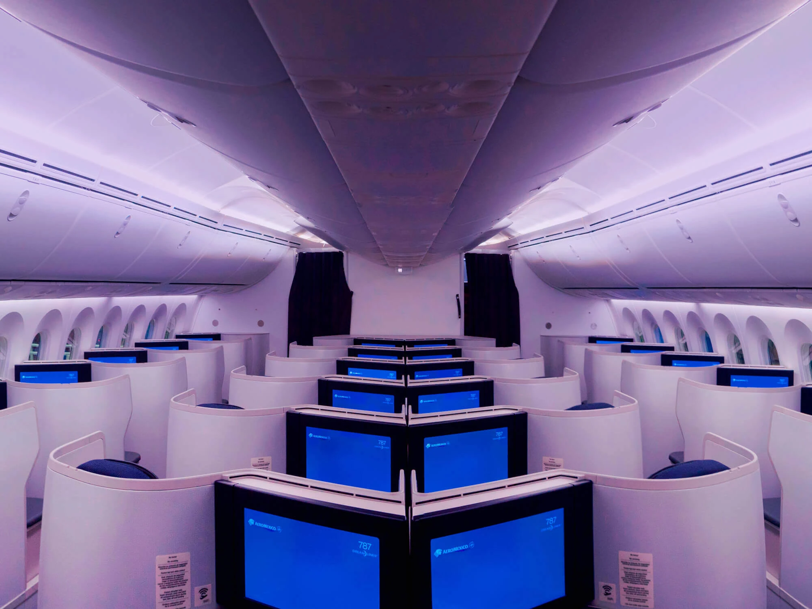
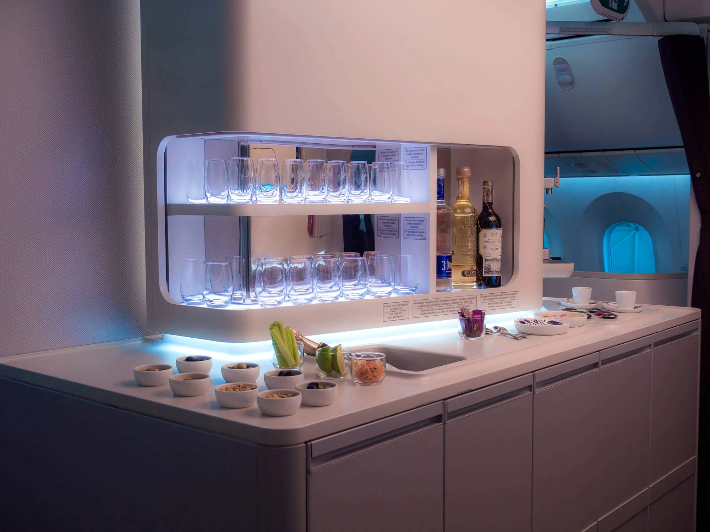
</figure>

## Conviértete en un Pro de Aeroméxico Rewards

Puedes [probar AwardFares gratis](https://awardfares.com/). Lanzamos nuevas funciones y mejoras regularmente, así que suscríbete a nuestro newsletter mensual para estar al tanto de las últimas noticias, anuncios y consejos para viajar gratis.

Con nuestros [niveles Oro y Diamante](https://awardfares.com/pricing), puedes acceder a funciones premium como búsquedas diarias ilimitadas, alertas, mapas de asientos, horarios de vuelos, y más!

## Aprende Más

Nuestras guías tienen toda la información que necesitas para ser un hacker de viajes pro y explorar el mundo con puntos. Aquí tienes algunos posts relacionados que podrías disfrutar:

- [Cómo Encontrar Vuelos con Millas Baratos (Paso a Paso)](https://blog.awardfares.com/how-to-find-cheap-award-flights/)