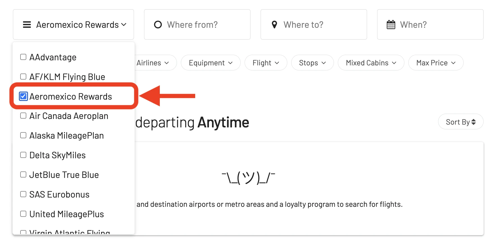

We're glad to announce a major expansion to AwardFares' award search capabilities – **Virgin Atlantic Flying Club** is now on board!

This integration brings a world of new possibilities to our users who are Flying Club members or collect Virgin Points through partner programs and credit cards. Now, you can easily search AwardFares to find the best ways to redeem your points for flights on Virgin Atlantic, alongside award options from other airlines in our comprehensive search engine.

### What's New?

- [Why Aeromexico Rewards?](#why-aeromexico-rewards)
- [What AwardFares Offers to Aeromexico Rewards Members](#what-awardfares-offers-to-aeromexico-rewards-members)
- [Finding Aeromexico Rewards Flights with AwardFares](#finding-aeromexico-rewards-flights-with-awardfares)
- [Top Aeromexico Routes](#top-aeromexico-routes)
- [Aeromexico Premier Class](#aeromexico-premier-class)
- [Become an Aeromexico Rewards Pro](#become-an-aeromexico-rewards-pro)
- [Learn More](#learn-more)

## Why Aeromexico Rewards?

[**Aeromexico Rewards**](https://www.aeromexico.com/en-us/aeromexico-rewards) offers an interesting and solid program for frequent flyers or those who crave flexibility in their travel rewards. Not only do points never expire, but you can earn them on everyday purchases in addition to flights with Aeromexico (at a rate of 8 points per dollar spent on the base fare). As you accumulate points and move up tiers in the program, you'll unlock perks like priority boarding, free checked bags, and access to exclusive airport lounges.

The real power comes in how you can redeem your points. Use them for flights on Aeromexico and partner airlines, snag upgrades to a more luxurious cabin, or craft dream vacations with Aeromexico packages. Since Aeromexico belongs to the SkyTeam alliance, you also have the potential to extend your reach and redeem points on flights with other member airlines, opening up a world of travel possibilities.

## What AwardFares Offers to Aeromexico Rewards Members

- **Up-to-the-minute Availability**: We provide real-time information on award seat availability for Aeromexico flights (and SkyTeam partners).
- **Flexible Searching**: Search for specific dates or explore options across a date range with our Timeline View.
- **More Choices, Better Decisions**: Compare award options across different airlines and loyalty programs to find the best fit for your travel plans (e.g. against other SkyTeam programs such as SkyMiles or Flying Blue).
- **Maximize Your Points**: AwardFares helps you sort and find the most value-efficient ways to use your Aeromeico Rewards Points.

## Finding Aeromexico Rewards Flights with AwardFares

*AwardFares never asks for your frequent flyer program login credentials.*

### 1. Visit [AwardFares](https://awardfares.com/signup)

Creating an account is optional, but registration is free and unlocks additional features. [Sign up here to get started.](https://awardfares.com/signup)

### 2. Choose Flying Club in the *Loyalty Program* Field

Select **Aeromexico Rewards** from the dropdown menu to start your award flight search.

### 3. Input Your Desired Route

Add your origin and destination airports, and AwardFares will search for available award flights, including those with stops. Filters for non-stop flights are also available.

In this example, we search for flights [between Cancun (CUN) to New York (NYC)](https://awardfares.com/search?CUN.NYC.;z:aeromexico).

### 4. Select Dates

Either input specific dates or use the Timeline View to explore availability over different periods. This view helps you easily compare the availability and class of service across various days.

You'll see the result list right below:

In addition, you can tap anywhere on the flight to display more details in an expanded view, such as aircraft type, and even [get the current seat maps](https://blog.awardfares.com/seatmaps-guide/) to see which seats are free or occupied.

### 5. Sort by Price

AwardFares displays results in real-time, allowing you to sort options by cost-effectiveness across different dates and airlines.

### 6. Book via Aeromexico's Website

Once you find your desired flight, click the **Book** button.

AwardFares will redirect you to Virgin Atlantic's website to complete your booking without the need to re-enter your search criteria, as it will be pre-populated.

## Top Aeromexico Routes

Using Aerome Atlantic Flying Club miles can be particularly rewarding on routes where the airline offers unique services, exceptional value, or access to destinations that are either popular or hard to reach. Here are some of the top Virgin Atlantic routes to consider for redeeming Flying Club miles, each chosen for its potential value, the experience it offers, or the popularity among travelers:

1. [**Mexico City (MEX) to Buenos Aires (EZE)**](https://awardfares.com/search?MEX.EZE.;z:aeromexico) - This route is a sweet spot on Aeromexico Rewards, with awards priced at 50,000 points in economy and 100,000 points in business class (one-way). Aeromexico flies modern Boeing 787 Dreamliners on this route, which offer a comfortable flying experience with lie-flat seats in business class.
2. [**Mexico City (MEX) to Bogotá (BOG)**](https://awardfares.com/search?MEX.BOG.;z:aeromexico) - This is another great option for exploring South America using Aeromexico Rewards.  Economy awards start at 40,000 points (one-way) and business class starts at 70,000 points (one-way). Bogotá is the capital of Colombia and offers a vibrant culture, delicious food, and beautiful scenery.
3. [**Mexico City (MEX) to London (LHR)**](https://awardfares.com/search?MEX.LHR.;z:aeromexico) - Traveling to Europe from Mexico City can be expensive on other airlines, but Aeromexico offers competitive award rates. Economy awards start at 60,000 points (one-way) and business class starts at 90,000 points (one-way). Aeromexico flies a mix of Boeing 787 Dreamliners and Boeing 777s on this route, all of which offer comfortable seating and amenities.
4. [**Los Angeles (LAX) to Paris (CDG)**](https://awardfares.com/search?MEX.CDG.;z:aeromexico) - This route is a great choice for West Coast travelers looking to redeem their Aeromexico Rewards points for a trip to Europe.  Economy awards start at 50,000 points (one-way) and business class starts at 80,000 points (one-way). Aeromexico partners with SkyTeam airlines like Delta, which means you have some flexibility in routing options.
5. **Miami (MIA) to Madrid (MAD)** - Similar to the LAX to CDG route, this is a good option for East Coast travelers wanting to use Aeromexico Rewards points to get to Europe. Economy awards start at 50,000 points (one-way) and business class starts at 80,000 points (one-way).
6. [**Monterrey (MTY) to Barcelona (BCN)**](https://awardfares.com/search?MTY.BCN.;z:aeromexico) - This route is a hidden gem for travelers looking to explore Spain. Aeromexico offers seasonal direct flights between Monterrey and Barcelona. Economy awards start at 40,000 points (one-way) and business class starts at 70,000 points (one-way).
7. [**Tijuana (TIJ) to Tokyo (NRT)**](https://awardfares.com/search?TIJ.NRT.;z:aeromexico) - This route allows you to experience Aeromexico's new fleet of Boeing 787 Dreamliners on a long-haul flight to Asia. Economy awards start at 70,000 points (one-way) and business class starts at 110,000 points (one-way).
8. [**Guadalajara (GDL) to Shanghai (PVG)**](https://awardfares.com/search?GDL.PVG.;z:aeromexico) - Similar to the TIJ to NRT route, this is another great option for using Aeromexico Rewards points to get to Asia. Economy awards start at 70,000 points (one-way) and business class starts at 110,000 points (one-way).
9. [Mexico City (MEX) to São Paulo (GRU)](https://awardfares.com/search?MEX.GRU.;z:aeromexico) - This route allows you to explore South America using Aeromexico Rewards points. Since Aeromexico does not publish award zones for many destinations, the exact cost in points can vary depending on the specific city you fly into. However, expect economy awards to start around 50,000 points (one-way) and business class to start around 100,000 points (one-way).
10. [Mexico City (MEX) to Santiago de Chile (SCL)](https://awardfares.com/search?MEX.SCL.;z:aeromexico) - Similar to the MEX to GRU route, this is another option for exploring South America using Aeromexico Rewards points. The exact cost in points can vary depending on the specific dates you fly, but expect economy awards to start around 50,000 points (one-way) and business class to start around 100,000 points (one-way).

## Aeromexico Premier Class

Aeromexico's 787 Dreamliners feature a premium cabin called *Clase Premier*, also known as Premier Class.  These business class seats are configured in a reverse herringbone layout, which provides excellent privacy and direct aisle access for all passengers. The seats convert into fully lie-flat beds, perfect for long-haul flights.

**Seating**

- Reverse herringbone layout: These seats provide excellent privacy with direct aisle access for everyone.
- Fully lie-flat beds: Perfect for stretching out and getting some rest on long flights.
- SeatGuru mentions: The 787-8 has a 2-2-2 configuration, while the 787-9 [offers a more spacious 1-2-1 configuration](https://www.seatguru.com/airlines/AeroMexico/AeroMexio_Boeing_787-8.php).

**Amenities**

- **Spacious Seats**: As mentioned earlier, the seats convert into fully lie-flat beds for maximum comfort.
- **Entertainment**: Large personal entertainment screens to keep you entertained throughout the flight.
- **Connectivity**: In-seat power and USB ports to keep your devices charged.
- **Comfort Kits**: Expect amenity kits with essentials like slippers, eyeshades, and toiletries.
- **Dining**: Aeromexico is known for its premium dining service in Clase Premier. This includes a selection of gourmet meals and beverages.
- **Bar Area**: The 787-9 Dreamliner even features [a private bar area for Clase Premier passengers Aeromexico 787-9](https://vuela.aeromexico.com/787-9/en/).

## Become an Aeromexico Rewards Pro

You can [try AwardFares for free](https://awardfares.com/). We regularly roll out new features and improvements, so [sign up for our monthly newsletter](https://awardfares.com/newsletter) to stay on top of the latest news, announcements, and pro tips.

With our [Gold and Diamond tiers](https://awardfares.com/pricing), you can access premium features such as unlimited daily searches, alerts, seat maps, flight schedules, and more!

## Learn More

Our guides have all the information you need to be a pro travel hacker and explore the world on points. Here are some related posts you might enjoy:

- [Top Frequent Flyer Programs To Consider In 2024 (Our Picks)](https://blog.awardfares.com/frequent-flyer-programs-2024/)
- [How To Find Cheap Award Flights And Identify Good Redemptions (Step-by-step)](https://blog.awardfares.com/how-to-find-cheap-award-flights/)
- [Demystifying Award Charts: All You Need To Know (2023)](https://blog.awardfares.com/demystifying-award-charts/)
- [Never Miss a Deal Again: Score the Perfect Fare with New Price Alerts and Filters](https://blog.awardfares.com/price-alerts/)