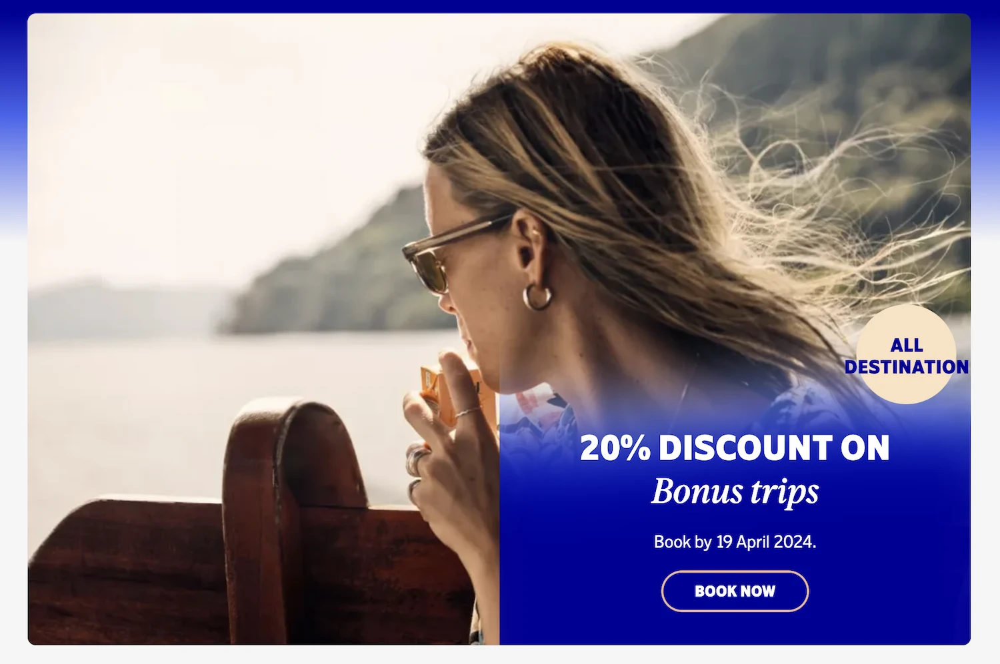
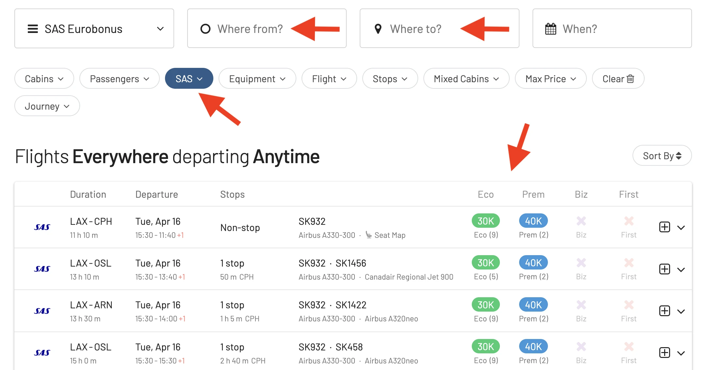

SAS launched a [new special offer for EuroBonus members](https://www.sas.se/special-offers/poangrabatt/): **a 20% discount on award flights to all destinations**. This promotion is applicable to all cabin classes including SAS Go Bonus, SAS Plus Bonus, and SAS Business Bonus. It's rare to see promotions like these with no geographical restrictions, so it's a great opportunity to take advantage of the offer and enjoy a wonderful destinations while making a cost-effective trip!

One thing to highlight is the possibility to combine the discount with the FlyPremium benefit (for holders of the SAS Mastercard), which means you can possible fly Business Class to the US or Asia

  TIME LEFT TO BOOK

## Get 20% OFF any EuroBonus award booking

Here are the terms and conditions for the ongoing promotion

- **Discount**: 20% off on the points cost of your bonus trip
- **Cabin Classes**: SAS Go Bonus, SAS Plus Bonus, SAS Business Bonus
- **Valid for**: Both single and return journeys
- **Travel Period**: May 1, 2024 – October 31, 2024
- **Booking Deadline**: April 19, 2024

Additionally, children aged 2-11 years benefit from a further 50% reduction on the discounted points price.

## Find EuroBonus Sweet Spots

To quickly find the best available flights on SAS, and the best ways to use your EuroBonus points, follow these steps:

1. Go to AwardFares.
2. Select **EuroBonus** under *Loyalty Program*.
3. Select **SAS only** under Airline
4. Choose a desired route and date.
5. Voilà! AwardFares will do its magic and show you the available flights in the list below, including details such as the prices per cabin, number of stops, total travel time, aircraft used, and more!

## Full T&C

- The price is set according to place of departure and destination, regardless of the chosen route (direct or with a stopover).
- The offer applies one-way or return.
- You must be logged in to see the points discount.
- Taxes and service charges are added per person and may vary depending on destination and route. The exact amount will be shown when you book. Taxes and fees cannot be paid with points.
- The points discount is only available for SAS Bonus tickets. It is not available when you mix points and cash, and for regular tickets for points.
- When mixing a SAS Bonus ticket with a regular ticket for points in a single booking, only the Bonus ticket receives the discount.
- Both the outbound and inbound journeys must begin during the stated travel period.
- Children receive a 50% discount on the offer unless otherwise stated.
- Infants travel free if you book a seat for your infant - 50% discount.
- Offer start and end times are always midnight to midnight CET, unless otherwise stated.
- The number of seats for bonus journeys is always limited.
- Bookings cannot be changed once the booking period for the campaign has ended, but then normal bonus prices apply.
- The traveler must pay all applicable fees, e.g., airport tax.
- Cannot be combined with other discounts/offers for bonus travel except for the Mastercard FlyPremium (level 2-4).
- The general membership conditions for EuroBonus apply.

## Become a EuroBonus Pro

You can [try AwardFares for free](https://awardfares.com/). We are rolling out new features and improvements regularly, so [sign up for our monthly newsletter](https://awardfares.com/newsletter) to stay on top of the latest news, announcements, and pro tips.

With our [Gold and Diamond tiers](https://awardfares.com/pricing), you can access premium features such as unlimited daily searches, alerts, seat maps, flight schedules, and more!

## Read More

Our guides have all the information you need to be a pro travel hacker and explore the world on points. Here are some related posts you might enjoy:

- [From Star Alliance to SkyTeam: The SAS Transition (Official Info)](https://blog.awardfares.com/sas-transition-to-skyteam/)
- [Guide To Using SAS EuroBonus Points (Before & After They Join SkyTeam)](https://blog.awardfares.com/eurobonus-guide/)
- [Updates For SAS EuroBonus Members (March 2024)](https://blog.awardfares.com/eurobonus-updates-mar-2024/)
- [Try These EuroBonus Award Flights Before SAS Leaves Star Alliance](https://blog.awardfares.com/eurobonus-star-alliance-awards/)
- [SAS Will Leave Star Alliance! Here’s What To Do Next](https://blog.awardfares.com/sas-acquisition/)
- [7 Benefits Of SAS Joining SkyTeam (The Bright Side)](https://blog.awardfares.com/sas-and-skyteam/)

