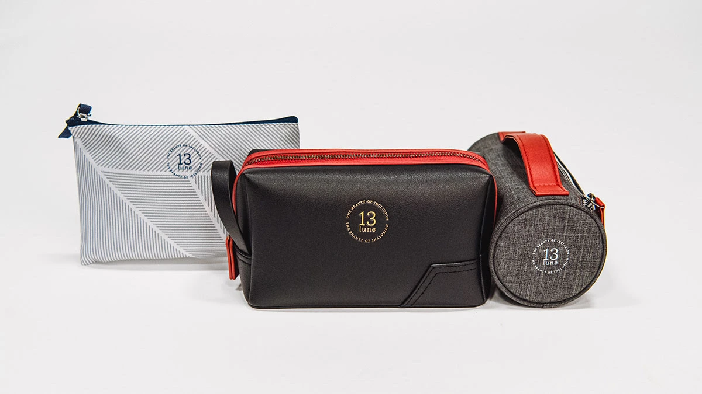
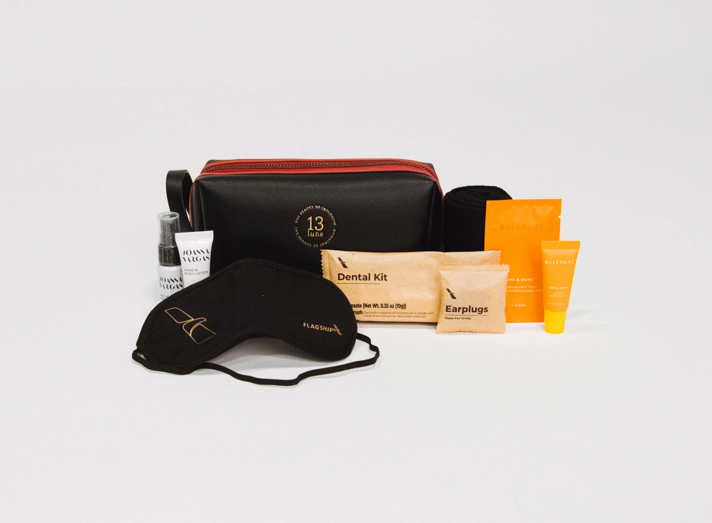
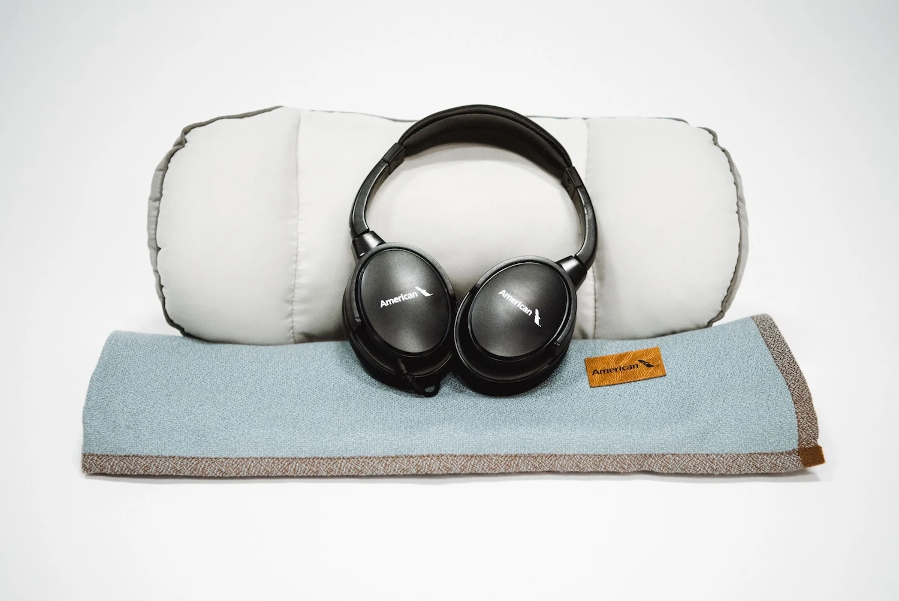
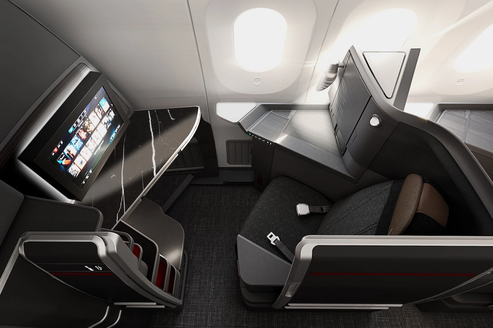
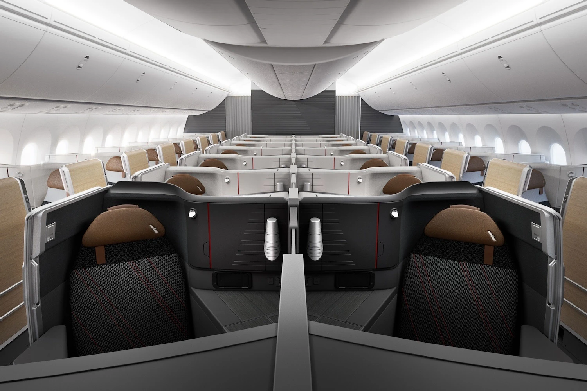

American Airlines is heavily revamping their inflight experience for a more enjoyable journey this summer season. A wave of premium upgrades is coming your way, including new amenity kits, bedding, and delicious menu options. Let's have a look at the details!

## Fresh Amenities and Sustainable Practices

We bet every traveler loves amenity kits. Well, these are great news then. American is introducing a first-of-its-kind program featuring a rotating collection of amenity kits. These stylish kits will showcase diverse designers and brands throughout the year, with a focus on sustainable materials and causes important to the airline and its customers. The kits will also include high-quality skincare products, making every flight feel more luxurious.

### Limited-Edition Amenity Kits for Collectors

In addition to the rotating amenity kits, American Airlines will offer limited-edition specialty kits designed in collaboration with various US-based designers and brands. These special kits will celebrate important milestones and initiatives that reflect the airline's values and the backgrounds of its passengers and crew. Keep an eye out for these collector's items!

## Superb New Bedding

After listening to many rounds of customer surveys, American finally decided to provide enhanced bedding for a more comfortable flight experience. Passengers will now enjoy new bedding, pillows, and sleepwear designed. This includes dual-sided pillows with different materials on each side, slippers in Flagship Business Class for international flights, and premium duvets and fleece blankets made from recycled materials for all cabins.

<figure>

</figure>

## New Menus for International and Domestic Flights

The new American Airlines menus are inspired by popular destinations worldwide. Passengers flying to summer destinations like Nice, Naples, or Copenhagen can savor dishes like macadamia-crusted sea bass with citrus cream sauce. In Business Class, travelers can indulge in internationally-inspired pastas, salads, and other delicious options, including new pre-order choices like short rib mac and cheese.

<figure>

</figure>

## AAdvantage Members Get More

AAdvantage members can leverage their miles and status to unlock access to these premium inflight experiences, including the new amenity kits, upgraded sleepwear, bedding, and delectable new menus. Additionally, status members may be eligible for complimentary upgrades.

## Looking Forward to Flagship Suites

Passengers flying on new Boeing 787-9, 777-300, and Airbus A321XLR aircraft can look forward to a completely revamped interior featuring the Flagship Suite seat, offering privacy doors, a chaise lounge position, and ample storage space.

For those seeking the ultimate in luxury, the Flagship Suite Preferred seat offers an even more premium experience with a Nest Bedding mattress pad, exclusive amenities, and additional skincare products. In Premium Economy and Main Cabin will also enjoy upgrades like wireless charging, additional storage, and improved seatback entertainment systems.

<figure>

</figure>

## Become an AAdvantage Pro

You can [try AwardFares for free](https://awardfares.com/). We are rolling out new features and improvements regularly, so [sign up for our monthly newsletter](https://awardfares.com/newsletter) to stay on top of the latest news, announcements, and pro tips.

With our [Gold and Diamond tiers](https://awardfares.com/pricing), you can access premium features such as unlimited daily searches, alerts, seat maps, flight schedules, and more!

## Learn More

Our guides have all the information you need to be a pro travel hacker and explore the world on points. Here are some related posts you might enjoy:

- [How To Find AAdvantage Awards In 2024](https://blog.awardfares.com/aadvantage-guide/)
- [Changes to AAdvantage Coming in 2024](https://blog.awardfares.com/aadvantage-program-updates-2024/)
- [American Airlines Announces Winter Schedule For 2024: New Route to Brisbane with Flagship Suites & More](https://blog.awardfares.com/american-winter-routes-2024/)
- [American Airlines Makes Changes to Bag Fees, Loyalty Program, and It's Not All Roses](https://blog.awardfares.com/american-updates-feb-2024/)